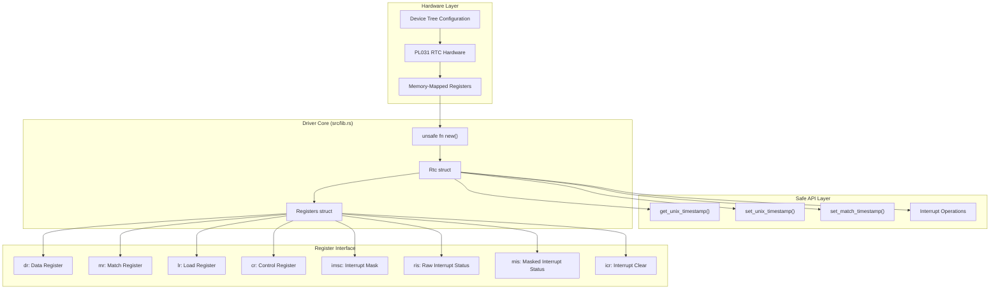
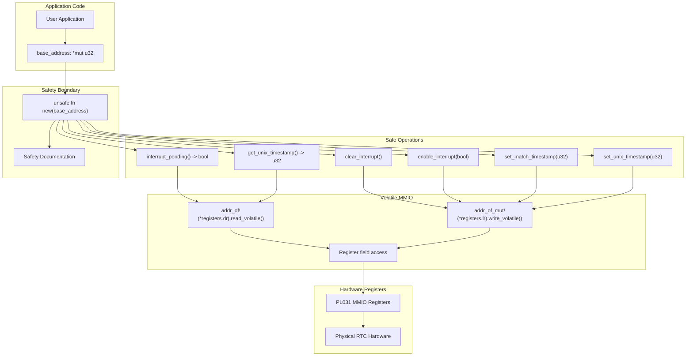

# Overview

> **Relevant source files**
> * [Cargo.toml](https://github.com/arceos-org/arm_pl031/blob/8cc6761d/Cargo.toml)
> * [README.md](https://github.com/arceos-org/arm_pl031/blob/8cc6761d/README.md)
> * [src/lib.rs](https://github.com/arceos-org/arm_pl031/blob/8cc6761d/src/lib.rs)

## Purpose and Scope

The `arm_pl031` crate provides a safe Rust driver for the ARM PL031 Real-Time Clock (RTC) hardware on aarch64 systems. This driver enables embedded and systems software to read and set time values, configure interrupts, and manage RTC functionality through a memory-mapped I/O interface.

The crate is designed for `no_std` environments and supports both basic Unix timestamp operations and optional high-level DateTime handling through the `chrono` feature. It targets embedded systems, hypervisors, and operating system kernels that need direct hardware access to PL031 RTC devices.

For detailed implementation specifics, see [Core Driver Implementation](/arceos-org/arm_pl031/3-core-driver-implementation). For optional features and extensions, see [Features and Extensions](/arceos-org/arm_pl031/4-features-and-extensions). For practical usage guidance, see [Getting Started](/arceos-org/arm_pl031/2-getting-started).

Sources: [Cargo.toml(L1 - L20)&emsp;](https://github.com/arceos-org/arm_pl031/blob/8cc6761d/Cargo.toml#L1-L20) [src/lib.rs(L1 - L8)&emsp;](https://github.com/arceos-org/arm_pl031/blob/8cc6761d/src/lib.rs#L1-L8) [README.md(L1 - L6)&emsp;](https://github.com/arceos-org/arm_pl031/blob/8cc6761d/README.md#L1-L6)

## System Architecture

The `arm_pl031` driver implements a layered architecture that provides multiple abstraction levels over the PL031 hardware, from raw register access to high-level DateTime operations.

### Core Driver Architecture



The driver centers around the `Rtc` struct which encapsulates a raw pointer to the hardware registers. The `Registers` struct defines the memory layout matching the PL031 hardware specification, ensuring correct MMIO access patterns.

Sources: [src/lib.rs(L15 - L44)&emsp;](https://github.com/arceos-org/arm_pl031/blob/8cc6761d/src/lib.rs#L15-L44) [src/lib.rs(L46 - L61)&emsp;](https://github.com/arceos-org/arm_pl031/blob/8cc6761d/src/lib.rs#L46-L61)

### Feature-Based System Components

```

```

The system uses Cargo features to provide modular functionality. The core driver in `lib.rs` provides essential RTC operations, while the optional `chrono` module adds convenient DateTime handling for applications that need it.

Sources: [Cargo.toml(L14 - L19)&emsp;](https://github.com/arceos-org/arm_pl031/blob/8cc6761d/Cargo.toml#L14-L19) [src/lib.rs(L10 - L11)&emsp;](https://github.com/arceos-org/arm_pl031/blob/8cc6761d/src/lib.rs#L10-L11) [src/lib.rs(L123 - L128)&emsp;](https://github.com/arceos-org/arm_pl031/blob/8cc6761d/src/lib.rs#L123-L128)

## Hardware Interface and Safety Model

### Memory-Mapped I/O Operations



The driver implements a clear safety boundary where unsafe operations are isolated to the constructor `new()` function, while all subsequent operations use safe Rust APIs. All hardware access uses volatile operations to ensure proper MMIO semantics.

Sources: [src/lib.rs(L46 - L60)&emsp;](https://github.com/arceos-org/arm_pl031/blob/8cc6761d/src/lib.rs#L46-L60) [src/lib.rs(L62 - L74)&emsp;](https://github.com/arceos-org/arm_pl031/blob/8cc6761d/src/lib.rs#L62-L74) [src/lib.rs(L76 - L120)&emsp;](https://github.com/arceos-org/arm_pl031/blob/8cc6761d/src/lib.rs#L76-L120)

## Key Code Entities and Relationships

The following table maps the primary system components to their code representations:

|System Component|Code Entity|File Location|Purpose|
| --- | --- | --- | --- |
|RTC Driver|Rtcstruct|src/lib.rs42-44|Main driver interface|
|Hardware Layout|Registersstruct|src/lib.rs15-39|Memory-mapped register layout|
|Initialization|unsafe fn new()|src/lib.rs47-60|Driver constructor with safety contract|
|Time Reading|get_unix_timestamp()|src/lib.rs62-67|Read current time from hardware|
|Time Setting|set_unix_timestamp()|src/lib.rs69-74|Set hardware time|
|Interrupt Control|enable_interrupt()|src/lib.rs108-113|Manage interrupt masking|
|Interrupt Status|interrupt_pending()|src/lib.rs97-102|Check interrupt state|
|Optional DateTime|chrono module|src/lib.rs10-11|High-level time operations|

### Register Field Mapping

The `Registers` struct directly corresponds to the PL031 hardware specification:

|Register Field|Hardware Purpose|Access Pattern|
| --- | --- | --- |
|dr|Data Register - current time|Read-only viaread_volatile()|
|mr|Match Register - interrupt trigger|Write viawrite_volatile()|
|lr|Load Register - set time|Write viawrite_volatile()|
|cr|Control Register - device control|Reserved for future use|
|imsc|Interrupt Mask - enable/disable|Write viawrite_volatile()|
|ris|Raw Interrupt Status - match state|Read viaread_volatile()|
|mis|Masked Interrupt Status - pending|Read viaread_volatile()|
|icr|Interrupt Clear - acknowledge|Write viawrite_volatile()|

Sources: [src/lib.rs(L17 - L39)&emsp;](https://github.com/arceos-org/arm_pl031/blob/8cc6761d/src/lib.rs#L17-L39) [src/lib.rs(L63 - L66)&emsp;](https://github.com/arceos-org/arm_pl031/blob/8cc6761d/src/lib.rs#L63-L66) [src/lib.rs(L70 - L73)&emsp;](https://github.com/arceos-org/arm_pl031/blob/8cc6761d/src/lib.rs#L70-L73) [src/lib.rs(L78 - L81)&emsp;](https://github.com/arceos-org/arm_pl031/blob/8cc6761d/src/lib.rs#L78-L81)