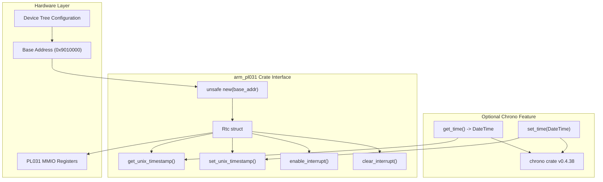
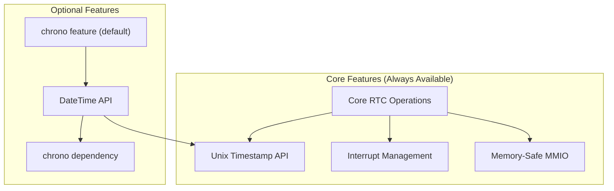
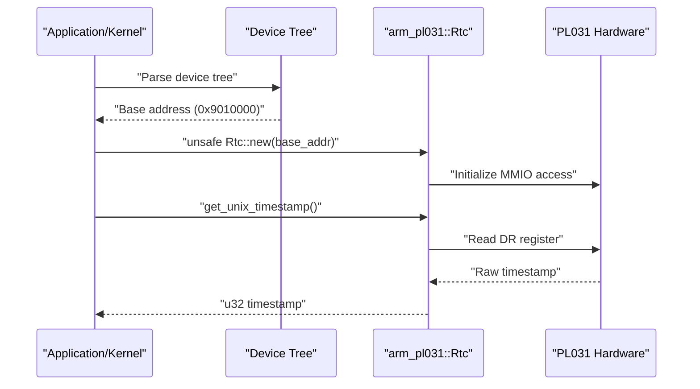

# Project Purpose and Scope

> **Relevant source files**
> * [Cargo.toml](https://github.com/arceos-org/arm_pl031/blob/8cc6761d/Cargo.toml)
> * [README.md](https://github.com/arceos-org/arm_pl031/blob/8cc6761d/README.md)

This document defines the purpose and scope of the `arm_pl031` crate, a Real Time Clock (RTC) driver for ARM PL031 hardware on aarch64 platforms. For information about the internal driver implementation, see [Core Driver Implementation](/arceos-org/arm_pl031/3-core-driver-implementation). For build and deployment details, see [Building and Testing](/arceos-org/arm_pl031/5.1-building-and-testing).

## Overview

The `arm_pl031` crate provides a safe Rust interface to ARM PL031 Real Time Clock hardware, specifically designed for aarch64-based embedded systems and operating system kernels. The driver abstracts the low-level memory-mapped I/O operations required to interact with PL031 RTC hardware while maintaining memory safety and providing both basic timestamp operations and high-level DateTime functionality.

**Sources:** [Cargo.toml(L1 - L20)&emsp;](https://github.com/arceos-org/arm_pl031/blob/8cc6761d/Cargo.toml#L1-L20) [README.md(L1 - L38)&emsp;](https://github.com/arceos-org/arm_pl031/blob/8cc6761d/README.md#L1-L38)

## Target Platforms and Compatibility

### Supported Architectures

The driver primarily targets aarch64 platforms but maintains compatibility with multiple architectures through its `no_std` design:

|Architecture|Support Level|Use Case|
| --- | --- | --- |
|aarch64-unknown-none-*|Primary|Embedded/bare-metal systems|
|x86_64-unknown-linux-gnu|Testing|Development and CI|
|riscv64gc-unknown-none-elf|Secondary|Cross-platform embedded|

### Environment Compatibility

The crate is designed for `no_std` environments, making it suitable for:

* Embedded operating systems (such as ArceOS)
* Bare-metal applications
* Kernel-level drivers
* Real-time systems requiring precise timekeeping

**Sources:** [Cargo.toml(L12)&emsp;](https://github.com/arceos-org/arm_pl031/blob/8cc6761d/Cargo.toml#L12-L12) [README.md(L5)&emsp;](https://github.com/arceos-org/arm_pl031/blob/8cc6761d/README.md#L5-L5)

## Core Capabilities and Feature Set

### Hardware Interface Diagram

### Feature Configuration

The crate provides a modular feature system:

**Sources:** [Cargo.toml(L14 - L19)&emsp;](https://github.com/arceos-org/arm_pl031/blob/8cc6761d/Cargo.toml#L14-L19) [README.md(L9 - L14)&emsp;](https://github.com/arceos-org/arm_pl031/blob/8cc6761d/README.md#L9-L14)

## Usage Scenarios

### Primary Use Cases

1. **Embedded Operating Systems**: Integration into kernel-level time management systems
2. **Bare-Metal Applications**: Direct hardware timekeeping without OS overhead
3. **Real-Time Systems**: Precise timestamp generation and interrupt-driven time events
4. **Device Drivers**: Foundation for higher-level system time services

### Integration Pattern

The typical integration follows this initialization pattern:

**Sources:** [README.md(L16 - L37)&emsp;](https://github.com/arceos-org/arm_pl031/blob/8cc6761d/README.md#L16-L37)

## Scope Boundaries

### What the Crate Provides

* **Hardware Abstraction**: Safe wrapper around PL031 MMIO operations
* **Memory Safety**: Encapsulation of unsafe hardware access
* **Time Operations**: Unix timestamp reading and writing
* **Interrupt Support**: Match register configuration and interrupt handling
* **Optional DateTime**: High-level time manipulation via chrono integration

### What the Crate Does NOT Provide

* **Device Discovery**: Users must obtain base addresses from device tree or firmware
* **Clock Configuration**: Hardware clock setup is assumed to be done by firmware/bootloader
* **Time Zone Support**: Only UTC timestamps are supported natively
* **Persistence**: No handling of RTC battery backup or power management
* **Multiple Instance Management**: Single RTC instance per hardware unit

### Licensing and Compliance

The crate uses a triple-license approach supporting multiple compliance requirements:

* **GPL-3.0-or-later**: For GPL-compatible projects
* **Apache-2.0**: For Apache ecosystem integration
* **MulanPSL-2.0**: For Chinese regulatory compliance

**Sources:** [Cargo.toml(L7)&emsp;](https://github.com/arceos-org/arm_pl031/blob/8cc6761d/Cargo.toml#L7-L7) [Cargo.toml(L6)&emsp;](https://github.com/arceos-org/arm_pl031/blob/8cc6761d/Cargo.toml#L6-L6) [Cargo.toml(L11 - L12)&emsp;](https://github.com/arceos-org/arm_pl031/blob/8cc6761d/Cargo.toml#L11-L12)