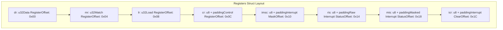
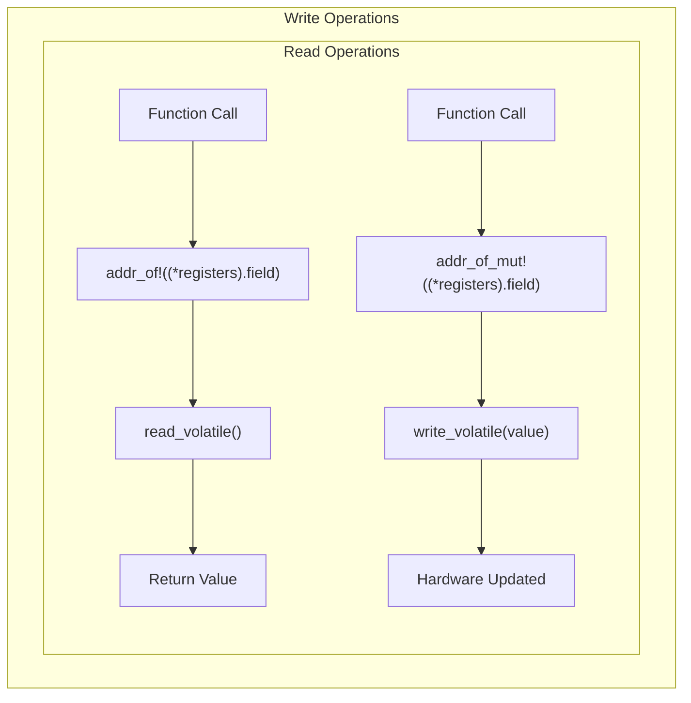
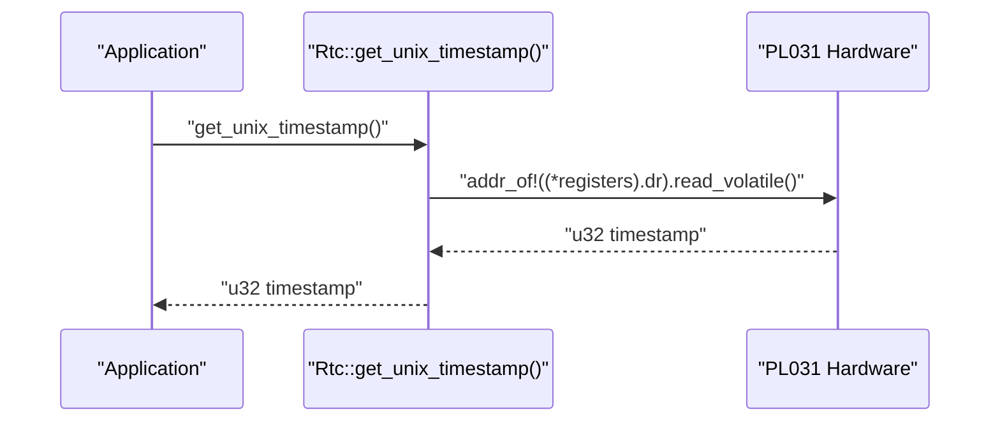
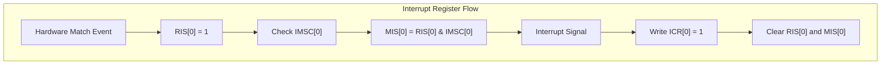
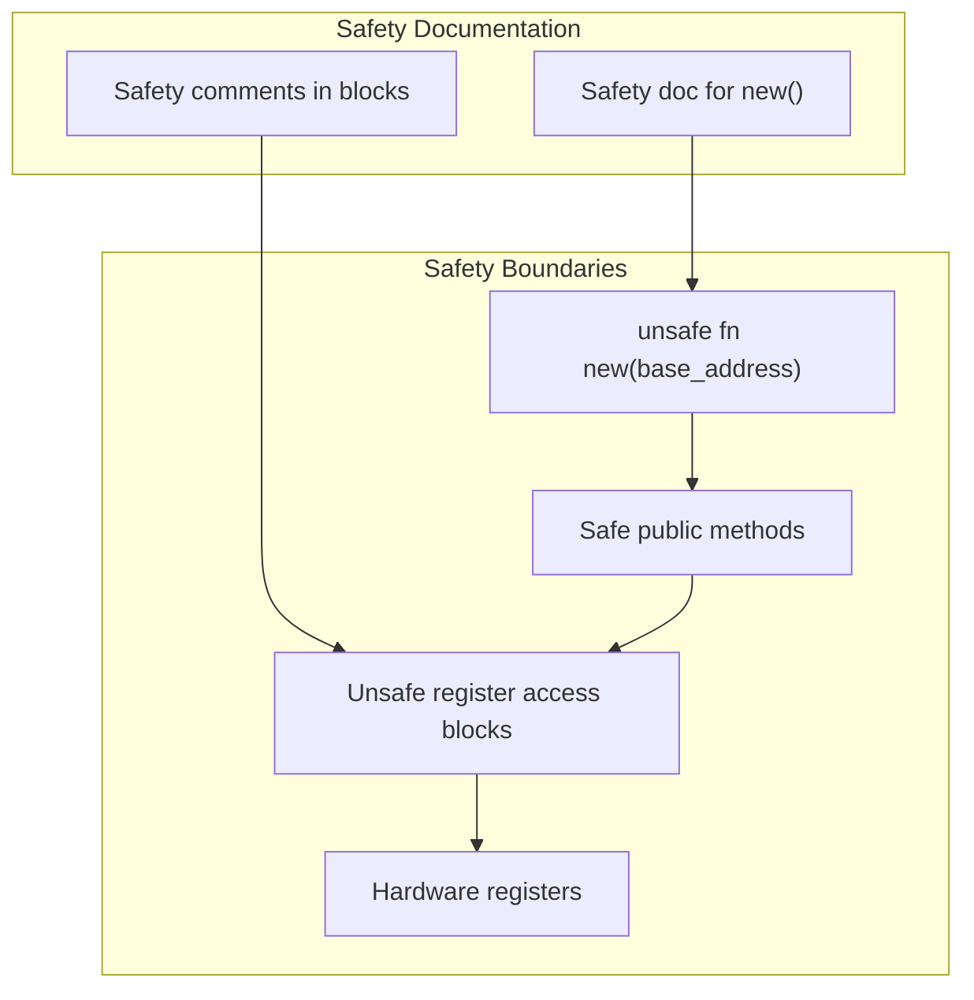

# Register Operations

> **Relevant source files**
> * [src/lib.rs](https://github.com/arceos-org/arm_pl031/blob/8cc6761d/src/lib.rs)

This page provides comprehensive documentation of the PL031 register operations implemented in the ARM PL031 RTC driver. It covers the register memory layout, volatile access patterns, and the meaning of each hardware register. For information about the broader hardware interface and MMIO concepts, see [Hardware Interface and MMIO](/arceos-org/arm_pl031/3.2-hardware-interface-and-mmio). For details about interrupt-specific register usage, see [Interrupt Handling](/arceos-org/arm_pl031/3.4-interrupt-handling).

## Register Layout and Memory Mapping

The PL031 device exposes its functionality through a set of memory-mapped registers. The driver defines these registers using a C-compatible structure that matches the hardware layout exactly.

### Memory Layout Structure

The register layout is defined in the `Registers` struct which uses precise memory alignment and padding to match the PL031 hardware specification:

The structure uses `#[repr(C, align(4))]` to ensure proper memory layout and alignment with the hardware expectations. Reserved fields with specific padding ensure that each register appears at the correct memory offset.

**Sources:** [src/lib.rs(L15 - L39)&emsp;](https://github.com/arceos-org/arm_pl031/blob/8cc6761d/src/lib.rs#L15-L39)

### Register Access Patterns

All register operations use volatile memory access to prevent compiler optimizations that could interfere with hardware communication:

**Sources:** [src/lib.rs(L64 - L66)&emsp;](https://github.com/arceos-org/arm_pl031/blob/8cc6761d/src/lib.rs#L64-L66) [src/lib.rs(L70 - L74)&emsp;](https://github.com/arceos-org/arm_pl031/blob/8cc6761d/src/lib.rs#L70-L74) [src/lib.rs(L78 - L82)&emsp;](https://github.com/arceos-org/arm_pl031/blob/8cc6761d/src/lib.rs#L78-L82)

## Individual Register Operations

### Data Register (DR)

The Data Register provides read-only access to the current RTC value as a 32-bit Unix timestamp.

|Field|Type|Access|Purpose|
| --- | --- | --- | --- |
|dr|u32|Read-only|Current time in seconds since Unix epoch|

The `get_unix_timestamp()` method reads this register:

**Sources:** [src/lib.rs(L18)&emsp;](https://github.com/arceos-org/arm_pl031/blob/8cc6761d/src/lib.rs#L18-L18) [src/lib.rs(L62 - L67)&emsp;](https://github.com/arceos-org/arm_pl031/blob/8cc6761d/src/lib.rs#L62-L67)

### Load Register (LR)

The Load Register allows setting the current RTC time by writing a 32-bit Unix timestamp.

|Field|Type|Access|Purpose|
| --- | --- | --- | --- |
|lr|u32|Write-only|Sets current time in seconds since Unix epoch|

The `set_unix_timestamp()` method writes to this register:

**Sources:** [src/lib.rs(L22)&emsp;](https://github.com/arceos-org/arm_pl031/blob/8cc6761d/src/lib.rs#L22-L22) [src/lib.rs(L69 - L74)&emsp;](https://github.com/arceos-org/arm_pl031/blob/8cc6761d/src/lib.rs#L69-L74)

### Match Register (MR)

The Match Register stores a timestamp value that triggers an interrupt when the RTC time matches it.

|Field|Type|Access|Purpose|
| --- | --- | --- | --- |
|mr|u32|Write-only|Alarm time for interrupt generation|

The `set_match_timestamp()` method configures this register:

**Sources:** [src/lib.rs(L20)&emsp;](https://github.com/arceos-org/arm_pl031/blob/8cc6761d/src/lib.rs#L20-L20) [src/lib.rs(L76 - L82)&emsp;](https://github.com/arceos-org/arm_pl031/blob/8cc6761d/src/lib.rs#L76-L82)

### Interrupt Control Registers

The PL031 provides several registers for interrupt management:

|Register|Field|Type|Purpose|
| --- | --- | --- | --- |
|IMSC|imsc|u8|Interrupt mask control (enable/disable)|
|RIS|ris|u8|Raw interrupt status (always shows match state)|
|MIS|mis|u8|Masked interrupt status (shows pending interrupts)|
|ICR|icr|u8|Interrupt clear (write to acknowledge)|

**Sources:** [src/lib.rs(L27 - L38)&emsp;](https://github.com/arceos-org/arm_pl031/blob/8cc6761d/src/lib.rs#L27-L38) [src/lib.rs(L104 - L113)&emsp;](https://github.com/arceos-org/arm_pl031/blob/8cc6761d/src/lib.rs#L104-L113) [src/lib.rs(L115 - L120)&emsp;](https://github.com/arceos-org/arm_pl031/blob/8cc6761d/src/lib.rs#L115-L120)

## Volatile Access Safety

All register operations are performed within `unsafe` blocks due to the raw pointer dereference required for MMIO access. The driver ensures safety through several mechanisms:

### Memory Safety Guarantees

* The `Rtc::new()` constructor requires the caller to provide safety guarantees about the base address
* All register access uses `addr_of!` and `addr_of_mut!` macros to create properly aligned pointers
* Volatile operations prevent compiler optimizations that could reorder or eliminate hardware accesses

**Sources:** [src/lib.rs(L51 - L60)&emsp;](https://github.com/arceos-org/arm_pl031/blob/8cc6761d/src/lib.rs#L51-L60) [src/lib.rs(L64 - L66)&emsp;](https://github.com/arceos-org/arm_pl031/blob/8cc6761d/src/lib.rs#L64-L66) [src/lib.rs(L72 - L74)&emsp;](https://github.com/arceos-org/arm_pl031/blob/8cc6761d/src/lib.rs#L72-L74)

### Register Field Access Patterns

The driver uses consistent patterns for accessing register fields:

|Operation|Pattern|Example|
| --- | --- | --- |
|Read u32|addr_of!((*registers).field).read_volatile()|DR, RIS, MIS|
|Write u32|addr_of_mut!((*registers).field).write_volatile(value)|LR, MR|
|Read u8|addr_of!((*registers).field).read_volatile()|Status registers|
|Write u8|addr_of_mut!((*registers).field).write_volatile(value)|Control registers|

All register operations include safety comments explaining why the unsafe operation is valid within the context of the driver's safety guarantees.

**Sources:** [src/lib.rs(L64 - L74)&emsp;](https://github.com/arceos-org/arm_pl031/blob/8cc6761d/src/lib.rs#L64-L74) [src/lib.rs(L88 - L90)&emsp;](https://github.com/arceos-org/arm_pl031/blob/8cc6761d/src/lib.rs#L88-L90) [src/lib.rs(L99 - L101)&emsp;](https://github.com/arceos-org/arm_pl031/blob/8cc6761d/src/lib.rs#L99-L101) [src/lib.rs(L111 - L112)&emsp;](https://github.com/arceos-org/arm_pl031/blob/8cc6761d/src/lib.rs#L111-L112) [src/lib.rs(L118 - L119)&emsp;](https://github.com/arceos-org/arm_pl031/blob/8cc6761d/src/lib.rs#L118-L119)