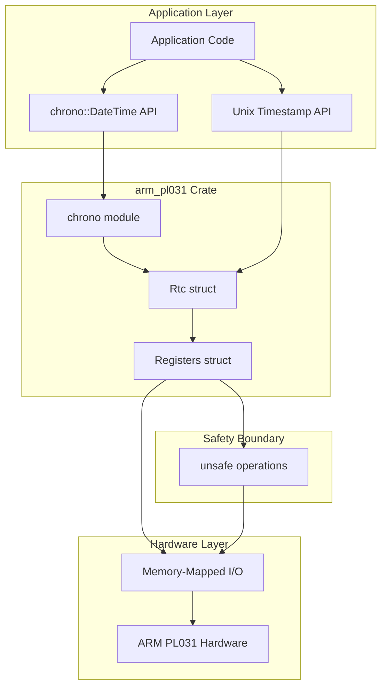
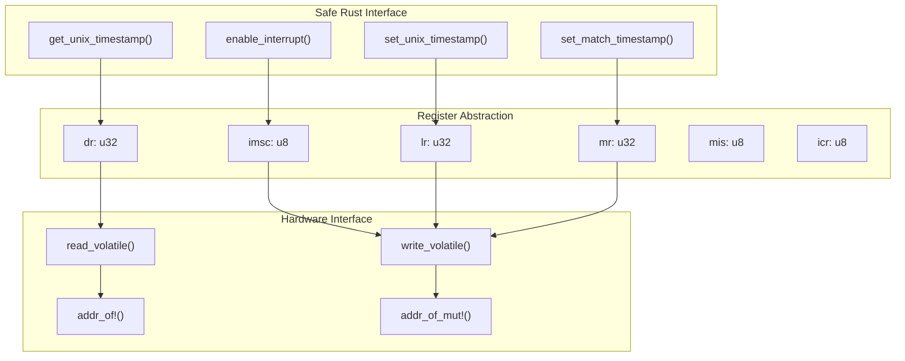
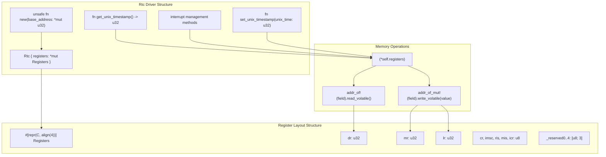
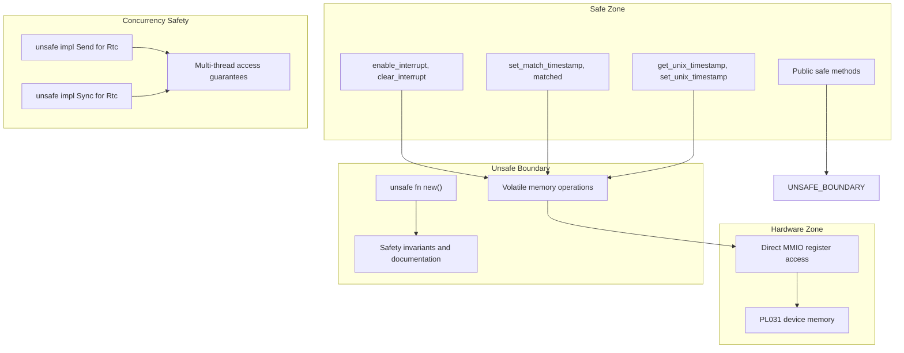

# System Architecture

> **Relevant source files**
> * [README.md](https://github.com/arceos-org/arm_pl031/blob/8cc6761d/README.md)
> * [src/lib.rs](https://github.com/arceos-org/arm_pl031/blob/8cc6761d/src/lib.rs)

## Purpose and Scope

This document explains the high-level architecture of the arm_pl031 crate, focusing on how the driver abstracts ARM PL031 RTC hardware through layered components, safety boundaries, and feature integration. It covers the structural relationships between the core `Rtc` driver, hardware register interface, and optional feature extensions.

For implementation details of specific components, see [Core Driver Implementation](/arceos-org/arm_pl031/3-core-driver-implementation). For practical usage guidance, see [Getting Started](/arceos-org/arm_pl031/2-getting-started).

## Overall Architecture Overview

The arm_pl031 crate implements a layered architecture that provides safe, high-level access to ARM PL031 RTC hardware while maintaining clear separation between abstraction levels.



**Architecture Diagram: Overall System Layers**

This architecture provides multiple abstraction levels, allowing developers to choose between high-level `DateTime` operations or low-level timestamp manipulation while maintaining memory safety through controlled unsafe boundaries.

Sources: [src/lib.rs(L1 - L159)&emsp;](https://github.com/arceos-org/arm_pl031/blob/8cc6761d/src/lib.rs#L1-L159)

## Hardware Abstraction Layers

The driver implements a three-tier abstraction model that isolates hardware specifics while providing flexible access patterns.



**Architecture Diagram: Hardware Abstraction Tiers**

Each tier serves a specific purpose:

* **Safe Interface**: Provides memory-safe methods with clear semantics
* **Register Abstraction**: Maps PL031 registers to Rust types with proper layout
* **Hardware Interface**: Handles volatile memory operations with explicit safety documentation

Sources: [src/lib.rs(L15 - L39)&emsp;](https://github.com/arceos-org/arm_pl031/blob/8cc6761d/src/lib.rs#L15-L39) [src/lib.rs(L62 - L121)&emsp;](https://github.com/arceos-org/arm_pl031/blob/8cc6761d/src/lib.rs#L62-L121)

## Component Architecture and Relationships

The core architecture centers around two primary structures that encapsulate hardware interaction and provide the driver interface.

|Component|Purpose|Safety Level|Key Responsibilities|
| --- | --- | --- | --- |
|Rtc|Driver interface|Safe wrapper|Time operations, interrupt management|
|Registers|Hardware layout|Memory representation|Register field mapping, memory alignment|
|chronomodule|Feature extension|Safe wrapper|DateTime conversion, high-level API|



**Architecture Diagram: Core Component Relationships**

The `Rtc` struct maintains a single pointer to a `Registers` structure, which provides C-compatible memory layout matching the PL031 hardware specification. All hardware access flows through volatile pointer operations to ensure proper memory semantics.

Sources: [src/lib.rs(L15 - L44)&emsp;](https://github.com/arceos-org/arm_pl031/blob/8cc6761d/src/lib.rs#L15-L44) [src/lib.rs(L46 - L61)&emsp;](https://github.com/arceos-org/arm_pl031/blob/8cc6761d/src/lib.rs#L46-L61)

## Safety Model and Boundaries

The driver implements a clear safety model that contains all unsafe operations at the hardware interface boundary while providing safe abstractions for application code.



**Architecture Diagram: Safety Boundaries and Concurrency Model**

### Safety Requirements

The driver enforces specific safety requirements at the boundary:

1. **Memory Safety**: The `base_address` parameter in `Rtc::new()` must point to valid PL031 MMIO registers
2. **Alignment**: Hardware addresses must be 4-byte aligned as enforced by `#[repr(C, align(4))]`
3. **Exclusive Access**: No other aliases to the device memory region are permitted
4. **Device Mapping**: Memory must be mapped as device memory, not normal cacheable memory

### Concurrency Safety

The driver provides thread-safety through carefully designed `Send` and `Sync` implementations:

* `Send`: Safe because device memory access works from any thread context
* `Sync`: Safe because shared read access to device registers is inherently safe, and mutation requires `&mut self`

Sources: [src/lib.rs(L51 - L60)&emsp;](https://github.com/arceos-org/arm_pl031/blob/8cc6761d/src/lib.rs#L51-L60) [src/lib.rs(L123 - L128)&emsp;](https://github.com/arceos-org/arm_pl031/blob/8cc6761d/src/lib.rs#L123-L128)

## Feature Integration Architecture

The crate supports optional feature integration through Cargo feature flags, with the chrono integration serving as the primary example of the extensibility model.

```

```

**Architecture Diagram: Feature Integration and Build Configuration**

### Feature Design Principles

1. **Minimal Core**: The base driver remains lightweight with only essential functionality
2. **Optional Extensions**: Advanced features like DateTime support are opt-in through feature flags
3. **No-std Compatibility**: All features maintain compatibility with embedded environments
4. **Layered Integration**: Feature modules build upon the core API without modifying its interface

The chrono integration demonstrates this pattern by providing higher-level `DateTime<Utc>` operations while delegating to the core `get_unix_timestamp()` and `set_unix_timestamp()` methods.

Sources: [src/lib.rs(L10 - L11)&emsp;](https://github.com/arceos-org/arm_pl031/blob/8cc6761d/src/lib.rs#L10-L11) [src/lib.rs(L3)&emsp;](https://github.com/arceos-org/arm_pl031/blob/8cc6761d/src/lib.rs#L3-L3)