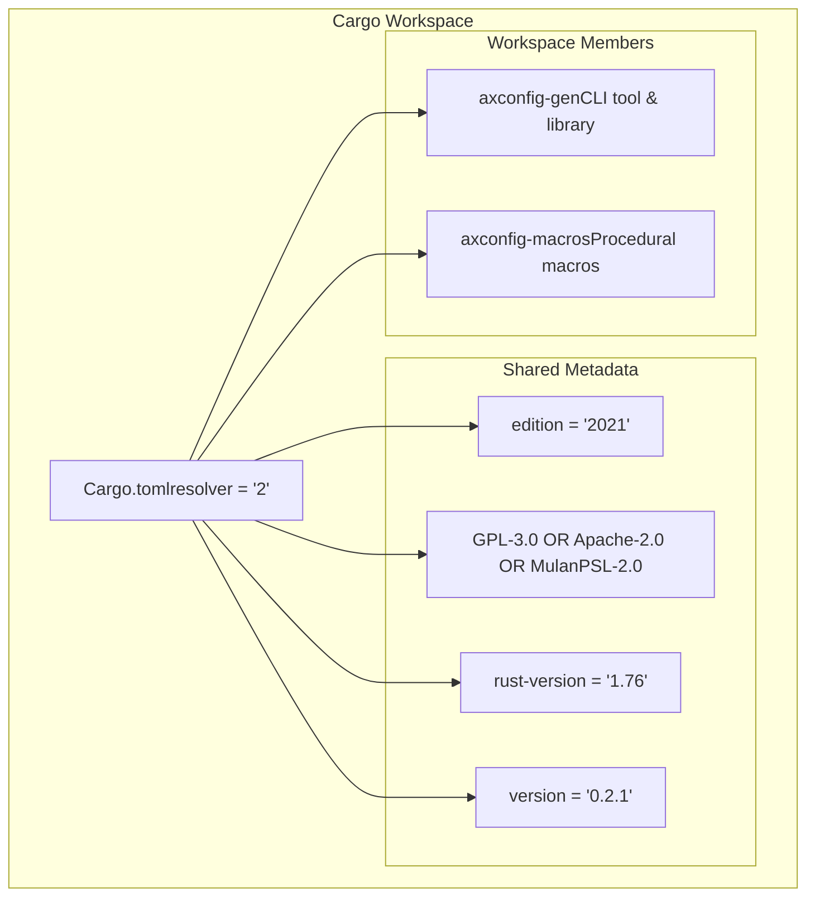
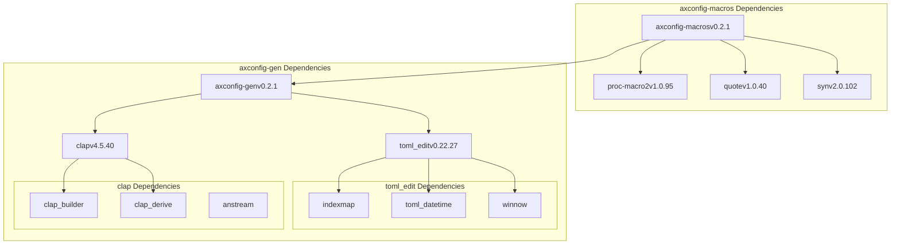
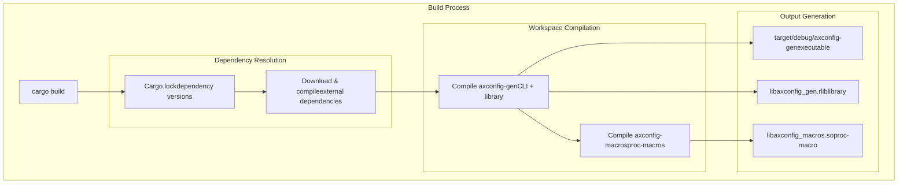

# Build System and Dependencies

> **Relevant source files**
> * [Cargo.lock](https://github.com/arceos-org/axconfig-gen/blob/99357274/Cargo.lock)
> * [Cargo.toml](https://github.com/arceos-org/axconfig-gen/blob/99357274/Cargo.toml)

This page documents the Cargo workspace structure, dependency management, and local build configuration for the axconfig-gen repository. It covers the multi-crate workspace organization, external dependency requirements, and the build process for both CLI tools and procedural macros.

For information about testing procedures, see [Testing](/arceos-org/axconfig-gen/5.2-testing). For details about continuous integration workflows, see [Continuous Integration](/arceos-org/axconfig-gen/5.3-continuous-integration).

## Workspace Structure

The axconfig-gen repository is organized as a Cargo workspace containing two primary crates that work together to provide configuration processing capabilities.

### Workspace Configuration

The workspace is defined in the root [Cargo.toml(L1 - L18)&emsp;](https://github.com/arceos-org/axconfig-gen/blob/99357274/Cargo.toml#L1-L18) with `resolver = "2"` enabling the newer dependency resolver. This configuration establishes shared metadata across all workspace members including version `0.2.1`, Rust edition `2021`, and a minimum Rust version requirement of `1.76`.

**Workspace Member Dependencies**

The workspace defines an explicit dependency relationship where `axconfig-macros` depends on `axconfig-gen`, allowing the procedural macros to reuse the core configuration processing logic.

Sources: [Cargo.toml(L1 - L18)&emsp;](https://github.com/arceos-org/axconfig-gen/blob/99357274/Cargo.toml#L1-L18) [Cargo.lock(L56 - L71)&emsp;](https://github.com/arceos-org/axconfig-gen/blob/99357274/Cargo.lock#L56-L71)

## Dependency Architecture

The project maintains a clean separation between CLI/library functionality and macro functionality through its dependency structure.

### Core Dependencies by Crate

|Crate|Direct Dependencies|Purpose|
| --- | --- | --- |
|axconfig-gen|clap,toml_edit|CLI argument parsing and TOML manipulation|
|axconfig-macros|axconfig-gen,proc-macro2,quote,syn|Procedural macro infrastructure and core logic reuse|

### External Dependency Graph

**Key Dependency Roles**

* `clap` (v4.5.40): Provides command-line argument parsing with derive macros for the CLI interface
* `toml_edit` (v0.22.27): Enables TOML document parsing and manipulation while preserving formatting
* `proc-macro2` (v1.0.95): Low-level procedural macro token stream manipulation
* `quote` (v1.0.40): Template-based Rust code generation for macro expansion
* `syn` (v2.0.102): Rust syntax tree parsing for macro input processing

Sources: [Cargo.lock(L56 - L61)&emsp;](https://github.com/arceos-org/axconfig-gen/blob/99357274/Cargo.lock#L56-L61) [Cargo.lock(L64 - L71)&emsp;](https://github.com/arceos-org/axconfig-gen/blob/99357274/Cargo.lock#L64-L71) [Cargo.lock(L74 - L81)&emsp;](https://github.com/arceos-org/axconfig-gen/blob/99357274/Cargo.lock#L74-L81) [Cargo.lock(L207 - L216)&emsp;](https://github.com/arceos-org/axconfig-gen/blob/99357274/Cargo.lock#L207-L216)

## Build Process and Requirements

### Environment Requirements

The project requires Rust `1.76` or later as specified in [Cargo.toml(L17)&emsp;](https://github.com/arceos-org/axconfig-gen/blob/99357274/Cargo.toml#L17-L17) This minimum version ensures compatibility with the procedural macro features and dependency requirements used throughout the codebase.

### Build Commands

|Command|Purpose|Output|
| --- | --- | --- |
|cargo build|Build all workspace members|Target binaries and libraries|
|cargo build --bin axconfig-gen|Build only CLI tool|target/debug/axconfig-gen|
|cargo build --release|Optimized build|Release binaries intarget/release/|
|cargo install --path axconfig-gen|Install CLI globally|System-wideaxconfig-gencommand|

### Build Flow

**Cross-Crate Compilation Order**

The build system automatically handles the dependency order, compiling `axconfig-gen` first since `axconfig-macros` depends on it. This ensures the library interface is available during procedural macro compilation.

Sources: [Cargo.toml(L4 - L7)&emsp;](https://github.com/arceos-org/axconfig-gen/blob/99357274/Cargo.toml#L4-L7) [Cargo.lock(L56 - L71)&emsp;](https://github.com/arceos-org/axconfig-gen/blob/99357274/Cargo.lock#L56-L71)

## Development Dependencies

### Transitive Dependency Analysis

The [Cargo.lock(L1 - L317)&emsp;](https://github.com/arceos-org/axconfig-gen/blob/99357274/Cargo.lock#L1-L317) reveals a total of 31 crates in the complete dependency tree. Key transitive dependencies include:

* **Windows Support**: `windows-sys` and related platform-specific crates for cross-platform CLI functionality
* **String Processing**: `unicode-ident`, `memchr`, `utf8parse` for robust text handling
* **Data Structures**: `hashbrown`, `indexmap` for efficient key-value storage in TOML processing

### Licensing Compatibility

The workspace uses a tri-license approach: `GPL-3.0-or-later OR Apache-2.0 OR MulanPSL-2.0` as specified in [Cargo.toml(L13)&emsp;](https://github.com/arceos-org/axconfig-gen/blob/99357274/Cargo.toml#L13-L13) All external dependencies maintain compatible licensing terms, ensuring legal compliance for distribution.

### Version Management

The workspace employs pinned versions in [Cargo.lock(L1 - L317)&emsp;](https://github.com/arceos-org/axconfig-gen/blob/99357274/Cargo.lock#L1-L317) to ensure reproducible builds across different environments. Major dependency versions are:

* CLI ecosystem: `clap` 4.x series with stable API
* TOML processing: `toml_edit` 0.22.x with advanced editing capabilities
* Macro ecosystem: `proc-macro2`, `quote`, `syn` 1.x/2.x series with mature APIs

Sources: [Cargo.toml(L9 - L17)&emsp;](https://github.com/arceos-org/axconfig-gen/blob/99357274/Cargo.toml#L9-L17) [Cargo.lock(L1 - L317)&emsp;](https://github.com/arceos-org/axconfig-gen/blob/99357274/Cargo.lock#L1-L317)