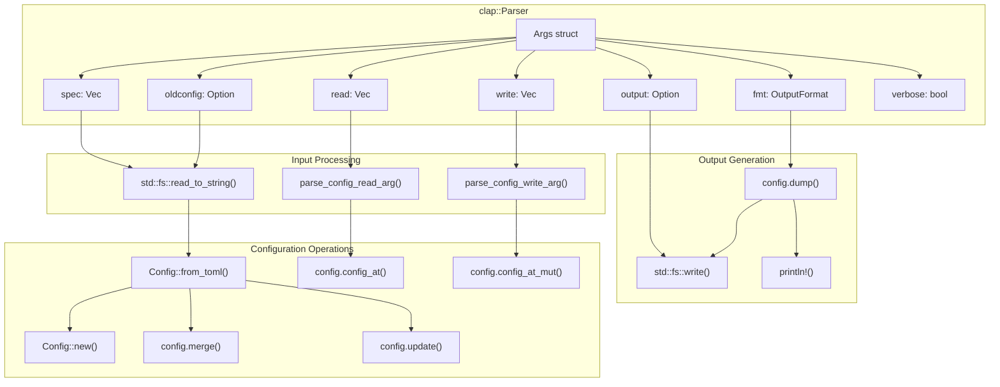
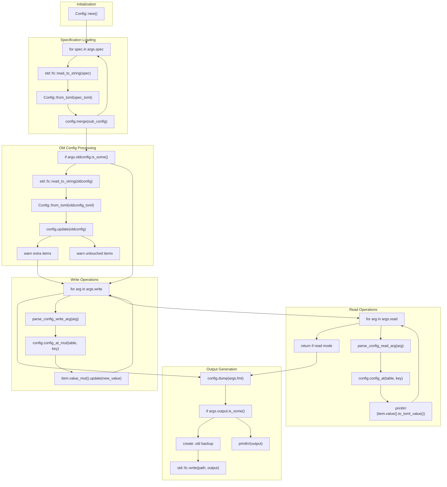

# Command Line Interface

> **Relevant source files**
> * [axconfig-gen/README.md](https://github.com/arceos-org/axconfig-gen/blob/99357274/axconfig-gen/README.md)
> * [axconfig-gen/src/main.rs](https://github.com/arceos-org/axconfig-gen/blob/99357274/axconfig-gen/src/main.rs)

This document provides comprehensive documentation for the `axconfig-gen` command-line interface (CLI) tool. The CLI enables users to process TOML configuration files, merge specifications, update configurations, and generate output in various formats for the ArceOS operating system.

For information about using axconfig-gen as a Rust library, see [Library API](/arceos-org/axconfig-gen/2.2-library-api). For compile-time configuration processing using procedural macros, see [axconfig-macros Package](/arceos-org/axconfig-gen/3-axconfig-macros-package).

## CLI Architecture Overview

The CLI tool is built around a structured argument parsing system that processes configuration specifications through a multi-stage pipeline.

**CLI Argument Processing Architecture**



Sources: [axconfig-gen/src/main.rs(L5 - L40)&emsp;](https://github.com/arceos-org/axconfig-gen/blob/99357274/axconfig-gen/src/main.rs#L5-L40) [axconfig-gen/src/main.rs(L76 - L174)&emsp;](https://github.com/arceos-org/axconfig-gen/blob/99357274/axconfig-gen/src/main.rs#L76-L174)

## Command Line Arguments

The CLI accepts multiple arguments that control different aspects of configuration processing:

|Argument|Short|Type|Required|Description|
| --- | --- | --- | --- | --- |
|<SPEC>...|-|Vec<String>|Yes|Paths to configuration specification files|
|--oldconfig|-c|Option<String>|No|Path to existing configuration file for updates|
|--output|-o|Option<String>|No|Output file path (stdout if not specified)|
|--fmt|-f|OutputFormat|No|Output format:tomlorrust(default:toml)|
|--read|-r|Vec<String>|No|Read config items with formattable.key|
|--write|-w|Vec<String>|No|Write config items with formattable.key=value|
|--verbose|-v|bool|No|Enable verbose debug output|

### Format Specification

The `--fmt` argument accepts two values processed by a `PossibleValuesParser`:

```
toml  - Generate TOML configuration output
rust  - Generate Rust constant definitions
```

Sources: [axconfig-gen/src/main.rs(L7 - L40)&emsp;](https://github.com/arceos-org/axconfig-gen/blob/99357274/axconfig-gen/src/main.rs#L7-L40) [axconfig-gen/README.md(L8 - L22)&emsp;](https://github.com/arceos-org/axconfig-gen/blob/99357274/axconfig-gen/README.md#L8-L22)

## Configuration Item Addressing

Configuration items use a dot-notation addressing system implemented in parsing functions:

**Configuration Item Parsing Flow**

```

```

Sources: [axconfig-gen/src/main.rs(L42 - L62)&emsp;](https://github.com/arceos-org/axconfig-gen/blob/99357274/axconfig-gen/src/main.rs#L42-L62) [axconfig-gen/src/main.rs(L136 - L147)&emsp;](https://github.com/arceos-org/axconfig-gen/blob/99357274/axconfig-gen/src/main.rs#L136-L147)

## Usage Patterns

### Basic Configuration Generation

Generate a configuration file from specifications:

```
axconfig-gen spec1.toml spec2.toml -o .axconfig.toml -f toml
```

This pattern loads multiple specification files, merges them using `Config::merge()`, and outputs the result.

### Configuration Updates

Update an existing configuration with new specifications:

```
axconfig-gen defconfig.toml -c existing.toml -o updated.toml
```

The update process uses `Config::update()` which returns untouched and extra items for warning generation.

### Runtime Configuration Queries

Read specific configuration values:

```
axconfig-gen defconfig.toml -r kernel.heap_size -r features.smp
```

Write configuration values:

```
axconfig-gen defconfig.toml -w kernel.heap_size=0x100000 -w features.smp=true
```

### Rust Code Generation

Generate Rust constant definitions:

```
axconfig-gen defconfig.toml -f rust -o config.rs
```

Sources: [axconfig-gen/README.md(L24 - L28)&emsp;](https://github.com/arceos-org/axconfig-gen/blob/99357274/axconfig-gen/README.md#L24-L28) [axconfig-gen/src/main.rs(L87 - L95)&emsp;](https://github.com/arceos-org/axconfig-gen/blob/99357274/axconfig-gen/src/main.rs#L87-L95) [axconfig-gen/src/main.rs(L97 - L117)&emsp;](https://github.com/arceos-org/axconfig-gen/blob/99357274/axconfig-gen/src/main.rs#L97-L117)

## Configuration Processing Pipeline

The CLI implements a sequential processing pipeline that handles merging, updating, and querying operations:

**Configuration Processing Flow**



Sources: [axconfig-gen/src/main.rs(L87 - L174)&emsp;](https://github.com/arceos-org/axconfig-gen/blob/99357274/axconfig-gen/src/main.rs#L87-L174)

## Error Handling and Debugging

The CLI implements comprehensive error handling with a custom `unwrap!` macro that provides clean error messages and exits gracefully:

### Error Handling Mechanism

* File reading errors display the problematic file path
* TOML parsing errors show detailed syntax information
* Config merging conflicts are reported with item names
* Missing configuration items generate helpful error messages

### Verbose Mode

When `--verbose` is enabled, the CLI outputs debug information for:

* Configuration specification loading
* Old configuration processing
* Individual config item operations
* Output generation decisions

The verbose output uses a local `debug!` macro that conditionally prints to stderr based on the `args.verbose` flag.

Sources: [axconfig-gen/src/main.rs(L64 - L74)&emsp;](https://github.com/arceos-org/axconfig-gen/blob/99357274/axconfig-gen/src/main.rs#L64-L74) [axconfig-gen/src/main.rs(L79 - L85)&emsp;](https://github.com/arceos-org/axconfig-gen/blob/99357274/axconfig-gen/src/main.rs#L79-L85) [axconfig-gen/src/main.rs(L89 - L90)&emsp;](https://github.com/arceos-org/axconfig-gen/blob/99357274/axconfig-gen/src/main.rs#L89-L90)

## File Backup System

When writing to an existing output file, the CLI automatically creates backup files to prevent data loss:

* Backup files use the `.old` extension (e.g., `config.toml` → `config.old.toml`)
* Backups are only created if the new output differs from the existing file
* The comparison prevents unnecessary writes when output is identical

This backup mechanism ensures safe configuration updates while avoiding redundant file operations.

Sources: [axconfig-gen/src/main.rs(L156 - L169)&emsp;](https://github.com/arceos-org/axconfig-gen/blob/99357274/axconfig-gen/src/main.rs#L156-L169)