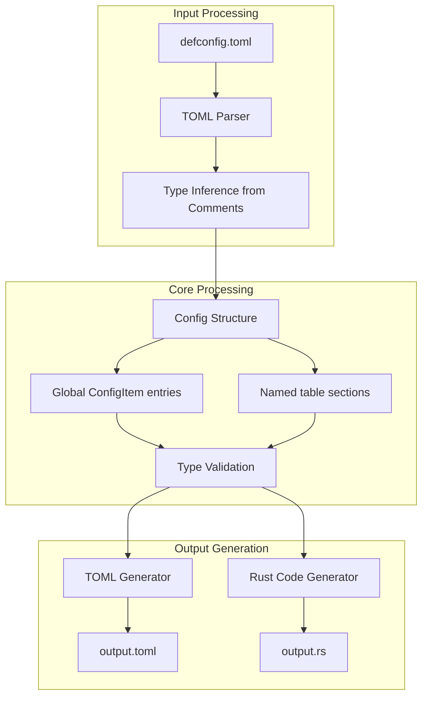
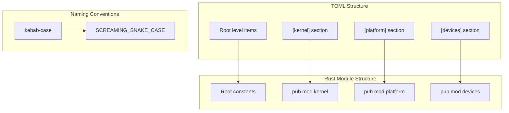

# Configuration Examples

> **Relevant source files**
> * [example-configs/defconfig.toml](https://github.com/arceos-org/axconfig-gen/blob/99357274/example-configs/defconfig.toml)
> * [example-configs/output.rs](https://github.com/arceos-org/axconfig-gen/blob/99357274/example-configs/output.rs)
> * [example-configs/output.toml](https://github.com/arceos-org/axconfig-gen/blob/99357274/example-configs/output.toml)

This page demonstrates how the axconfig-gen system transforms TOML configuration files into various output formats. It provides concrete examples showing input configurations and their corresponding generated outputs in both TOML and Rust formats. For information about the TOML input format specification, see [TOML Configuration Format](/arceos-org/axconfig-gen/4.1-toml-configuration-format). For detailed output format documentation, see [Generated Output Examples](/arceos-org/axconfig-gen/4.2-generated-output-examples).

## Complete Configuration Example

The following example demonstrates a complete ArceOS configuration transformation, showing how a defconfig TOML file is processed into both normalized TOML and Rust code outputs.

### Input Configuration Structure

```

```

**Sources:** [example-configs/defconfig.toml(L1 - L63)&emsp;](https://github.com/arceos-org/axconfig-gen/blob/99357274/example-configs/defconfig.toml#L1-L63)

### Transformation Pipeline



**Sources:** [example-configs/defconfig.toml(L1 - L63)&emsp;](https://github.com/arceos-org/axconfig-gen/blob/99357274/example-configs/defconfig.toml#L1-L63) [example-configs/output.toml(L1 - L63)&emsp;](https://github.com/arceos-org/axconfig-gen/blob/99357274/example-configs/output.toml#L1-L63) [example-configs/output.rs(L1 - L66)&emsp;](https://github.com/arceos-org/axconfig-gen/blob/99357274/example-configs/output.rs#L1-L66)

## Data Type Transformations

The configuration system supports multiple data types with automatic conversion between TOML values and Rust types:

|TOML Type|Example Input|Type Annotation|Rust Output|
| --- | --- | --- | --- |
|String|arch = "x86_64"|# str|pub const ARCH: &str = "x86_64";|
|Integer|smp = 1|# uint|pub const SMP: usize = 1;|
|Hex Integer|phys-memory-size = 0x800_0000|# uint|pub const PHYS_MEMORY_SIZE: usize = 0x800_0000;|
|String as Integer|kernel-base-vaddr = "0xffff_ff80_0020_0000"|# uint|pub const KERNEL_BASE_VADDR: usize = 0xffff_ff80_0020_0000;|
|Array of Arrays|mmio-regions = [["0xb000_0000", "0x1000_0000"]]|# [(uint, uint)]|pub const MMIO_REGIONS: &[(usize, usize)] = &[(0xb000_0000, 0x1000_0000)];|
|Empty Array|virtio-mmio-regions = []|# [(uint, uint)]|pub const VIRTIO_MMIO_REGIONS: &[(usize, usize)] = &[];|

**Sources:** [example-configs/defconfig.toml(L2 - L56)&emsp;](https://github.com/arceos-org/axconfig-gen/blob/99357274/example-configs/defconfig.toml#L2-L56) [example-configs/output.rs(L2 - L27)&emsp;](https://github.com/arceos-org/axconfig-gen/blob/99357274/example-configs/output.rs#L2-L27)

## Structure Mapping Between Formats

The system maps TOML structure to Rust module hierarchy:



**Sources:** [example-configs/defconfig.toml(L11 - L46)&emsp;](https://github.com/arceos-org/axconfig-gen/blob/99357274/example-configs/defconfig.toml#L11-L46) [example-configs/output.rs(L11 - L65)&emsp;](https://github.com/arceos-org/axconfig-gen/blob/99357274/example-configs/output.rs#L11-L65)

### Naming Convention Examples

|TOML Name|Rust Constant|
| --- | --- |
|task-stack-size|TASK_STACK_SIZE|
|phys-memory-base|PHYS_MEMORY_BASE|
|kernel-base-vaddr|KERNEL_BASE_VADDR|
|mmio-regions|MMIO_REGIONS|
|pci-ecam-base|PCI_ECAM_BASE|

**Sources:** [example-configs/defconfig.toml(L13 - L58)&emsp;](https://github.com/arceos-org/axconfig-gen/blob/99357274/example-configs/defconfig.toml#L13-L58) [example-configs/output.rs(L13 - L57)&emsp;](https://github.com/arceos-org/axconfig-gen/blob/99357274/example-configs/output.rs#L13-L57)

## Comment and Documentation Preservation

The system preserves comments from TOML files as Rust documentation:

### TOML Comments

```markdown
# Architecture identifier.
arch = "x86_64"             # str

# Stack size of each task.
task-stack-size = 0     # uint

# MMIO regions with format (`base_paddr`, `size`).
mmio-regions = [
    ["0xb000_0000", "0x1000_0000"], # PCI config space
    ["0xfe00_0000", "0xc0_0000"],   # PCI devices
]                           # [(uint, uint)]
```

### Generated Rust Documentation

```javascript
/// Architecture identifier.
pub const ARCH: &str = "x86_64";

/// Stack size of each task.
pub const TASK_STACK_SIZE: usize = 0;

/// MMIO regions with format (`base_paddr`, `size`).
pub const MMIO_REGIONS: &[(usize, usize)] = &[
    (0xb000_0000, 0x1000_0000),
    (0xfe00_0000, 0xc0_0000),
    // ... more entries
];
```

**Sources:** [example-configs/defconfig.toml(L1 - L54)&emsp;](https://github.com/arceos-org/axconfig-gen/blob/99357274/example-configs/defconfig.toml#L1-L54) [example-configs/output.rs(L1 - L35)&emsp;](https://github.com/arceos-org/axconfig-gen/blob/99357274/example-configs/output.rs#L1-L35)

## Array Processing Examples

The system handles complex array structures, converting TOML arrays to Rust slices:

### Input Array Format

```markdown
mmio-regions = [
    ["0xb000_0000", "0x1000_0000"], # PCI config space
    ["0xfe00_0000", "0xc0_0000"],   # PCI devices
    ["0xfec0_0000", "0x1000"],      # IO APIC
    ["0xfed0_0000", "0x1000"],      # HPET
    ["0xfee0_0000", "0x1000"],      # Local APIC
]                           # [(uint, uint)]
```

### Generated Rust Array

```javascript
pub const MMIO_REGIONS: &[(usize, usize)] = &[
    (0xb000_0000, 0x1000_0000),
    (0xfe00_0000, 0xc0_0000),
    (0xfec0_0000, 0x1000),
    (0xfed0_0000, 0x1000),
    (0xfee0_0000, 0x1000),
];
```

**Sources:** [example-configs/defconfig.toml(L48 - L54)&emsp;](https://github.com/arceos-org/axconfig-gen/blob/99357274/example-configs/defconfig.toml#L48-L54) [example-configs/output.rs(L13 - L19)&emsp;](https://github.com/arceos-org/axconfig-gen/blob/99357274/example-configs/output.rs#L13-L19)

## Output Format Comparison

Both output formats maintain the same logical structure but serve different purposes:

|Aspect|TOML Output|Rust Output|
| --- | --- | --- |
|Purpose|Configuration interchange|Compile-time constants|
|Structure|Flat sections with key-value pairs|Nested modules with constants|
|Types|TOML native types with annotations|Strongly-typed Rust constants|
|Usage|Runtime configuration loading|Direct code integration|
|Comments|Preserved as TOML comments|Converted to doc comments|

The TOML output in [example-configs/output.toml(L1 - L63)&emsp;](https://github.com/arceos-org/axconfig-gen/blob/99357274/example-configs/output.toml#L1-L63) maintains the original structure while normalizing formatting. The Rust output in [example-configs/output.rs(L1 - L66)&emsp;](https://github.com/arceos-org/axconfig-gen/blob/99357274/example-configs/output.rs#L1-L66) provides type-safe compile-time access to the same configuration data.

**Sources:** [example-configs/output.toml(L1 - L63)&emsp;](https://github.com/arceos-org/axconfig-gen/blob/99357274/example-configs/output.toml#L1-L63) [example-configs/output.rs(L1 - L66)&emsp;](https://github.com/arceos-org/axconfig-gen/blob/99357274/example-configs/output.rs#L1-L66)