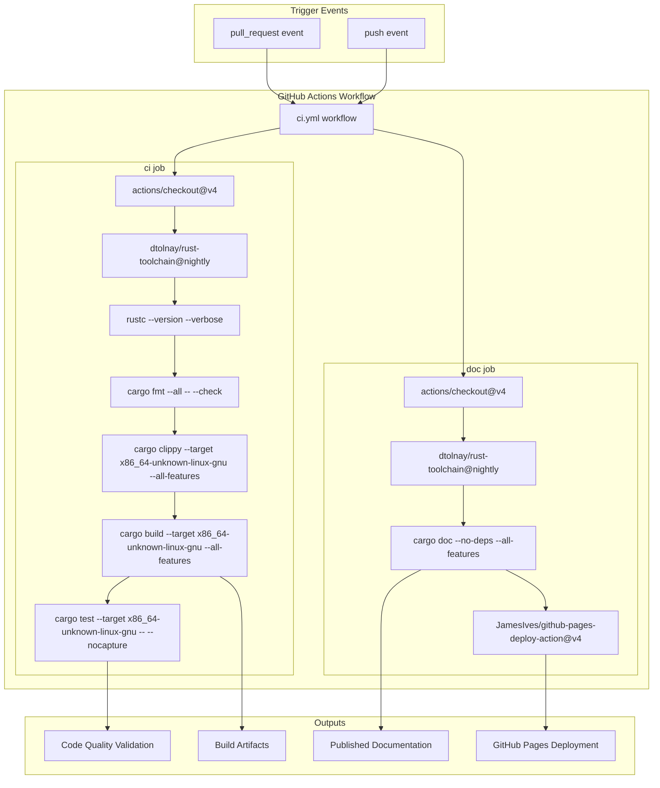
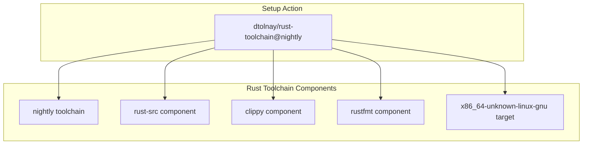
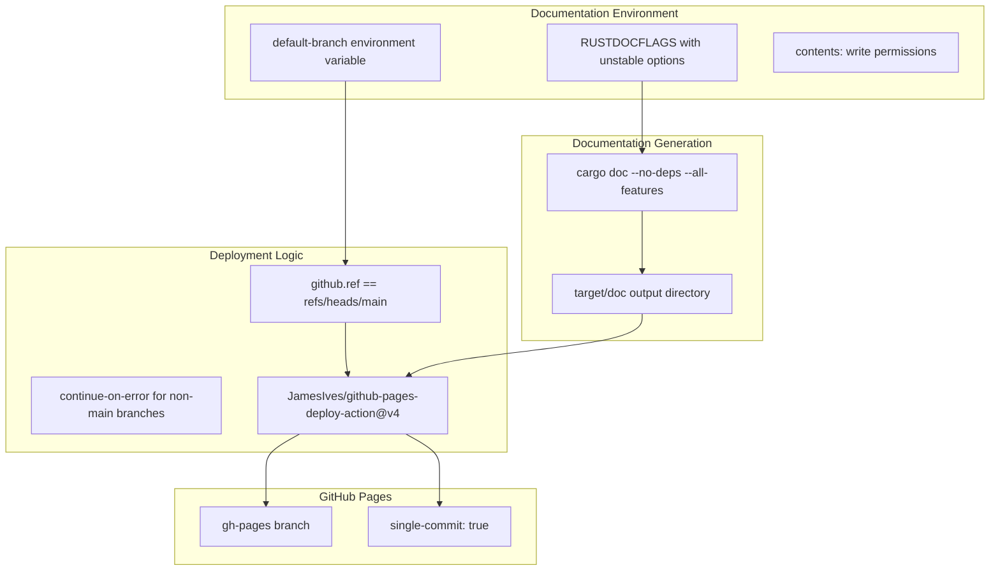

# Continuous Integration

> **Relevant source files**
> * [.github/workflows/ci.yml](https://github.com/arceos-org/axconfig-gen/blob/99357274/.github/workflows/ci.yml)

This document covers the automated continuous integration and deployment pipeline for the axconfig-gen repository. The CI system ensures code quality, runs comprehensive tests, and automatically deploys documentation. For information about manual testing procedures, see [Testing](/arceos-org/axconfig-gen/5.2-testing). For details about the build system configuration, see [Build System and Dependencies](/arceos-org/axconfig-gen/5.1-build-system-and-dependencies).

## Pipeline Overview

The CI system is implemented using GitHub Actions with a workflow defined in [.github/workflows/ci.yml(L1 - L53)&emsp;](https://github.com/arceos-org/axconfig-gen/blob/99357274/.github/workflows/ci.yml#L1-L53) The pipeline consists of two primary jobs that run on every push and pull request event.

### CI Workflow Structure

**Sources:** [.github/workflows/ci.yml(L1 - L53)&emsp;](https://github.com/arceos-org/axconfig-gen/blob/99357274/.github/workflows/ci.yml#L1-L53)

## Job Definitions and Matrix Strategy

The CI workflow uses a matrix strategy for the `ci` job to support multiple Rust toolchains and target architectures, though currently configured for a single combination.

### CI Job Configuration

|Parameter|Value|
| --- | --- |
|runs-on|ubuntu-latest|
|rust-toolchain|nightly|
|targets|x86_64-unknown-linux-gnu|
|fail-fast|false|

The job includes comprehensive Rust toolchain setup with required components:

**Sources:** [.github/workflows/ci.yml(L8 - L19)&emsp;](https://github.com/arceos-org/axconfig-gen/blob/99357274/.github/workflows/ci.yml#L8-L19)

## Quality Assurance Process

The CI pipeline implements a multi-stage quality assurance process that validates code formatting, performs static analysis, builds the project, and runs tests.

### Quality Gates Sequence

|Stage|Command|Purpose|
| --- | --- | --- |
|Version Check|rustc --version --verbose|Verify toolchain installation|
|Format Check|cargo fmt --all -- --check|Enforce code formatting standards|
|Static Analysis|cargo clippy --target x86_64-unknown-linux-gnu --all-features|Detect potential issues and style violations|
|Build|cargo build --target x86_64-unknown-linux-gnu --all-features|Ensure compilation succeeds|
|Test|cargo test --target x86_64-unknown-linux-gnu -- --nocapture|Execute unit and integration tests|

The pipeline uses the `--all-features` flag to ensure both `axconfig-gen` and `axconfig-macros` packages are tested with all feature combinations enabled.

**Sources:** [.github/workflows/ci.yml(L20 - L29)&emsp;](https://github.com/arceos-org/axconfig-gen/blob/99357274/.github/workflows/ci.yml#L20-L29)

## Documentation Pipeline

The `doc` job handles automated documentation generation and deployment to GitHub Pages with conditional execution based on the repository branch.

### Documentation Workflow

The documentation build uses specific `RUSTDOCFLAGS` configuration:

* `-Zunstable-options --enable-index-page`: Enables unstable documentation features
* `-D rustdoc::broken_intra_doc_links`: Treats broken internal links as errors
* `-D missing-docs`: Treats missing documentation as errors

**Sources:** [.github/workflows/ci.yml(L31 - L53)&emsp;](https://github.com/arceos-org/axconfig-gen/blob/99357274/.github/workflows/ci.yml#L31-L53)

## Deployment and Automation

The CI system implements conditional deployment logic that ensures documentation is only published from the main branch while allowing documentation builds to continue on other branches for validation.

### Deployment Configuration

|Setting|Value|Purpose|
| --- | --- | --- |
|single-commit|true|Maintains clean gh-pages history|
|branch|gh-pages|Target branch for documentation|
|folder|target/doc|Source directory for documentation files|

The deployment uses the `JamesIves/github-pages-deploy-action@v4` action with conditional execution based on `github.ref == env.default-branch` to ensure only main branch changes trigger actual deployment.

**Sources:** [.github/workflows/ci.yml(L46 - L52)&emsp;](https://github.com/arceos-org/axconfig-gen/blob/99357274/.github/workflows/ci.yml#L46-L52)