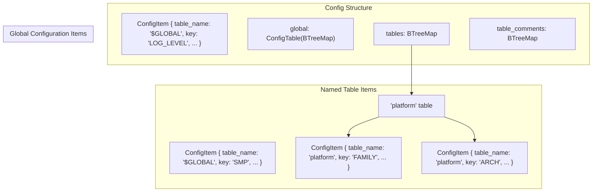
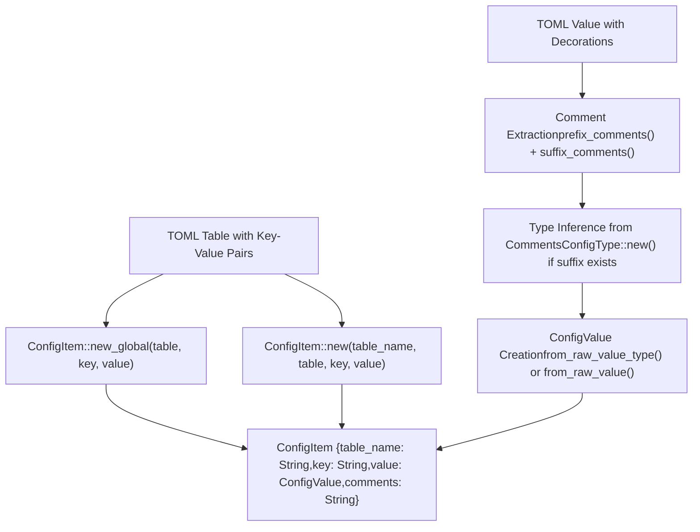
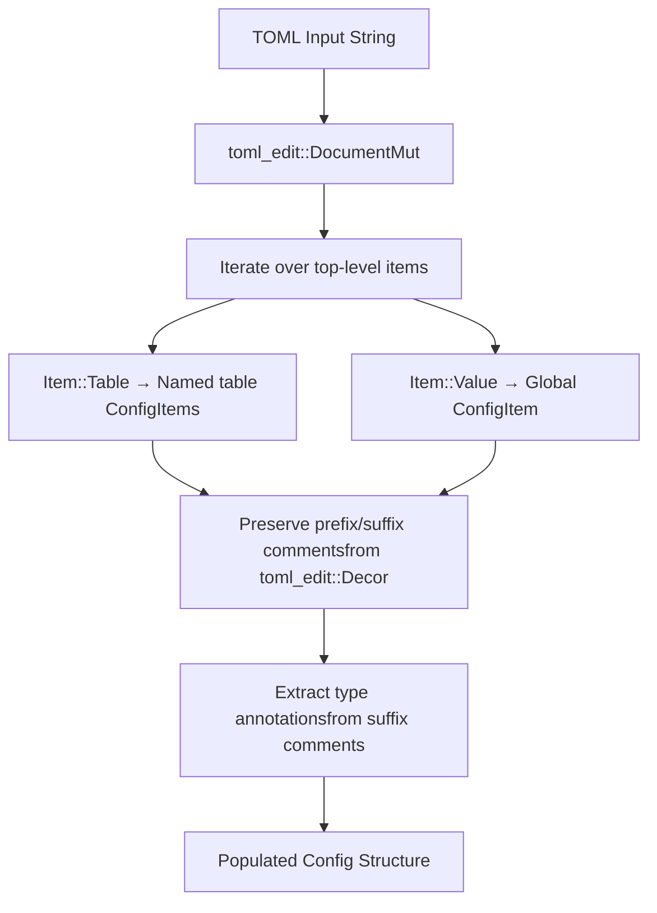

# Core Data Structures

> **Relevant source files**
> * [axconfig-gen/src/config.rs](https://github.com/arceos-org/axconfig-gen/blob/99357274/axconfig-gen/src/config.rs)
> * [axconfig-gen/src/tests.rs](https://github.com/arceos-org/axconfig-gen/blob/99357274/axconfig-gen/src/tests.rs)
> * [axconfig-gen/src/value.rs](https://github.com/arceos-org/axconfig-gen/blob/99357274/axconfig-gen/src/value.rs)

This page provides an in-depth examination of the three fundamental data structures that form the backbone of the axconfig-gen configuration system: `Config`, `ConfigItem`, and `ConfigValue`. These structures work together to represent, validate, and manipulate TOML-based configurations throughout the parsing, processing, and output generation pipeline.

For information about the type system and how types are inferred and validated, see [Type System](/arceos-org/axconfig-gen/2.2.2-type-system). For details on how these structures are used in output generation, see [Output Generation](/arceos-org/axconfig-gen/2.2.3-output-generation).

## Structure Relationships

The core data structures form a hierarchical relationship where `Config` serves as the top-level container, `ConfigItem` represents individual configuration entries, and `ConfigValue` wraps the actual values with type information.

```

```

**Sources:** [axconfig-gen/src/config.rs(L1 - L331)&emsp;](https://github.com/arceos-org/axconfig-gen/blob/99357274/axconfig-gen/src/config.rs#L1-L331) [axconfig-gen/src/value.rs(L1 - L289)&emsp;](https://github.com/arceos-org/axconfig-gen/blob/99357274/axconfig-gen/src/value.rs#L1-L289)

## Config Structure

The `Config` structure serves as the primary container for all configuration data, organizing items into a global table and named tables with associated comments.

### Internal Organization



The `Config` structure maintains a clear separation between global configuration items and those organized within named tables. The constant `GLOBAL_TABLE_NAME` is set to `"$GLOBAL"` to distinguish global items from named table items.

**Sources:** [axconfig-gen/src/config.rs(L91 - L113)&emsp;](https://github.com/arceos-org/axconfig-gen/blob/99357274/axconfig-gen/src/config.rs#L91-L113) [axconfig-gen/src/config.rs(L103 - L104)&emsp;](https://github.com/arceos-org/axconfig-gen/blob/99357274/axconfig-gen/src/config.rs#L103-L104)

### Key Methods and Operations

|Method|Purpose|Return Type|
| --- | --- | --- |
|new()|Creates empty config instance|Config|
|from_toml(toml: &str)|Parses TOML string into config|ConfigResult<Config>|
|merge(other: &Config)|Merges configurations, fails on duplicates|ConfigResult<()>|
|update(other: &Config)|Updates values, reports untouched/extra items|ConfigResult<(Vec<ConfigItem>, Vec<ConfigItem>)>|
|dump(fmt: OutputFormat)|Generates output in specified format|ConfigResult<String>|

The `merge` operation at [axconfig-gen/src/config.rs(L268 - L284)&emsp;](https://github.com/arceos-org/axconfig-gen/blob/99357274/axconfig-gen/src/config.rs#L268-L284) strictly prevents duplicate keys, while `update` at [axconfig-gen/src/config.rs(L292 - L322)&emsp;](https://github.com/arceos-org/axconfig-gen/blob/99357274/axconfig-gen/src/config.rs#L292-L322) allows value updates and reports which items were not updated.

**Sources:** [axconfig-gen/src/config.rs(L106 - L322)&emsp;](https://github.com/arceos-org/axconfig-gen/blob/99357274/axconfig-gen/src/config.rs#L106-L322)

## ConfigItem Structure

The `ConfigItem` structure represents individual configuration entries, encapsulating the hierarchical context (table name), the key identifier, the typed value, and associated documentation comments.

### Data Flow and Construction



The construction process extracts type annotations from trailing comments (suffix comments starting with `#`) and preserves documentation from prefix comments for later output generation.

**Sources:** [axconfig-gen/src/config.rs(L20 - L51)&emsp;](https://github.com/arceos-org/axconfig-gen/blob/99357274/axconfig-gen/src/config.rs#L20-L51) [axconfig-gen/src/config.rs(L324 - L330)&emsp;](https://github.com/arceos-org/axconfig-gen/blob/99357274/axconfig-gen/src/config.rs#L324-L330)

### Naming and Identification

The `item_name()` method at [axconfig-gen/src/config.rs(L57 - L63)&emsp;](https://github.com/arceos-org/axconfig-gen/blob/99357274/axconfig-gen/src/config.rs#L57-L63) provides a unique identifier for each configuration item:

* Global items: Returns just the key (e.g., `"SMP"`)
* Named table items: Returns `"table.key"` format (e.g., `"platform.ARCH"`)

This naming scheme enables unambiguous reference to any configuration item within the system.

**Sources:** [axconfig-gen/src/config.rs(L53 - L89)&emsp;](https://github.com/arceos-org/axconfig-gen/blob/99357274/axconfig-gen/src/config.rs#L53-L89)

## ConfigValue Structure

The `ConfigValue` structure wraps TOML values with optional type information, providing the foundation for type validation and code generation throughout the system.

### Value and Type Relationship

```

```

The dual representation allows for both dynamically inferred types (when no annotation is provided) and explicitly declared types (from TOML comment annotations).

**Sources:** [axconfig-gen/src/value.rs(L7 - L13)&emsp;](https://github.com/arceos-org/axconfig-gen/blob/99357274/axconfig-gen/src/value.rs#L7-L13) [axconfig-gen/src/value.rs(L82 - L90)&emsp;](https://github.com/arceos-org/axconfig-gen/blob/99357274/axconfig-gen/src/value.rs#L82-L90)

### Construction Patterns

|Constructor|Purpose|Type Information|
| --- | --- | --- |
|new(s: &str)|Parse TOML string, infer type|No explicit type|
|new_with_type(s: &str, ty: &str)|Parse with explicit type validation|Explicit type provided|
|from_raw_value(value: &Value)|Wrap existing TOML value|No explicit type|
|from_raw_value_type(value: &Value, ty: ConfigType)|Wrap with type validation|Explicit type provided|

The validation logic at [axconfig-gen/src/value.rs(L142 - L175)&emsp;](https://github.com/arceos-org/axconfig-gen/blob/99357274/axconfig-gen/src/value.rs#L142-L175) ensures that values match their declared types, with special handling for numeric strings that can represent multiple types.

**Sources:** [axconfig-gen/src/value.rs(L14 - L50)&emsp;](https://github.com/arceos-org/axconfig-gen/blob/99357274/axconfig-gen/src/value.rs#L14-L50)

### Value Update Semantics

The `update` method at [axconfig-gen/src/value.rs(L57 - L80)&emsp;](https://github.com/arceos-org/axconfig-gen/blob/99357274/axconfig-gen/src/value.rs#L57-L80) implements type-safe value updates with the following rules:

1. **Both have explicit types**: Types must match exactly
2. **Current has type, new doesn't**: New value must be compatible with current type
3. **Current has no type, new has type**: Current value must be compatible with new type
4. **Neither has explicit type**: No type constraint, update proceeds

This flexible approach allows for gradual type refinement while maintaining type safety where types are explicitly declared.

**Sources:** [axconfig-gen/src/value.rs(L57 - L80)&emsp;](https://github.com/arceos-org/axconfig-gen/blob/99357274/axconfig-gen/src/value.rs#L57-L80)

## Integration with TOML Processing

The core data structures integrate seamlessly with the `toml_edit` crate to preserve formatting, comments, and metadata during parsing and generation.

### TOML Parsing Pipeline



The parsing implementation at [axconfig-gen/src/config.rs(L200 - L236)&emsp;](https://github.com/arceos-org/axconfig-gen/blob/99357274/axconfig-gen/src/config.rs#L200-L236) carefully handles the distinction between global values, named tables, and validates that object arrays (`[[table]]` syntax) are not supported in the current implementation.

**Sources:** [axconfig-gen/src/config.rs(L200 - L236)&emsp;](https://github.com/arceos-org/axconfig-gen/blob/99357274/axconfig-gen/src/config.rs#L200-L236) [axconfig-gen/src/config.rs(L324 - L330)&emsp;](https://github.com/arceos-org/axconfig-gen/blob/99357274/axconfig-gen/src/config.rs#L324-L330)