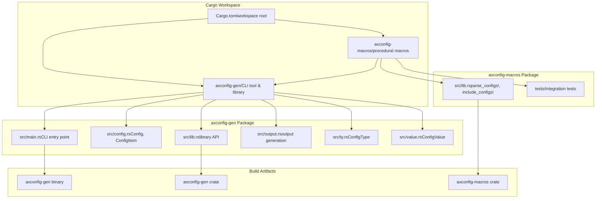
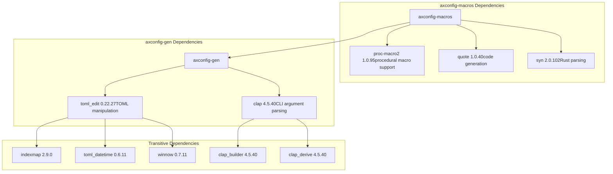
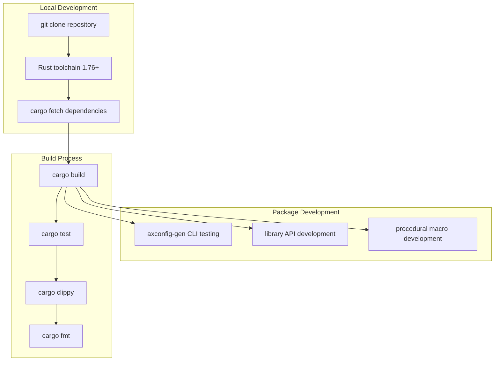

# Development Guide

> **Relevant source files**
> * [Cargo.lock](https://github.com/arceos-org/axconfig-gen/blob/99357274/Cargo.lock)
> * [Cargo.toml](https://github.com/arceos-org/axconfig-gen/blob/99357274/Cargo.toml)

This document provides essential information for developers contributing to the axconfig-gen project. It covers the build system, dependency management, testing procedures, and continuous integration processes. This guide is intended for contributors who need to understand the project structure, build the codebase locally, run tests, and submit changes.

For usage instructions of the CLI tool and library API, see [axconfig-gen Package](/arceos-org/axconfig-gen/2-axconfig-gen-package). For procedural macro usage, see [axconfig-macros Package](/arceos-org/axconfig-gen/3-axconfig-macros-package). For detailed build system information, see [Build System and Dependencies](/arceos-org/axconfig-gen/5.1-build-system-and-dependencies). For testing procedures, see [Testing](/arceos-org/axconfig-gen/5.2-testing). For CI/CD pipeline details, see [Continuous Integration](/arceos-org/axconfig-gen/5.3-continuous-integration).

## Project Structure Overview

The axconfig-gen repository is organized as a Cargo workspace containing two complementary packages that provide different interfaces to the same core configuration processing functionality.

### Workspace Architecture



**Workspace Configuration**: The project uses a Cargo workspace with `resolver = "2"` for improved dependency resolution. Both packages share common metadata including version, authors, and licensing information.

Sources: [Cargo.toml(L1 - L18)&emsp;](https://github.com/arceos-org/axconfig-gen/blob/99357274/Cargo.toml#L1-L18)

### Dependency Management



**Key Dependencies**:

* `clap`: Provides command-line argument parsing with derive macros
* `toml_edit`: Enables TOML parsing and manipulation while preserving formatting
* `proc-macro2`, `quote`, `syn`: Standard procedural macro toolkit for code generation

Sources: [Cargo.lock(L56 - L71)&emsp;](https://github.com/arceos-org/axconfig-gen/blob/99357274/Cargo.lock#L56-L71)

## Development Workflow

### Building the Project

The project can be built using standard Cargo commands from the workspace root:

```markdown
# Build both packages
cargo build

# Build with optimizations
cargo build --release

# Build specific package
cargo build -p axconfig-gen
cargo build -p axconfig-macros
```

### Development Environment Setup



**Minimum Rust Version**: The project requires Rust 1.76 or later as specified in the workspace configuration.

Sources: [Cargo.toml(L17)&emsp;](https://github.com/arceos-org/axconfig-gen/blob/99357274/Cargo.toml#L17-L17)

### Package-Specific Development

#### axconfig-gen Development

The `axconfig-gen` package contains both the CLI tool and the core library functionality. Development typically involves:

* **CLI Interface**: Modifying [axconfig-gen/src/main.rs](https://github.com/arceos-org/axconfig-gen/blob/99357274/axconfig-gen/src/main.rs) for command-line argument handling
* **Core Logic**: Working with `Config`, `ConfigItem`, and `ConfigValue` types in [axconfig-gen/src/config.rs](https://github.com/arceos-org/axconfig-gen/blob/99357274/axconfig-gen/src/config.rs) and [axconfig-gen/src/value.rs](https://github.com/arceos-org/axconfig-gen/blob/99357274/axconfig-gen/src/value.rs)
* **Type System**: Extending `ConfigType` functionality in [axconfig-gen/src/ty.rs](https://github.com/arceos-org/axconfig-gen/blob/99357274/axconfig-gen/src/ty.rs)
* **Output Generation**: Modifying TOML and Rust code generation in [axconfig-gen/src/output.rs](https://github.com/arceos-org/axconfig-gen/blob/99357274/axconfig-gen/src/output.rs)

#### axconfig-macros Development

The `axconfig-macros` package focuses on procedural macro implementation:

* **Macro Implementation**: Located in [axconfig-macros/src/lib.rs](https://github.com/arceos-org/axconfig-gen/blob/99357274/axconfig-macros/src/lib.rs)
* **Integration Testing**: Tests in [axconfig-macros/tests/](https://github.com/arceos-org/axconfig-gen/blob/99357274/axconfig-macros/tests/)
* **Cross-Package Dependencies**: Relies on `axconfig-gen` for core functionality

### Code Organization Patterns

The codebase follows several key organizational patterns:

1. **Separation of Concerns**: CLI tool, library API, and procedural macros are clearly separated
2. **Shared Core Logic**: Both packages use the same core configuration processing logic
3. **Type-Driven Design**: Strong type system with `ConfigType`, `ConfigValue`, and `Config` abstractions
4. **Dual Output Modes**: Support for both file-based generation and compile-time code generation

### Common Development Tasks

#### Adding New Configuration Types

When extending the type system, developers typically need to:

1. Extend `ConfigType` enum in [axconfig-gen/src/ty.rs](https://github.com/arceos-org/axconfig-gen/blob/99357274/axconfig-gen/src/ty.rs)
2. Update `ConfigValue` handling in [axconfig-gen/src/value.rs](https://github.com/arceos-org/axconfig-gen/blob/99357274/axconfig-gen/src/value.rs)
3. Modify output generation in [axconfig-gen/src/output.rs](https://github.com/arceos-org/axconfig-gen/blob/99357274/axconfig-gen/src/output.rs)
4. Add corresponding tests for both CLI and macro interfaces

#### Extending Output Formats

New output formats require:

1. Extending the output generation system in [axconfig-gen/src/output.rs](https://github.com/arceos-org/axconfig-gen/blob/99357274/axconfig-gen/src/output.rs)
2. Adding CLI flags in [axconfig-gen/src/main.rs](https://github.com/arceos-org/axconfig-gen/blob/99357274/axconfig-gen/src/main.rs)
3. Updating both file-based and macro-based code generation paths

#### Cross-Package Coordination

Since `axconfig-macros` depends on `axconfig-gen`, changes to the core library API require careful coordination:

1. Make API changes in `axconfig-gen` first
2. Update `axconfig-macros` to use new API
3. Ensure backward compatibility or coordinate breaking changes
4. Test both packages together to verify integration

Sources: [Cargo.lock(L56 - L71)&emsp;](https://github.com/arceos-org/axconfig-gen/blob/99357274/Cargo.lock#L56-L71) [Cargo.toml(L1 - L18)&emsp;](https://github.com/arceos-org/axconfig-gen/blob/99357274/Cargo.toml#L1-L18)