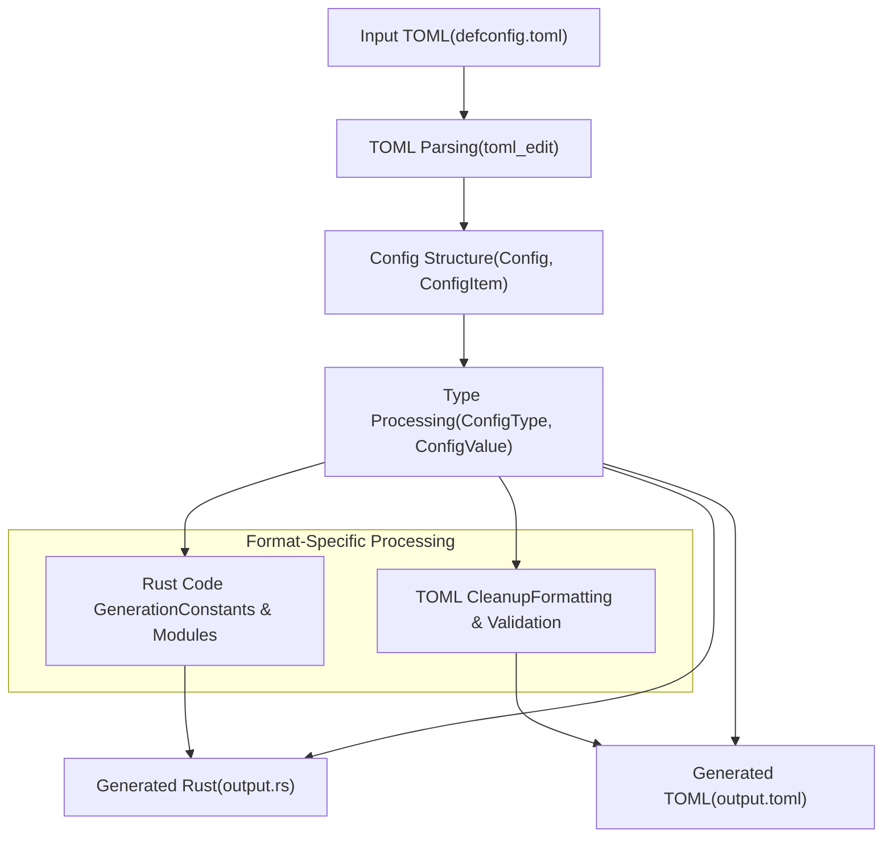
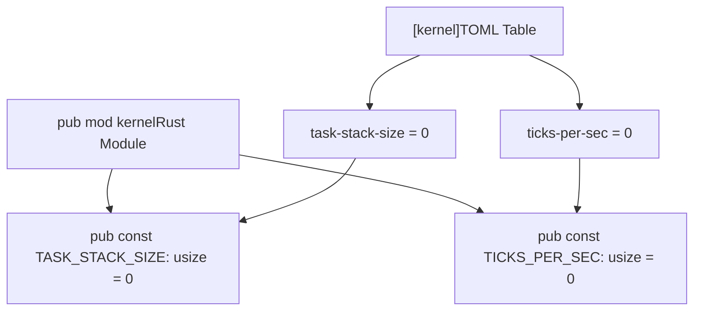
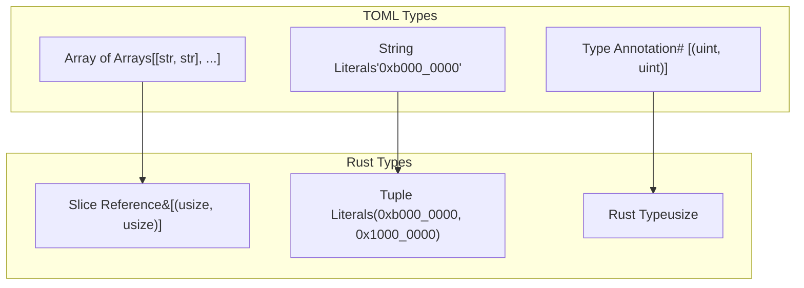
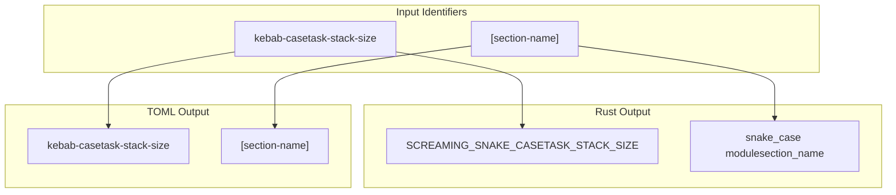

# Generated Output Examples

> **Relevant source files**
> * [example-configs/defconfig.toml](https://github.com/arceos-org/axconfig-gen/blob/99357274/example-configs/defconfig.toml)
> * [example-configs/output.rs](https://github.com/arceos-org/axconfig-gen/blob/99357274/example-configs/output.rs)
> * [example-configs/output.toml](https://github.com/arceos-org/axconfig-gen/blob/99357274/example-configs/output.toml)

This page demonstrates the output generation capabilities of axconfig-gen by showing concrete examples of how TOML input configurations are transformed into both cleaned TOML and Rust code outputs. The examples illustrate type mappings, naming conventions, structure preservation, and comment handling across different output formats.

For information about the input TOML configuration format and type annotation system, see [TOML Configuration Format](/arceos-org/axconfig-gen/4.1-toml-configuration-format). For details on the underlying output generation implementation, see [Output Generation](/arceos-org/axconfig-gen/2.2.3-output-generation).

## Transformation Process Overview

The axconfig-gen system processes input TOML configurations through a structured pipeline that preserves semantic meaning while adapting to different output format requirements.

**Transformation Pipeline**



Sources: [example-configs/defconfig.toml(L1 - L63)&emsp;](https://github.com/arceos-org/axconfig-gen/blob/99357274/example-configs/defconfig.toml#L1-L63) [example-configs/output.toml(L1 - L63)&emsp;](https://github.com/arceos-org/axconfig-gen/blob/99357274/example-configs/output.toml#L1-L63) [example-configs/output.rs(L1 - L66)&emsp;](https://github.com/arceos-org/axconfig-gen/blob/99357274/example-configs/output.rs#L1-L66)

## Global Configuration Items

Global configuration items defined at the root level of the TOML are transformed into top-level constants in Rust output while being preserved with consistent formatting in TOML output.

**Input TOML Configuration:**

```markdown
# Architecture identifier.
arch = "x86_64"             # str
# Platform identifier.
plat = "x86_64-qemu-q35"    # str
# Number of CPUs.
smp = 1                     # uint
```

**Generated TOML Output:**

```markdown
# Architecture identifier.
arch = "x86_64" # str
# Platform identifier.
plat = "x86_64-qemu-q35" # str
# Number of CPUs.
smp = 1 # uint
```

**Generated Rust Output:**

```javascript
/// Architecture identifier.
pub const ARCH: &str = "x86_64";
/// Platform identifier.
pub const PLAT: &str = "x86_64-qemu-q35";
/// Number of CPUs.
pub const SMP: usize = 1;
```

**Transformations Applied:**

|Aspect|Input|TOML Output|Rust Output|
| --- | --- | --- | --- |
|Naming|arch|arch|ARCH|
|Type|"x86_64"(str)|"x86_64" # str|&str|
|Comments|# Architecture identifier.|Preserved|/// Architecture identifier.|
|Formatting|Variable spacing|Consistent spacing|Rust doc comments|

Sources: [example-configs/defconfig.toml(L1 - L6)&emsp;](https://github.com/arceos-org/axconfig-gen/blob/99357274/example-configs/defconfig.toml#L1-L6) [example-configs/output.toml(L1 - L6)&emsp;](https://github.com/arceos-org/axconfig-gen/blob/99357274/example-configs/output.toml#L1-L6) [example-configs/output.rs(L1 - L6)&emsp;](https://github.com/arceos-org/axconfig-gen/blob/99357274/example-configs/output.rs#L1-L6)

## Sectioned Configuration

TOML table sections are transformed into Rust modules, maintaining the hierarchical organization while adapting naming conventions for each output format.

**Input TOML Configuration:**

```markdown
[kernel]
# Stack size of each task.
task-stack-size = 0     # uint
# Number of timer ticks per second (Hz).
ticks-per-sec = 0       # uint
```

**Generated TOML Output:**

```markdown
[kernel]
# Stack size of each task.
task-stack-size = 0 # uint
# Number of timer ticks per second (Hz).
ticks-per-sec = 0 # uint
```

**Generated Rust Output:**

```javascript
///
/// Kernel configs
///
pub mod kernel {
    /// Stack size of each task.
    pub const TASK_STACK_SIZE: usize = 0;
    /// Number of timer ticks per second (Hz).
    pub const TICKS_PER_SEC: usize = 0;
}
```

**Structure Mapping:**



Sources: [example-configs/defconfig.toml(L11 - L16)&emsp;](https://github.com/arceos-org/axconfig-gen/blob/99357274/example-configs/defconfig.toml#L11-L16) [example-configs/output.toml(L32 - L37)&emsp;](https://github.com/arceos-org/axconfig-gen/blob/99357274/example-configs/output.toml#L32-L37) [example-configs/output.rs(L33 - L39)&emsp;](https://github.com/arceos-org/axconfig-gen/blob/99357274/example-configs/output.rs#L33-L39)

## Complex Data Types

Array and tuple types demonstrate sophisticated type mapping between TOML array syntax and Rust slice references, including proper handling of nested structures.

**Input TOML Configuration:**

```markdown
[devices]
# MMIO regions with format (`base_paddr`, `size`).
mmio-regions = [
    ["0xb000_0000", "0x1000_0000"], # PCI config space
    ["0xfe00_0000", "0xc0_0000"],   # PCI devices
    ["0xfec0_0000", "0x1000"],      # IO APIC
]                           # [(uint, uint)]
```

**Generated TOML Output:**

```markdown
[devices]
# MMIO regions with format (`base_paddr`, `size`).
mmio-regions = [
    ["0xb000_0000", "0x1000_0000"],
    ["0xfe00_0000", "0xc0_0000"],
    ["0xfec0_0000", "0x1000"],
] # [(uint, uint)]
```

**Generated Rust Output:**

```javascript
pub mod devices {
    /// MMIO regions with format (`base_paddr`, `size`).
    pub const MMIO_REGIONS: &[(usize, usize)] = &[
        (0xb000_0000, 0x1000_0000),
        (0xfe00_0000, 0xc0_0000),
        (0xfec0_0000, 0x1000),
    ];
}
```

**Type System Mappings:**



Sources: [example-configs/defconfig.toml(L48 - L54)&emsp;](https://github.com/arceos-org/axconfig-gen/blob/99357274/example-configs/defconfig.toml#L48-L54) [example-configs/output.toml(L13 - L19)&emsp;](https://github.com/arceos-org/axconfig-gen/blob/99357274/example-configs/output.toml#L13-L19) [example-configs/output.rs(L13 - L19)&emsp;](https://github.com/arceos-org/axconfig-gen/blob/99357274/example-configs/output.rs#L13-L19)

## Type System and Naming Conventions

The transformation process applies consistent rules for type mapping and identifier naming across output formats.

**Type Mapping Rules:**

|TOML Type Annotation|TOML Value|Rust Type|Rust Value|
| --- | --- | --- | --- |
|# str|"x86_64"|&str|"x86_64"|
|# uint|1|usize|1|
|# uint|"0xffff_ff80_0000_0000"|usize|0xffff_ff80_0000_0000|
|# [(uint, uint)]|[["0x1000", "0x2000"]]|&[(usize, usize)]|&[(0x1000, 0x2000)]|

**Naming Convention Transformations:**



**Hexadecimal Value Processing:**

Large hexadecimal values in TOML strings are parsed and converted to native Rust integer literals:

* Input: `kernel-base-vaddr = "0xffff_ff80_0020_0000"`
* Output: `pub const KERNEL_BASE_VADDR: usize = 0xffff_ff80_0020_0000;`

Sources: [example-configs/defconfig.toml(L29)&emsp;](https://github.com/arceos-org/axconfig-gen/blob/99357274/example-configs/defconfig.toml#L29-L29) [example-configs/output.rs(L52)&emsp;](https://github.com/arceos-org/axconfig-gen/blob/99357274/example-configs/output.rs#L52-L52) [example-configs/defconfig.toml(L32)&emsp;](https://github.com/arceos-org/axconfig-gen/blob/99357274/example-configs/defconfig.toml#L32-L32) [example-configs/output.rs(L62)&emsp;](https://github.com/arceos-org/axconfig-gen/blob/99357274/example-configs/output.rs#L62-L62)

## Comment and Documentation Preservation

Comments from the input TOML are preserved and transformed appropriately for each output format, maintaining documentation context across transformations.

**Comment Transformation Rules:**

|Input Location|TOML Output|Rust Output|
| --- | --- | --- |
|Line comments|Preserved as-is|Converted to///doc comments|
|Section headers|Preserved with formatting|Converted to module doc comments|
|Type annotations|Preserved inline|Embedded in type signatures|

The generated outputs maintain full traceability to the original configuration intent while adapting to the idioms and conventions of their respective formats.

Sources: [example-configs/defconfig.toml(L1 - L63)&emsp;](https://github.com/arceos-org/axconfig-gen/blob/99357274/example-configs/defconfig.toml#L1-L63) [example-configs/output.toml(L1 - L63)&emsp;](https://github.com/arceos-org/axconfig-gen/blob/99357274/example-configs/output.toml#L1-L63) [example-configs/output.rs(L1 - L66)&emsp;](https://github.com/arceos-org/axconfig-gen/blob/99357274/example-configs/output.rs#L1-L66)