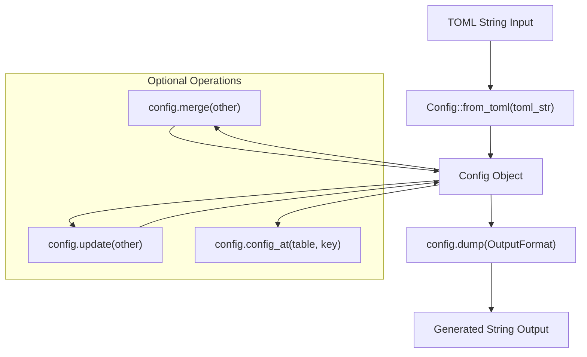

# Library API

> **Relevant source files**
> * [axconfig-gen/README.md](https://github.com/arceos-org/axconfig-gen/blob/99357274/axconfig-gen/README.md)
> * [axconfig-gen/src/config.rs](https://github.com/arceos-org/axconfig-gen/blob/99357274/axconfig-gen/src/config.rs)
> * [axconfig-gen/src/lib.rs](https://github.com/arceos-org/axconfig-gen/blob/99357274/axconfig-gen/src/lib.rs)

This document covers the programmatic interface for using axconfig-gen as a Rust library. The library API allows developers to programmatically parse TOML configurations, manipulate configuration data, and generate output in various formats within their own Rust applications. For information about using axconfig-gen as a command-line tool, see [Command Line Interface](/arceos-org/axconfig-gen/2.1-command-line-interface). For details about the internal data structures, see [Core Data Structures](/arceos-org/axconfig-gen/2.2.1-core-data-structures).

## API Overview

The axconfig-gen library provides a high-level API centered around the `Config` type, which manages configuration data parsed from TOML files. The library handles TOML parsing, type inference, validation, and output generation through a clean programmatic interface.

```

```

Sources: [axconfig-gen/src/lib.rs(L13 - L16)&emsp;](https://github.com/arceos-org/axconfig-gen/blob/99357274/axconfig-gen/src/lib.rs#L13-L16) [axconfig-gen/src/config.rs(L9 - L18)&emsp;](https://github.com/arceos-org/axconfig-gen/blob/99357274/axconfig-gen/src/config.rs#L9-L18) [axconfig-gen/src/config.rs(L95 - L100)&emsp;](https://github.com/arceos-org/axconfig-gen/blob/99357274/axconfig-gen/src/config.rs#L95-L100)

## Basic Usage Pattern

The fundamental workflow for using the library API involves parsing TOML input, optionally manipulating the configuration, and generating output in the desired format.



The library usage example from the README demonstrates this pattern:

|Operation|Method|Purpose|
| --- | --- | --- |
|Parse TOML|Config::from_toml()|Convert TOML string to Config object|
|Generate Output|config.dump()|Convert Config to TOML or Rust code|
|Access Data|config.config_at()|Retrieve specific configuration items|
|Combine Configs|config.merge()|Merge multiple configurations|
|Update Values|config.update()|Update existing configuration values|

Sources: [axconfig-gen/README.md(L36 - L62)&emsp;](https://github.com/arceos-org/axconfig-gen/blob/99357274/axconfig-gen/README.md#L36-L62) [axconfig-gen/src/config.rs(L200 - L236)&emsp;](https://github.com/arceos-org/axconfig-gen/blob/99357274/axconfig-gen/src/config.rs#L200-L236) [axconfig-gen/src/config.rs(L238 - L265)&emsp;](https://github.com/arceos-org/axconfig-gen/blob/99357274/axconfig-gen/src/config.rs#L238-L265)

## Configuration Management

The `Config` type provides methods for managing configuration data at both the table and item level. The configuration is organized into a global table and named tables, following TOML's structure.

### Table Operations

|Method|Return Type|Description|
| --- | --- | --- |
|global_table()|&BTreeMap<String, ConfigItem>|Access global configuration items|
|table_at(name)|Option<&BTreeMap<String, ConfigItem>>|Access named table by name|
|table_at_mut(name)|Option<&mut BTreeMap<String, ConfigItem>>|Mutable access to named table|
|table_comments_at(name)|Option<&str>|Get comments for a table|

### Item Access

|Method|Return Type|Description|
| --- | --- | --- |
|config_at(table, key)|Option<&ConfigItem>|Access specific configuration item|
|config_at_mut(table, key)|Option<&mut ConfigItem>|Mutable access to configuration item|
|iter()|Iterator<Item = &ConfigItem>|Iterate over all configuration items|
|table_iter()|Iterator<Item = (&str, &ConfigTable, &str)>|Iterate over all tables|

Sources: [axconfig-gen/src/config.rs(L135 - L196)&emsp;](https://github.com/arceos-org/axconfig-gen/blob/99357274/axconfig-gen/src/config.rs#L135-L196)

## Configuration Manipulation

The library provides two primary methods for combining and updating configurations: `merge()` and `update()`. These operations support different use cases for configuration management.

### Merge Operation

The `merge()` method combines two configurations, requiring that no duplicate keys exist:

```

```

### Update Operation

The `update()` method overwrites existing values and returns information about keys that were not matched:

```

```

Sources: [axconfig-gen/src/config.rs(L267 - L284)&emsp;](https://github.com/arceos-org/axconfig-gen/blob/99357274/axconfig-gen/src/config.rs#L267-L284) [axconfig-gen/src/config.rs(L286 - L322)&emsp;](https://github.com/arceos-org/axconfig-gen/blob/99357274/axconfig-gen/src/config.rs#L286-L322)

## Output Generation

The library supports generating output in multiple formats through the `OutputFormat` enum and `dump()` method family.

### Output Formats

|Format|Method|Description|
| --- | --- | --- |
|TOML|dump_toml()|Generate TOML configuration file|
|Rust|dump_rs()|Generate Rust constant definitions|
|Generic|dump(OutputFormat)|Generate output in specified format|

### Output Generation Process

```

```

The output generation process iterates through all tables and items, formatting them according to the specified output format. For TOML output, it preserves comments and structure. For Rust output, it generates `pub const` definitions with appropriate types.

Sources: [axconfig-gen/src/config.rs(L238 - L265)&emsp;](https://github.com/arceos-org/axconfig-gen/blob/99357274/axconfig-gen/src/config.rs#L238-L265) [axconfig-gen/src/lib.rs(L14)&emsp;](https://github.com/arceos-org/axconfig-gen/blob/99357274/axconfig-gen/src/lib.rs#L14-L14)

## Error Handling

The library uses a custom error type `ConfigErr` with a specialized result type `ConfigResult<T>`. All fallible operations return this result type for consistent error handling.

### Error Types

|Variant|Description|Common Causes|
| --- | --- | --- |
|Parse(TomlError)|TOML parsing failure|Invalid TOML syntax|
|InvalidValue|Invalid configuration value|Unsupported value types|
|InvalidType|Invalid type annotation|Malformed type comments|
|ValueTypeMismatch|Value doesn't match specified type|Type annotation conflicts|
|Other(String)|General errors|Duplicate keys, reserved names|

### Error Handling Pattern

```

```

The error type implements both `Display` and `Debug` traits for easy error reporting, and automatically converts from `TomlError` for seamless integration with the underlying TOML parsing library.

Sources: [axconfig-gen/src/lib.rs(L18 - L57)&emsp;](https://github.com/arceos-org/axconfig-gen/blob/99357274/axconfig-gen/src/lib.rs#L18-L57)