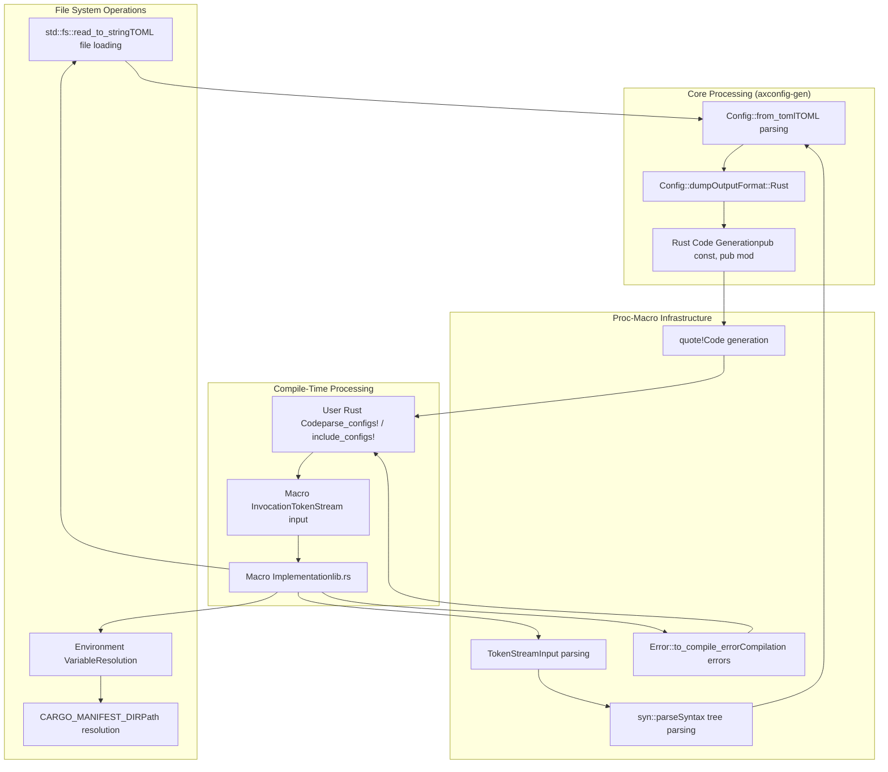
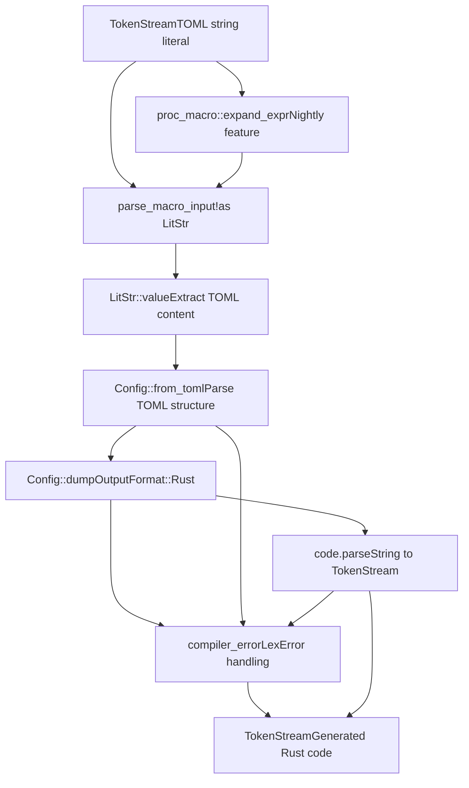
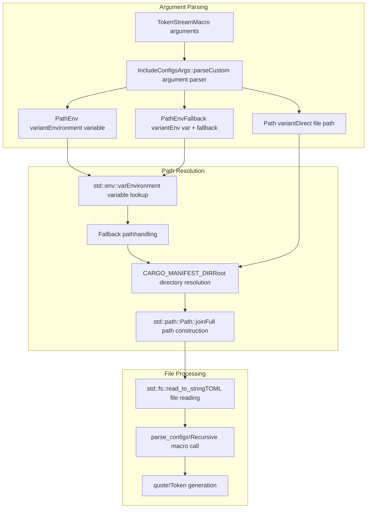
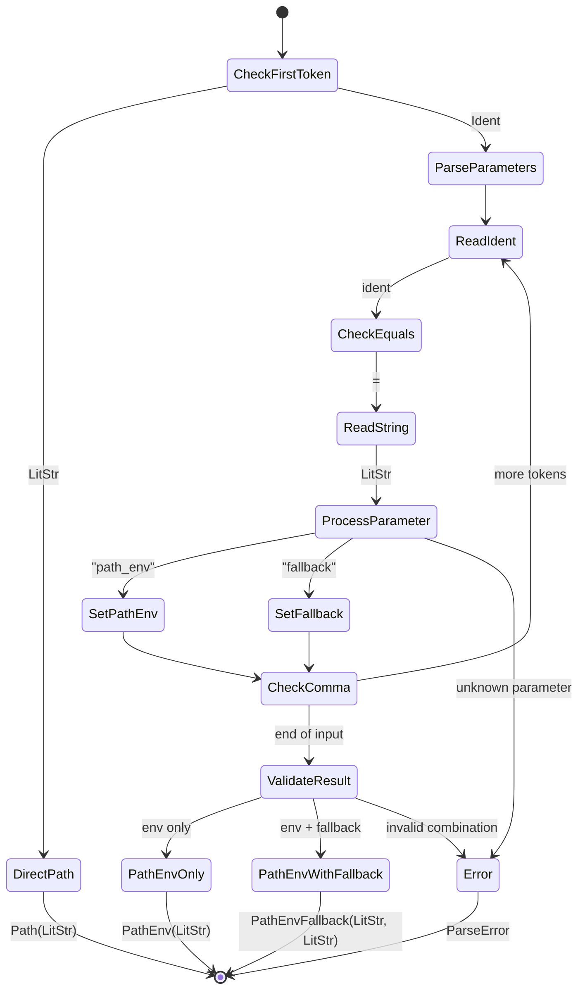
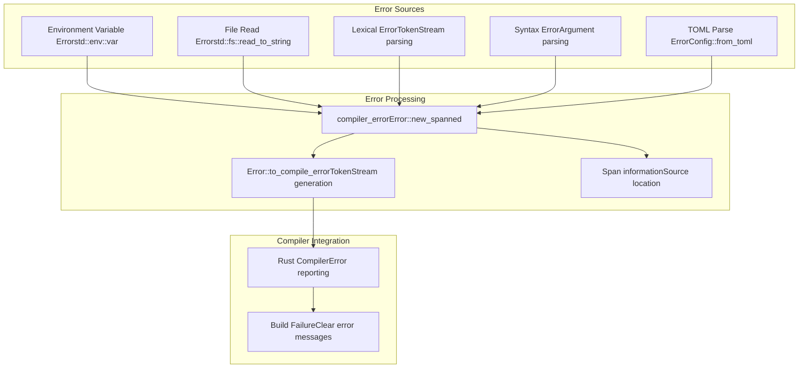
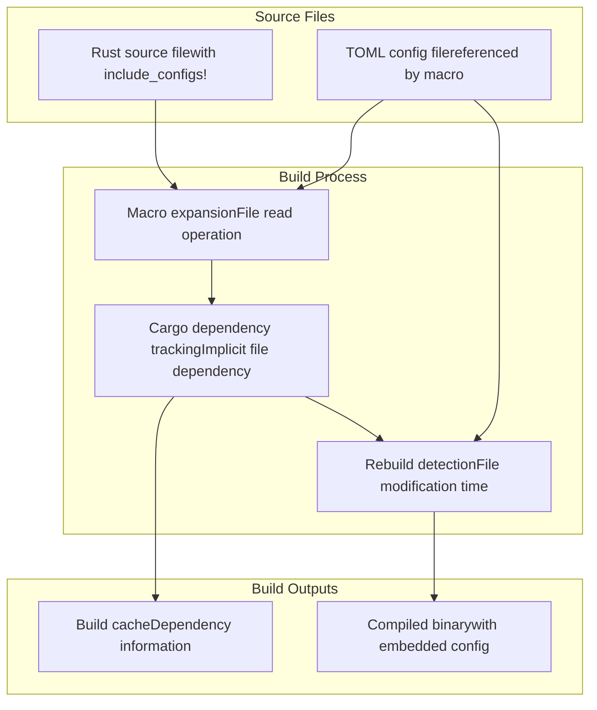
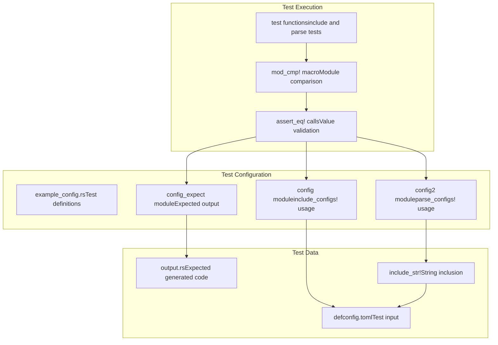

# Macro Implementation

> **Relevant source files**
> * [axconfig-macros/src/lib.rs](https://github.com/arceos-org/axconfig-gen/blob/99357274/axconfig-macros/src/lib.rs)
> * [axconfig-macros/tests/example_config.rs](https://github.com/arceos-org/axconfig-gen/blob/99357274/axconfig-macros/tests/example_config.rs)

This document covers the technical implementation details of the procedural macros in the `axconfig-macros` crate, including their integration with the core `axconfig-gen` library. It explains how the macros process TOML configurations at compile time and generate Rust code using the proc-macro infrastructure.

For information about how to use these macros in practice, see [Macro Usage Patterns](/arceos-org/axconfig-gen/3.1-macro-usage-patterns). For details about the underlying configuration processing logic, see [Library API](/arceos-org/axconfig-gen/2.2-library-api).

## Procedural Macro Architecture

The `axconfig-macros` crate implements two procedural macros that provide compile-time TOML configuration processing by leveraging the core functionality from `axconfig-gen`. The architecture separates parsing and code generation concerns from the macro expansion logic.

**Sources:** [axconfig-macros/src/lib.rs(L1 - L144)&emsp;](https://github.com/arceos-org/axconfig-gen/blob/99357274/axconfig-macros/src/lib.rs#L1-L144)

## Macro Implementation Details

### parse_configs! Macro

The `parse_configs!` macro processes inline TOML strings and expands them into Rust code at compile time. It handles both regular compilation and nightly compiler features for enhanced expression expansion.

The implementation includes conditional compilation for nightly features:

|Feature|Functionality|Implementation|
| --- | --- | --- |
|Nightly|Enhanced expression expansion|config_toml.expand_expr()|
|Stable|Standard literal parsing|parse_macro_input!(config_toml as LitStr)|
|Error Handling|Compilation error generation|compiler_error()function|

**Sources:** [axconfig-macros/src/lib.rs(L22 - L41)&emsp;](https://github.com/arceos-org/axconfig-gen/blob/99357274/axconfig-macros/src/lib.rs#L22-L41)

### include_configs! Macro

The `include_configs!` macro supports three different path specification methods and handles file system operations with comprehensive error handling.

**Sources:** [axconfig-macros/src/lib.rs(L58 - L87)&emsp;](https://github.com/arceos-org/axconfig-gen/blob/99357274/axconfig-macros/src/lib.rs#L58-L87)

## Argument Parsing Implementation

The `IncludeConfigsArgs` enum and its `Parse` implementation handle the complex argument parsing for the `include_configs!` macro with proper error reporting.

The parsing logic handles these parameter combinations:

|Syntax|Enum Variant|Behavior|
| --- | --- | --- |
|"path/to/file.toml"|Path(LitStr)|Direct file path|
|path_env = "ENV_VAR"|PathEnv(LitStr)|Environment variable only|
|path_env = "ENV_VAR", fallback = "default.toml"|PathEnvFallback(LitStr, LitStr)|Environment variable with fallback|

**Sources:** [axconfig-macros/src/lib.rs(L89 - L143)&emsp;](https://github.com/arceos-org/axconfig-gen/blob/99357274/axconfig-macros/src/lib.rs#L89-L143)

## Error Handling and Compilation

The macro implementation includes comprehensive error handling that generates meaningful compilation errors for various failure scenarios.

### Compiler Error Generation

The `compiler_error` function provides a centralized mechanism for generating compilation errors that integrate properly with the Rust compiler's diagnostic system.

**Sources:** [axconfig-macros/src/lib.rs(L12 - L14)&emsp;](https://github.com/arceos-org/axconfig-gen/blob/99357274/axconfig-macros/src/lib.rs#L12-L14) [axconfig-macros/src/lib.rs(L36 - L40)&emsp;](https://github.com/arceos-org/axconfig-gen/blob/99357274/axconfig-macros/src/lib.rs#L36-L40) [axconfig-macros/src/lib.rs(L63 - L67)&emsp;](https://github.com/arceos-org/axconfig-gen/blob/99357274/axconfig-macros/src/lib.rs#L63-L67) [axconfig-macros/src/lib.rs(L79 - L81)&emsp;](https://github.com/arceos-org/axconfig-gen/blob/99357274/axconfig-macros/src/lib.rs#L79-L81)

## Integration with Build System

The macros integrate with Cargo's build system through environment variable resolution and dependency tracking that ensures proper rebuilds when configuration files change.

### Build-Time Path Resolution

The implementation uses `CARGO_MANIFEST_DIR` to resolve relative paths consistently across different build environments:

|Environment Variable|Purpose|Usage|
| --- | --- | --- |
|CARGO_MANIFEST_DIR|Project root directory|Path resolution base|
|User-defined env vars|Config file paths|Dynamic path specification|

### Dependency Tracking

The file-based operations in `include_configs!` automatically create implicit dependencies that Cargo uses for rebuild detection:

**Sources:** [axconfig-macros/src/lib.rs(L76 - L77)&emsp;](https://github.com/arceos-org/axconfig-gen/blob/99357274/axconfig-macros/src/lib.rs#L76-L77) [axconfig-macros/tests/example_config.rs(L4 - L5)&emsp;](https://github.com/arceos-org/axconfig-gen/blob/99357274/axconfig-macros/tests/example_config.rs#L4-L5)

## Testing Integration

The macro implementation includes comprehensive testing that validates both the generated code and the macro expansion process itself.

The test structure demonstrates proper integration between the macros and expected outputs:

**Sources:** [axconfig-macros/tests/example_config.rs(L1 - L87)&emsp;](https://github.com/arceos-org/axconfig-gen/blob/99357274/axconfig-macros/tests/example_config.rs#L1-L87)