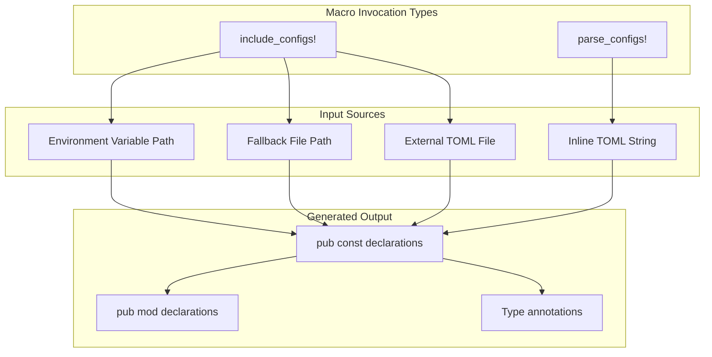
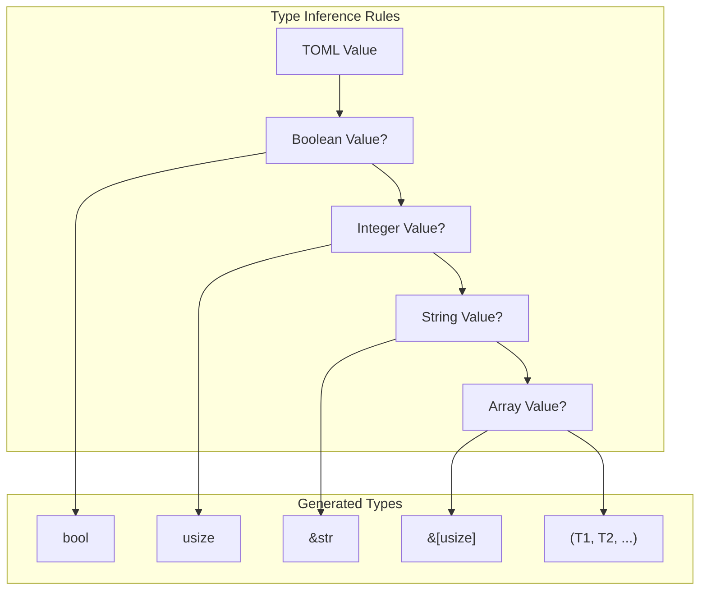
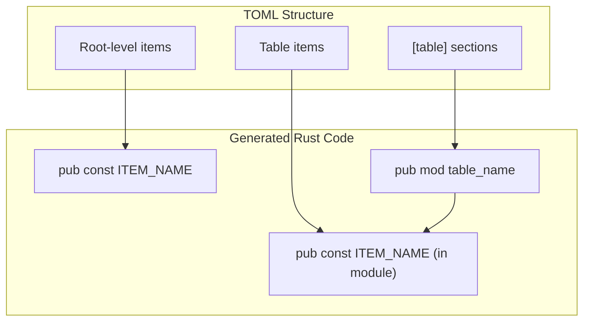

# Macro Usage Patterns

> **Relevant source files**
> * [axconfig-macros/README.md](https://github.com/arceos-org/axconfig-gen/blob/99357274/axconfig-macros/README.md)
> * [axconfig-macros/tests/example_config.rs](https://github.com/arceos-org/axconfig-gen/blob/99357274/axconfig-macros/tests/example_config.rs)

This document provides practical guidance for using the procedural macros provided by the `axconfig-macros` crate. It covers the two primary macros (`parse_configs!` and `include_configs!`), their various invocation patterns, and best practices for integrating TOML configuration processing into Rust code at compile time.

For implementation details of how these macros work internally, see [Macro Implementation](/arceos-org/axconfig-gen/3.2-macro-implementation). For TOML format specifications and examples, see [TOML Configuration Format](/arceos-org/axconfig-gen/4.1-toml-configuration-format).

## Basic Macro Invocation Patterns

The `axconfig-macros` crate provides two fundamental macros for compile-time TOML processing: `parse_configs!` for inline TOML content and `include_configs!` for external file processing.



**Macro Processing Flow**

### Inline TOML Processing

The `parse_configs!` macro processes TOML content directly embedded in Rust source code. This pattern is useful for small, static configurations that don't require external file management.

Basic usage pattern as shown in [axconfig-macros/README.md(L8 - L16)&emsp;](https://github.com/arceos-org/axconfig-gen/blob/99357274/axconfig-macros/README.md#L8-L16):

```yaml
axconfig_macros::parse_configs!(r#"
are-you-ok = true
one-two-three = 123

[hello]
"one-two-three" = "456"     # int
array = [1, 2, 3]           # [uint]
tuple = [1, "abc", 3]
"#);
```

This generates compile-time constants that can be accessed immediately after the macro invocation, as demonstrated in [axconfig-macros/README.md(L18 - L22)&emsp;](https://github.com/arceos-org/axconfig-gen/blob/99357274/axconfig-macros/README.md#L18-L22)

Sources: axconfig-macros/README.md:8-22

### External File Processing

The `include_configs!` macro reads TOML configuration from external files at compile time. This pattern is preferred for larger configurations or when configuration files are shared across multiple projects.

```

```

**File Path Resolution Strategies**

Sources: axconfig-macros/README.md:40-48

## File Inclusion Patterns

### Direct File Path

The simplest file inclusion pattern specifies a direct path relative to `CARGO_MANIFEST_DIR`:

```yaml
axconfig_macros::include_configs!("path/to/config.toml");
```

This pattern is demonstrated in [axconfig-macros/tests/example_config.rs(L5)&emsp;](https://github.com/arceos-org/axconfig-gen/blob/99357274/axconfig-macros/tests/example_config.rs#L5-L5) where the test loads configuration from a relative path.

### Environment Variable Path Resolution

For flexible deployment scenarios, the macro can resolve file paths from environment variables:

```yaml
axconfig_macros::include_configs!(path_env = "AX_CONFIG_PATH");
```

This pattern allows the configuration file location to be determined at build time through environment variables, enabling different configurations for different build environments.

### Environment Variable with Fallback

The most robust pattern combines environment variable resolution with a fallback path:

```yaml
axconfig_macros::include_configs!(
    path_env = "AX_CONFIG_PATH", 
    fallback = "path/to/defconfig.toml"
);
```

This ensures the build succeeds even when the environment variable is not set, defaulting to a known configuration file.

Sources: axconfig-macros/README.md:42-47, axconfig-macros/tests/example_config.rs:5

## Type Annotation Patterns

### Explicit Type Specification

Type annotations are specified using TOML comments following configuration values. The type system supports several categories:

|Type Category|Syntax|Example|
| --- | --- | --- |
|Boolean|# bool|enabled = true # bool|
|Signed Integer|# int|offset = -10 # int|
|Unsigned Integer|# uint|size = 1024 # uint|
|String|# str|name = "test" # str|
|Array|# [type]|values = [1, 2, 3] # [uint]|
|Tuple|# (type1, type2, ...)|pair = [1, "abc"] # (uint, str)|

As shown in [axconfig-macros/README.md(L13 - L15)&emsp;](https://github.com/arceos-org/axconfig-gen/blob/99357274/axconfig-macros/README.md#L13-L15) type annotations directly influence the generated Rust code types.

### Type Inference

When no explicit type annotation is provided, the macro attempts to infer types from TOML values:



**Type Inference Decision Tree**

Sources: axconfig-macros/README.md:25

## Generated Code Structure

### Constant Generation

The macros generate `pub const` declarations for top-level configuration items and `pub mod` declarations for TOML tables, as shown in [axconfig-macros/README.md(L29 - L38)&emsp;](https://github.com/arceos-org/axconfig-gen/blob/99357274/axconfig-macros/README.md#L29-L38):



**TOML to Rust Code Mapping**

### Identifier Transformation

TOML keys are transformed to valid Rust identifiers following these rules:

* Hyphens are converted to underscores
* Snake_case is preserved
* Quoted keys are handled appropriately
* Case conversion follows Rust naming conventions

As demonstrated in [axconfig-macros/README.md(L18 - L20)&emsp;](https://github.com/arceos-org/axconfig-gen/blob/99357274/axconfig-macros/README.md#L18-L20) the key `"one-two-three"` becomes the identifier `ONE_TWO_THREE`.

Sources: axconfig-macros/README.md:29-38, axconfig-macros/README.md:18-20

## Integration Patterns

### Module-scoped Configuration

A common pattern is to define configuration within a dedicated module to avoid namespace pollution:

```
mod config {
    include_configs!("../example-configs/defconfig.toml");
}
```

This pattern is used in [axconfig-macros/tests/example_config.rs(L4 - L6)&emsp;](https://github.com/arceos-org/axconfig-gen/blob/99357274/axconfig-macros/tests/example_config.rs#L4-L6) and allows accessing configuration through qualified paths like `config::ARCH`.

### Conditional Compilation

The macros can be used with conditional compilation for different build configurations:

```
#[cfg(feature = "nightly")]
mod config2 {
    parse_configs!(include_str!("../../example-configs/defconfig.toml"));
}
```

This pattern, shown in [axconfig-macros/tests/example_config.rs(L8 - L11)&emsp;](https://github.com/arceos-org/axconfig-gen/blob/99357274/axconfig-macros/tests/example_config.rs#L8-L11) demonstrates combining `parse_configs!` with `include_str!` for feature-gated builds.

### Testing Integration

Configuration modules can be compared for testing purposes, as demonstrated in the comprehensive comparison macro in [axconfig-macros/tests/example_config.rs(L17 - L75)&emsp;](https://github.com/arceos-org/axconfig-gen/blob/99357274/axconfig-macros/tests/example_config.rs#L17-L75) which validates that different macro invocation methods produce identical results.

Sources: axconfig-macros/tests/example_config.rs:4-11, axconfig-macros/tests/example_config.rs:17-75