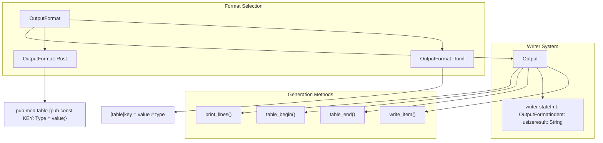
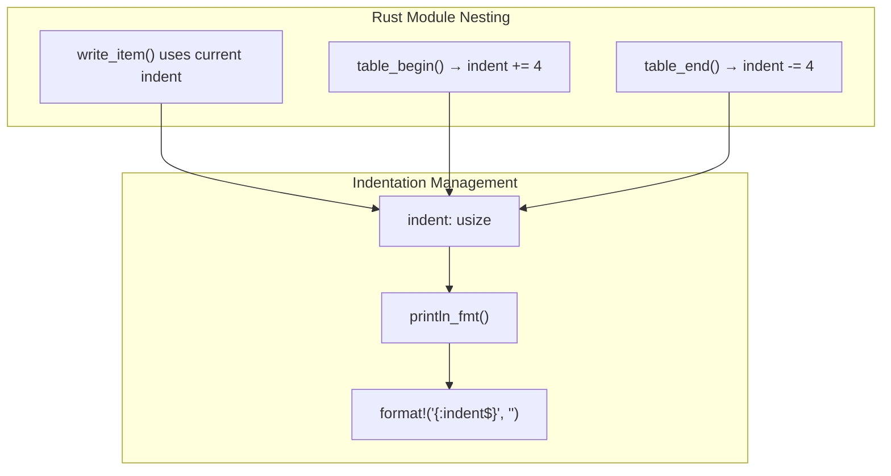
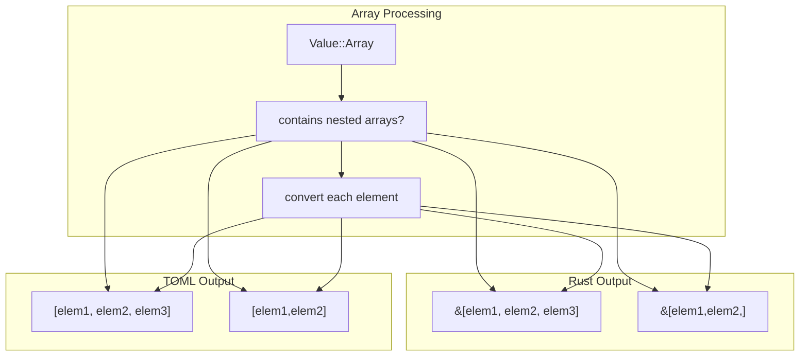
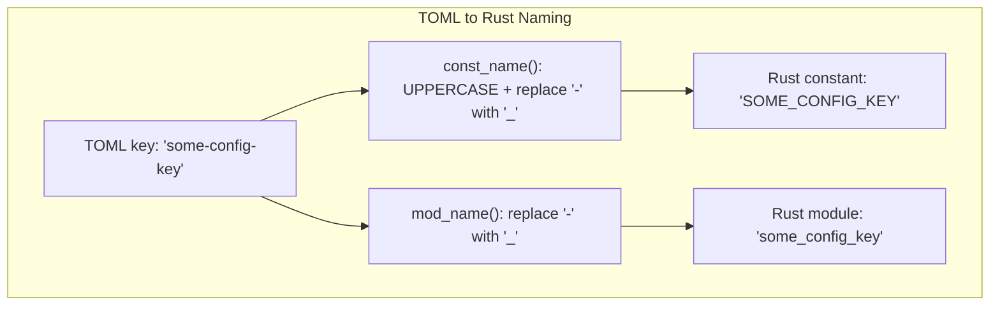

# Output Generation

> **Relevant source files**
> * [axconfig-gen/src/output.rs](https://github.com/arceos-org/axconfig-gen/blob/99357274/axconfig-gen/src/output.rs)
> * [axconfig-gen/src/tests.rs](https://github.com/arceos-org/axconfig-gen/blob/99357274/axconfig-gen/src/tests.rs)
> * [axconfig-gen/src/value.rs](https://github.com/arceos-org/axconfig-gen/blob/99357274/axconfig-gen/src/value.rs)

This section covers the output generation system in axconfig-gen, which converts parsed configuration structures into formatted output strings. The system supports generating both TOML files and Rust source code from configuration data, handling proper formatting, type annotations, and structural organization.

For information about the core data structures being formatted, see [Core Data Structures](/arceos-org/axconfig-gen/2.2.1-core-data-structures). For details about the type system that drives code generation, see [Type System](/arceos-org/axconfig-gen/2.2.2-type-system).

## Purpose and Scope

The output generation system serves as the final stage of the configuration processing pipeline, transforming internal `Config`, `ConfigItem`, and `ConfigValue` structures into human-readable and machine-consumable formats. It handles:

* **Format Selection**: Supporting TOML and Rust code output formats
* **Structural Organization**: Managing tables, modules, and hierarchical output
* **Type-Aware Generation**: Converting values according to their configured types
* **Formatting and Indentation**: Ensuring readable, properly formatted output
* **Comment Preservation**: Maintaining documentation and type annotations

## Output Format Architecture

The system centers around the `OutputFormat` enum and `Output` writer, which coordinate the transformation process.

**Output Format Selection**



Sources: [axconfig-gen/src/output.rs(L3 - L32)&emsp;](https://github.com/arceos-org/axconfig-gen/blob/99357274/axconfig-gen/src/output.rs#L3-L32) [axconfig-gen/src/output.rs(L34 - L48)&emsp;](https://github.com/arceos-org/axconfig-gen/blob/99357274/axconfig-gen/src/output.rs#L34-L48)

## Value Conversion Pipeline

The conversion from internal values to output strings follows a type-aware transformation process.

**Value to Output Conversion Flow**

```

```

Sources: [axconfig-gen/src/value.rs(L92 - L102)&emsp;](https://github.com/arceos-org/axconfig-gen/blob/99357274/axconfig-gen/src/value.rs#L92-L102) [axconfig-gen/src/value.rs(L226 - L241)&emsp;](https://github.com/arceos-org/axconfig-gen/blob/99357274/axconfig-gen/src/value.rs#L226-L241) [axconfig-gen/src/value.rs(L243 - L288)&emsp;](https://github.com/arceos-org/axconfig-gen/blob/99357274/axconfig-gen/src/value.rs#L243-L288)

## Output Writer Implementation

The `Output` struct manages the formatting state and provides methods for building structured output.

### Core Writer Methods

|Method|Purpose|TOML Behavior|Rust Behavior|
| --- | --- | --- | --- |
|table_begin()|Start a configuration section|Writes[table-name]header|Createspub mod table_name {|
|table_end()|End a configuration section|No action needed|Writes closing}|
|write_item()|Output a key-value pair|key = value # type|pub const KEY: Type = value;|
|print_lines()|Handle multi-line comments|Preserves#comments|Converts to///doc comments|

Sources: [axconfig-gen/src/output.rs(L71 - L93)&emsp;](https://github.com/arceos-org/axconfig-gen/blob/99357274/axconfig-gen/src/output.rs#L71-L93) [axconfig-gen/src/output.rs(L95 - L136)&emsp;](https://github.com/arceos-org/axconfig-gen/blob/99357274/axconfig-gen/src/output.rs#L95-L136)

### Formatting and Indentation

The system maintains proper indentation for nested structures:



Sources: [axconfig-gen/src/output.rs(L54 - L60)&emsp;](https://github.com/arceos-org/axconfig-gen/blob/99357274/axconfig-gen/src/output.rs#L54-L60) [axconfig-gen/src/output.rs(L82 - L84)&emsp;](https://github.com/arceos-org/axconfig-gen/blob/99357274/axconfig-gen/src/output.rs#L82-L84) [axconfig-gen/src/output.rs(L89 - L92)&emsp;](https://github.com/arceos-org/axconfig-gen/blob/99357274/axconfig-gen/src/output.rs#L89-L92)

## Type-Specific Value Generation

Different value types require specialized conversion logic for both TOML and Rust output formats.

### Primitive Types

|Value Type|TOML Output|Rust Output|
| --- | --- | --- |
|Boolean|true,false|true,false|
|Integer|42,0xdead_beef|42,0xdead_beef|
|String|"hello"|"hello"|
|Numeric String|"0xff"|0xff(converted to number)|

Sources: [axconfig-gen/src/value.rs(L228 - L230)&emsp;](https://github.com/arceos-org/axconfig-gen/blob/99357274/axconfig-gen/src/value.rs#L228-L230) [axconfig-gen/src/value.rs(L245 - L255)&emsp;](https://github.com/arceos-org/axconfig-gen/blob/99357274/axconfig-gen/src/value.rs#L245-L255)

### Collection Types

**Array Conversion Logic**



Sources: [axconfig-gen/src/value.rs(L231 - L240)&emsp;](https://github.com/arceos-org/axconfig-gen/blob/99357274/axconfig-gen/src/value.rs#L231-L240) [axconfig-gen/src/value.rs(L267 - L285)&emsp;](https://github.com/arceos-org/axconfig-gen/blob/99357274/axconfig-gen/src/value.rs#L267-L285)

### Tuple vs Array Distinction

The system distinguishes between homogeneous arrays and heterogeneous tuples:

|Configuration|Type|TOML Output|Rust Output|
| --- | --- | --- | --- |
|[1, 2, 3]|[uint]|[1, 2, 3]|&[1, 2, 3]|
|[1, "a", true]|(uint, str, bool)|[1, "a", true]|(1, "a", true)|

Sources: [axconfig-gen/src/value.rs(L256 - L265)&emsp;](https://github.com/arceos-org/axconfig-gen/blob/99357274/axconfig-gen/src/value.rs#L256-L265) [axconfig-gen/src/value.rs(L267 - L285)&emsp;](https://github.com/arceos-org/axconfig-gen/blob/99357274/axconfig-gen/src/value.rs#L267-L285)

## Name Transformation

The system applies consistent naming conventions when converting between formats:

**Identifier Transformation Rules**



Sources: [axconfig-gen/src/output.rs(L138 - L144)&emsp;](https://github.com/arceos-org/axconfig-gen/blob/99357274/axconfig-gen/src/output.rs#L138-L144)

## Error Handling in Output Generation

The system provides comprehensive error handling for output generation scenarios:

|Error Condition|When It Occurs|Error Type|
| --- | --- | --- |
|Unknown type for key|Type inference fails and no explicit type|ConfigErr::Other|
|Value type mismatch|Value doesn't match expected type|ConfigErr::ValueTypeMismatch|
|Array length mismatch|Tuple and array length differ|ConfigErr::ValueTypeMismatch|

Sources: [axconfig-gen/src/output.rs(L120 - L125)&emsp;](https://github.com/arceos-org/axconfig-gen/blob/99357274/axconfig-gen/src/output.rs#L120-L125) [axconfig-gen/src/value.rs(L257 - L259)&emsp;](https://github.com/arceos-org/axconfig-gen/blob/99357274/axconfig-gen/src/value.rs#L257-L259)

The output generation system provides a robust foundation for transforming configuration data into multiple target formats while preserving type information and maintaining readable formatting conventions.