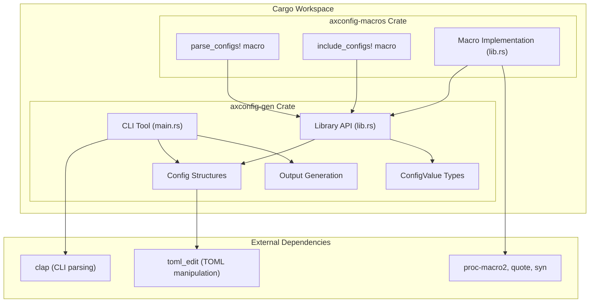
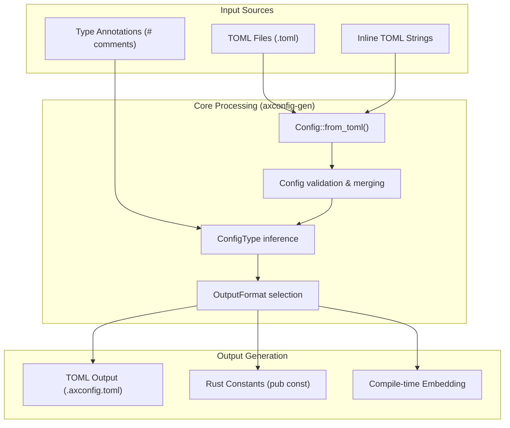
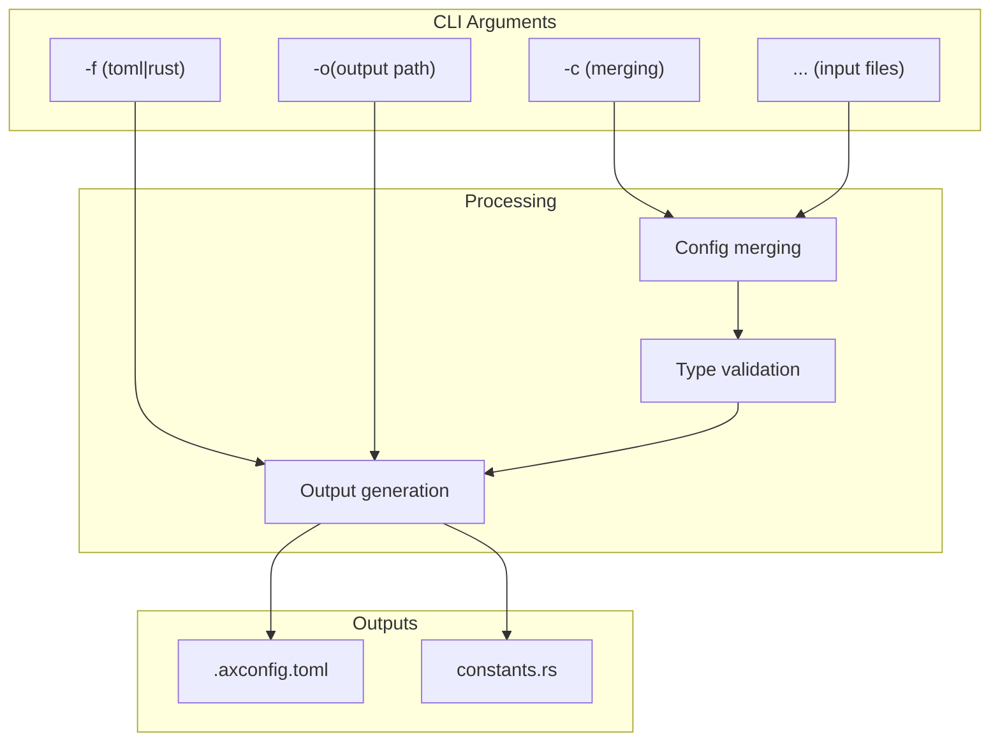
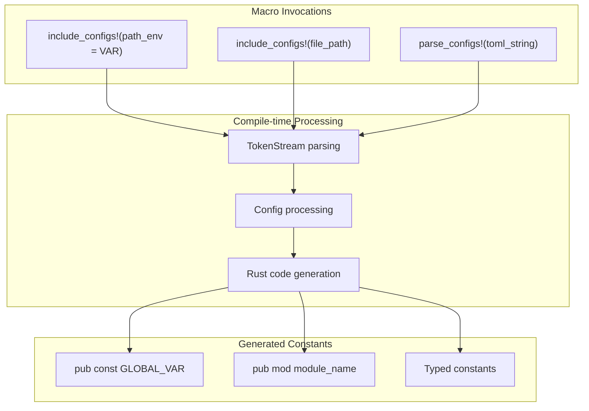
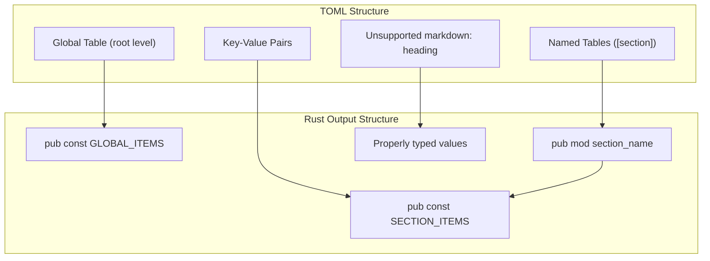
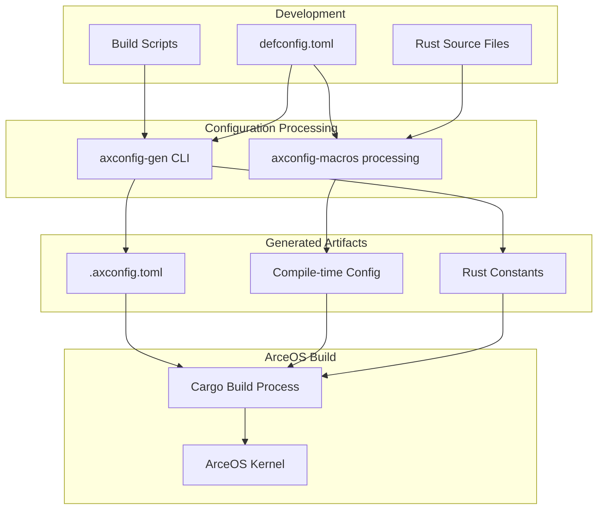

# Overview

> **Relevant source files**
> * [README.md](https://github.com/arceos-org/axconfig-gen/blob/99357274/README.md)

## Purpose and Scope

This document provides an overview of the `axconfig-gen` repository, a TOML-based configuration generation system designed for ArceOS. The system provides two primary interfaces: a command-line tool (`axconfig-gen`) for build-time configuration generation and procedural macros (`axconfig-macros`) for compile-time configuration embedding. The system transforms TOML configuration specifications into either TOML output files or Rust constant definitions with proper type annotations.

For detailed CLI usage patterns, see [Command Line Interface](/arceos-org/axconfig-gen/2.1-command-line-interface). For comprehensive macro usage, see [Macro Usage Patterns](/arceos-org/axconfig-gen/3.1-macro-usage-patterns). For configuration format specifications, see [TOML Configuration Format](/arceos-org/axconfig-gen/4.1-toml-configuration-format).

## System Architecture

The repository implements a dual-interface configuration system organized as a Cargo workspace with two main crates that share core processing logic.

### Component Architecture

**Sources:** [README.md(L1 - L109)&emsp;](https://github.com/arceos-org/axconfig-gen/blob/99357274/README.md#L1-L109) [Cargo.toml workspace structure implied]

### Core Processing Pipeline

**Sources:** [README.md(L39 - L65)&emsp;](https://github.com/arceos-org/axconfig-gen/blob/99357274/README.md#L39-L65) [README.md(L69 - L98)&emsp;](https://github.com/arceos-org/axconfig-gen/blob/99357274/README.md#L69-L98)

## Usage Modes

The system operates in two distinct modes, each targeting different use cases in the ArceOS build pipeline.

|Mode|Interface|Input Source|Output Target|Use Case|
| --- | --- | --- | --- | --- |
|CLI Mode|axconfig-gencommand|File paths (<SPEC>...)|File output (-o,-f)|Build-time generation|
|Macro Mode|parse_configs!,include_configs!|Inline strings or file paths|Token stream|Compile-time embedding|

### CLI Mode Operation

The CLI tool processes multiple TOML specification files and generates output files in either TOML or Rust format.

**Sources:** [README.md(L8 - L31)&emsp;](https://github.com/arceos-org/axconfig-gen/blob/99357274/README.md#L8-L31)

### Macro Mode Operation

Procedural macros embed configuration processing directly into the compilation process, generating constants at compile time.

**Sources:** [README.md(L67 - L108)&emsp;](https://github.com/arceos-org/axconfig-gen/blob/99357274/README.md#L67-L108)

## Type System and Output Generation

The system implements a sophisticated type inference and annotation system that enables generation of properly typed Rust constants.

### Type Annotation System

Configuration values support type annotations through TOML comments, enabling precise Rust type generation:

* `bool` - Boolean values
* `int` - Signed integers (`isize`)
* `uint` - Unsigned integers (`usize`)
* `str` - String literals (`&str`)
* `[type]` - Arrays of specified type
* `(type1, type2, ...)` - Tuples with mixed types

### Configuration Structure Mapping

**Sources:** [README.md(L35 - L36)&emsp;](https://github.com/arceos-org/axconfig-gen/blob/99357274/README.md#L35-L36) [README.md(L42 - L64)&emsp;](https://github.com/arceos-org/axconfig-gen/blob/99357274/README.md#L42-L64) [README.md(L89 - L97)&emsp;](https://github.com/arceos-org/axconfig-gen/blob/99357274/README.md#L89-L97)

## Integration with ArceOS

The configuration system integrates into the ArceOS build process through multiple pathways, providing flexible configuration management for the operating system's components.

**Sources:** [README.md(L27 - L33)&emsp;](https://github.com/arceos-org/axconfig-gen/blob/99357274/README.md#L27-L33) [README.md(L102 - L108)&emsp;](https://github.com/arceos-org/axconfig-gen/blob/99357274/README.md#L102-L108)

This architecture enables ArceOS to maintain consistent configuration across build-time generation and compile-time embedding, supporting both static configuration files and dynamic configuration processing during compilation.