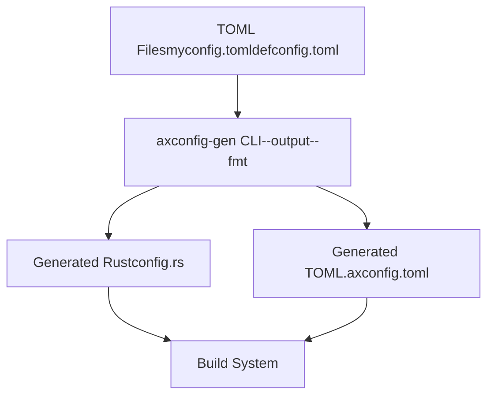
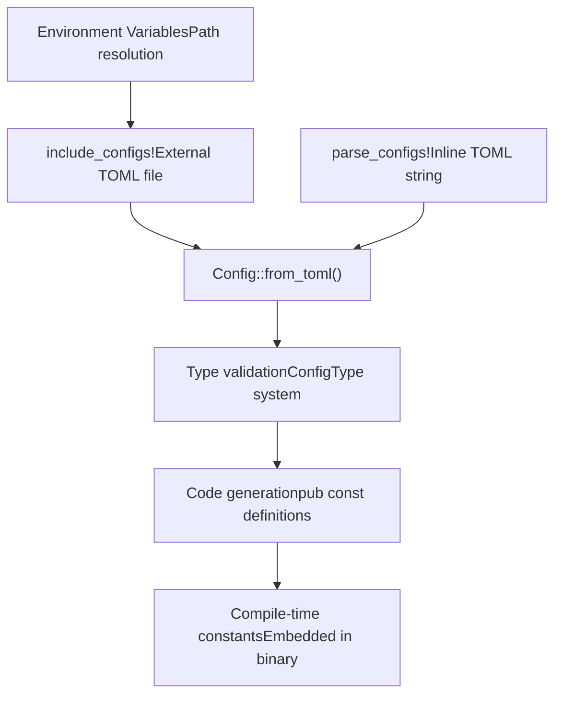
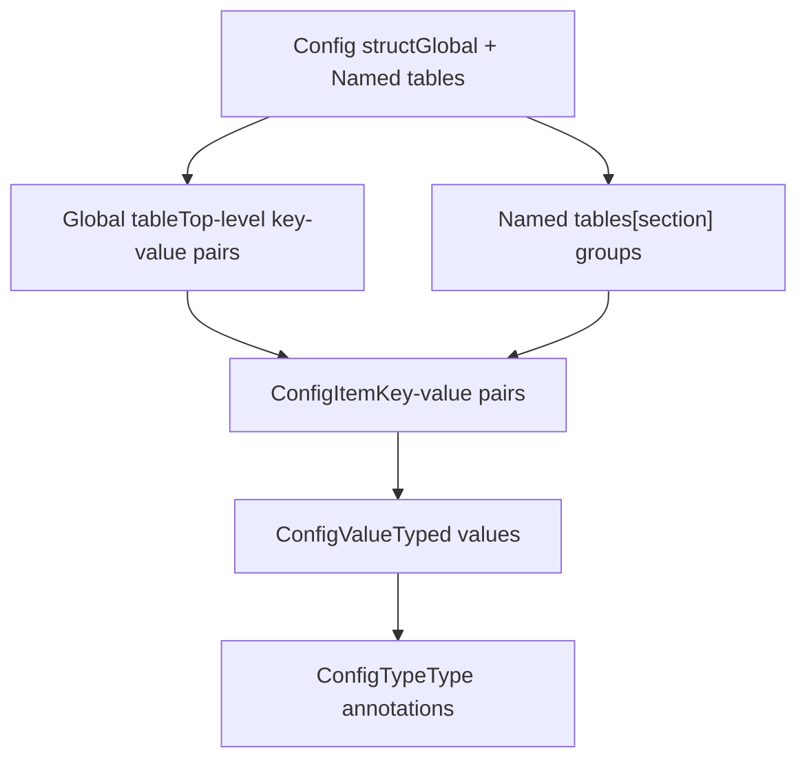

# Quick Start Guide

> **Relevant source files**
> * [README.md](https://github.com/arceos-org/axconfig-gen/blob/99357274/README.md)
> * [example-configs/defconfig.toml](https://github.com/arceos-org/axconfig-gen/blob/99357274/example-configs/defconfig.toml)

This guide provides step-by-step instructions for immediately getting started with axconfig-gen. It covers the three primary usage patterns: CLI tool for file generation, library API for programmatic use, and procedural macros for compile-time configuration embedding.

For detailed CLI documentation, see [Command Line Interface](/arceos-org/axconfig-gen/2.1-command-line-interface). For comprehensive macro usage patterns, see [Macro Usage Patterns](/arceos-org/axconfig-gen/3.1-macro-usage-patterns). For complete configuration format specification, see [TOML Configuration Format](/arceos-org/axconfig-gen/4.1-toml-configuration-format).

## Installation

Install axconfig-gen using Cargo:

```
cargo install axconfig-gen
```

For procedural macro support, add these dependencies to your `Cargo.toml`:

```
[dependencies]
axconfig-gen = "0.1"
axconfig-macros = "0.1"
```

## CLI Quick Start

### Basic File Generation

Create a configuration specification file `myconfig.toml`:

```markdown
# Global configurations
arch = "x86_64"        # str
debug = true           # bool
version = 123          # uint

[kernel]
stack-size = 0x8000    # uint
task-limit = 64        # uint
```

Generate a processed configuration file:

```
axconfig-gen myconfig.toml -o .axconfig.toml -f toml
```

Generate Rust constants:

```
axconfig-gen myconfig.toml -o config.rs -f rust
```

### CLI Workflow Diagram



**Sources:** [README.md(L8 - L34)&emsp;](https://github.com/arceos-org/axconfig-gen/blob/99357274/README.md#L8-L34) [README.md(L55 - L65)&emsp;](https://github.com/arceos-org/axconfig-gen/blob/99357274/README.md#L55-L65)

## Macro Quick Start

### Inline Configuration Processing

Use `parse_configs!` for inline TOML processing:

```css
use axconfig_macros::parse_configs;

parse_configs!(r#"
debug = true           # bool
port = 8080           # uint
name = "my-app"       # str

[database]
url = "localhost"     # str
pool-size = 10        # uint
"#);

// Generated constants are now available
println!("Debug mode: {}", DEBUG);
println!("Port: {}", PORT);
println!("DB URL: {}", database::URL);
```

### File-Based Configuration Processing

Use `include_configs!` for external TOML files:

```python
use axconfig_macros::include_configs;

// Include from file path
include_configs!("config/app.toml");

// Include using environment variable
include_configs!(path_env = "APP_CONFIG_PATH");

// Include with fallback
include_configs!(
    path_env = "APP_CONFIG_PATH", 
    fallback = "config/default.toml"
);
```

### Macro Processing Flow



**Sources:** [README.md(L67 - L108)&emsp;](https://github.com/arceos-org/axconfig-gen/blob/99357274/README.md#L67-L108) [README.md(L39 - L65)&emsp;](https://github.com/arceos-org/axconfig-gen/blob/99357274/README.md#L39-L65)

## Understanding Configuration Types

### Type Annotation System

Configuration values require type annotations in comments for Rust code generation:

|Type Annotation|Rust Type|Example|
| --- | --- | --- |
|# bool|bool|debug = true # bool|
|# int|isize|offset = -10 # int|
|# uint|usize|size = 1024 # uint|
|# str|&str|name = "test" # str|
|# [uint]|&[usize]|ports = [80, 443] # [uint]|
|# (uint, str)|(usize, &str)|pair = [8080, "http"] # (uint, str)|

### Configuration Structure



**Sources:** [README.md(L35 - L36)&emsp;](https://github.com/arceos-org/axconfig-gen/blob/99357274/README.md#L35-L36) [example-configs/defconfig.toml(L1 - L63)&emsp;](https://github.com/arceos-org/axconfig-gen/blob/99357274/example-configs/defconfig.toml#L1-L63)

## Common Usage Patterns

### Development Workflow

1. **Create configuration specification** with type annotations
2. **Test with CLI tool** to verify output format
3. **Integrate with build system** using CLI or macros
4. **Access constants** in your Rust code

### CLI Integration Example

```markdown
# Generate configuration for build
axconfig-gen platform/x86_64.toml kernel/debug.toml -o .axconfig.toml

# Generate Rust constants
axconfig-gen .axconfig.toml -o src/config.rs -f rust
```

### Macro Integration Example

```rust
// In your Rust project
axconfig_macros::include_configs!(
    path_env = "AXCONFIG_PATH",
    fallback = "configs/defconfig.toml"
);

// Use generated constants
fn main() {
    println!("Architecture: {}", ARCH);
    println!("SMP cores: {}", SMP);
    println!("Kernel stack size: {}", kernel::TASK_STACK_SIZE);
}
```

## Output Format Comparison

|Input TOML|Generated TOML|Generated Rust|
| --- | --- | --- |
|debug = true # bool|debug = true|pub const DEBUG: bool = true;|
|[kernel]size = 64 # uint|[kernel]size = 64|pub mod kernel {pub const SIZE: usize = 64;}|

**Sources:** [README.md(L55 - L65)&emsp;](https://github.com/arceos-org/axconfig-gen/blob/99357274/README.md#L55-L65) [README.md(L89 - L98)&emsp;](https://github.com/arceos-org/axconfig-gen/blob/99357274/README.md#L89-L98)

## Next Steps

* **For CLI usage:** See [Command Line Interface](/arceos-org/axconfig-gen/2.1-command-line-interface) for complete CLI documentation
* **For library integration:** See [Library API](/arceos-org/axconfig-gen/2.2-library-api) for programmatic usage
* **For macro details:** See [Macro Usage Patterns](/arceos-org/axconfig-gen/3.1-macro-usage-patterns) for advanced macro features
* **For configuration examples:** See [Configuration Examples](/arceos-org/axconfig-gen/4-configuration-examples) for comprehensive TOML format guide
* **For development:** See [Development Guide](/arceos-org/axconfig-gen/5-development-guide) for contributing and building locally