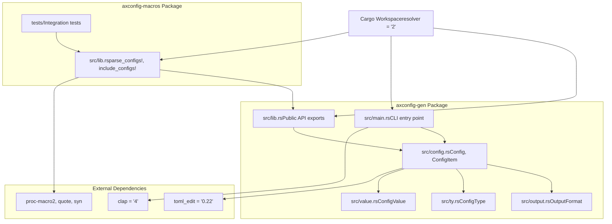
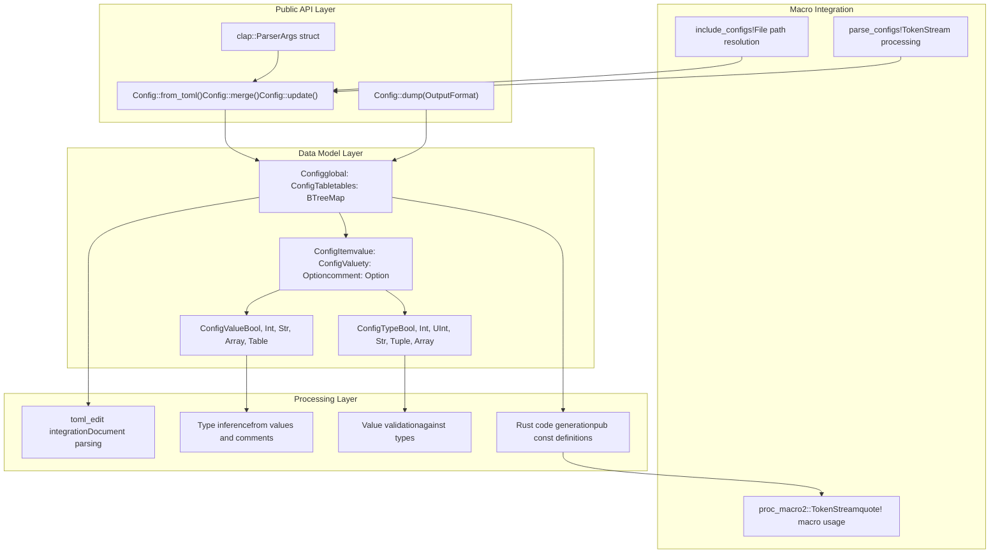
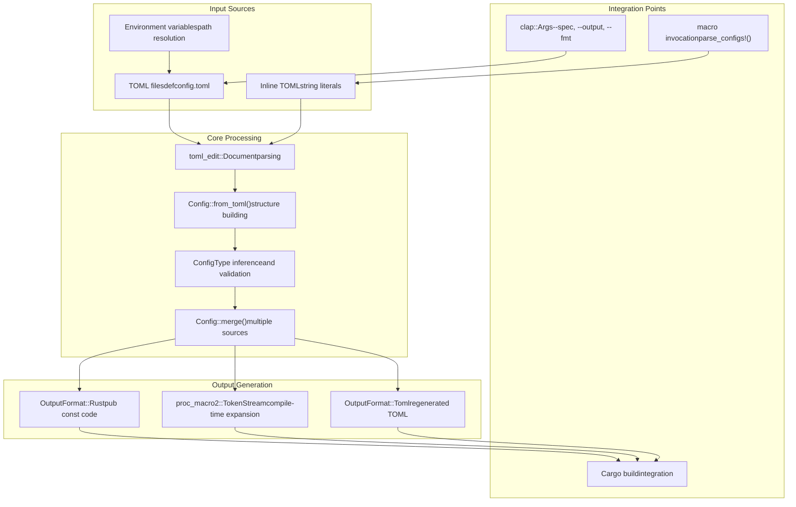

# System Architecture

> **Relevant source files**
> * [Cargo.toml](https://github.com/arceos-org/axconfig-gen/blob/99357274/Cargo.toml)
> * [README.md](https://github.com/arceos-org/axconfig-gen/blob/99357274/README.md)
> * [axconfig-gen/Cargo.toml](https://github.com/arceos-org/axconfig-gen/blob/99357274/axconfig-gen/Cargo.toml)
> * [axconfig-macros/Cargo.toml](https://github.com/arceos-org/axconfig-gen/blob/99357274/axconfig-macros/Cargo.toml)

This document explains the architectural design of the axconfig-gen configuration system, covering how the `axconfig-gen` and `axconfig-macros` packages work together within a unified Cargo workspace. It details the component relationships, data flow patterns, and integration points that enable both CLI-based and compile-time configuration processing for ArceOS.

For specific CLI tool usage, see [Command Line Interface](/arceos-org/axconfig-gen/2.1-command-line-interface). For procedural macro implementation details, see [Macro Implementation](/arceos-org/axconfig-gen/3.2-macro-implementation).

## Workspace Organization

The axconfig-gen repository implements a dual-package architecture within a Cargo workspace that provides both standalone tooling and compile-time integration capabilities.

### Workspace Structure

Sources: [Cargo.toml(L1 - L7)&emsp;](https://github.com/arceos-org/axconfig-gen/blob/99357274/Cargo.toml#L1-L7) [axconfig-gen/Cargo.toml(L1 - L18)&emsp;](https://github.com/arceos-org/axconfig-gen/blob/99357274/axconfig-gen/Cargo.toml#L1-L18) [axconfig-macros/Cargo.toml(L1 - L26)&emsp;](https://github.com/arceos-org/axconfig-gen/blob/99357274/axconfig-macros/Cargo.toml#L1-L26)

## Component Architecture

The system implements a layered architecture where `axconfig-macros` depends on `axconfig-gen` for core functionality, enabling code reuse across both CLI and compile-time processing modes.

### Core Processing Components

Sources: [README.md(L39 - L65)&emsp;](https://github.com/arceos-org/axconfig-gen/blob/99357274/README.md#L39-L65) [README.md(L69 - L98)&emsp;](https://github.com/arceos-org/axconfig-gen/blob/99357274/README.md#L69-L98)

## Integration Patterns

The architecture supports two distinct integration patterns that share common core processing but serve different use cases in the ArceOS build pipeline.

### Dual Processing Modes

|Processing Mode|Entry Point|Input Source|Output Target|Use Case|
| --- | --- | --- | --- | --- |
|CLI Mode|axconfig-genbinary|File arguments|Generated files|Build-time configuration|
|Macro Mode|parse_configs!/include_configs!|Inline TOML / File paths|Token streams|Compile-time constants|

### Data Flow Architecture

Sources: [README.md(L10 - L31)&emsp;](https://github.com/arceos-org/axconfig-gen/blob/99357274/README.md#L10-L31) [README.md(L100 - L108)&emsp;](https://github.com/arceos-org/axconfig-gen/blob/99357274/README.md#L100-L108)

## Processing Modes

The system architecture enables flexible configuration processing through two complementary approaches that share the same core data model and validation logic.

### CLI Processing Pipeline

The CLI mode implements external file processing for build-time configuration generation:

* **Input**: Multiple TOML specification files via command-line arguments
* **Processing**: File-based merging using `Config::merge()` operations
* **Output**: Generated `.axconfig.toml` or Rust constant files
* **Integration**: Build script integration via file I/O

### Macro Processing Pipeline

The macro mode implements compile-time configuration embedding:

* **Input**: Inline TOML strings or file paths in macro invocations
* **Processing**: Token stream manipulation using `proc-macro2` infrastructure
* **Output**: Rust constant definitions injected into the compilation AST
* **Integration**: Direct compile-time constant availability

### Shared Core Components

Both processing modes utilize the same underlying components:

* `Config` struct for configuration representation
* `ConfigValue` and `ConfigType` for type-safe value handling
* `toml_edit` integration for TOML parsing and manipulation
* Rust code generation logic for consistent output formatting

Sources: [axconfig-gen/Cargo.toml(L15 - L17)&emsp;](https://github.com/arceos-org/axconfig-gen/blob/99357274/axconfig-gen/Cargo.toml#L15-L17) [axconfig-macros/Cargo.toml(L18 - L22)&emsp;](https://github.com/arceos-org/axconfig-gen/blob/99357274/axconfig-macros/Cargo.toml#L18-L22)