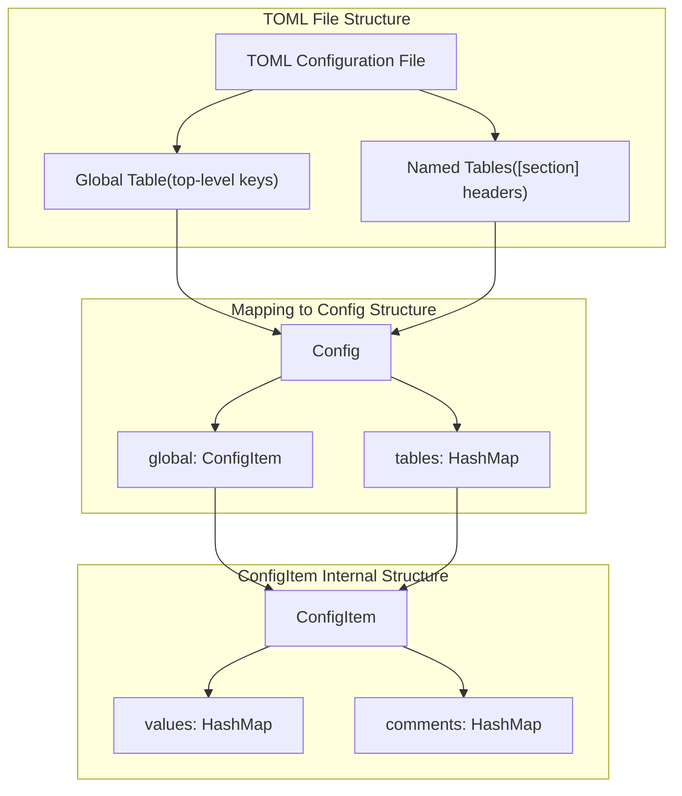
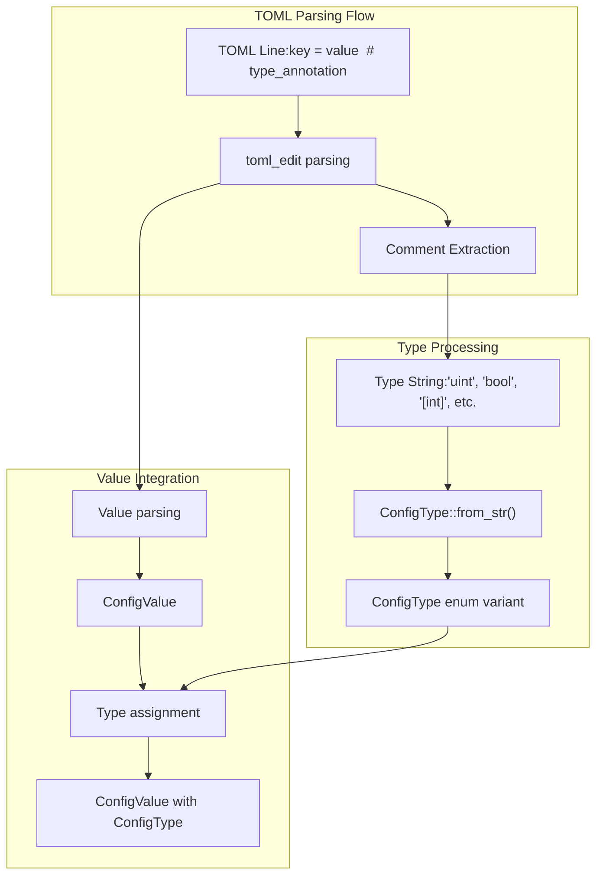
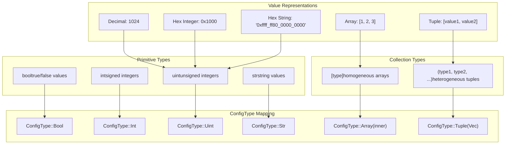
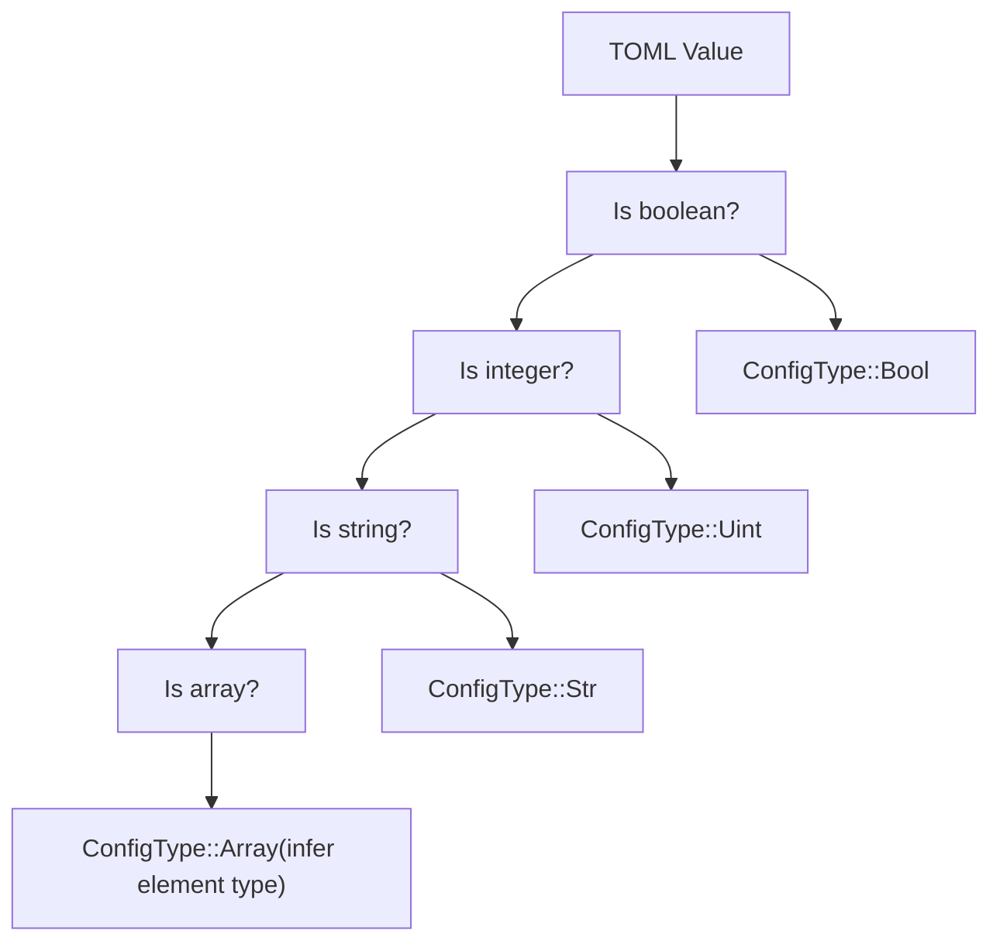

# TOML Configuration Format

> **Relevant source files**
> * [README.md](https://github.com/arceos-org/axconfig-gen/blob/99357274/README.md)
> * [example-configs/defconfig.toml](https://github.com/arceos-org/axconfig-gen/blob/99357274/example-configs/defconfig.toml)

This document specifies the TOML input format used by axconfig-gen for configuration processing. It covers the structure, type annotation system, supported data types, and ArceOS-specific conventions for writing configuration files.

For information about how configurations are processed into output formats, see [Generated Output Examples](/arceos-org/axconfig-gen/4.2-generated-output-examples). For details about the CLI tool that processes these TOML files, see [Command Line Interface](/arceos-org/axconfig-gen/2.1-command-line-interface).

## Basic TOML Structure

The axconfig-gen system processes TOML files organized into a two-level hierarchy: a global table for top-level configuration items and named tables for grouped configurations.



**TOML Structure to Internal Representation Mapping**

The parser maps TOML sections directly to the internal `Config` structure, where global keys become part of the `global` `ConfigItem` and each `[section]` becomes a named table entry.

**Sources**: [README.md(L42 - L65)&emsp;](https://github.com/arceos-org/axconfig-gen/blob/99357274/README.md#L42-L65) [example-configs/defconfig.toml(L1 - L63)&emsp;](https://github.com/arceos-org/axconfig-gen/blob/99357274/example-configs/defconfig.toml#L1-L63)

## Type Annotation System

Type information is specified through inline comments immediately following configuration values. This annotation system enables precise Rust code generation with correct type definitions.



**Type Annotation Processing Pipeline**

The system extracts type annotations from comments and converts them to `ConfigType` instances for type-safe code generation.

### Type Annotation Syntax

|Annotation|ConfigType|Rust Output Type|Example|
| --- | --- | --- | --- |
|# bool|ConfigType::Bool|bool|enabled = true  # bool|
|# int|ConfigType::Int|isize|offset = -10  # int|
|# uint|ConfigType::Uint|usize|size = 1024  # uint|
|# str|ConfigType::Str|&str|name = "test"  # str|
|# [uint]|ConfigType::Array(Uint)|&[usize]|ports = [80, 443]  # [uint]|
|# (uint, str)|ConfigType::Tuple([Uint, Str])|(usize, &str)|pair = [1, "a"]  # (uint, str)|

**Sources**: [README.md(L35 - L36)&emsp;](https://github.com/arceos-org/axconfig-gen/blob/99357274/README.md#L35-L36) [README.md(L47 - L48)&emsp;](https://github.com/arceos-org/axconfig-gen/blob/99357274/README.md#L47-L48) [example-configs/defconfig.toml(L2 - L3)&emsp;](https://github.com/arceos-org/axconfig-gen/blob/99357274/example-configs/defconfig.toml#L2-L3)

## Supported Data Types

The type system supports primitive types, collections, and nested structures to accommodate complex ArceOS configuration requirements.



**ConfigType System and Value Mappings**

### Complex Type Examples

**Array Types**: Support homogeneous collections with type-safe element access:

```markdown
mmio-regions = [
    ["0xb000_0000", "0x1000_0000"],
    ["0xfe00_0000", "0xc0_0000"]
]  # [(uint, uint)]
```

**Tuple Types**: Enable heterogeneous data grouping:

```markdown
endpoint = ["192.168.1.1", 8080, true]  # (str, uint, bool)
```

**Sources**: [example-configs/defconfig.toml(L48 - L54)&emsp;](https://github.com/arceos-org/axconfig-gen/blob/99357274/example-configs/defconfig.toml#L48-L54) [README.md(L47 - L49)&emsp;](https://github.com/arceos-org/axconfig-gen/blob/99357274/README.md#L47-L49)

## ArceOS Configuration Conventions

ArceOS configurations follow established patterns for organizing system, platform, and device specifications into logical groupings.

### Standard Configuration Sections

```mermaid
flowchart TD
subgraph subGraph4["Devices Section Details"]
    MMIO["mmio-regions: [(uint, uint)]"]
    VIRTIO["virtio-mmio-regions: [(uint, uint)]"]
    PCI["pci-ecam-base: uint"]
end
subgraph subGraph3["Platform Section Details"]
    PHYS_BASE["phys-memory-base: uint"]
    PHYS_SIZE["phys-memory-size: uint"]
    KERN_BASE["kernel-base-paddr: uint"]
    VIRT_MAP["phys-virt-offset: uint"]
end
subgraph subGraph2["Kernel Section Details"]
    STACK["task-stack-size: uint"]
    TICKS["ticks-per-sec: uint"]
end
subgraph subGraph1["Root Level Details"]
    ARCH["arch: strArchitecture identifier"]
    PLAT["plat: strPlatform identifier"]
    SMP["smp: uintCPU count"]
end
subgraph subGraph0["ArceOS Configuration Structure"]
    ROOT["Root Levelarch, plat, smp"]
    KERNEL["[kernel] SectionRuntime parameters"]
    PLATFORM["[platform] SectionMemory layout & hardware"]
    DEVICES["[devices] SectionHardware specifications"]
end

DEVICES --> MMIO
DEVICES --> PCI
DEVICES --> VIRTIO
KERNEL --> STACK
KERNEL --> TICKS
PLATFORM --> KERN_BASE
PLATFORM --> PHYS_BASE
PLATFORM --> PHYS_SIZE
PLATFORM --> VIRT_MAP
ROOT --> ARCH
ROOT --> PLAT
ROOT --> SMP
```



**ArceOS Standard Configuration Organization**

### Memory Address Conventions

ArceOS uses specific patterns for memory address specification:

|Address Type|Format|Example|Purpose|
| --- | --- | --- | --- |
|Physical addresses|Hex integers|0x20_0000|Hardware memory locations|
|Virtual addresses|Hex strings|"0xffff_ff80_0020_0000"|Kernel virtual memory|
|Memory regions|Tuple arrays|[["0xb000_0000", "0x1000_0000"]]|MMIO ranges|
|Size specifications|Hex integers|0x800_0000|Memory region sizes|

**Sources**: [example-configs/defconfig.toml(L22 - L39)&emsp;](https://github.com/arceos-org/axconfig-gen/blob/99357274/example-configs/defconfig.toml#L22-L39) [example-configs/defconfig.toml(L48 - L62)&emsp;](https://github.com/arceos-org/axconfig-gen/blob/99357274/example-configs/defconfig.toml#L48-L62)

## Key Naming and Value Formats

The configuration system supports flexible key naming and multiple value representation formats to accommodate diverse configuration needs.

### Key Naming Conventions

```markdown
# Standard kebab-case keys
task-stack-size = 0x1000        # uint

# Quoted keys for special characters
"one-two-three" = 456           # int

# Mixed naming in different contexts
kernel-base-paddr = 0x20_0000   # uint
"phys-memory-base" = 0          # uint
```

### Value Format Support

|Value Type|TOML Representation|Internal Processing|Output|
| --- | --- | --- | --- |
|Decimal integers|1024|Direct parsing|1024|
|Hex integers|0x1000|Hex parsing|4096|
|Hex strings|"0xffff_ff80"|String + type hint|0xffff_ff80_usize|
|Underscore separators|0x800_0000|Ignored in parsing|0x8000000|
|String literals|"x86_64"|String preservation|"x86_64"|
|Boolean values|true/false|Direct mapping|true/false|

### Type Inference Rules

When no explicit type annotation is provided:



**Type Inference Decision Tree**

The system defaults to unsigned integers for numeric values and attempts to infer array element types recursively.

**Sources**: [README.md(L35 - L36)&emsp;](https://github.com/arceos-org/axconfig-gen/blob/99357274/README.md#L35-L36) [example-configs/defconfig.toml(L1 - L7)&emsp;](https://github.com/arceos-org/axconfig-gen/blob/99357274/example-configs/defconfig.toml#L1-L7) [example-configs/defconfig.toml(L28 - L32)&emsp;](https://github.com/arceos-org/axconfig-gen/blob/99357274/example-configs/defconfig.toml#L28-L32)