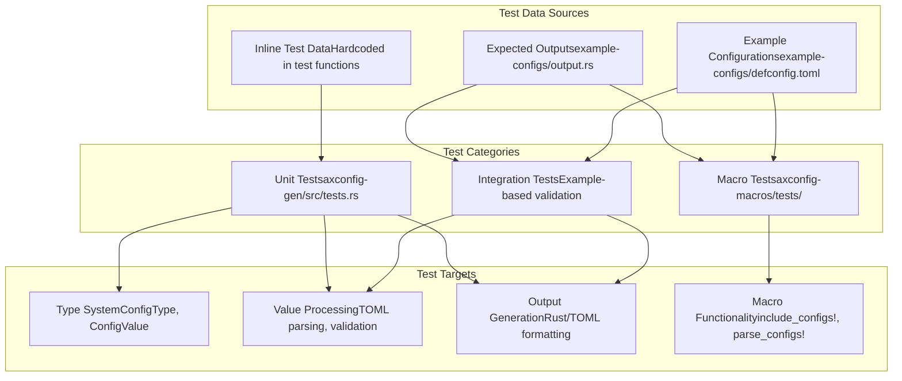
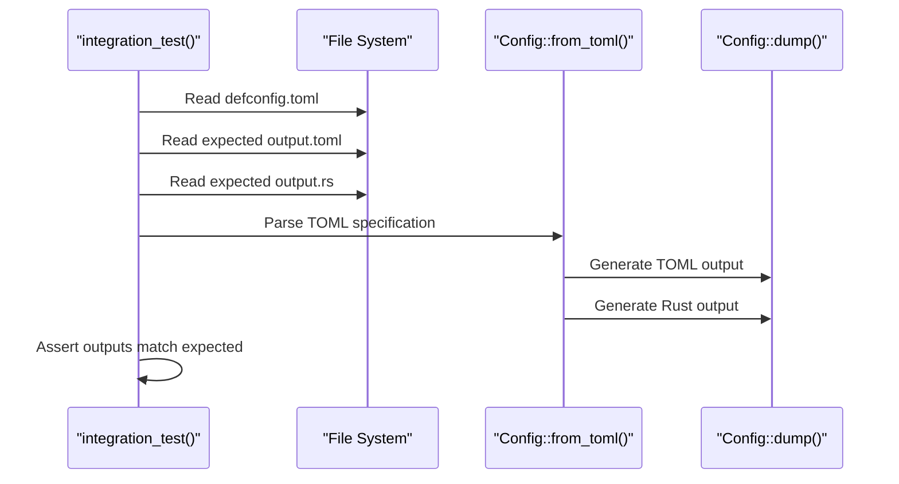
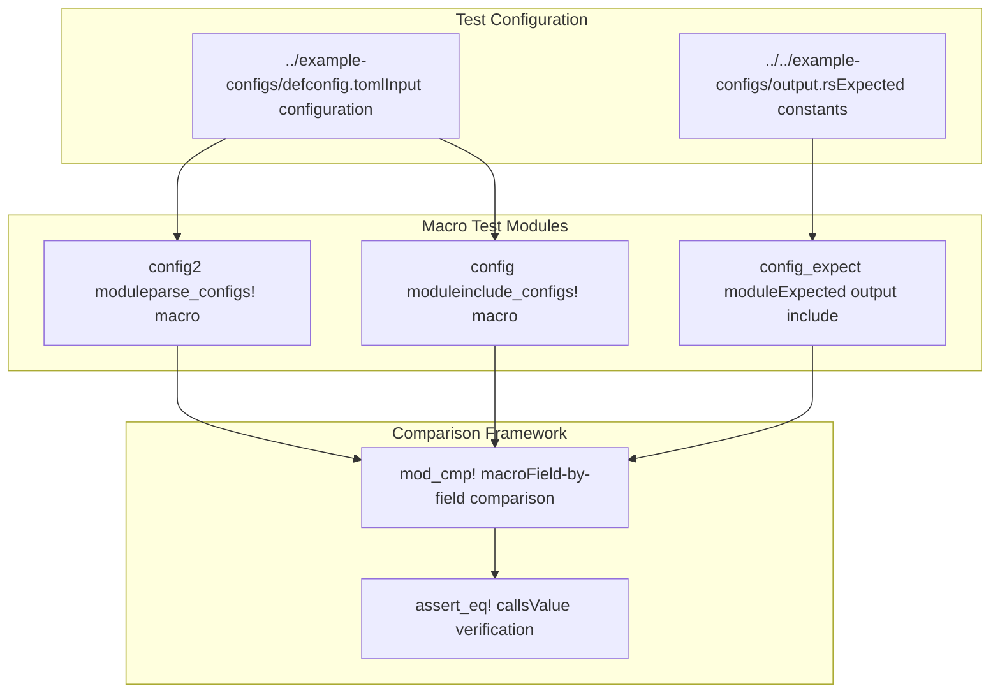

# Testing

> **Relevant source files**
> * [axconfig-gen/src/tests.rs](https://github.com/arceos-org/axconfig-gen/blob/99357274/axconfig-gen/src/tests.rs)
> * [axconfig-gen/src/value.rs](https://github.com/arceos-org/axconfig-gen/blob/99357274/axconfig-gen/src/value.rs)
> * [axconfig-macros/tests/example_config.rs](https://github.com/arceos-org/axconfig-gen/blob/99357274/axconfig-macros/tests/example_config.rs)

This page covers the testing infrastructure and test organization for the axconfig-gen project. It includes unit tests for core functionality, integration tests for end-to-end validation, and macro-specific tests for procedural macro behavior.

For information about the build system setup, see [Build System and Dependencies](/arceos-org/axconfig-gen/5.1-build-system-and-dependencies). For details about the continuous integration pipeline, see [Continuous Integration](/arceos-org/axconfig-gen/5.3-continuous-integration).

## Test Architecture Overview

The testing strategy is organized into three main categories: unit tests for individual components, integration tests for complete workflows, and macro-specific tests for procedural macro functionality.



**Sources:** [axconfig-gen/src/tests.rs(L1 - L192)&emsp;](https://github.com/arceos-org/axconfig-gen/blob/99357274/axconfig-gen/src/tests.rs#L1-L192) [axconfig-macros/tests/example_config.rs(L1 - L87)&emsp;](https://github.com/arceos-org/axconfig-gen/blob/99357274/axconfig-macros/tests/example_config.rs#L1-L87)

## Unit Test Structure

The unit tests in `axconfig-gen` cover individual components of the configuration system, focusing on type inference, value validation, and code generation.

### Type System Testing

The type inference and validation system is tested through the `test_type_infer` and `test_type_match` functions, which verify that TOML values are correctly mapped to Rust types.

```

```

**Sources:** [axconfig-gen/src/tests.rs(L23 - L59)&emsp;](https://github.com/arceos-org/axconfig-gen/blob/99357274/axconfig-gen/src/tests.rs#L23-L59) [axconfig-gen/src/tests.rs(L61 - L115)&emsp;](https://github.com/arceos-org/axconfig-gen/blob/99357274/axconfig-gen/src/tests.rs#L61-L115)

### Code Generation Testing

The `test_to_rust` function validates that TOML values are correctly converted to Rust code with proper formatting and indentation.

|Test Case|Input TOML|Expected Rust Output|Purpose|
| --- | --- | --- | --- |
|Nested Arrays|[[(uint, (str, str), uint)]]|&[&[(usize, (&str, &str), usize)]]|Complex nesting validation|
|Mixed Arrays|[[(uint, [str], uint)]]|&[&[(usize, &[&str], usize)]]|Variable-length arrays|
|Indentation|Multi-level arrays|Properly indented code|Formatting correctness|

**Sources:** [axconfig-gen/src/tests.rs(L137 - L180)&emsp;](https://github.com/arceos-org/axconfig-gen/blob/99357274/axconfig-gen/src/tests.rs#L137-L180)

## Integration Testing

Integration tests verify the complete pipeline from TOML input to generated output, ensuring that all components work together correctly.



The integration test reads example configuration files and compares the generated outputs against reference files to ensure consistency across the entire processing pipeline.

**Sources:** [axconfig-gen/src/tests.rs(L182 - L191)&emsp;](https://github.com/arceos-org/axconfig-gen/blob/99357274/axconfig-gen/src/tests.rs#L182-L191)

## Macro Testing Framework

The macro tests in `axconfig-macros` verify that procedural macros generate the same output as the CLI tool, ensuring consistency between compile-time and build-time processing.

### Test Structure



**Sources:** [axconfig-macros/tests/example_config.rs(L4 - L15)&emsp;](https://github.com/arceos-org/axconfig-gen/blob/99357274/axconfig-macros/tests/example_config.rs#L4-L15)

### Comparison Strategy

The `mod_cmp!` macro systematically compares all generated constants across different modules to ensure consistency:

|Category|Constants Tested|Purpose|
| --- | --- | --- |
|Global|ARCH,PLAT,SMP|Core system configuration|
|Devices|MMIO_REGIONS,PCI_*,VIRTIO_*|Hardware abstraction|
|Kernel|TASK_STACK_SIZE,TICKS_PER_SEC|Runtime parameters|
|Platform|KERNEL_*,PHYS_*|Memory layout|

**Sources:** [axconfig-macros/tests/example_config.rs(L17 - L75)&emsp;](https://github.com/arceos-org/axconfig-gen/blob/99357274/axconfig-macros/tests/example_config.rs#L17-L75)

## Running Tests

### Test Execution Commands

```markdown
# Run all tests in the workspace
cargo test

# Run unit tests only (axconfig-gen)
cargo test -p axconfig-gen

# Run macro tests only (axconfig-macros)
cargo test -p axconfig-macros

# Run specific test functions
cargo test test_type_infer
cargo test integration_test
```

### Feature-Specific Testing

The macro tests include conditional compilation for nightly features:

```rust
#[cfg(feature = "nightly")]
#[test]
fn test_parse_configs() {
    mod_cmp!(config2, config_expect);
}
```

**Sources:** [axconfig-macros/tests/example_config.rs(L82 - L86)&emsp;](https://github.com/arceos-org/axconfig-gen/blob/99357274/axconfig-macros/tests/example_config.rs#L82-L86)

## Test Data Management

### Example Configuration Files

The test suite relies on shared example configuration files located in the `example-configs` directory:

* `defconfig.toml` - Input TOML configuration
* `output.toml` - Expected TOML output
* `output.rs` - Expected Rust code output

These files serve as the source of truth for both integration tests and macro tests, ensuring consistency across test categories.

**Sources:** [axconfig-macros/tests/example_config.rs(L5)&emsp;](https://github.com/arceos-org/axconfig-gen/blob/99357274/axconfig-macros/tests/example_config.rs#L5-L5) [axconfig-gen/src/tests.rs(L184 - L186)&emsp;](https://github.com/arceos-org/axconfig-gen/blob/99357274/axconfig-gen/src/tests.rs#L184-L186)

## Adding New Tests

### Unit Test Guidelines

When adding unit tests to [axconfig-gen/src/tests.rs](https://github.com/arceos-org/axconfig-gen/blob/99357274/axconfig-gen/src/tests.rs) follow these patterns:

1. Use the `check_type_infer()` helper for type inference tests
2. Use the `assert_err!` macro for error condition validation
3. Include both positive and negative test cases
4. Test edge cases like empty arrays and complex nesting

### Integration Test Additions

For new integration tests:

1. Add test configuration files to `example-configs/`
2. Update the `integration_test()` function to include new scenarios
3. Ensure both TOML and Rust output validation

### Macro Test Extensions

When extending macro tests:

1. Update the `mod_cmp!` macro to include new configuration fields
2. Add conditional compilation for feature-specific functionality
3. Maintain consistency with the expected output format

**Sources:** [axconfig-gen/src/tests.rs(L14 - L21)&emsp;](https://github.com/arceos-org/axconfig-gen/blob/99357274/axconfig-gen/src/tests.rs#L14-L21) [axconfig-macros/tests/example_config.rs(L17 - L75)&emsp;](https://github.com/arceos-org/axconfig-gen/blob/99357274/axconfig-macros/tests/example_config.rs#L17-L75)