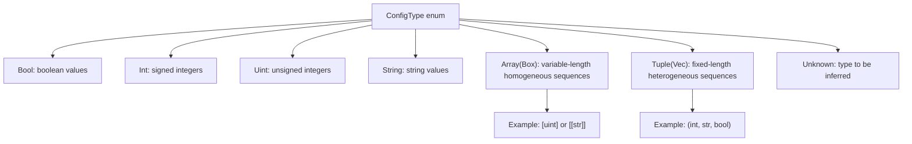
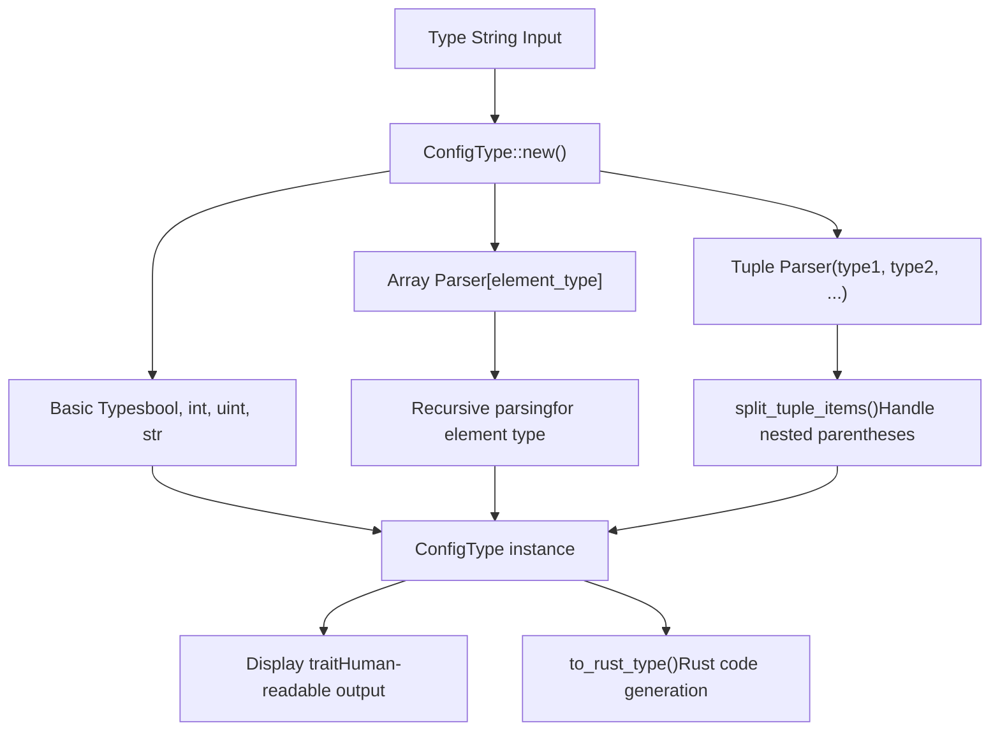
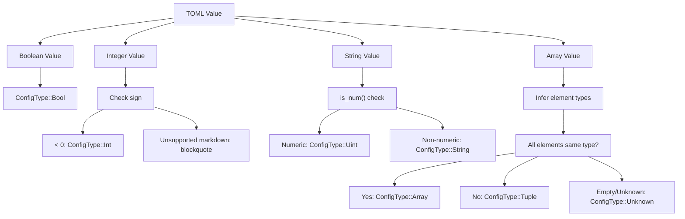
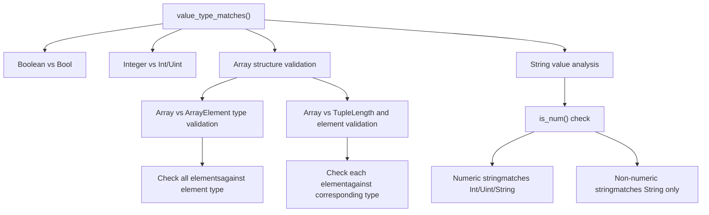
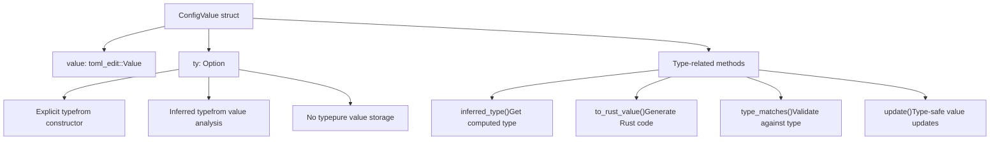
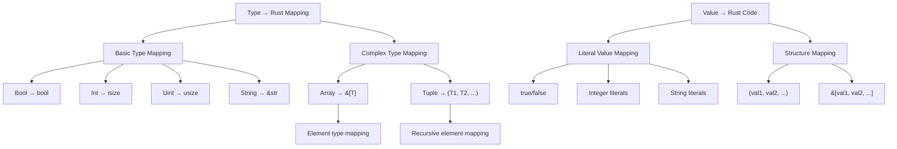

# Type System

> **Relevant source files**
> * [axconfig-gen/src/tests.rs](https://github.com/arceos-org/axconfig-gen/blob/99357274/axconfig-gen/src/tests.rs)
> * [axconfig-gen/src/ty.rs](https://github.com/arceos-org/axconfig-gen/blob/99357274/axconfig-gen/src/ty.rs)
> * [axconfig-gen/src/value.rs](https://github.com/arceos-org/axconfig-gen/blob/99357274/axconfig-gen/src/value.rs)

## Purpose and Scope

The Type System is the core component responsible for type inference, validation, and code generation in the axconfig-gen library. It provides mechanisms to parse type annotations from strings, infer types from TOML values, validate type compatibility, and generate appropriate Rust type declarations for configuration values.

For information about how types are used in configuration data structures, see [Core Data Structures](/arceos-org/axconfig-gen/2.2.1-core-data-structures). For details on how the type system integrates with output generation, see [Output Generation](/arceos-org/axconfig-gen/2.2.3-output-generation).

## ConfigType Enumeration

The foundation of the type system is the `ConfigType` enum, which represents all supported configuration value types in the system.

**Supported Type Categories**

|Type Category|ConfigType Variant|Rust Equivalent|TOML Representation|
| --- | --- | --- | --- |
|Boolean|Bool|bool|true,false|
|Signed Integer|Int|isize|-123,0x80|
|Unsigned Integer|Uint|usize|123,0xff|
|String|String|&str|"hello"|
|Tuple|Tuple(Vec<ConfigType>)|(T1, T2, ...)|[val1, val2, ...]|
|Array|Array(Box<ConfigType>)|&[T]|[val1, val2, ...]|
|Unknown|Unknown|N/A|Used for inference|

Sources: [axconfig-gen/src/ty.rs(L4 - L22)&emsp;](https://github.com/arceos-org/axconfig-gen/blob/99357274/axconfig-gen/src/ty.rs#L4-L22)

## Type Parsing and String Representation

The type system supports parsing type specifications from string format, enabling type annotations in TOML comments and explicit type declarations.

**Type String Examples**

|Input String|Parsed Type|Rust Output|
| --- | --- | --- |
|"bool"|ConfigType::Bool|"bool"|
|"[uint]"|ConfigType::Array(Box::new(ConfigType::Uint))|"&[usize]"|
|"(int, str)"|ConfigType::Tuple(vec![ConfigType::Int, ConfigType::String])|"(isize, &str)"|
|"[[bool]]"|ConfigType::Array(Box::new(ConfigType::Array(...)))|"&[&[bool]]"|

Sources: [axconfig-gen/src/ty.rs(L24 - L61)&emsp;](https://github.com/arceos-org/axconfig-gen/blob/99357274/axconfig-gen/src/ty.rs#L24-L61) [axconfig-gen/src/ty.rs(L83 - L111)&emsp;](https://github.com/arceos-org/axconfig-gen/blob/99357274/axconfig-gen/src/ty.rs#L83-L111) [axconfig-gen/src/ty.rs(L113 - L134)&emsp;](https://github.com/arceos-org/axconfig-gen/blob/99357274/axconfig-gen/src/ty.rs#L113-L134)

## Type Inference System

The type inference system automatically determines types from TOML values, supporting both simple and complex nested structures.

**Inference Rules**

* **Integers**: Negative values infer as `Int`, non-negative as `Uint`
* **Strings**: Numeric strings (hex, binary, octal, decimal) infer as `Uint`, others as `String`
* **Arrays**: Homogeneous arrays become `Array`, heterogeneous become `Tuple`
* **Nested Arrays**: Recursively infer element types

Sources: [axconfig-gen/src/value.rs(L177 - L224)&emsp;](https://github.com/arceos-org/axconfig-gen/blob/99357274/axconfig-gen/src/value.rs#L177-L224) [axconfig-gen/src/value.rs(L114 - L125)&emsp;](https://github.com/arceos-org/axconfig-gen/blob/99357274/axconfig-gen/src/value.rs#L114-L125)

## Type Validation and Matching

The type system provides comprehensive validation to ensure values conform to expected types, with special handling for string-encoded numbers and flexible integer types.

**Type Compatibility Matrix**

|TOML Value|Bool|Int|Uint|String|Notes|
| --- | --- | --- | --- | --- | --- |
|true/false|✓|✗|✗|✗|Exact match only|
|123|✗|✓|✓|✗|Integers match both Int/Uint|
|-123|✗|✓|✓|✗|Negative still matches Uint|
|"123"|✗|✓|✓|✓|Numeric strings are flexible|
|"abc"|✗|✗|✗|✓|Non-numeric strings|

Sources: [axconfig-gen/src/value.rs(L142 - L175)&emsp;](https://github.com/arceos-org/axconfig-gen/blob/99357274/axconfig-gen/src/value.rs#L142-L175) [axconfig-gen/src/value.rs(L58 - L80)&emsp;](https://github.com/arceos-org/axconfig-gen/blob/99357274/axconfig-gen/src/value.rs#L58-L80)

## Integration with ConfigValue

The type system integrates closely with `ConfigValue` to provide type-safe configuration value management.

**ConfigValue Type Operations**

* **Construction**: Values can be created with or without explicit types
* **Inference**: Types can be computed from TOML values automatically
* **Validation**: Updates are validated against existing or specified types
* **Code Generation**: Type information drives Rust code output format

Sources: [axconfig-gen/src/value.rs(L7 - L12)&emsp;](https://github.com/arceos-org/axconfig-gen/blob/99357274/axconfig-gen/src/value.rs#L7-L12) [axconfig-gen/src/value.rs(L52 - L103)&emsp;](https://github.com/arceos-org/axconfig-gen/blob/99357274/axconfig-gen/src/value.rs#L52-L103)

## Rust Code Generation

The type system drives generation of appropriate Rust type declarations and value literals for compile-time configuration constants.

**Rust Generation Examples**

|ConfigType|Rust Type|Example Value|Generated Rust|
| --- | --- | --- | --- |
|Bool|bool|true|true|
|Uint|usize|"0xff"|0xff|
|Array(String)|&[&str]|["a", "b"]|&["a", "b"]|
|Tuple([Uint, String])|(usize, &str)|[123, "test"]|(123, "test")|

Sources: [axconfig-gen/src/ty.rs(L62 - L81)&emsp;](https://github.com/arceos-org/axconfig-gen/blob/99357274/axconfig-gen/src/ty.rs#L62-L81) [axconfig-gen/src/value.rs(L243 - L288)&emsp;](https://github.com/arceos-org/axconfig-gen/blob/99357274/axconfig-gen/src/value.rs#L243-L288)