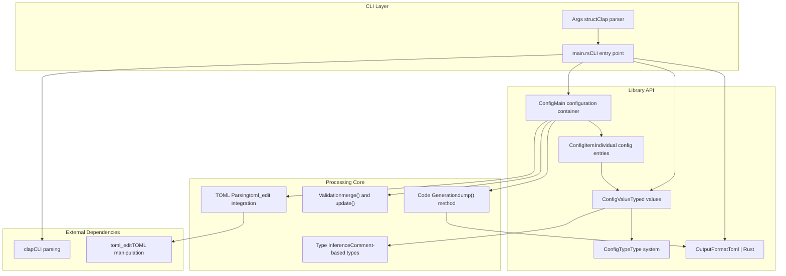
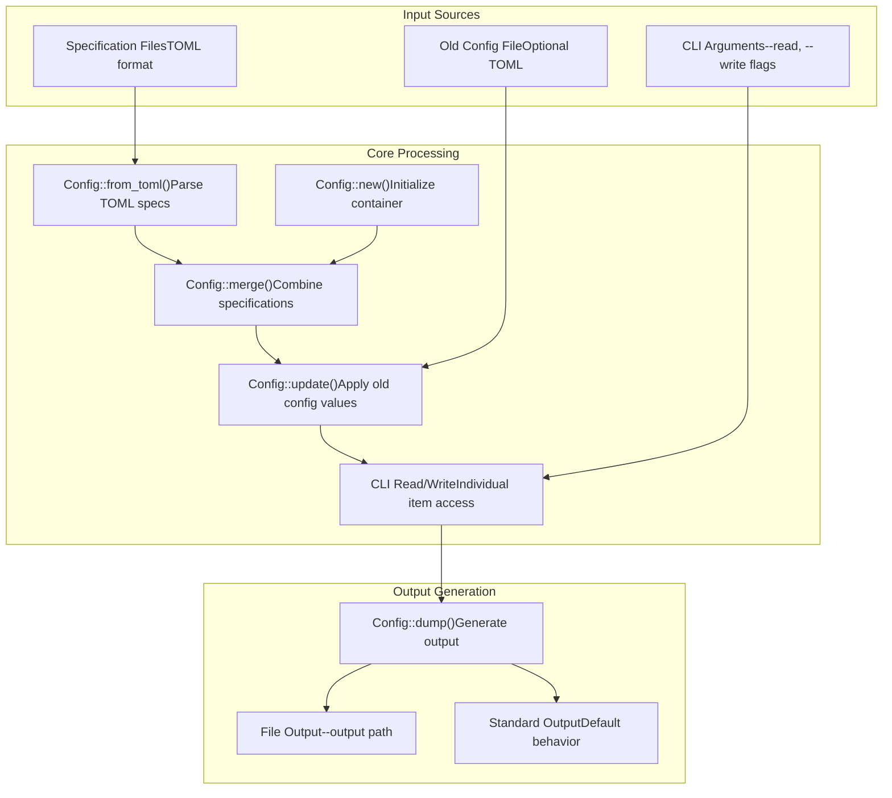
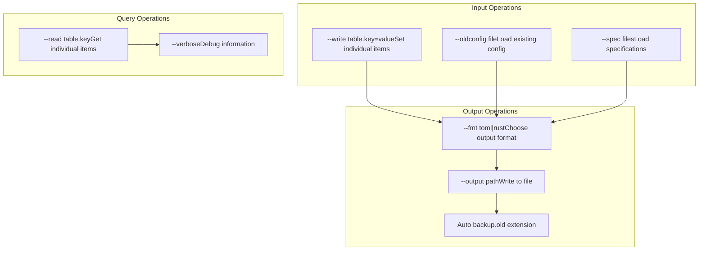
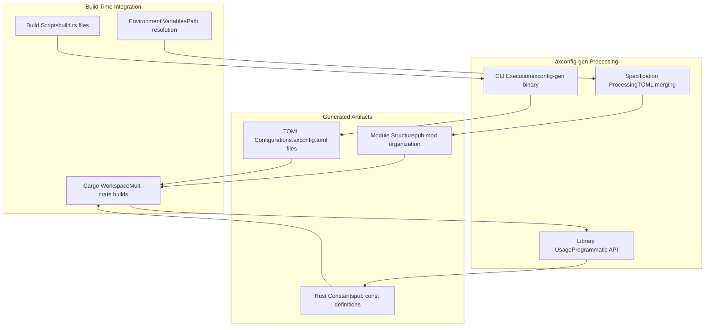

# axconfig-gen Package

> **Relevant source files**
> * [axconfig-gen/README.md](https://github.com/arceos-org/axconfig-gen/blob/99357274/axconfig-gen/README.md)
> * [axconfig-gen/src/main.rs](https://github.com/arceos-org/axconfig-gen/blob/99357274/axconfig-gen/src/main.rs)

This document covers the `axconfig-gen` package, which provides both a command-line tool and a Rust library for TOML-based configuration generation in the ArceOS ecosystem. The package serves as the core processing engine for configuration management, offering type-safe conversion from TOML specifications to both TOML and Rust code outputs.

For procedural macro interfaces that build on this package, see [axconfig-macros Package](/arceos-org/axconfig-gen/3-axconfig-macros-package). For specific CLI usage patterns, see [Command Line Interface](/arceos-org/axconfig-gen/2.1-command-line-interface). For programmatic API details, see [Library API](/arceos-org/axconfig-gen/2.2-library-api).

## Package Architecture

The `axconfig-gen` package operates as a dual-purpose tool, providing both standalone CLI functionality and a library API for integration into other Rust applications. The package implements a sophisticated configuration processing pipeline that handles TOML parsing, type inference, validation, and code generation.

### Core Components

Sources: [axconfig-gen/src/main.rs(L1 - L175)&emsp;](https://github.com/arceos-org/axconfig-gen/blob/99357274/axconfig-gen/src/main.rs#L1-L175) [axconfig-gen/README.md(L1 - L69)&emsp;](https://github.com/arceos-org/axconfig-gen/blob/99357274/axconfig-gen/README.md#L1-L69)

### Processing Pipeline

Sources: [axconfig-gen/src/main.rs(L76 - L174)&emsp;](https://github.com/arceos-org/axconfig-gen/blob/99357274/axconfig-gen/src/main.rs#L76-L174)

## Key Capabilities

### Configuration Management

The package provides comprehensive configuration management through the `Config` struct, which serves as the central container for all configuration data. The configuration system supports:

|Feature|Description|Implementation|
| --- | --- | --- |
|Specification Loading|Load multiple TOML specification files|Config::from_toml()andConfig::merge()|
|Value Updates|Apply existing configuration values|Config::update()method|
|Individual Access|Read/write specific configuration items|config_at()andconfig_at_mut()|
|Type Safety|Enforce types through comments and inference|ConfigTypeandConfigValue|
|Global and Scoped|Support both global and table-scoped items|GLOBAL_TABLE_NAMEconstant|

### CLI Interface

The command-line interface, implemented in [axconfig-gen/src/main.rs(L5 - L40)&emsp;](https://github.com/arceos-org/axconfig-gen/blob/99357274/axconfig-gen/src/main.rs#L5-L40) provides extensive functionality for configuration management:

Sources: [axconfig-gen/src/main.rs(L5 - L40)&emsp;](https://github.com/arceos-org/axconfig-gen/blob/99357274/axconfig-gen/src/main.rs#L5-L40) [axconfig-gen/README.md(L8 - L22)&emsp;](https://github.com/arceos-org/axconfig-gen/blob/99357274/axconfig-gen/README.md#L8-L22)

### Type System Integration

The package implements a sophisticated type system that bridges TOML configuration with Rust type safety:

|Type Category|TOML Comment Syntax|Generated Rust Type|
| --- | --- | --- |
|Primitives|# bool,# int,# uint,# str|bool,isize,usize,&str|
|Collections|# [type]|&[type]|
|Tuples|# (type1, type2, ...)|(type1, type2, ...)|
|Inferred|No comment|Automatic from value|

### Library API

The package exposes a clean programmatic interface for integration into other Rust applications. The core workflow follows this pattern:

1. **Configuration Creation**: Initialize with `Config::new()` or `Config::from_toml()`
2. **Specification Merging**: Combine multiple sources with `Config::merge()`
3. **Value Management**: Update configurations with `Config::update()`
4. **Output Generation**: Generate code with `Config::dump(OutputFormat)`

## Integration Points

### ArceOS Build System

The package integrates with the ArceOS build system through multiple pathways:

Sources: [axconfig-gen/src/main.rs(L87 - L95)&emsp;](https://github.com/arceos-org/axconfig-gen/blob/99357274/axconfig-gen/src/main.rs#L87-L95) [axconfig-gen/README.md(L24 - L28)&emsp;](https://github.com/arceos-org/axconfig-gen/blob/99357274/axconfig-gen/README.md#L24-L28)

### External Tool Integration

The package supports integration with external configuration management tools through its file-based interface and backup mechanisms implemented in [axconfig-gen/src/main.rs(L155 - L170)&emsp;](https://github.com/arceos-org/axconfig-gen/blob/99357274/axconfig-gen/src/main.rs#L155-L170) The automatic backup system ensures configuration history preservation during updates.

Sources: [axconfig-gen/src/main.rs(L155 - L170)&emsp;](https://github.com/arceos-org/axconfig-gen/blob/99357274/axconfig-gen/src/main.rs#L155-L170) [axconfig-gen/README.md(L34 - L62)&emsp;](https://github.com/arceos-org/axconfig-gen/blob/99357274/axconfig-gen/README.md#L34-L62)