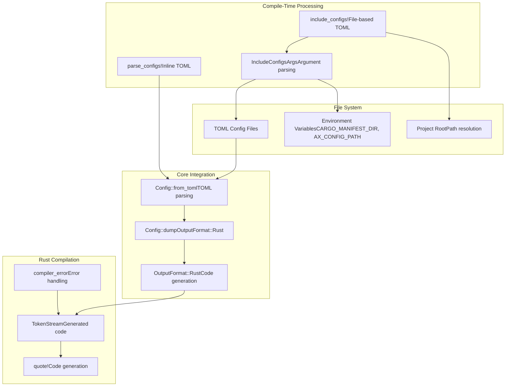
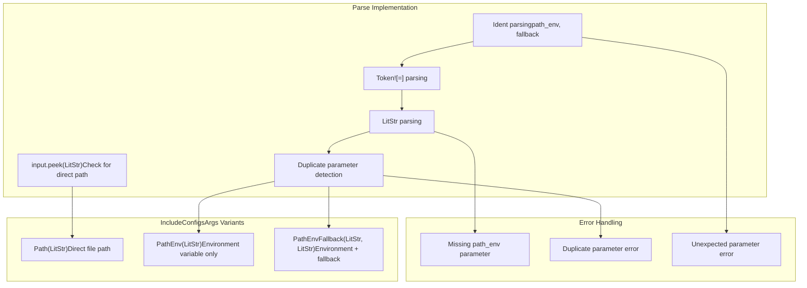
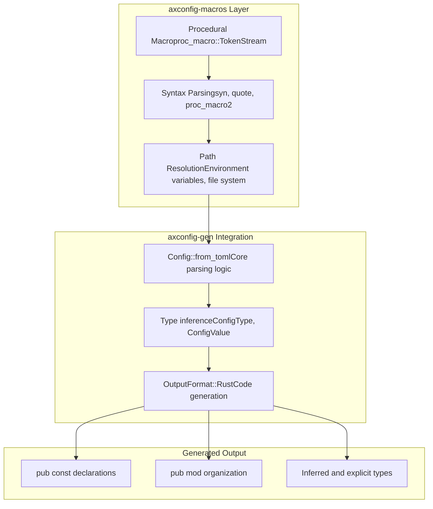

# axconfig-macros Package

> **Relevant source files**
> * [axconfig-macros/README.md](https://github.com/arceos-org/axconfig-gen/blob/99357274/axconfig-macros/README.md)
> * [axconfig-macros/src/lib.rs](https://github.com/arceos-org/axconfig-gen/blob/99357274/axconfig-macros/src/lib.rs)

This document covers the `axconfig-macros` procedural macro crate, which provides compile-time TOML configuration processing for the ArceOS ecosystem. The package transforms TOML configuration data into Rust constant definitions during compilation, enabling zero-cost configuration access at runtime.

For information about the CLI tool and library API that provides the core processing functionality, see [axconfig-gen Package](/arceos-org/axconfig-gen/2-axconfig-gen-package). For practical usage examples and TOML format specifications, see [Configuration Examples](/arceos-org/axconfig-gen/4-configuration-examples).

## Overview

The `axconfig-macros` package provides two procedural macros that convert TOML configuration data into Rust constants at compile time:

* `parse_configs!` - Processes inline TOML strings
* `include_configs!` - Reads and processes external TOML files

Both macros leverage the core processing functionality from `axconfig-gen` to parse TOML, infer types, and generate Rust code, but operate during compilation rather than as a separate build step.

**Sources:** [axconfig-macros/README.md(L1 - L49)&emsp;](https://github.com/arceos-org/axconfig-gen/blob/99357274/axconfig-macros/README.md#L1-L49) [axconfig-macros/src/lib.rs(L1 - L143)&emsp;](https://github.com/arceos-org/axconfig-gen/blob/99357274/axconfig-macros/src/lib.rs#L1-L143)

## Macro Processing Architecture



This diagram shows how the procedural macros integrate with the `axconfig-gen` core processing pipeline and the Rust compilation system.

**Sources:** [axconfig-macros/src/lib.rs(L22 - L41)&emsp;](https://github.com/arceos-org/axconfig-gen/blob/99357274/axconfig-macros/src/lib.rs#L22-L41) [axconfig-macros/src/lib.rs(L58 - L87)&emsp;](https://github.com/arceos-org/axconfig-gen/blob/99357274/axconfig-macros/src/lib.rs#L58-L87) [axconfig-macros/src/lib.rs(L89 - L143)&emsp;](https://github.com/arceos-org/axconfig-gen/blob/99357274/axconfig-macros/src/lib.rs#L89-L143)

## Macro Usage Patterns

### parse_configs! Macro

The `parse_configs!` macro processes inline TOML strings and generates corresponding Rust constants:

|Input Type|Generated Output|Example|
| --- | --- | --- |
|Global constants|pub const NAME: TYPE = VALUE;|pub const ARE_YOU_OK: bool = true;|
|Table sections|pub mod table_name { ... }|pub mod hello { ... }|
|Typed values|Type-annotated constants|pub const VALUE: isize = 456;|

The macro supports type annotations through TOML comments and automatic type inference from values.

**Sources:** [axconfig-macros/README.md(L7 - L23)&emsp;](https://github.com/arceos-org/axconfig-gen/blob/99357274/axconfig-macros/README.md#L7-L23) [axconfig-macros/src/lib.rs(L16 - L41)&emsp;](https://github.com/arceos-org/axconfig-gen/blob/99357274/axconfig-macros/src/lib.rs#L16-L41)

### include_configs! Macro

The `include_configs!` macro provides three path resolution strategies:

```

```

**Sources:** [axconfig-macros/src/lib.rs(L58 - L87)&emsp;](https://github.com/arceos-org/axconfig-gen/blob/99357274/axconfig-macros/src/lib.rs#L58-L87) [axconfig-macros/src/lib.rs(L76 - L77)&emsp;](https://github.com/arceos-org/axconfig-gen/blob/99357274/axconfig-macros/src/lib.rs#L76-L77) [axconfig-macros/src/lib.rs(L83 - L86)&emsp;](https://github.com/arceos-org/axconfig-gen/blob/99357274/axconfig-macros/src/lib.rs#L83-L86)

## Implementation Details

### Argument Parsing System

The `IncludeConfigsArgs` enum handles the three different invocation patterns for `include_configs!`:



**Sources:** [axconfig-macros/src/lib.rs(L89 - L143)&emsp;](https://github.com/arceos-org/axconfig-gen/blob/99357274/axconfig-macros/src/lib.rs#L89-L143) [axconfig-macros/src/lib.rs(L95 - L142)&emsp;](https://github.com/arceos-org/axconfig-gen/blob/99357274/axconfig-macros/src/lib.rs#L95-L142)

### Error Handling and Compilation Integration

The macro implementation includes comprehensive error handling that integrates with the Rust compiler's diagnostic system:

|Error Type|Function|Generated Output|
| --- | --- | --- |
|TOML parsing errors|compiler_error|Compile-time error with span information|
|File read failures|compiler_error|Error message with file path context|
|Environment variable errors|compiler_error|Missing environment variable details|
|Token parsing errors|LexErrorhandling|Rust lexer error propagation|

**Sources:** [axconfig-macros/src/lib.rs(L12 - L14)&emsp;](https://github.com/arceos-org/axconfig-gen/blob/99357274/axconfig-macros/src/lib.rs#L12-L14) [axconfig-macros/src/lib.rs(L39 - L40)&emsp;](https://github.com/arceos-org/axconfig-gen/blob/99357274/axconfig-macros/src/lib.rs#L39-L40) [axconfig-macros/src/lib.rs(L63 - L67)&emsp;](https://github.com/arceos-org/axconfig-gen/blob/99357274/axconfig-macros/src/lib.rs#L63-L67) [axconfig-macros/src/lib.rs(L79 - L81)&emsp;](https://github.com/arceos-org/axconfig-gen/blob/99357274/axconfig-macros/src/lib.rs#L79-L81)

## Integration with axconfig-gen Core



The macros act as a procedural macro frontend to the core `axconfig-gen` processing pipeline, handling the compile-time integration and file system operations while delegating the actual TOML processing and code generation to the shared library.

**Sources:** [axconfig-macros/src/lib.rs(L10)&emsp;](https://github.com/arceos-org/axconfig-gen/blob/99357274/axconfig-macros/src/lib.rs#L10-L10) [axconfig-macros/src/lib.rs(L34 - L35)&emsp;](https://github.com/arceos-org/axconfig-gen/blob/99357274/axconfig-macros/src/lib.rs#L34-L35)

## Type System Integration

The macros inherit the full type system capabilities from `axconfig-gen`, including:

* **Automatic type inference** from TOML values
* **Explicit type annotations** via TOML comments
* **Complex type support** for tuples, arrays, and nested structures
* **Rust-native type mapping** for generated constants

The generated code maintains type safety and zero-cost abstractions by producing compile-time constants rather than runtime configuration lookups.

**Sources:** [axconfig-macros/README.md(L25 - L38)&emsp;](https://github.com/arceos-org/axconfig-gen/blob/99357274/axconfig-macros/README.md#L25-L38) [axconfig-macros/src/lib.rs(L34 - L35)&emsp;](https://github.com/arceos-org/axconfig-gen/blob/99357274/axconfig-macros/src/lib.rs#L34-L35)