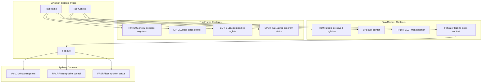
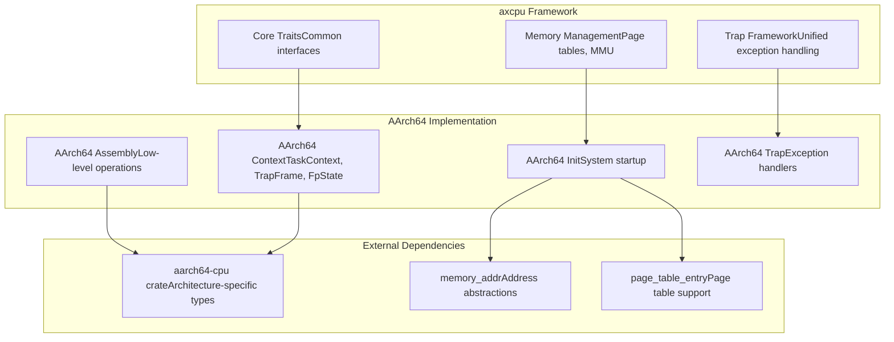

# AArch64 Architecture

> **Relevant source files**
> * [src/aarch64/mod.rs](https://github.com/arceos-org/axcpu/blob/b93d8fa3/src/aarch64/mod.rs)

## Purpose and Scope

This document provides a comprehensive overview of AArch64 (ARM64) architecture support within the axcpu library. The AArch64 implementation provides CPU abstraction capabilities including context management, trap handling, and system initialization for ARM 64-bit processors.

For detailed information about specific AArch64 subsystems, see [AArch64 Context Management](/arceos-org/axcpu/3.1-aarch64-context-management), [AArch64 Trap and Exception Handling](/arceos-org/axcpu/3.2-aarch64-trap-and-exception-handling), and [AArch64 System Initialization](/arceos-org/axcpu/3.3-aarch64-system-initialization). For information about cross-architecture features that work with AArch64, see [Cross-Architecture Features](/arceos-org/axcpu/6-cross-architecture-features).

## Module Organization

The AArch64 architecture support is organized into several focused modules that handle different aspects of CPU management and abstraction.

### AArch64 Module Structure

```

```

The module structure follows a consistent pattern with other architectures in axcpu, providing specialized implementations for AArch64's unique characteristics while maintaining a unified interface.

Sources: [src/aarch64/mod.rs(L1 - L13)&emsp;](https://github.com/arceos-org/axcpu/blob/b93d8fa3/src/aarch64/mod.rs#L1-L13)

## Core Data Structures

The AArch64 implementation centers around three primary data structures that encapsulate different aspects of CPU state management.

### Context Management Abstractions



These structures provide the foundation for AArch64's context switching, exception handling, and floating-point state management capabilities.

Sources: [src/aarch64/mod.rs(L12)&emsp;](https://github.com/arceos-org/axcpu/blob/b93d8fa3/src/aarch64/mod.rs#L12-L12)

## Feature-Based Compilation

The AArch64 implementation uses conditional compilation to provide different capabilities based on the target environment and enabled features.

|Condition|Module|Purpose|
| --- | --- | --- |
|target_os = "none"|trap|Bare-metal trap handling|
|feature = "uspace"|uspace|User space support and system calls|
|Default|context,asm,init|Core functionality always available|

### Conditional Module Integration

```

```

This modular design allows the AArch64 implementation to be tailored for different deployment scenarios, from bare-metal embedded systems to full operating system kernels with user space support.

Sources: [src/aarch64/mod.rs(L6 - L10)&emsp;](https://github.com/arceos-org/axcpu/blob/b93d8fa3/src/aarch64/mod.rs#L6-L10)

## Architecture Integration

The AArch64 implementation integrates with the broader axcpu framework through standardized interfaces and common abstractions.

### Cross-Architecture Compatibility



The AArch64 implementation follows the established patterns used by other architectures in axcpu, ensuring consistent behavior and interfaces across different processor architectures while leveraging AArch64-specific features and optimizations.

Sources: [src/aarch64/mod.rs(L1 - L13)&emsp;](https://github.com/arceos-org/axcpu/blob/b93d8fa3/src/aarch64/mod.rs#L1-L13)