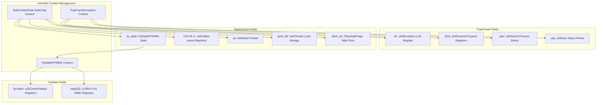
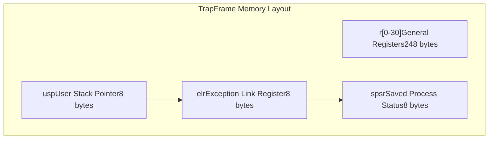
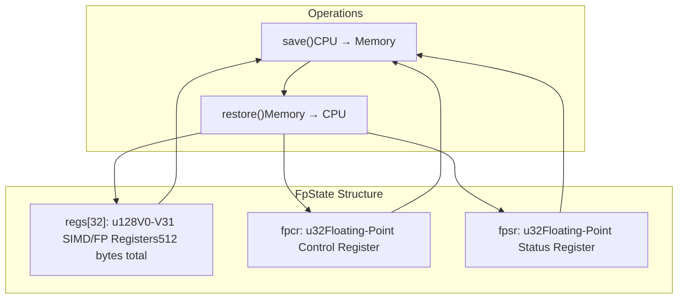
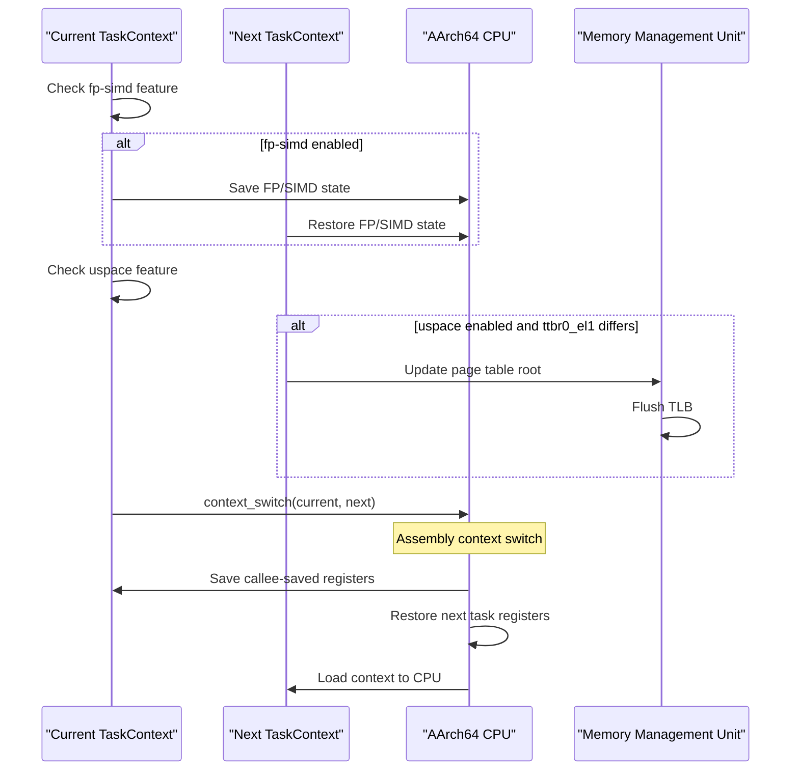
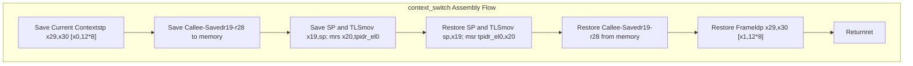
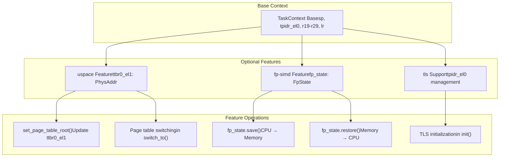
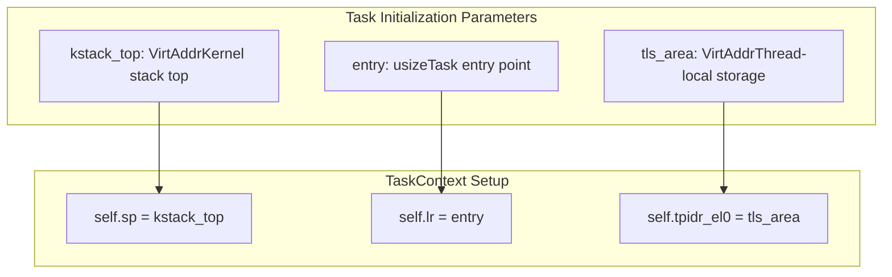

# AArch64 Context Management

> **Relevant source files**
> * [src/aarch64/context.rs](https://github.com/arceos-org/axcpu/blob/b93d8fa3/src/aarch64/context.rs)

This document covers CPU context management for the AArch64 architecture within the axcpu library. It details the data structures, mechanisms, and assembly implementations used for task switching, exception handling, and state preservation on ARM64 systems.

The scope includes the `TaskContext` structure for task switching, `TrapFrame` for exception handling, and `FpState` for floating-point operations. For information about how these contexts are used during exception processing, see [AArch64 Trap and Exception Handling](/arceos-org/axcpu/3.2-aarch64-trap-and-exception-handling). For system initialization and setup procedures, see [AArch64 System Initialization](/arceos-org/axcpu/3.3-aarch64-system-initialization).

## Context Data Structures

The AArch64 context management revolves around three primary data structures, each serving different aspects of CPU state management.

### Context Structure Overview

Sources: [src/aarch64/context.rs(L8 - L124)&emsp;](https://github.com/arceos-org/axcpu/blob/b93d8fa3/src/aarch64/context.rs#L8-L124)

### TaskContext Structure

The `TaskContext` structure maintains the minimal set of registers needed for task switching, focusing on callee-saved registers and system state.

|Field|Type|Purpose|
| --- | --- | --- |
|sp|u64|Stack pointer register|
|tpidr_el0|u64|Thread pointer for TLS|
|r19-r29|u64|Callee-saved general registers|
|lr|u64|Link register (r30)|
|ttbr0_el1|PhysAddr|User page table root (uspace feature)|
|fp_state|FpState|Floating-point state (fp-simd feature)|

The structure is conditionally compiled based on enabled features, with `ttbr0_el1` only included with the `uspace` feature and `fp_state` only with the `fp-simd` feature.

Sources: [src/aarch64/context.rs(L104 - L124)&emsp;](https://github.com/arceos-org/axcpu/blob/b93d8fa3/src/aarch64/context.rs#L104-L124)

### TrapFrame Structure

The `TrapFrame` captures the complete CPU state during exceptions and system calls, preserving all general-purpose registers and processor state.

The `TrapFrame` provides accessor methods for system call arguments through `arg0()` through `arg5()` methods, which map to registers `r[0]` through `r[5]` respectively.

Sources: [src/aarch64/context.rs(L8 - L63)&emsp;](https://github.com/arceos-org/axcpu/blob/b93d8fa3/src/aarch64/context.rs#L8-L63)

### FpState Structure

The `FpState` structure manages floating-point and SIMD register state, with 16-byte alignment required for proper SIMD operations.

Sources: [src/aarch64/context.rs(L66 - L88)&emsp;](https://github.com/arceos-org/axcpu/blob/b93d8fa3/src/aarch64/context.rs#L66-L88)

## Context Switching Mechanism

Task switching on AArch64 involves saving the current task's callee-saved registers and restoring the next task's context, with optional handling of floating-point state and page tables.

### Context Switch Flow

The `switch_to` method orchestrates the complete context switch:

1. **FP/SIMD State**: If `fp-simd` feature is enabled, saves current FP state and restores next task's FP state
2. **Page Table Switching**: If `uspace` feature is enabled and page tables differ, updates `ttbr0_el1` and flushes TLB
3. **Register Context**: Calls assembly `context_switch` function to handle callee-saved registers

Sources: [src/aarch64/context.rs(L160 - L172)&emsp;](https://github.com/arceos-org/axcpu/blob/b93d8fa3/src/aarch64/context.rs#L160-L172)

### Assembly Context Switch Implementation

The low-level context switching is implemented in naked assembly within the `context_switch` function:

The assembly implementation uses paired load/store instructions (`stp`/`ldp`) for efficiency, handling registers in pairs and preserving the AArch64 calling convention.

Sources: [src/aarch64/context.rs(L175 - L203)&emsp;](https://github.com/arceos-org/axcpu/blob/b93d8fa3/src/aarch64/context.rs#L175-L203)

## Feature-Conditional Context Management

The AArch64 context management includes several optional features that extend the base functionality.

### Feature Integration Overview

### User Space Support

When the `uspace` feature is enabled, `TaskContext` includes the `ttbr0_el1` field for managing user-space page tables. The `set_page_table_root` method allows updating the page table root, and context switching automatically handles page table updates and TLB flushes when switching between tasks with different address spaces.

### Floating-Point State Management

The `fp-simd` feature enables comprehensive floating-point and SIMD state management through the `FpState` structure. The assembly implementations `fpstate_save` and `fpstate_restore` handle all 32 vector registers (V0-V31) plus control registers using quad-word load/store instructions.

Sources: [src/aarch64/context.rs(L77 - L88)&emsp;](https://github.com/arceos-org/axcpu/blob/b93d8fa3/src/aarch64/context.rs#L77-L88) [src/aarch64/context.rs(L120 - L123)&emsp;](https://github.com/arceos-org/axcpu/blob/b93d8fa3/src/aarch64/context.rs#L120-L123) [src/aarch64/context.rs(L147 - L154)&emsp;](https://github.com/arceos-org/axcpu/blob/b93d8fa3/src/aarch64/context.rs#L147-L154) [src/aarch64/context.rs(L206 - L267)&emsp;](https://github.com/arceos-org/axcpu/blob/b93d8fa3/src/aarch64/context.rs#L206-L267)

## Task Initialization

New tasks are initialized through the `TaskContext::init` method, which sets up the minimal execution environment:

The initialization sets the stack pointer to the kernel stack top, the link register to the task entry point, and the thread pointer for thread-local storage support.

Sources: [src/aarch64/context.rs(L140 - L145)&emsp;](https://github.com/arceos-org/axcpu/blob/b93d8fa3/src/aarch64/context.rs#L140-L145)