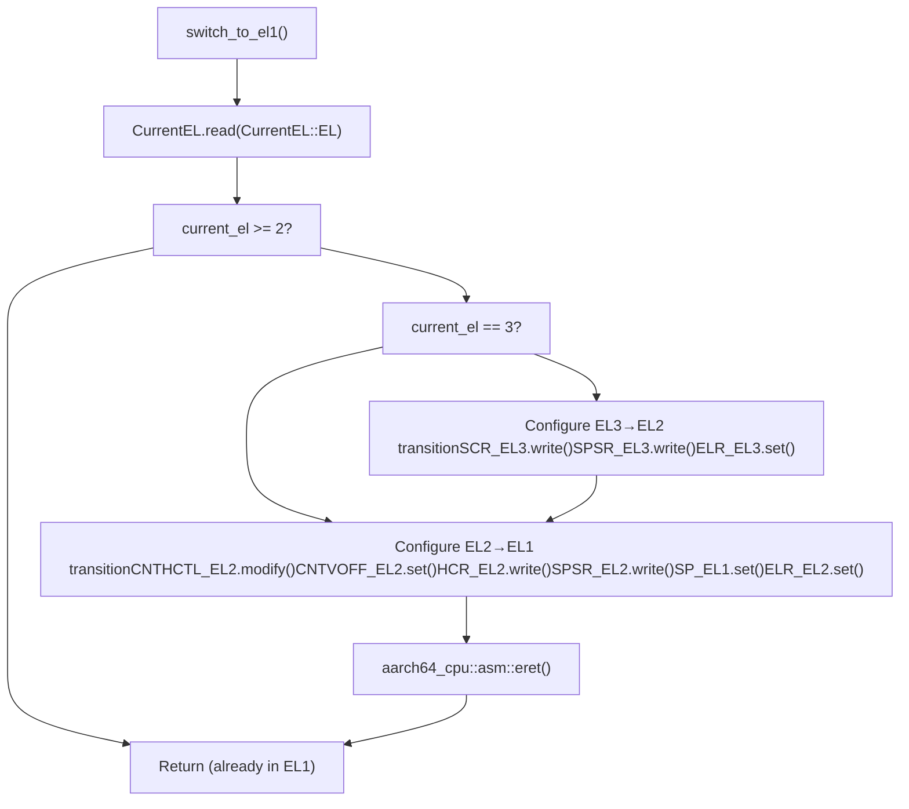
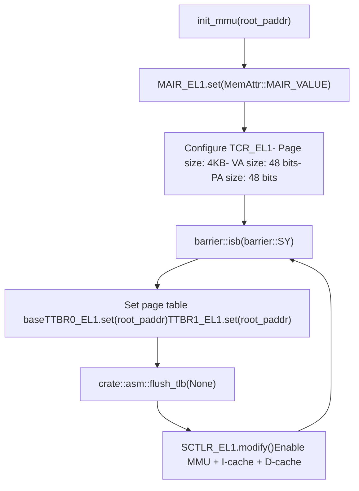
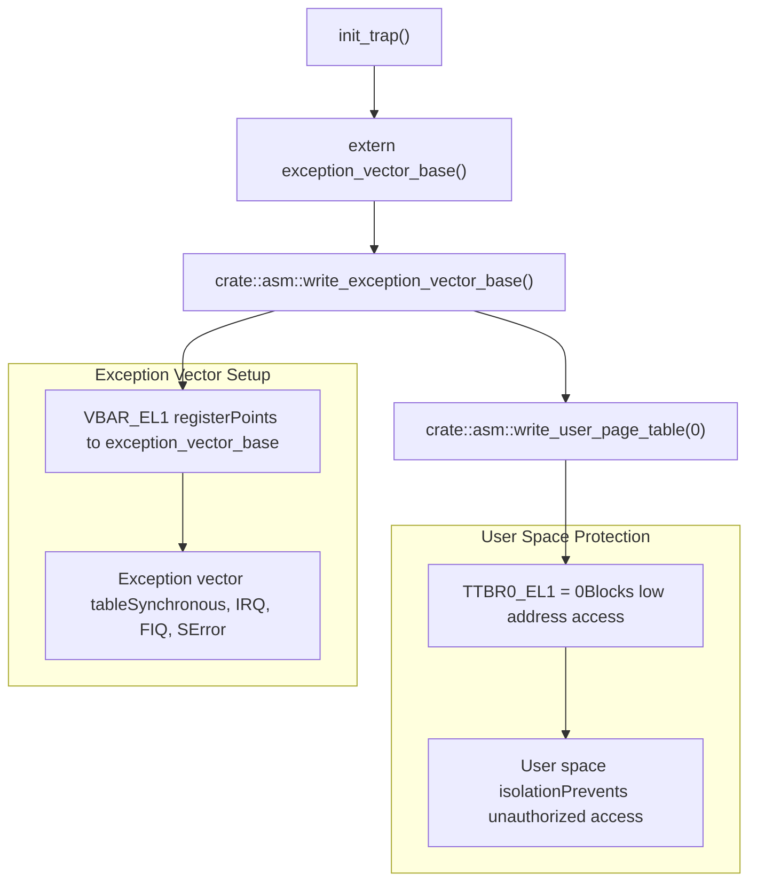
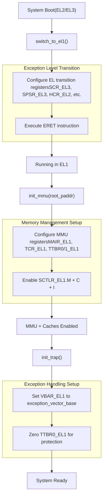

# AArch64 System Initialization

> **Relevant source files**
> * [src/aarch64/init.rs](https://github.com/arceos-org/axcpu/blob/b93d8fa3/src/aarch64/init.rs)

This document covers the AArch64 system initialization procedures provided by the axcpu library. The initialization process includes exception level transitions, Memory Management Unit (MMU) configuration, and trap handler setup. These functions are primarily used during system bootstrap to establish a proper execution environment at EL1.

For detailed information about AArch64 trap and exception handling mechanisms, see [AArch64 Trap and Exception Handling](/arceos-org/axcpu/3.2-aarch64-trap-and-exception-handling). For AArch64 context management including TaskContext and TrapFrame structures, see [AArch64 Context Management](/arceos-org/axcpu/3.1-aarch64-context-management).

## Exception Level Transition

AArch64 systems support multiple exception levels (EL0-EL3), with EL3 being the highest privilege level and EL0 being user space. The `switch_to_el1()` function handles the transition from higher exception levels (EL2 or EL3) down to EL1, which is the typical kernel execution level.

### Exception Level Transition Flow

Sources: [src/aarch64/init.rs(L15 - L52)&emsp;](https://github.com/arceos-org/axcpu/blob/b93d8fa3/src/aarch64/init.rs#L15-L52)

The transition process configures multiple system registers:

|Register|Purpose|Configuration|
| --- | --- | --- |
|SCR_EL3|Secure Configuration Register|Non-secure world, HVC enabled, AArch64|
|SPSR_EL3/EL2|Saved Program Status Register|EL1h mode, interrupts masked|
|ELR_EL3/EL2|Exception Link Register|Return address from LR|
|HCR_EL2|Hypervisor Configuration Register|EL1 in AArch64 mode|
|CNTHCTL_EL2|Counter-timer Hypervisor Control|Enable EL1 timer access|

## MMU Initialization

The Memory Management Unit initialization is handled by the `init_mmu()` function, which configures address translation and enables caching. This function sets up a dual page table configuration using both TTBR0_EL1 and TTBR1_EL1.

### MMU Configuration Sequence

Sources: [src/aarch64/init.rs(L54 - L95)&emsp;](https://github.com/arceos-org/axcpu/blob/b93d8fa3/src/aarch64/init.rs#L54-L95)

### Memory Attribute Configuration

The MMU initialization configures memory attributes through several system registers:

|Register|Configuration|Purpose|
| --- | --- | --- |
|MAIR_EL1|Memory attribute encoding|Defines memory types (Normal, Device, etc.)|
|TCR_EL1|Translation control|Page size, address ranges, cacheability|
|TTBR0_EL1|Translation table base 0|User space page table root|
|TTBR1_EL1|Translation table base 1|Kernel space page table root|
|SCTLR_EL1|System control|MMU enable, cache enable|

The function configures both translation table base registers to use the same physical address, enabling a unified address space configuration at initialization time.

## Trap Handler Initialization

The `init_trap()` function sets up the exception handling infrastructure by configuring the exception vector table base address and initializing user space memory protection.

### Trap Initialization Components

Sources: [src/aarch64/init.rs(L97 - L109)&emsp;](https://github.com/arceos-org/axcpu/blob/b93d8fa3/src/aarch64/init.rs#L97-L109)

The function performs two critical operations:

1. **Vector Base Setup**: Points `VBAR_EL1` to the `exception_vector_base` symbol, which contains the exception handlers
2. **User Space Protection**: Sets `TTBR0_EL1` to 0, effectively disabling user space address translation until a proper user page table is loaded

## System Initialization Sequence

The complete AArch64 system initialization follows a specific sequence to ensure proper system state transitions and hardware configuration.

### Complete Initialization Flow

Sources: [src/aarch64/init.rs(L1 - L110)&emsp;](https://github.com/arceos-org/axcpu/blob/b93d8fa3/src/aarch64/init.rs#L1-L110)

### Safety Considerations

All initialization functions are marked as `unsafe` due to their privileged operations:

* **`switch_to_el1()`**: Changes CPU execution mode and privilege level
* **`init_mmu()`**: Modifies address translation configuration, which can affect memory access behavior
* **Assembly operations**: Direct register manipulation and barrier instructions require careful sequencing

The initialization sequence must be performed in the correct order, as MMU configuration depends on being in the proper exception level, and trap handling setup assumes MMU functionality is available.