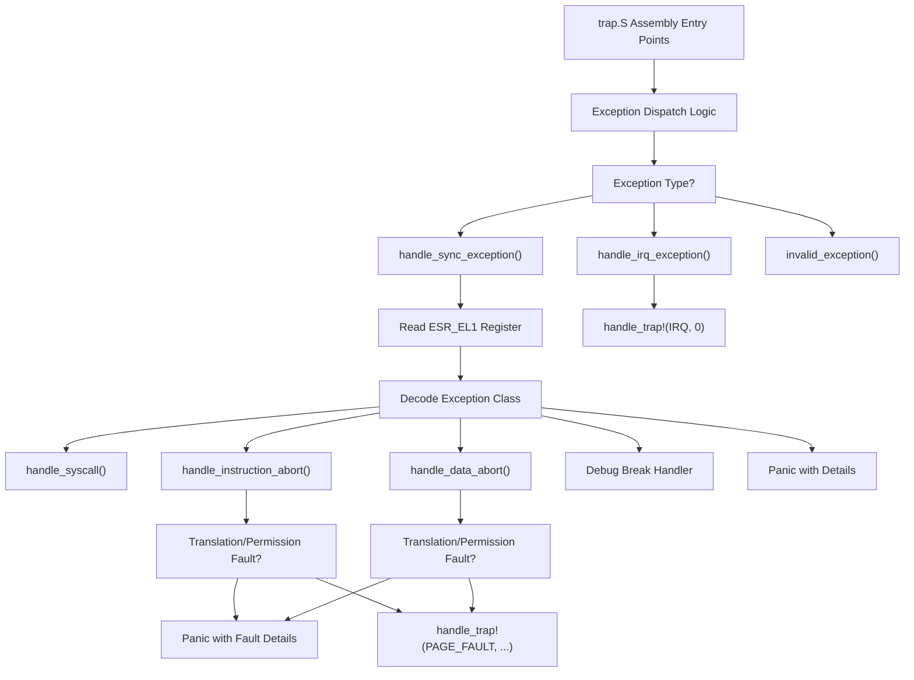
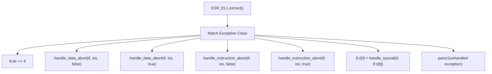
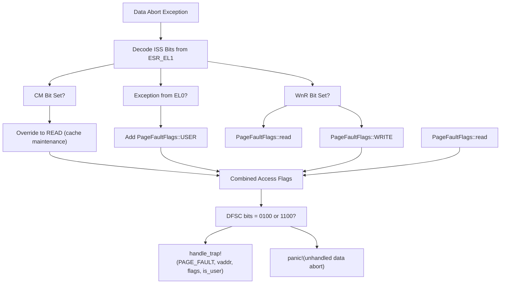

# AArch64 Trap and Exception Handling

> **Relevant source files**
> * [src/aarch64/trap.rs](https://github.com/arceos-org/axcpu/blob/b93d8fa3/src/aarch64/trap.rs)

This document covers the AArch64 (ARM64) trap and exception handling implementation in the axcpu library. It details the exception classification system, handler dispatch mechanism, and integration with the cross-architecture trap handling framework. For AArch64 context management including `TrapFrame` structure, see [AArch64 Context Management](/arceos-org/axcpu/3.1-aarch64-context-management). For system initialization and exception vector setup, see [AArch64 System Initialization](/arceos-org/axcpu/3.3-aarch64-system-initialization).

## Exception Classification System

The AArch64 trap handler uses a two-dimensional classification system to categorize exceptions based on their type and source context.

### Exception Types

The system defines four primary exception types in the `TrapKind` enumeration:

|Exception Type|Value|Description|
| --- | --- | --- |
|Synchronous|0|Synchronous exceptions requiring immediate handling|
|Irq|1|Standard interrupt requests|
|Fiq|2|Fast interrupt requests (higher priority)|
|SError|3|System error exceptions|

### Exception Sources

The `TrapSource` enumeration categorizes the execution context from which exceptions originate:

|Source Type|Value|Description|
| --- | --- | --- |
|CurrentSpEl0|0|Current stack pointer, Exception Level 0|
|CurrentSpElx|1|Current stack pointer, Exception Level 1+|
|LowerAArch64|2|Lower exception level, AArch64 state|
|LowerAArch32|3|Lower exception level, AArch32 state|

Sources: [src/aarch64/trap.rs(L9 - L27)&emsp;](https://github.com/arceos-org/axcpu/blob/b93d8fa3/src/aarch64/trap.rs#L9-L27)

## Exception Handler Architecture

### Exception Handler Dispatch Flow



Sources: [src/aarch64/trap.rs(L29 - L121)&emsp;](https://github.com/arceos-org/axcpu/blob/b93d8fa3/src/aarch64/trap.rs#L29-L121)

### Core Handler Functions

The trap handling system implements several specialized handler functions:

#### Synchronous Exception Handler

The `handle_sync_exception` function serves as the primary dispatcher for synchronous exceptions, using the ESR_EL1 register to determine the specific exception class:



Sources: [src/aarch64/trap.rs(L94 - L121)&emsp;](https://github.com/arceos-org/axcpu/blob/b93d8fa3/src/aarch64/trap.rs#L94-L121)

#### IRQ Exception Handler

The `handle_irq_exception` function provides a simple interface to the cross-architecture interrupt handling system through the `handle_trap!` macro:

Sources: [src/aarch64/trap.rs(L37 - L40)&emsp;](https://github.com/arceos-org/axcpu/blob/b93d8fa3/src/aarch64/trap.rs#L37-L40)

#### Invalid Exception Handler

The `invalid_exception` function handles unexpected exception types or sources by panicking with detailed context information including the `TrapFrame`, exception kind, and source classification:

Sources: [src/aarch64/trap.rs(L29 - L35)&emsp;](https://github.com/arceos-org/axcpu/blob/b93d8fa3/src/aarch64/trap.rs#L29-L35)

## Memory Fault Handling

The AArch64 implementation provides specialized handling for instruction and data aborts, which correspond to page faults in other architectures.

### Page Fault Classification

Both instruction and data aborts use a common pattern for classifying page faults:

|Fault Type|ISS Bits|Handled|Description|
| --- | --- | --- | --- |
|Translation Fault|0b0100|Yes|Missing page table entry|
|Permission Fault|0b1100|Yes|Access permission violation|
|Other Faults|Various|No|Unhandled fault types|

### Access Flag Generation

The system generates `PageFaultFlags` based on the fault characteristics:

#### Instruction Abort Flags

* Always includes `PageFaultFlags::EXECUTE`
* Adds `PageFaultFlags::USER` for EL0 (user) faults

#### Data Abort Flags

* Uses ESR_EL1 ISS WnR bit (Write not Read) to determine access type
* Considers CM bit (Cache Maintenance) to exclude cache operations from write classification
* Adds `PageFaultFlags::USER` for EL0 (user) faults



Sources: [src/aarch64/trap.rs(L42 - L92)&emsp;](https://github.com/arceos-org/axcpu/blob/b93d8fa3/src/aarch64/trap.rs#L42-L92)

## System Call Integration

When the `uspace` feature is enabled, the trap handler supports AArch64 system calls through the SVC (Supervisor Call) instruction.

### System Call Convention

* System call number: Passed in register `x8` (`tf.r[8]`)
* Return value: Stored in register `x0` (`tf.r[0]`)
* Handler: Delegates to cross-architecture `crate::trap::handle_syscall`

Sources: [src/aarch64/trap.rs(L99 - L102)&emsp;](https://github.com/arceos-org/axcpu/blob/b93d8fa3/src/aarch64/trap.rs#L99-L102)

## Integration with Cross-Architecture Framework

The AArch64 trap handler integrates with the broader axcpu trap handling framework through several mechanisms:

### Trap Handler Macros

The implementation uses the `handle_trap!` macro for consistent integration:

* `handle_trap!(IRQ, 0)` for interrupt processing
* `handle_trap!(PAGE_FAULT, vaddr, access_flags, is_user)` for memory faults

### Assembly Integration

The Rust handlers are called from assembly code included via:

```yaml
core::arch::global_asm!(include_str!("trap.S"));
```

### Register Access

The system uses the `aarch64_cpu` crate to access AArch64 system registers:

* `ESR_EL1`: Exception Syndrome Register for fault classification
* `FAR_EL1`: Fault Address Register for memory fault addresses

Sources: [src/aarch64/trap.rs(L1 - L7)&emsp;](https://github.com/arceos-org/axcpu/blob/b93d8fa3/src/aarch64/trap.rs#L1-L7)