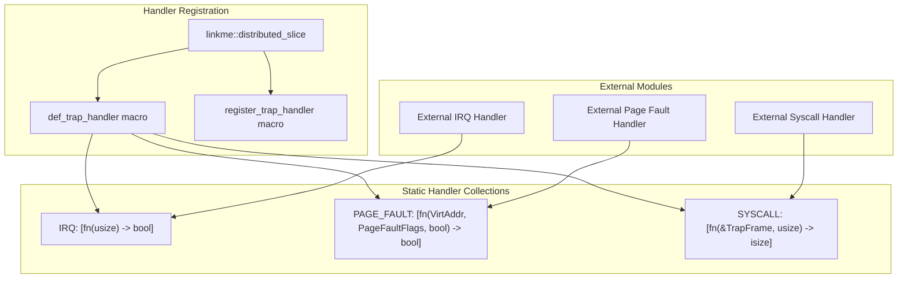
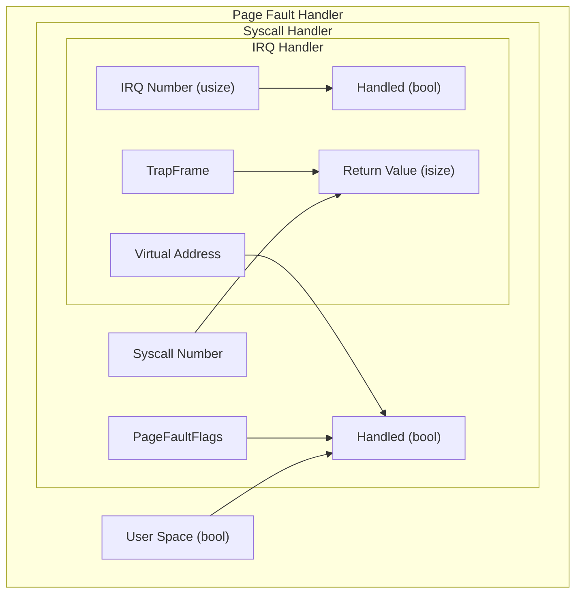
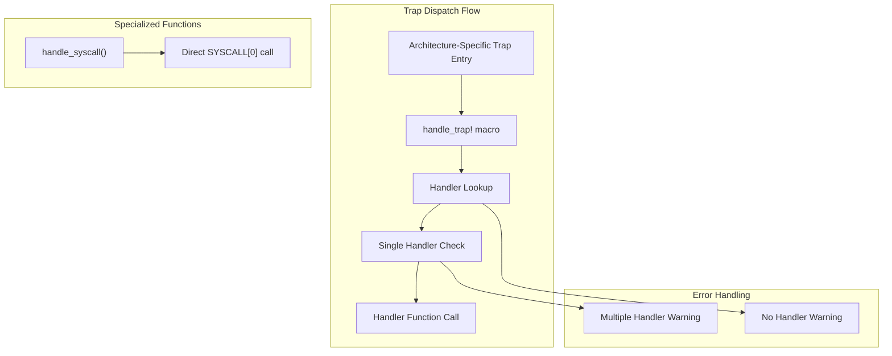
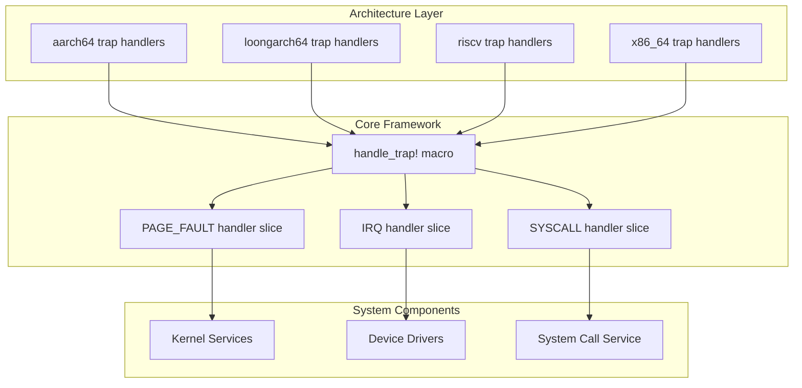

# Core Trap Handling Framework

> **Relevant source files**
> * [src/lib.rs](https://github.com/arceos-org/axcpu/blob/b93d8fa3/src/lib.rs)
> * [src/trap.rs](https://github.com/arceos-org/axcpu/blob/b93d8fa3/src/trap.rs)

## Purpose and Scope

The Core Trap Handling Framework provides a unified, cross-architecture mechanism for registering and dispatching trap handlers in axcpu. This framework enables external code to register handlers for interrupts, page faults, and system calls without needing to know architecture-specific details. The framework uses Rust's `linkme` crate to create distributed slices that collect handlers at link time.

For architecture-specific trap handling implementations, see [x86_64 Trap and Exception Handling](/arceos-org/axcpu/2.2-x86_64-trap-and-exception-handling), [AArch64 Trap and Exception Handling](/arceos-org/axcpu/3.2-aarch64-trap-and-exception-handling), [RISC-V Trap and Exception Handling](/arceos-org/axcpu/4.2-risc-v-trap-and-exception-handling), and related sections. For user space system call support, see [User Space Support](/arceos-org/axcpu/6.1-user-space-support).

## Handler Registration Mechanism

The framework uses `linkme::distributed_slice` to create static collections of handler functions that are populated at link time. This allows modules throughout the codebase to register handlers without requiring explicit registration calls.

### Handler Registration Architecture

Sources: [src/trap.rs(L6 - L7)&emsp;](https://github.com/arceos-org/axcpu/blob/b93d8fa3/src/trap.rs#L6-L7) [src/trap.rs(L11 - L22)&emsp;](https://github.com/arceos-org/axcpu/blob/b93d8fa3/src/trap.rs#L11-L22)

The framework exports two key macros:

* `def_trap_handler` - Used internally to define handler collections
* `register_trap_handler` - Used by external code to register handlers

## Trap Types and Handler Signatures

The framework defines three primary trap types, each with specific handler signatures optimized for their use cases.

|Trap Type|Handler Signature|Purpose|Feature Gate|
| --- | --- | --- | --- |
|IRQ|fn(usize) -> bool|Hardware interrupt handling|Always available|
|PAGE_FAULT|fn(VirtAddr, PageFaultFlags, bool) -> bool|Memory access violations|Always available|
|SYSCALL|fn(&TrapFrame, usize) -> isize|System call handling|uspacefeature|

### Trap Handler Details

Sources: [src/trap.rs(L12)&emsp;](https://github.com/arceos-org/axcpu/blob/b93d8fa3/src/trap.rs#L12-L12) [src/trap.rs(L16)&emsp;](https://github.com/arceos-org/axcpu/blob/b93d8fa3/src/trap.rs#L16-L16) [src/trap.rs(L22)&emsp;](https://github.com/arceos-org/axcpu/blob/b93d8fa3/src/trap.rs#L22-L22)

## Trap Dispatching Framework

The framework provides a unified dispatching mechanism through the `handle_trap` macro and specialized functions for different trap types.

### Dispatch Mechanism

Sources: [src/trap.rs(L25 - L38)&emsp;](https://github.com/arceos-org/axcpu/blob/b93d8fa3/src/trap.rs#L25-L38) [src/trap.rs(L42 - L44)&emsp;](https://github.com/arceos-org/axcpu/blob/b93d8fa3/src/trap.rs#L42-L44)

### Macro Implementation

The `handle_trap` macro provides a standardized way to dispatch to registered handlers:

* Retrieves the handler slice for the specified trap type
* Checks for exactly one registered handler
* Issues warnings for multiple or missing handlers
* Calls the handler with the provided arguments

### System Call Specialization

System calls receive special handling through the `handle_syscall` function, which directly calls the first (and expected only) syscall handler without the overhead of the generic dispatch mechanism.

Sources: [src/trap.rs(L41 - L44)&emsp;](https://github.com/arceos-org/axcpu/blob/b93d8fa3/src/trap.rs#L41-L44)

## Integration with Architecture-Specific Code

The Core Trap Handling Framework serves as the interface between architecture-specific trap entry points and higher-level system components.

### Architecture Integration Flow

Sources: [src/lib.rs(L12)&emsp;](https://github.com/arceos-org/axcpu/blob/b93d8fa3/src/lib.rs#L12-L12) [src/lib.rs(L15 - L27)&emsp;](https://github.com/arceos-org/axcpu/blob/b93d8fa3/src/lib.rs#L15-L27)

### Type System Integration

The framework integrates with core axcpu types:

* `TrapFrame` - Architecture-specific CPU state during traps
* `VirtAddr` - Virtual memory addresses from the `memory_addr` crate
* `PageFaultFlags` - Memory access flags from `page_table_entry` crate

This type integration ensures that handlers receive properly structured data regardless of the underlying architecture.

Sources: [src/trap.rs(L3)&emsp;](https://github.com/arceos-org/axcpu/blob/b93d8fa3/src/trap.rs#L3-L3) [src/trap.rs(L5)&emsp;](https://github.com/arceos-org/axcpu/blob/b93d8fa3/src/trap.rs#L5-L5) [src/trap.rs(L8)&emsp;](https://github.com/arceos-org/axcpu/blob/b93d8fa3/src/trap.rs#L8-L8)