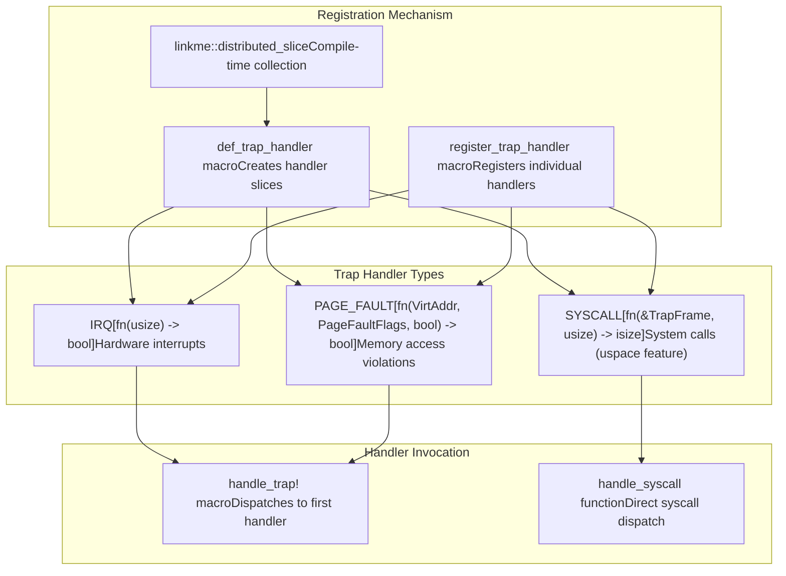
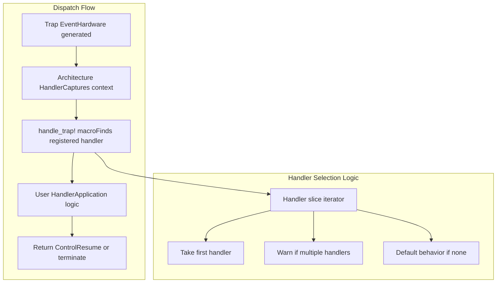
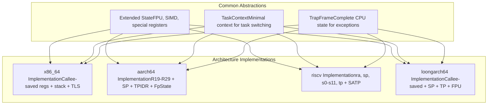
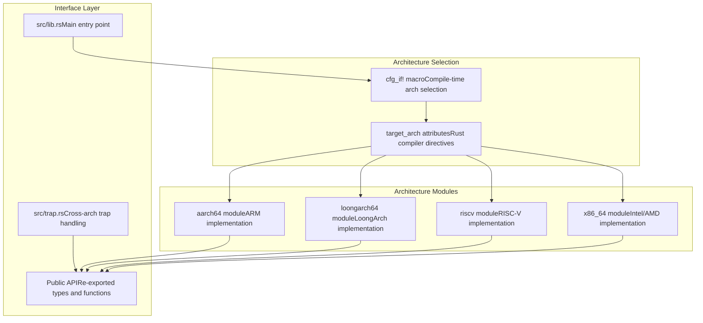
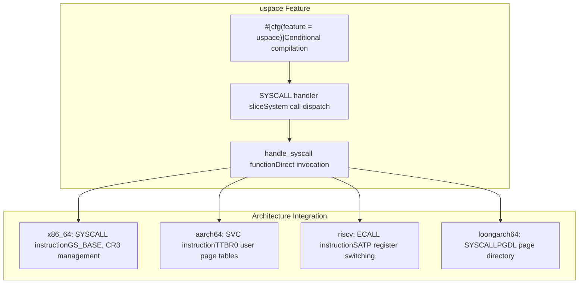
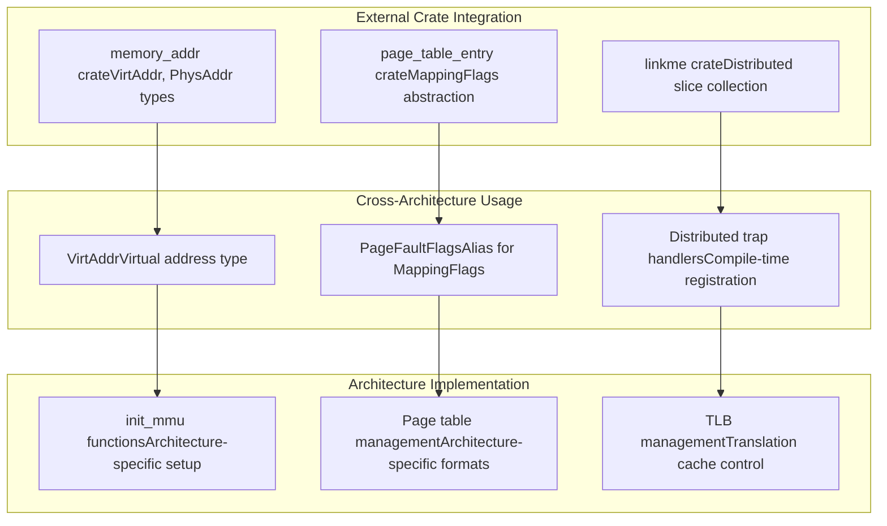
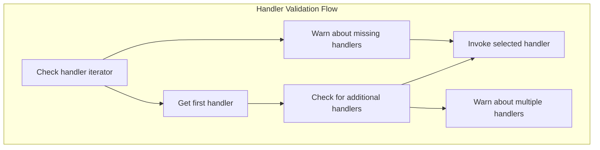

# Cross-Architecture Features

> **Relevant source files**
> * [src/lib.rs](https://github.com/arceos-org/axcpu/blob/b93d8fa3/src/lib.rs)
> * [src/trap.rs](https://github.com/arceos-org/axcpu/blob/b93d8fa3/src/trap.rs)

## Purpose and Scope

This document covers features and abstractions in the axcpu library that work uniformly across all supported architectures (x86_64, AArch64, RISC-V, and LoongArch64). These cross-architecture features provide unified interfaces and common functionality that abstract away architecture-specific implementation details.

For architecture-specific implementations, see the dedicated architecture pages: [x86_64 Architecture](/arceos-org/axcpu/2-x86_64-architecture), [AArch64 Architecture](/arceos-org/axcpu/3-aarch64-architecture), [RISC-V Architecture](/arceos-org/axcpu/4-risc-v-architecture), and [LoongArch64 Architecture](/arceos-org/axcpu/5-loongarch64-architecture). For user space specific functionality, see [User Space Support](/arceos-org/axcpu/6.1-user-space-support).

## Unified Trap Handling Framework

The axcpu library provides a distributed trap handling system that allows external code to register handlers for various types of traps and exceptions. This system works consistently across all supported architectures through the `linkme` crate's distributed slice mechanism.

### Trap Handler Registration

The core trap handling framework defines three types of distributed handler slices:

**Sources:** [src/trap.rs(L10 - L22)&emsp;](https://github.com/arceos-org/axcpu/blob/b93d8fa3/src/trap.rs#L10-L22) [src/trap.rs(L6 - L7)&emsp;](https://github.com/arceos-org/axcpu/blob/b93d8fa3/src/trap.rs#L6-L7)

### Handler Dispatch Mechanism

The trap handling system uses a macro-based dispatch mechanism that supports single-handler registration. When multiple handlers are registered for the same trap type, the system issues a warning and uses only the first handler.

**Sources:** [src/trap.rs(L25 - L38)&emsp;](https://github.com/arceos-org/axcpu/blob/b93d8fa3/src/trap.rs#L25-L38) [src/trap.rs(L42 - L44)&emsp;](https://github.com/arceos-org/axcpu/blob/b93d8fa3/src/trap.rs#L42-L44)

## Architecture-Agnostic Abstractions

The library provides common abstractions that are implemented differently by each architecture but present a unified interface to higher-level code.

### Core Data Structure Patterns

Each architecture implements the same core abstractions with architecture-specific layouts:

**Sources:** [src/lib.rs(L14 - L28)&emsp;](https://github.com/arceos-org/axcpu/blob/b93d8fa3/src/lib.rs#L14-L28) [src/trap.rs(L5)&emsp;](https://github.com/arceos-org/axcpu/blob/b93d8fa3/src/trap.rs#L5-L5)

### Common Interface Design

The library uses Rust's module system and conditional compilation to provide a unified interface while allowing architecture-specific implementations:

**Sources:** [src/lib.rs(L14 - L28)&emsp;](https://github.com/arceos-org/axcpu/blob/b93d8fa3/src/lib.rs#L14-L28)

## Feature-Based Conditional Compilation

The axcpu library uses Cargo features to enable optional functionality across all architectures. These features control the compilation of additional capabilities that may not be needed in all use cases.

### Feature Flag System

|Feature|Purpose|Availability|
| --- | --- | --- |
|uspace|User space support including system calls|All architectures|
|fp-simd|Floating point and SIMD register management|All architectures|
|tls|Thread-local storage support|All architectures|

### User Space Feature Integration

The `uspace` feature enables system call handling across all architectures:

**Sources:** [src/trap.rs(L19 - L22)&emsp;](https://github.com/arceos-org/axcpu/blob/b93d8fa3/src/trap.rs#L19-L22) [src/trap.rs(L41 - L44)&emsp;](https://github.com/arceos-org/axcpu/blob/b93d8fa3/src/trap.rs#L41-L44)

## Common Memory Management Abstractions

The library integrates with external crates to provide consistent memory management abstractions across architectures.

### External Dependencies Integration

**Sources:** [src/lib.rs(L9)&emsp;](https://github.com/arceos-org/axcpu/blob/b93d8fa3/src/lib.rs#L9-L9) [src/trap.rs(L3)&emsp;](https://github.com/arceos-org/axcpu/blob/b93d8fa3/src/trap.rs#L3-L3) [src/trap.rs(L8)&emsp;](https://github.com/arceos-org/axcpu/blob/b93d8fa3/src/trap.rs#L8-L8) [src/trap.rs(L6)&emsp;](https://github.com/arceos-org/axcpu/blob/b93d8fa3/src/trap.rs#L6-L6)

## Error Handling and Warnings

The cross-architecture framework includes built-in error handling and diagnostic capabilities that work consistently across all supported architectures.

### Handler Registration Validation

The trap handling system validates handler registration at runtime and provides warnings for common configuration issues:

The system issues specific warning messages for:

* Multiple handlers registered for the same trap type
* No handlers registered for a trap that occurs
* Feature mismatches between compile-time and runtime expectations

**Sources:** [src/trap.rs(L25 - L38)&emsp;](https://github.com/arceos-org/axcpu/blob/b93d8fa3/src/trap.rs#L25-L38)