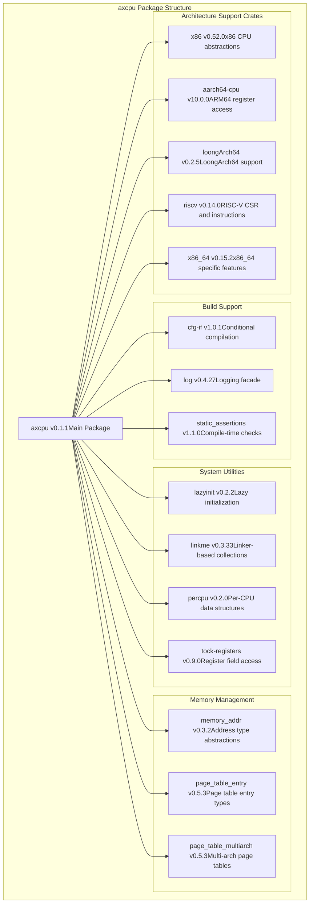
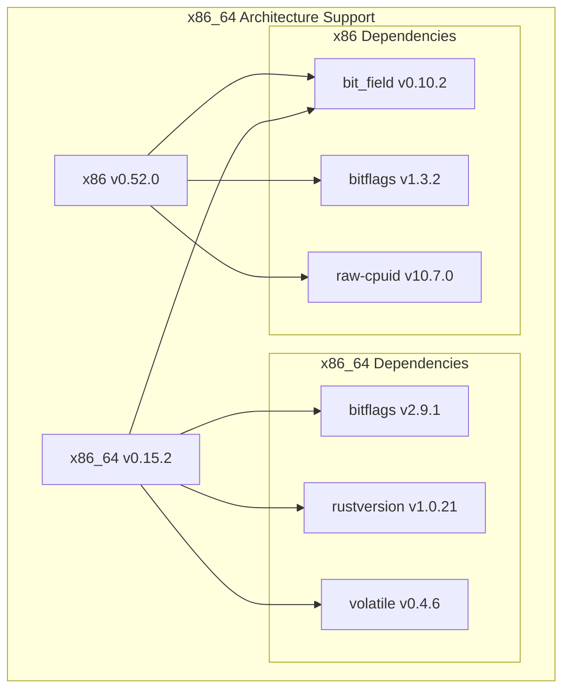
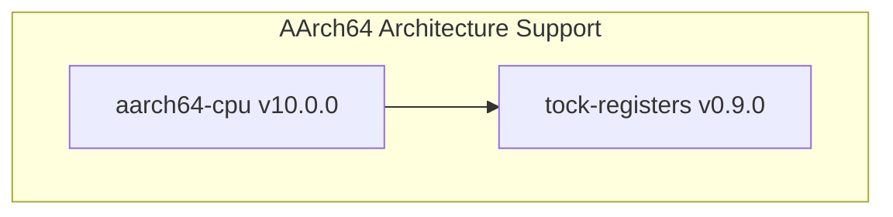
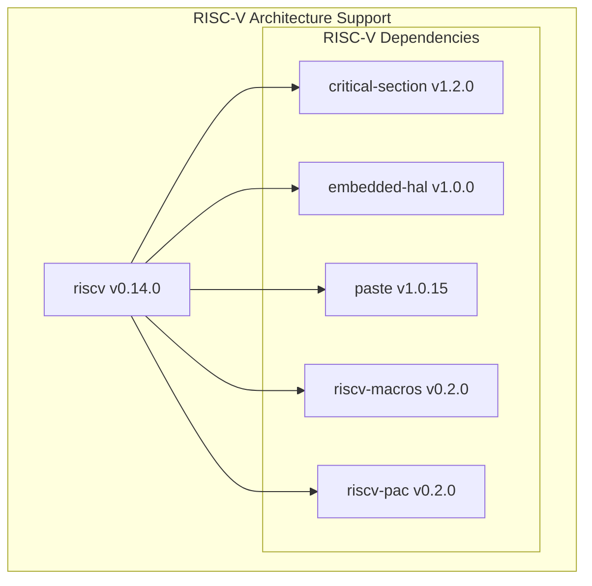
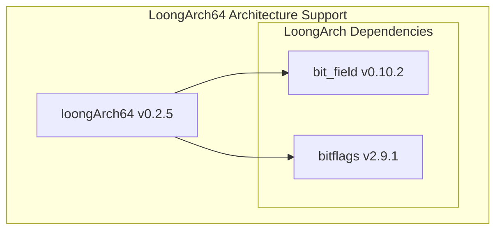
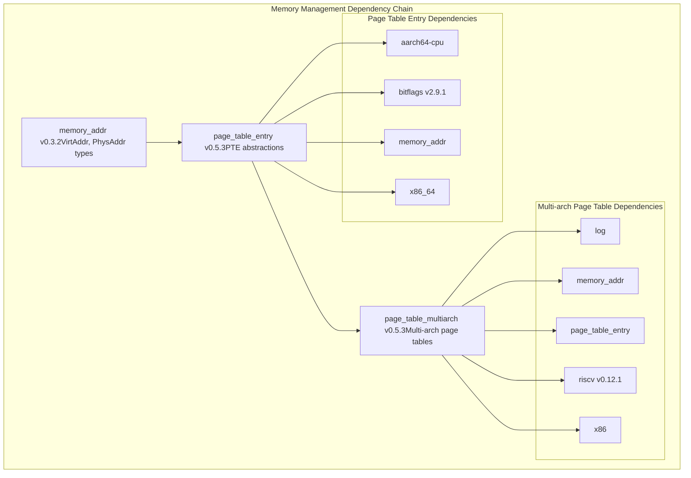
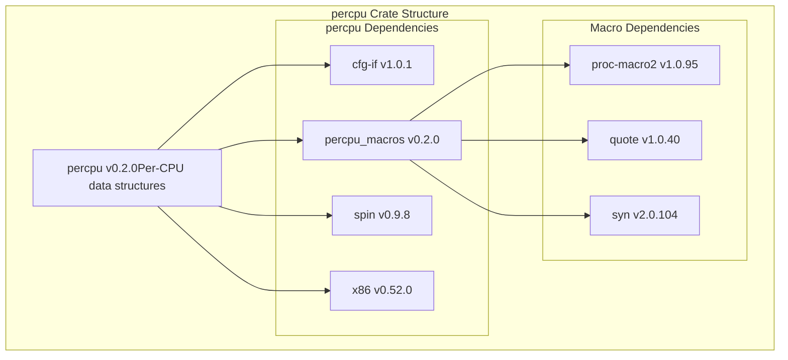

# Dependencies and Package Structure

> **Relevant source files**
> * [Cargo.lock](https://github.com/arceos-org/axcpu/blob/b93d8fa3/Cargo.lock)

This document explains the dependency structure and package organization of the axcpu library. It covers the external crates that provide architecture-specific functionality, common utilities, and abstractions used across all supported architectures. For detailed information about specific architecture implementations, see the individual architecture sections ([x86_64](/arceos-org/axcpu/2-x86_64-architecture), [AArch64](/arceos-org/axcpu/3-aarch64-architecture), [RISC-V](/arceos-org/axcpu/4-risc-v-architecture), [LoongArch64](/arceos-org/axcpu/5-loongarch64-architecture)).

## Core Package Structure

The axcpu crate is organized as a single package that provides multi-architecture CPU abstraction through conditional compilation and architecture-specific dependencies. The library selectively includes dependencies based on the target architecture being compiled for.

### Main Dependency Categories



Sources: [Cargo.lock(L21 - L39)&emsp;](https://github.com/arceos-org/axcpu/blob/b93d8fa3/Cargo.lock#L21-L39)

## Architecture-Specific Dependencies

Each supported architecture relies on specialized crates that provide low-level access to CPU features, registers, and instructions.

### x86/x86_64 Dependencies



|Crate|Purpose|Key Features|
| --- | --- | --- |
|x86|32-bit x86 support|CPU ID, MSR access, I/O port operations|
|x86_64|64-bit extensions|Page table management, 64-bit registers, VirtAddr/PhysAddr|
|raw-cpuid|CPU feature detection|CPUID instruction wrapper|
|volatile|Memory access control|Prevents compiler optimizations on memory operations|

Sources: [Cargo.lock(L315 - L335)&emsp;](https://github.com/arceos-org/axcpu/blob/b93d8fa3/Cargo.lock#L315-L335)

### AArch64 Dependencies



The `aarch64-cpu` crate provides register access patterns and system control for ARM64 processors, built on top of the `tock-registers` framework for type-safe register field manipulation.

Sources: [Cargo.lock(L6 - L12)&emsp;](https://github.com/arceos-org/axcpu/blob/b93d8fa3/Cargo.lock#L6-L12)

### RISC-V Dependencies



|Component|Purpose|
| --- | --- |
|riscv-macros|Procedural macros for CSR access|
|riscv-pac|Peripheral Access Crate for RISC-V|
|critical-section|Interrupt-safe critical sections|
|paste|Token pasting for macro generation|

Sources: [Cargo.lock(L229 - L239)&emsp;](https://github.com/arceos-org/axcpu/blob/b93d8fa3/Cargo.lock#L229-L239)

### LoongArch64 Dependencies



The LoongArch64 support uses bit manipulation utilities for register and instruction field access.

Sources: [Cargo.lock(L120 - L127)&emsp;](https://github.com/arceos-org/axcpu/blob/b93d8fa3/Cargo.lock#L120-L127)

## Memory Management Dependencies

The memory management subsystem relies on a set of interconnected crates that provide address abstractions and page table management across architectures.



Sources: [Cargo.lock(L130 - L158)&emsp;](https://github.com/arceos-org/axcpu/blob/b93d8fa3/Cargo.lock#L130-L158)

## System Utility Dependencies

### Per-CPU Data Management



The `percpu` crate provides architecture-aware per-CPU data structures with x86-specific optimizations for CPU-local storage access.

Sources: [Cargo.lock(L167 - L187)&emsp;](https://github.com/arceos-org/axcpu/blob/b93d8fa3/Cargo.lock#L167-L187)

### Linker-Based Collections

The `linkme` crate enables compile-time collection of distributed static data, used for registering trap handlers and other system components across architecture modules.

|Crate|Purpose|Dependencies|
| --- | --- | --- |
|linkme|Distributed static collections|linkme-impl|
|linkme-impl|Implementation macros|proc-macro2,quote,syn|

Sources: [Cargo.lock(L84 - L101)&emsp;](https://github.com/arceos-org/axcpu/blob/b93d8fa3/Cargo.lock#L84-L101)

## Conditional Compilation Structure

The axcpu library uses feature-based compilation to include only the dependencies and code paths relevant to the target architecture.

```

```

Sources: [Cargo.lock(L60 - L63)&emsp;](https://github.com/arceos-org/axcpu/blob/b93d8fa3/Cargo.lock#L60-L63)

## Build-Time Dependencies

### Static Assertions and Verification

The `static_assertions` crate provides compile-time verification of type sizes, alignment requirements, and other invariants critical for low-level CPU context management.

### Procedural Macro Infrastructure

|Macro Crate|Purpose|Used By|
| --- | --- | --- |
|proc-macro2|Procedural macro toolkit|linkme-impl,percpu_macros,riscv-macros|
|quote|Code generation helper|All macro implementations|
|syn|Rust syntax parsing|All macro implementations|

Sources: [Cargo.lock(L190 - L294)&emsp;](https://github.com/arceos-org/axcpu/blob/b93d8fa3/Cargo.lock#L190-L294)

## Version Constraints and Compatibility

The dependency graph maintains compatibility across architecture-specific crates through careful version selection:

* **Bitflags**: Uses both v1.3.2 (for x86) and v2.9.1 (for newer crates)
* **RISC-V**: Uses v0.14.0 for axcpu, v0.12.1 for page table compatibility
* **Register Access**: Standardized on `tock-registers` v0.9.0 for AArch64

This structure ensures that each architecture module can use the most appropriate version of its dependencies while maintaining overall system compatibility.

Sources: [Cargo.lock(L1 - L336)&emsp;](https://github.com/arceos-org/axcpu/blob/b93d8fa3/Cargo.lock#L1-L336)