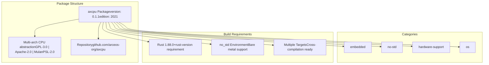
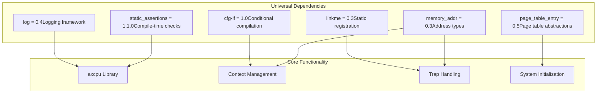
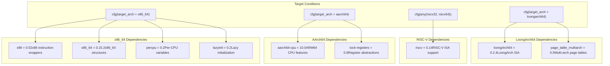
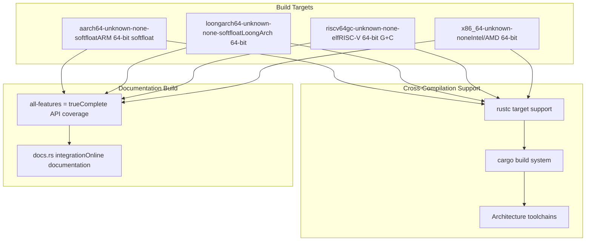
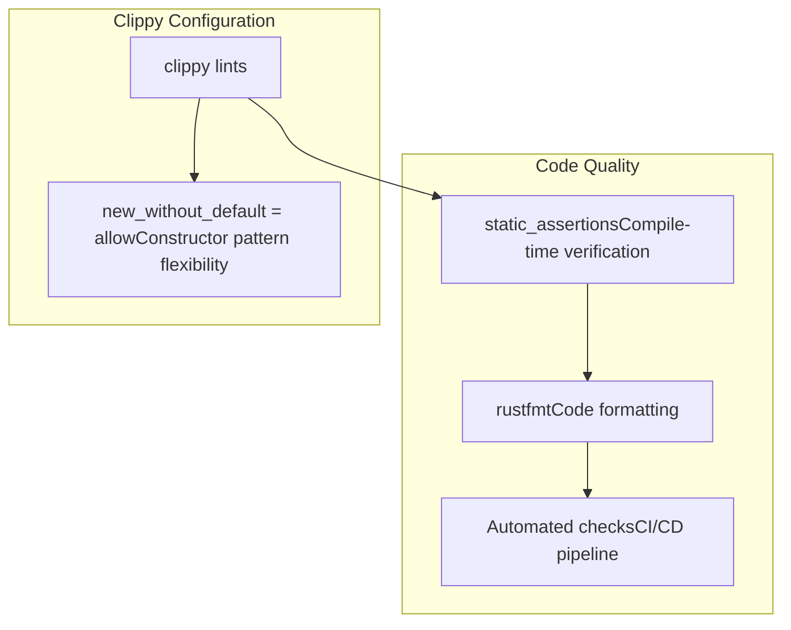

# Development and Build Configuration

> **Relevant source files**
> * [Cargo.toml](https://github.com/arceos-org/axcpu/blob/b93d8fa3/Cargo.toml)

This document covers the build system, dependency management, and development environment configuration for the axcpu library. It explains how to set up the development environment, configure build targets, and understand the feature-based compilation system.

For information about architecture-specific implementations, see the respective architecture pages ([x86_64](/arceos-org/axcpu/2-x86_64-architecture), [AArch64](/arceos-org/axcpu/3-aarch64-architecture), [RISC-V](/arceos-org/axcpu/4-risc-v-architecture), [LoongArch64](/arceos-org/axcpu/5-loongarch64-architecture)). For details about cross-architecture features and their runtime behavior, see [Cross-Architecture Features](/arceos-org/axcpu/6-cross-architecture-features).

## Build System Overview

The axcpu library uses Cargo as its build system with a sophisticated feature-based configuration that enables conditional compilation for different architectures and capabilities. The build system is designed to support both bare-metal (no_std) environments and multiple target architectures simultaneously.

### Package Configuration



The package configuration establishes axcpu as a foundational library in the embedded and OS development ecosystem, with specific version requirements and licensing terms.

Sources: [Cargo.toml(L1 - L21)&emsp;](https://github.com/arceos-org/axcpu/blob/b93d8fa3/Cargo.toml#L1-L21)

## Feature Flag System

The axcpu library uses a feature-based compilation system that allows selective inclusion of functionality based on target requirements and capabilities.

### Feature Flag Architecture

```mermaid
flowchart TD
subgraph subGraph2["Architecture Integration"]
    X86_FP["x86_64: FXSAVE/FXRSTORSSE/AVX support"]
    ARM_FP["aarch64: V-registersSIMD operations"]
    RISC_FP["riscv: Future FP supportExtension hooks"]
    LOONG_FP["loongarch64: F-registersFPU state management"]
    X86_TLS["x86_64: FS_BASESegment-based TLS"]
    ARM_TLS["aarch64: TPIDR_EL0Thread pointer register"]
    RISC_TLS["riscv: TP registerThread pointer"]
    LOONG_TLS["loongarch64: TP registerThread pointer"]
    X86_US["x86_64: CR3 + GS_BASESyscall interface"]
    ARM_US["aarch64: TTBR0EL0 support"]
    RISC_US["riscv: SATPSystem calls"]
    LOONG_US["loongarch64: PGDLSystem calls"]
end
subgraph subGraph1["Core Features"]
    DEFAULT["default = []Minimal feature set"]
    subgraph subGraph0["Optional Features"]
        FPSIMD["fp-simdFloating-point & SIMD"]
        TLS["tlsThread Local Storage"]
        USPACE["uspaceUser space support"]
    end
end

FPSIMD --> ARM_FP
FPSIMD --> LOONG_FP
FPSIMD --> RISC_FP
FPSIMD --> X86_FP
TLS --> ARM_TLS
TLS --> LOONG_TLS
TLS --> RISC_TLS
TLS --> X86_TLS
USPACE --> ARM_US
USPACE --> LOONG_US
USPACE --> RISC_US
USPACE --> X86_US
```



Each feature flag enables specific functionality across all supported architectures, with architecture-specific implementations handling the low-level details.

Sources: [Cargo.toml(L23 - L27)&emsp;](https://github.com/arceos-org/axcpu/blob/b93d8fa3/Cargo.toml#L23-L27)

## Dependency Management

The dependency structure is organized into common dependencies and architecture-specific dependencies that are conditionally included based on the target architecture.

### Common Dependencies



These dependencies provide foundational functionality used across all architectures, including memory management abstractions, logging, and compile-time utilities.

Sources: [Cargo.toml(L29 - L35)&emsp;](https://github.com/arceos-org/axcpu/blob/b93d8fa3/Cargo.toml#L29-L35)

### Architecture-Specific Dependencies



Each architecture includes specific dependencies that provide low-level access to architecture-specific features, instruction sets, and register management.

Sources: [Cargo.toml(L37 - L52)&emsp;](https://github.com/arceos-org/axcpu/blob/b93d8fa3/Cargo.toml#L37-L52)

## Target Architecture Configuration

The build system supports multiple target architectures with specific configurations for documentation and cross-compilation.

### Documentation Targets

The library is configured to build documentation for all supported target architectures:

|Target|Purpose|ABI|
| --- | --- | --- |
|x86_64-unknown-none|x86_64 bare metal|Hard float|
|aarch64-unknown-none-softfloat|ARM64 bare metal|Soft float|
|riscv64gc-unknown-none-elf|RISC-V 64-bit|General+Compressed|
|loongarch64-unknown-none-softfloat|LoongArch64 bare metal|Soft float|



Sources: [Cargo.toml(L57 - L59)&emsp;](https://github.com/arceos-org/axcpu/blob/b93d8fa3/Cargo.toml#L57-L59)

## Development Workflow

### Setting Up the Development Environment

1. **Rust Toolchain**: Ensure Rust 1.88.0 or later is installed
2. **Target Installation**: Install required target architectures using `rustup target add`
3. **Cross-Compilation Tools**: Install architecture-specific toolchains if needed
4. **Feature Testing**: Use `cargo build --features` to test specific feature combinations

### Build Commands

```markdown
# Build with all features
cargo build --all-features

# Build for specific architecture
cargo build --target x86_64-unknown-none

# Build with specific features
cargo build --features "fp-simd,tls,uspace"

# Generate documentation
cargo doc --all-features --open
```

### Linting Configuration

The project includes specific linting rules to maintain code quality:



Sources: [Cargo.toml(L54 - L55)&emsp;](https://github.com/arceos-org/axcpu/blob/b93d8fa3/Cargo.toml#L54-L55)

The development and build configuration ensures consistent behavior across all supported architectures while providing flexibility for different deployment scenarios and feature requirements.