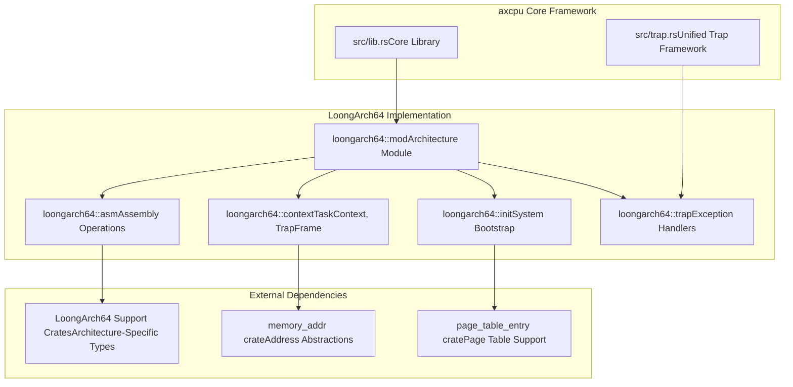

# LoongArch64 Architecture

> **Relevant source files**
> * [src/loongarch64/mod.rs](https://github.com/arceos-org/axcpu/blob/b93d8fa3/src/loongarch64/mod.rs)

## Purpose and Scope

This document covers the LoongArch64 architecture support within the axcpu multi-architecture CPU abstraction library. LoongArch64 is a RISC instruction set architecture developed by Loongson Technology, and this module provides comprehensive CPU context management, trap handling, and system initialization capabilities for LoongArch64-based systems.

For detailed information about specific aspects of LoongArch64 support, see [LoongArch64 Context Management](/arceos-org/axcpu/5.1-loongarch64-context-management), [LoongArch64 Assembly Operations](/arceos-org/axcpu/5.2-loongarch64-assembly-operations), and [LoongArch64 System Initialization](/arceos-org/axcpu/5.3-loongarch64-system-initialization). For comparative information about other supported architectures, see [x86_64 Architecture](/arceos-org/axcpu/2-x86_64-architecture), [AArch64 Architecture](/arceos-org/axcpu/3-aarch64-architecture), and [RISC-V Architecture](/arceos-org/axcpu/4-risc-v-architecture).

## LoongArch64 Module Organization

The LoongArch64 architecture support follows the standard axcpu architecture pattern, with a well-organized module structure that separates concerns between low-level assembly operations, context management, trap handling, and system initialization.

### Module Structure Overview

```

```

Sources: [src/loongarch64/mod.rs(L1 - L14)&emsp;](https://github.com/arceos-org/axcpu/blob/b93d8fa3/src/loongarch64/mod.rs#L1-L14)

### Core Data Structures

The LoongArch64 module exports four key data structures that form the foundation of CPU state management:

|Structure|Purpose|Module|
| --- | --- | --- |
|FpuState|Floating-point unit register state|context|
|GeneralRegisters|General-purpose register state|context|
|TaskContext|Minimal context for task switching|context|
|TrapFrame|Complete CPU state for exception handling|context|

These structures provide the necessary abstractions for context switching, exception handling, and floating-point state management specific to the LoongArch64 architecture.

Sources: [src/loongarch64/mod.rs(L13)&emsp;](https://github.com/arceos-org/axcpu/blob/b93d8fa3/src/loongarch64/mod.rs#L13-L13)

## LoongArch64 Feature Support

The LoongArch64 implementation supports both core functionality and optional features that enhance system capabilities.

### Feature Matrix

```

```

Sources: [src/loongarch64/mod.rs(L10 - L11)&emsp;](https://github.com/arceos-org/axcpu/blob/b93d8fa3/src/loongarch64/mod.rs#L10-L11)

## Architecture Integration

The LoongArch64 module integrates seamlessly with the broader axcpu framework, following established patterns while accommodating LoongArch64-specific requirements.

### Integration with axcpu Framework



Sources: [src/loongarch64/mod.rs(L1 - L14)&emsp;](https://github.com/arceos-org/axcpu/blob/b93d8fa3/src/loongarch64/mod.rs#L1-L14)

## LoongArch64-Specific Characteristics

LoongArch64 brings several unique characteristics to the axcpu framework that distinguish it from other supported architectures:

### Register Architecture

* **General Purpose Registers**: 32 general-purpose registers (R0-R31)
* **Floating Point Registers**: 32 floating-point registers (F0-F31)
* **Control Registers**: Including ERA (Exception Return Address), PRMD (Privilege Mode), and others
* **Thread Pointer**: TP register for thread-local storage support

### Memory Management

* **Page Table Structure**: Multi-level page tables with LoongArch64-specific layout
* **TLB Management**: Translation Lookaside Buffer with architecture-specific invalidation
* **MMU Configuration**: Memory Management Unit setup with LoongArch64 control registers

### Exception Handling

* **Exception Types**: Synchronous exceptions, interrupts, and system calls
* **Exception Levels**: Multiple privilege levels with controlled transitions
* **Vector Table**: LoongArch64-specific exception vector organization

The LoongArch64 implementation maintains compatibility with the unified axcpu interface while providing full access to architecture-specific features through specialized modules and assembly operations.

Sources: [src/loongarch64/mod.rs(L1 - L14)&emsp;](https://github.com/arceos-org/axcpu/blob/b93d8fa3/src/loongarch64/mod.rs#L1-L14)