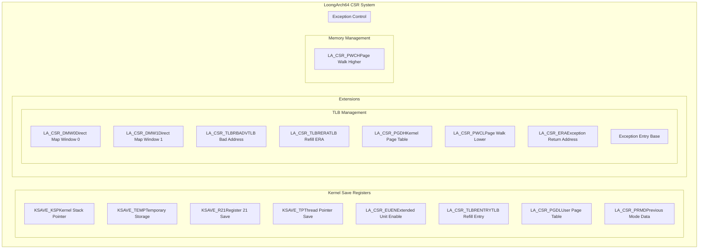
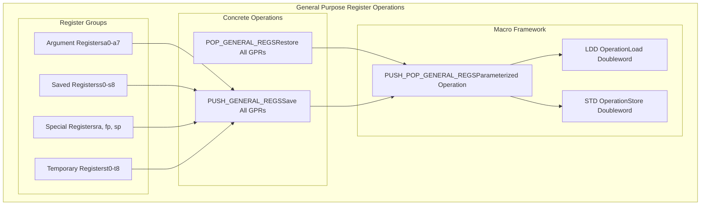
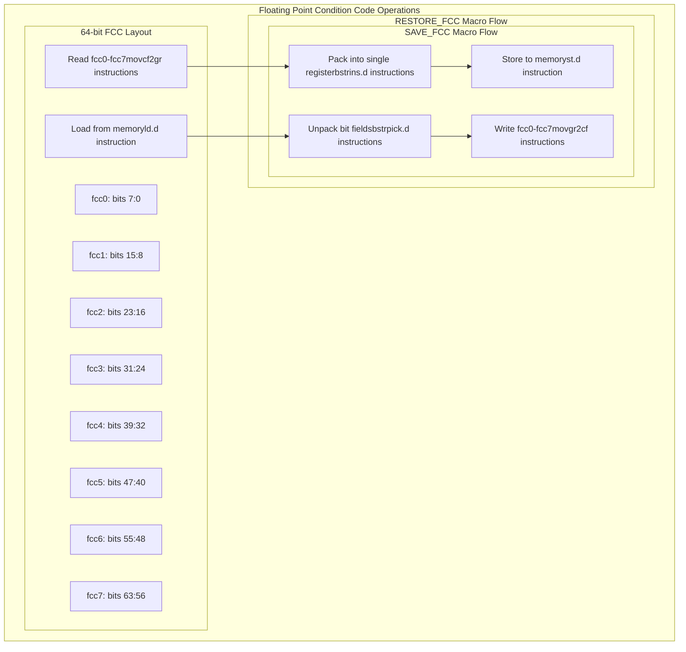
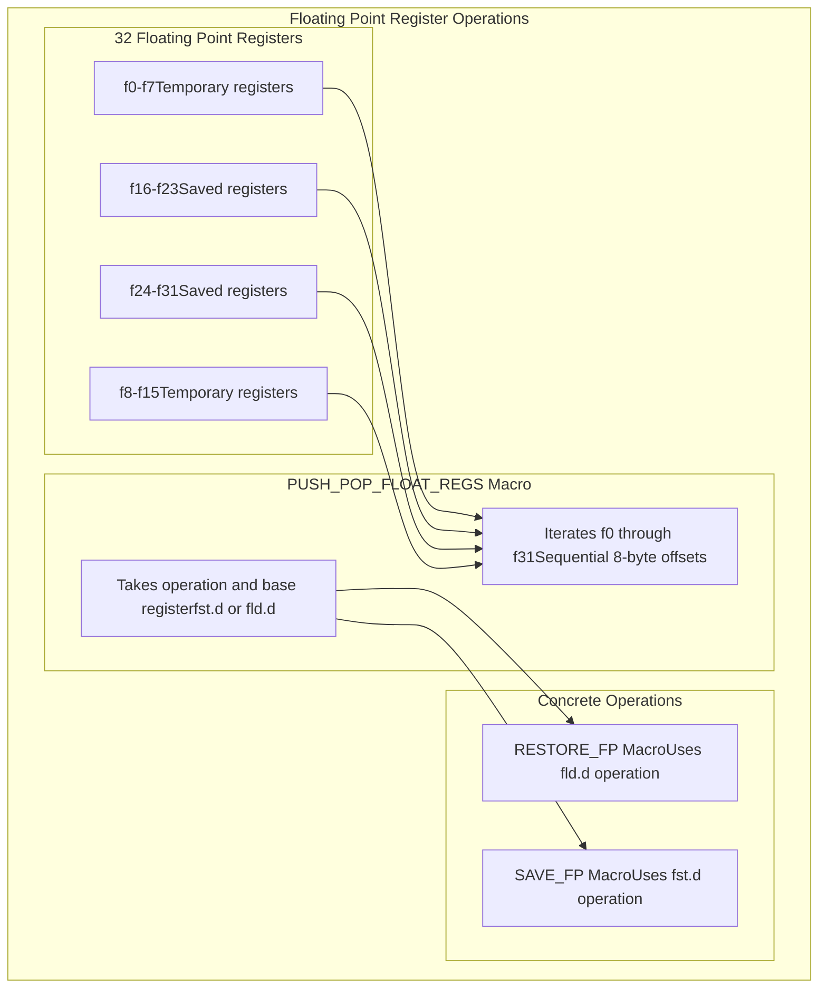
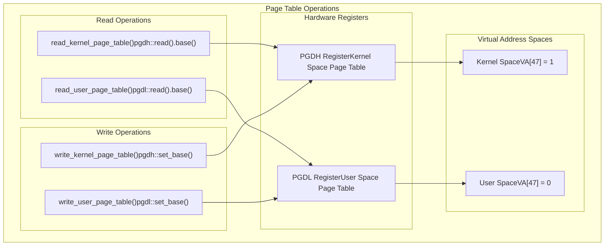
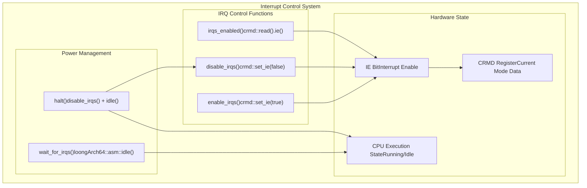

# LoongArch64 Assembly Operations

> **Relevant source files**
> * [src/aarch64/asm.rs](https://github.com/arceos-org/axcpu/blob/b93d8fa3/src/aarch64/asm.rs)
> * [src/loongarch64/asm.rs](https://github.com/arceos-org/axcpu/blob/b93d8fa3/src/loongarch64/asm.rs)
> * [src/loongarch64/macros.rs](https://github.com/arceos-org/axcpu/blob/b93d8fa3/src/loongarch64/macros.rs)

This document covers the low-level assembly operations and macros provided by the LoongArch64 architecture implementation in axcpu. It focuses on the assembly-level primitives used for CPU state management, register manipulation, and hardware control operations.

For information about LoongArch64 context structures and high-level context switching, see [LoongArch64 Context Management](/arceos-org/axcpu/5.1-loongarch64-context-management). For system initialization procedures, see [LoongArch64 System Initialization](/arceos-org/axcpu/5.3-loongarch64-system-initialization).

## Control and Status Register (CSR) Operations

The LoongArch64 implementation defines a comprehensive set of Control and Status Register (CSR) constants and operations. These registers control fundamental CPU behaviors including exception handling, memory management, and system configuration.

### CSR Definitions

The core CSR registers are defined as assembly constants for direct hardware access:

|Register|Value|Purpose|
| --- | --- | --- |
|LA_CSR_PRMD|0x1|Previous Mode Data - saves processor state|
|LA_CSR_EUEN|0x2|Extended Unit Enable - controls extensions|
|LA_CSR_ERA|0x6|Exception Return Address|
|LA_CSR_PGDL|0x19|Page table base when VA[47] = 0|
|LA_CSR_PGDH|0x1a|Page table base when VA[47] = 1|
|LA_CSR_PGD|0x1b|General page table base|
|LA_CSR_TLBRENTRY|0x88|TLB refill exception entry|
|LA_CSR_DMW0/DMW1|0x180/0x181|Direct Mapped Windows|

Sources: [src/loongarch64/macros.rs(L7 - L29)&emsp;](https://github.com/arceos-org/axcpu/blob/b93d8fa3/src/loongarch64/macros.rs#L7-L29)

### Register Access Macros

The implementation provides optimized macros for common register operations:

* `STD rd, rj, off` - Store doubleword with scaled offset
* `LDD rd, rj, off` - Load doubleword with scaled offset

These macros automatically scale the offset by 8 bytes for 64-bit operations, simplifying stack and structure access patterns.

Sources: [src/loongarch64/macros.rs(L31 - L36)&emsp;](https://github.com/arceos-org/axcpu/blob/b93d8fa3/src/loongarch64/macros.rs#L31-L36)

## General Purpose Register Operations

### Register Save/Restore Framework

The LoongArch64 implementation provides a systematic approach to saving and restoring general purpose registers using parameterized macros:

The `PUSH_POP_GENERAL_REGS` macro takes an operation parameter (`STD` for save, `LDD` for restore) and systematically processes all general purpose registers in a standardized order. This ensures consistent register handling across all context switching operations.

Sources: [src/loongarch64/macros.rs(L38 - L74)&emsp;](https://github.com/arceos-org/axcpu/blob/b93d8fa3/src/loongarch64/macros.rs#L38-L74)

### Register Layout and Ordering

The register save/restore operations follow the LoongArch64 ABI conventions:

|Offset|Register|Purpose|
| --- | --- | --- |
|1|$ra|Return address|
|4-11|$a0-$a7|Function arguments|
|12-20|$t0-$t8|Temporary registers|
|22|$fp|Frame pointer|
|23-31|$s0-$s8|Saved registers|

Sources: [src/loongarch64/macros.rs(L39 - L66)&emsp;](https://github.com/arceos-org/axcpu/blob/b93d8fa3/src/loongarch64/macros.rs#L39-L66)

## Floating Point Operations

When the `fp-simd` feature is enabled, the LoongArch64 implementation provides comprehensive floating point state management through specialized assembly macros.

### Floating Point Condition Code (FCC) Management

The FCC registers (`fcc0`-`fcc7`) store comparison results and require special handling due to their packed storage format:

The implementation uses bit manipulation instructions (`bstrins.d`, `bstrpick.d`) to efficiently pack and unpack the 8 condition code registers into a single 64-bit value for storage.

Sources: [src/loongarch64/macros.rs(L87 - L125)&emsp;](https://github.com/arceos-org/axcpu/blob/b93d8fa3/src/loongarch64/macros.rs#L87-L125)

### Floating Point Control and Status Register (FCSR)

The FCSR management is simpler than FCC handling since it's a single 32-bit register:

* `SAVE_FCSR` - Uses `movfcsr2gr` to read FCSR and `st.w` to store
* `RESTORE_FCSR` - Uses `ld.w` to load and `movgr2fcsr` to write back

Sources: [src/loongarch64/macros.rs(L127 - L135)&emsp;](https://github.com/arceos-org/axcpu/blob/b93d8fa3/src/loongarch64/macros.rs#L127-L135)

### Floating Point Register Operations

The floating point registers (`$f0`-`$f31`) are handled through a parameterized macro system similar to general purpose registers:

Sources: [src/loongarch64/macros.rs(L138 - L179)&emsp;](https://github.com/arceos-org/axcpu/blob/b93d8fa3/src/loongarch64/macros.rs#L138-L179)

## Memory Management Operations

The LoongArch64 architecture provides sophisticated memory management capabilities through dedicated wrapper functions that interact with hardware registers and TLB operations.

### Page Table Management

LoongArch64 uses separate page table base registers for user and kernel address spaces:

|Function|Register|Address Space|
| --- | --- | --- |
|read_user_page_table()|PGDL|VA[47] = 0 (user space)|
|read_kernel_page_table()|PGDH|VA[47] = 1 (kernel space)|
|write_user_page_table()|PGDL|User space page table root|
|write_kernel_page_table()|PGDH|Kernel space page table root|

Sources: [src/loongarch64/asm.rs(L41 - L79)&emsp;](https://github.com/arceos-org/axcpu/blob/b93d8fa3/src/loongarch64/asm.rs#L41-L79)

### TLB Management

The Translation Lookaside Buffer (TLB) management uses the `invtlb` instruction with specific operation codes:

* `invtlb 0x00` - Clear all TLB entries (full flush)
* `invtlb 0x05` - Clear specific VA with ASID=0 (single page flush)

The implementation includes proper memory barriers (`dbar 0`) to ensure ordering of memory operations around TLB invalidation.

Sources: [src/loongarch64/asm.rs(L81 - L111)&emsp;](https://github.com/arceos-org/axcpu/blob/b93d8fa3/src/loongarch64/asm.rs#L81-L111)

### Page Walk Controller Configuration

The `write_pwc()` function configures the hardware page walker through the PWCL and PWCH registers, which control page table traversal parameters for lower and upper address spaces respectively.

Sources: [src/loongarch64/asm.rs(L130 - L150)&emsp;](https://github.com/arceos-org/axcpu/blob/b93d8fa3/src/loongarch64/asm.rs#L130-L150)

## Exception and Interrupt Handling

### Interrupt Control

The LoongArch64 interrupt system is controlled through the Current Mode register (CRMD):

|Function|Operation|Hardware Effect|
| --- | --- | --- |
|enable_irqs()|crmd::set_ie(true)|Sets IE bit in CRMD|
|disable_irqs()|crmd::set_ie(false)|Clears IE bit in CRMD|
|irqs_enabled()|crmd::read().ie()|Reads IE bit status|

Sources: [src/loongarch64/asm.rs(L8 - L39)&emsp;](https://github.com/arceos-org/axcpu/blob/b93d8fa3/src/loongarch64/asm.rs#L8-L39)

### Exception Entry Configuration

The `write_exception_entry_base()` function configures the exception handling entry point by setting both the Exception Entry Base Address register (EENTRY) and the Exception Configuration register (ECFG):

* Sets `ECFG.VS = 0` for unified exception entry
* Sets `EENTRY` to the provided exception handler address

Sources: [src/loongarch64/asm.rs(L113 - L128)&emsp;](https://github.com/arceos-org/axcpu/blob/b93d8fa3/src/loongarch64/asm.rs#L113-L128)

## Thread Local Storage Support

LoongArch64 implements Thread Local Storage (TLS) through the thread pointer register (`$tp`):

* `read_thread_pointer()` - Reads current `$tp` value using `move` instruction
* `write_thread_pointer()` - Updates `$tp` register for TLS base address

The implementation also provides kernel stack pointer management through a custom CSR (`KSAVE_KSP`) when the `uspace` feature is enabled, supporting user-space context switching.

Sources: [src/loongarch64/asm.rs(L152 - L199)&emsp;](https://github.com/arceos-org/axcpu/blob/b93d8fa3/src/loongarch64/asm.rs#L152-L199)

## Extension Support

### Floating Point Extensions

The LoongArch64 implementation supports multiple floating point and SIMD extensions:

* `enable_fp()` - Enables floating-point instructions by setting `EUEN.FPE`
* `enable_lsx()` - Enables LSX (LoongArch SIMD eXtension) by setting `EUEN.SXE`

These functions control the Extended Unit Enable register (EUEN) to selectively enable hardware extensions based on system requirements.

Sources: [src/loongarch64/asm.rs(L174 - L187)&emsp;](https://github.com/arceos-org/axcpu/blob/b93d8fa3/src/loongarch64/asm.rs#L174-L187)