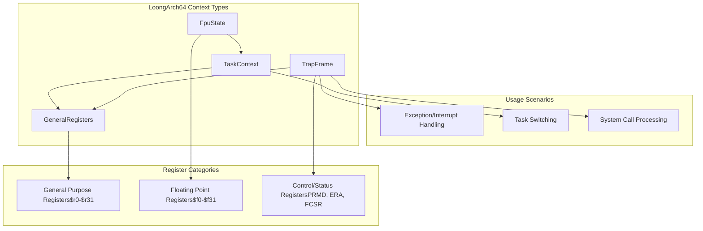
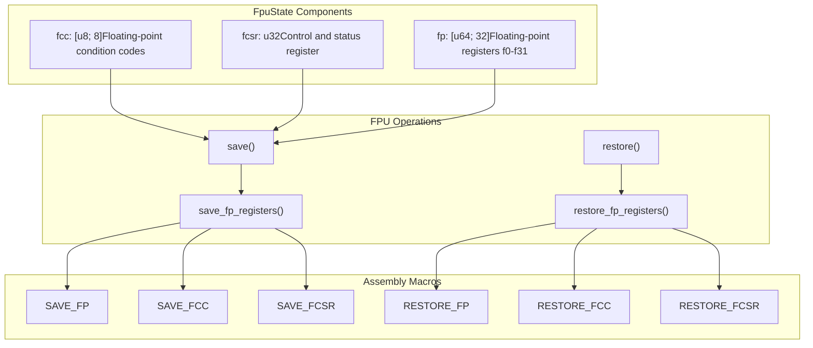
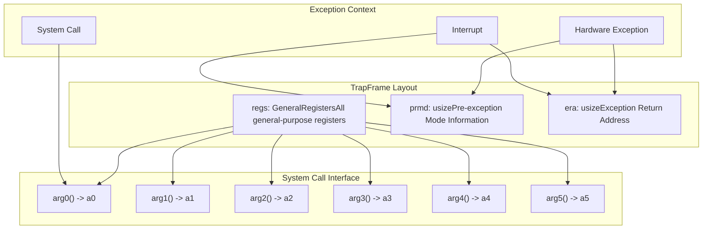

# LoongArch64 Context Management

> **Relevant source files**
> * [src/loongarch64/context.rs](https://github.com/arceos-org/axcpu/blob/b93d8fa3/src/loongarch64/context.rs)

This document covers the CPU context management system for the LoongArch64 architecture within the axcpu library. It details the data structures and mechanisms used to save, restore, and switch between different execution contexts including general-purpose registers, floating-point state, and task switching contexts.

For LoongArch64 assembly operations and low-level register manipulation, see [LoongArch64 Assembly Operations](/arceos-org/axcpu/5.2-loongarch64-assembly-operations). For system initialization including MMU and TLB setup, see [LoongArch64 System Initialization](/arceos-org/axcpu/5.3-loongarch64-system-initialization).

## Context Management Overview

The LoongArch64 context management system provides three primary context types, each serving different purposes in the execution lifecycle:



**Sources:** [src/loongarch64/context.rs(L6 - L43)&emsp;](https://github.com/arceos-org/axcpu/blob/b93d8fa3/src/loongarch64/context.rs#L6-L43) [src/loongarch64/context.rs(L72 - L82)&emsp;](https://github.com/arceos-org/axcpu/blob/b93d8fa3/src/loongarch64/context.rs#L72-L82) [src/loongarch64/context.rs(L116 - L145)&emsp;](https://github.com/arceos-org/axcpu/blob/b93d8fa3/src/loongarch64/context.rs#L116-L145)

## General Register Management

The `GeneralRegisters` structure captures all LoongArch64 general-purpose registers following the architecture's register naming convention:

|Register Category|Registers|Purpose|
| --- | --- | --- |
|Zero Register|zero($r0)|Always contains zero|
|Return Address|ra($r1)|Function return address|
|Stack/Thread|sp($r3),tp($r2)|Stack pointer, thread pointer|
|Arguments|a0-a7($r4-$r11)|Function arguments and return values|
|Temporaries|t0-t8($r12-$r20)|Temporary registers|
|Saved|s0-s8($r23-$r31)|Callee-saved registers|
|Frame Pointer|fp($r22)|Frame pointer|
|Reserved|u0($r21)|Reserved for user applications|

The register layout in `GeneralRegisters` matches the LoongArch64 ABI specification, ensuring compatibility with compiler-generated code and system call conventions.

**Sources:** [src/loongarch64/context.rs(L6 - L43)&emsp;](https://github.com/arceos-org/axcpu/blob/b93d8fa3/src/loongarch64/context.rs#L6-L43)

## Floating-Point State Management

### FpuState Structure

The `FpuState` structure manages LoongArch64 floating-point context:



### FPU State Operations

The floating-point state management is conditional on the `fp-simd` feature flag. When enabled, the `FpuState` structure provides `save()` and `restore()` methods that delegate to assembly routines for efficient register transfers.

The assembly implementations use offset calculations to access structure fields directly, ensuring optimal performance during context switches.

**Sources:** [src/loongarch64/context.rs(L45 - L70)&emsp;](https://github.com/arceos-org/axcpu/blob/b93d8fa3/src/loongarch64/context.rs#L45-L70) [src/loongarch64/context.rs(L197 - L229)&emsp;](https://github.com/arceos-org/axcpu/blob/b93d8fa3/src/loongarch64/context.rs#L197-L229)

## Trap Frame Context

### TrapFrame Structure

The `TrapFrame` captures the complete CPU state when exceptions, interrupts, or system calls occur:



### System Call Argument Access

The `TrapFrame` provides convenience methods for accessing system call arguments through registers `a0` through `a5`. These methods cast the register values appropriately for syscall parameter passing conventions.

**Sources:** [src/loongarch64/context.rs(L72 - L114)&emsp;](https://github.com/arceos-org/axcpu/blob/b93d8fa3/src/loongarch64/context.rs#L72-L114)

## Task Context and Switching

### TaskContext Structure

The `TaskContext` represents the minimal state required for task switching:

|Field|Type|Purpose|Feature Flag|
| --- | --- | --- | --- |
|ra|usize|Return address|Always|
|sp|usize|Stack pointer|Always|
|s|[usize; 10]|Saved registers $r22-$r31|Always|
|tp|usize|Thread pointer|Always|
|pgdl|usize|Page table root|uspace|
|fpu|FpuState|FPU state|fp-simd|

### Context Switch Implementation

The task switching process involves multiple phases coordinated between Rust and assembly code:

```

```

### Context Switch Assembly Implementation

The low-level context switch uses the `STD` and `LDD` assembly macros to efficiently save and restore the minimal register set required for task switching. The assembly routine saves callee-saved registers from the current context and restores them for the next context.

**Sources:** [src/loongarch64/context.rs(L116 - L195)&emsp;](https://github.com/arceos-org/axcpu/blob/b93d8fa3/src/loongarch64/context.rs#L116-L195) [src/loongarch64/context.rs(L231 - L266)&emsp;](https://github.com/arceos-org/axcpu/blob/b93d8fa3/src/loongarch64/context.rs#L231-L266)

## Feature-Conditional Context Management

The LoongArch64 context management system supports several optional features that extend the basic context switching capabilities:

### Thread-Local Storage Support

When the `tls` feature is enabled, the context switch saves and restores the thread pointer (`tp`) register, enabling proper thread-local storage functionality across task switches.

### User Space Support

The `uspace` feature adds user page table management to task contexts. During context switches, the system checks if the page table root (`pgdl`) has changed and updates the hardware page table register accordingly, followed by a TLB flush.

### Floating-Point SIMD Support

With the `fp-simd` feature, the task context includes complete FPU state management. During context switches, the current task's FPU state is saved and the next task's FPU state is restored, ensuring floating-point computations remain isolated between tasks.

**Sources:** [src/loongarch64/context.rs(L175 - L194)&emsp;](https://github.com/arceos-org/axcpu/blob/b93d8fa3/src/loongarch64/context.rs#L175-L194)