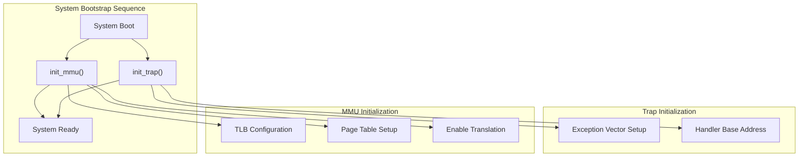
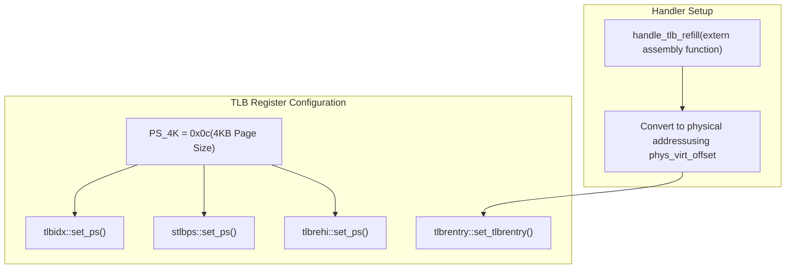
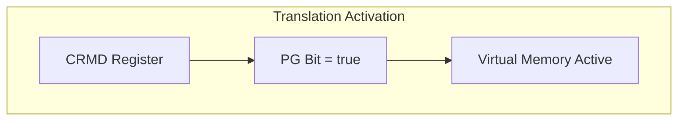
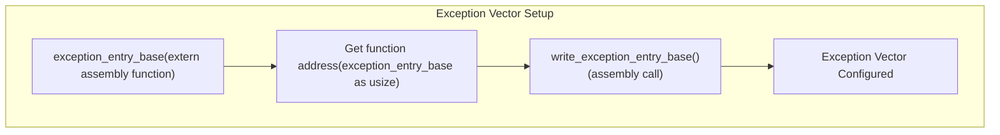

# LoongArch64 System Initialization

> **Relevant source files**
> * [src/loongarch64/init.rs](https://github.com/arceos-org/axcpu/blob/b93d8fa3/src/loongarch64/init.rs)

This document covers the LoongArch64 system initialization routines in the axcpu library, focusing on the bootstrapping procedures for CPU state, memory management unit (MMU), and trap handling. The initialization process establishes the fundamental hardware configurations required for the CPU to operate in the kernel environment.

This page specifically covers system-level hardware initialization. For LoongArch64 CPU context management and task switching, see [LoongArch64 Context Management](/arceos-org/axcpu/5.1-loongarch64-context-management). For low-level assembly operations and register manipulation, see [LoongArch64 Assembly Operations](/arceos-org/axcpu/5.2-loongarch64-assembly-operations).

## Initialization Overview

The LoongArch64 system initialization process consists of two primary components: MMU/TLB configuration and trap handling setup. These initialization routines are implemented in the `init_mmu` and `init_trap` functions, which must be called during system bootstrap to establish a properly configured execution environment.

**Sources:** [src/loongarch64/init.rs(L1 - L49)&emsp;](https://github.com/arceos-org/axcpu/blob/b93d8fa3/src/loongarch64/init.rs#L1-L49)

## MMU and TLB Initialization

The `init_mmu` function performs comprehensive memory management unit initialization, configuring the Translation Lookaside Buffer (TLB), page table walking parameters, and enabling virtual memory translation.

### TLB Configuration Process

The MMU initialization begins with TLB configuration, setting consistent 4KB page sizes across multiple TLB-related registers and establishing the TLB refill exception handler address.

**Sources:** [src/loongarch64/init.rs(L19 - L25)&emsp;](https://github.com/arceos-org/axcpu/blob/b93d8fa3/src/loongarch64/init.rs#L19-L25)

### Page Table Walking Configuration

Following TLB setup, the function configures page table walking parameters and establishes both kernel and user page table root addresses.

|Configuration Step|Function Call|Purpose|
| --- | --- | --- |
|PWC Registers|write_pwc(PWCL_VALUE, PWCH_VALUE)|Set page walking control values|
|Kernel Page Table|write_kernel_page_table(root_paddr)|Configure kernel space translation|
|User Page Table|write_user_page_table(pa!(0))|Initialize user space (initially zero)|
|TLB Flush|flush_tlb(None)|Clear existing TLB entries|

**Sources:** [src/loongarch64/init.rs(L28 - L33)&emsp;](https://github.com/arceos-org/axcpu/blob/b93d8fa3/src/loongarch64/init.rs#L28-L33)

### Translation Mode Activation

The final step enables mapped address translation mode through the Current Mode (`CRMD`) register, activating virtual memory management.

**Sources:** [src/loongarch64/init.rs(L35 - L36)&emsp;](https://github.com/arceos-org/axcpu/blob/b93d8fa3/src/loongarch64/init.rs#L35-L36)

## Trap and Exception Initialization

The `init_trap` function establishes the exception handling infrastructure by configuring the exception vector base address, which serves as the entry point for all hardware exceptions and interrupts.

### Exception Vector Configuration

The trap initialization process involves setting up the base address for exception handling routines, linking the hardware exception mechanism to the software handlers.

**Sources:** [src/loongarch64/init.rs(L42 - L48)&emsp;](https://github.com/arceos-org/axcpu/blob/b93d8fa3/src/loongarch64/init.rs#L42-L48)

## Assembly Integration Points

Both initialization functions rely heavily on external assembly routines and low-level register operations that interface directly with LoongArch64 hardware.

### External Assembly Functions

|Function|Purpose|Used By|
| --- | --- | --- |
|handle_tlb_refill|TLB refill exception handler|init_mmu|
|exception_entry_base|Exception vector entry point|init_trap|

### Assembly Module Integration

The initialization routines call several functions from the `crate::asm` module:

* `write_pwc()` - Configure page walking control registers
* `write_kernel_page_table()` - Set kernel page table root
* `write_user_page_table()` - Set user page table root
* `flush_tlb()` - Invalidate TLB entries
* `write_exception_entry_base()` - Set exception vector base

**Sources:** [src/loongarch64/init.rs(L29 - L47)&emsp;](https://github.com/arceos-org/axcpu/blob/b93d8fa3/src/loongarch64/init.rs#L29-L47)

## Register and Hardware References

The initialization code directly manipulates several LoongArch64-specific control registers through the `loongArch64::register` module:

* **CRMD** - Current Mode register for translation control
* **STLBPS** - Shared TLB Page Size register
* **TLBIDX** - TLB Index register
* **TLBREHI** - TLB Refill Entry High register
* **TLBRENTRY** - TLB Refill Exception Entry Base Address register

These registers are documented in the LoongArch Architecture Reference Manual, with specific links provided in the source code comments.

**Sources:** [src/loongarch64/init.rs(L3 - L13)&emsp;](https://github.com/arceos-org/axcpu/blob/b93d8fa3/src/loongarch64/init.rs#L3-L13)