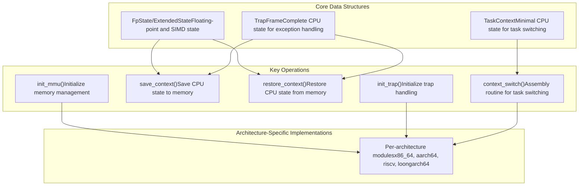
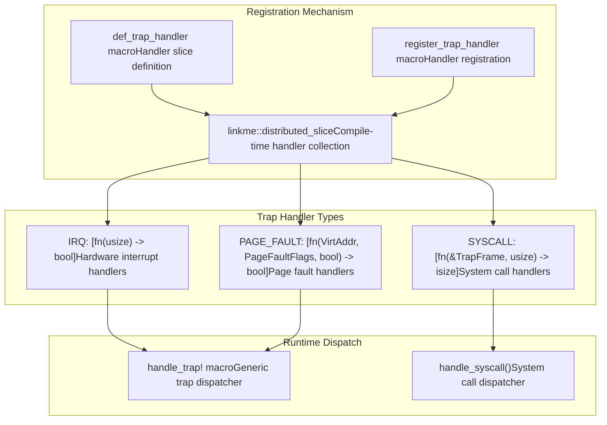

# Overview

> **Relevant source files**
> * [Cargo.toml](https://github.com/arceos-org/axcpu/blob/b93d8fa3/Cargo.toml)
> * [src/lib.rs](https://github.com/arceos-org/axcpu/blob/b93d8fa3/src/lib.rs)
> * [src/trap.rs](https://github.com/arceos-org/axcpu/blob/b93d8fa3/src/trap.rs)

The `axcpu` repository provides a unified, multi-architecture CPU abstraction library that enables privileged instruction execution and low-level CPU state management across different processor architectures. This library serves as a hardware abstraction layer (HAL) for the ArceOS operating system project, offering consistent interfaces for CPU context switching, trap handling, memory management, and system initialization.

This document covers the overall architecture and capabilities of the `axcpu` library. For detailed information about specific architectures, see [x86_64 Architecture](/arceos-org/axcpu/2-x86_64-architecture), [AArch64 Architecture](/arceos-org/axcpu/3-aarch64-architecture), [RISC-V Architecture](/arceos-org/axcpu/4-risc-v-architecture), and [LoongArch64 Architecture](/arceos-org/axcpu/5-loongarch64-architecture). For cross-architecture features and abstractions, see [Cross-Architecture Features](/arceos-org/axcpu/6-cross-architecture-features).

## Library Architecture

The `axcpu` library implements a modular architecture that provides consistent abstractions across four supported CPU architectures through conditional compilation and feature flags.

### Architecture Selection and Module Structure

```

```

Sources: [src/lib.rs(L14 - L28)&emsp;](https://github.com/arceos-org/axcpu/blob/b93d8fa3/src/lib.rs#L14-L28) [Cargo.toml(L37 - L52)&emsp;](https://github.com/arceos-org/axcpu/blob/b93d8fa3/Cargo.toml#L37-L52)

### Core Abstractions and Data Structures

The library provides several key abstractions that are implemented consistently across all supported architectures:



Sources: Architecture-specific context.rs files, init.rs files across all architectures

## Feature Flags and Conditional Compilation

The library uses Cargo features to enable optional functionality and reduce code size when certain capabilities are not needed:

|Feature|Description|Affected Components|
| --- | --- | --- |
|fp-simd|Floating-point and SIMD state management|FpState,ExtendedStatestructures|
|tls|Thread-local storage support|Thread pointer management inTaskContext|
|uspace|User space support|System call handling, user/kernel context switching|

Sources: [Cargo.toml(L23 - L27)&emsp;](https://github.com/arceos-org/axcpu/blob/b93d8fa3/Cargo.toml#L23-L27)

### Architecture-Specific Dependencies

Each architecture requires specific external crates for low-level operations:

```

```

Sources: [Cargo.toml(L29 - L52)&emsp;](https://github.com/arceos-org/axcpu/blob/b93d8fa3/Cargo.toml#L29-L52)

## Trap Handling Framework

The library implements a unified trap handling system using distributed slices that allows external code to register handlers for different types of CPU exceptions and interrupts.

### Trap Handler Registration



Sources: [src/trap.rs(L10 - L22)&emsp;](https://github.com/arceos-org/axcpu/blob/b93d8fa3/src/trap.rs#L10-L22) [src/trap.rs(L25 - L44)&emsp;](https://github.com/arceos-org/axcpu/blob/b93d8fa3/src/trap.rs#L25-L44)

## Integration with ArceOS Ecosystem

The `axcpu` library is designed as a foundational component of the ArceOS operating system, providing the low-level CPU abstractions needed by higher-level OS components:

* **Memory Management**: Integrates with `memory_addr` and `page_table_entry` crates for address translation and page table management
* **Architecture Support**: Provides consistent interfaces that higher-level ArceOS components can use without architecture-specific code
* **Modular Design**: Uses feature flags to enable only needed functionality, supporting both full OS and embedded use cases
* **No-std Compatible**: Designed for bare-metal and kernel environments without standard library dependencies

Sources: [Cargo.toml(L14)&emsp;](https://github.com/arceos-org/axcpu/blob/b93d8fa3/Cargo.toml#L14-L14) [Cargo.toml(L19 - L20)&emsp;](https://github.com/arceos-org/axcpu/blob/b93d8fa3/Cargo.toml#L19-L20) [src/lib.rs(L1)&emsp;](https://github.com/arceos-org/axcpu/blob/b93d8fa3/src/lib.rs#L1-L1)

## Documentation and Target Platforms

The library supports multiple target platforms and provides comprehensive documentation:

* **Documented Targets**: `x86_64-unknown-none`, `aarch64-unknown-none-softfloat`, `riscv64gc-unknown-none-elf`, `loongarch64-unknown-none-softfloat`
* **Documentation**: Available at docs.rs with all features enabled for complete API coverage
* **License**: Triple-licensed under GPL-3.0-or-later, Apache-2.0, and MulanPSL-2.0

Sources: [Cargo.toml(L57 - L59)&emsp;](https://github.com/arceos-org/axcpu/blob/b93d8fa3/Cargo.toml#L57-L59) [Cargo.toml(L15)&emsp;](https://github.com/arceos-org/axcpu/blob/b93d8fa3/Cargo.toml#L15-L15) [Cargo.toml(L18)&emsp;](https://github.com/arceos-org/axcpu/blob/b93d8fa3/Cargo.toml#L18-L18)