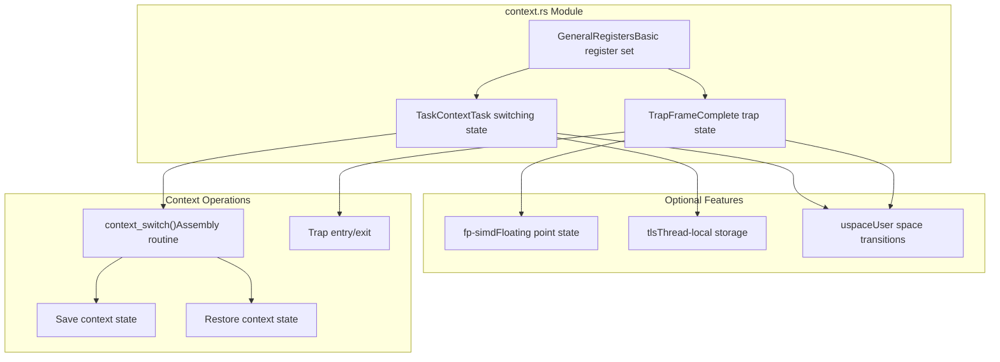
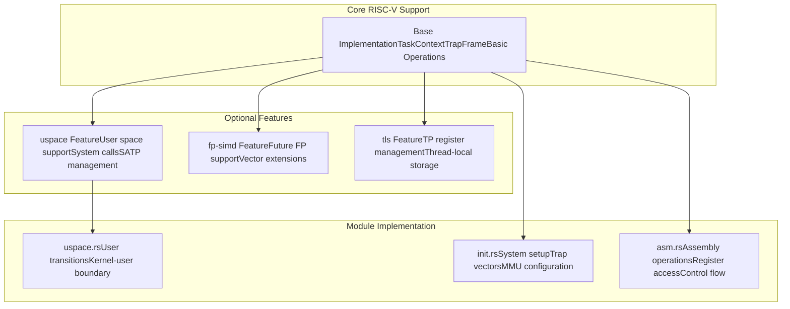

# RISC-V Architecture

> **Relevant source files**
> * [src/riscv/mod.rs](https://github.com/arceos-org/axcpu/blob/b93d8fa3/src/riscv/mod.rs)

## Purpose and Scope

This document covers the RISC-V architecture support within the axcpu library, focusing on the module organization, key data structures, and integration patterns specific to RISC-V processors. The RISC-V implementation follows the common multi-architecture abstraction pattern established by axcpu, providing CPU context management, trap handling, and system initialization capabilities.

For detailed coverage of RISC-V context management operations, see [RISC-V Context Management](/arceos-org/axcpu/4.1-risc-v-context-management). For RISC-V trap and exception handling mechanisms, see [RISC-V Trap and Exception Handling](/arceos-org/axcpu/4.2-risc-v-trap-and-exception-handling). For RISC-V system initialization procedures, see [RISC-V System Initialization](/arceos-org/axcpu/4.3-risc-v-system-initialization).

## Module Organization

The RISC-V architecture support is organized under the `src/riscv/` directory, following the standard architecture module pattern used throughout axcpu. The main module file orchestrates the various components and provides the public API.

#### RISC-V Module Structure

```

```

The `mod.rs` file serves as the central orchestrator, defining the module hierarchy and exporting the primary data structures. The macro system provides low-level assembly abstractions shared across the RISC-V modules.

Sources: [src/riscv/mod.rs(L1 - L14)&emsp;](https://github.com/arceos-org/axcpu/blob/b93d8fa3/src/riscv/mod.rs#L1-L14)

## Core Data Structures

The RISC-V architecture implementation defines three fundamental data structures that encapsulate different aspects of CPU state management: `GeneralRegisters`, `TaskContext`, and `TrapFrame`.

#### RISC-V Context Management Hierarchy



The `GeneralRegisters` structure provides the foundation for both task switching and trap handling contexts. The `TaskContext` builds upon this for efficient task switching, while `TrapFrame` extends it with additional state needed for complete exception handling.

Sources: [src/riscv/mod.rs(L13)&emsp;](https://github.com/arceos-org/axcpu/blob/b93d8fa3/src/riscv/mod.rs#L13-L13)

## Architecture Integration

The RISC-V implementation integrates with the broader axcpu framework through standardized interfaces and conditional compilation features. This allows RISC-V-specific optimizations while maintaining compatibility with the cross-architecture abstractions.

#### RISC-V Feature Integration



The modular design allows RISC-V support to be configured with only the necessary features for a given use case, while providing extension points for future capabilities like floating-point and vector processing.

Sources: [src/riscv/mod.rs(L10 - L11)&emsp;](https://github.com/arceos-org/axcpu/blob/b93d8fa3/src/riscv/mod.rs#L10-L11)

## System Initialization and Runtime

The RISC-V architecture support provides comprehensive system initialization capabilities through the `init` module, complemented by low-level assembly operations in the `asm` module. These components work together to establish the runtime environment and provide the foundation for higher-level abstractions.

The trap handling system integrates with the RISC-V privilege architecture, managing transitions between different privilege levels and handling various exception types. This forms the basis for kernel-user space transitions and system call implementations when the `uspace` feature is enabled.

Sources: [src/riscv/mod.rs(L7 - L8)&emsp;](https://github.com/arceos-org/axcpu/blob/b93d8fa3/src/riscv/mod.rs#L7-L8)