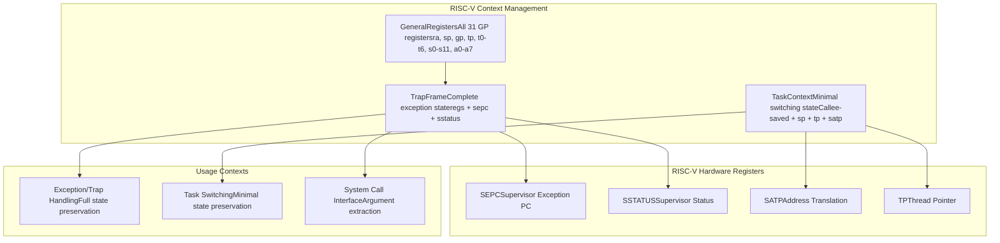
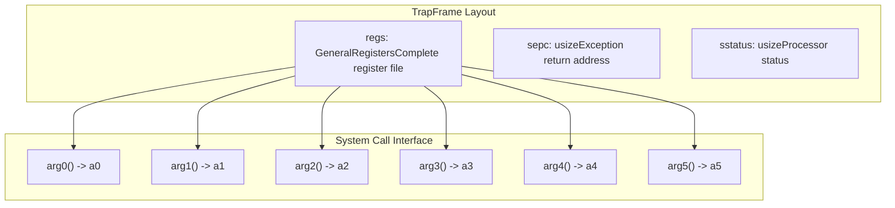
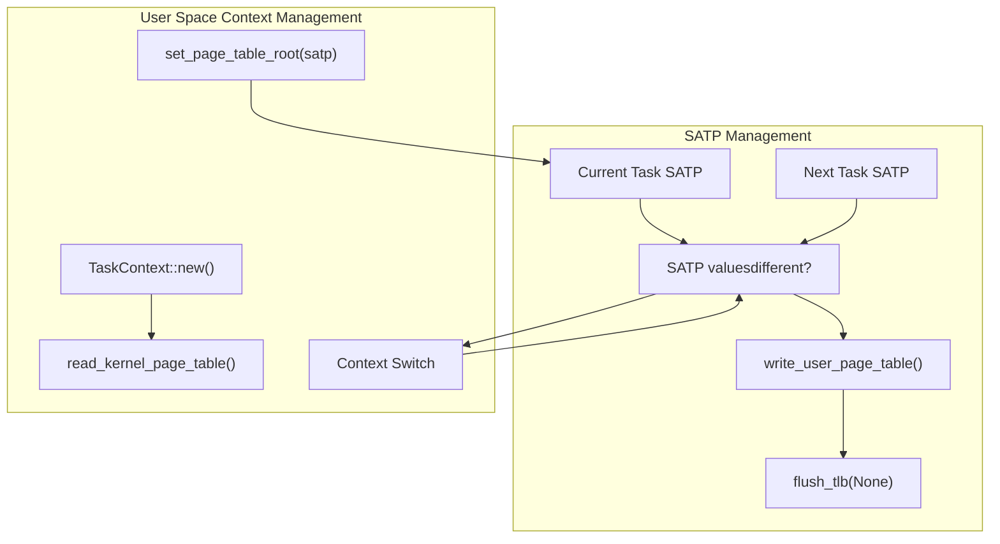
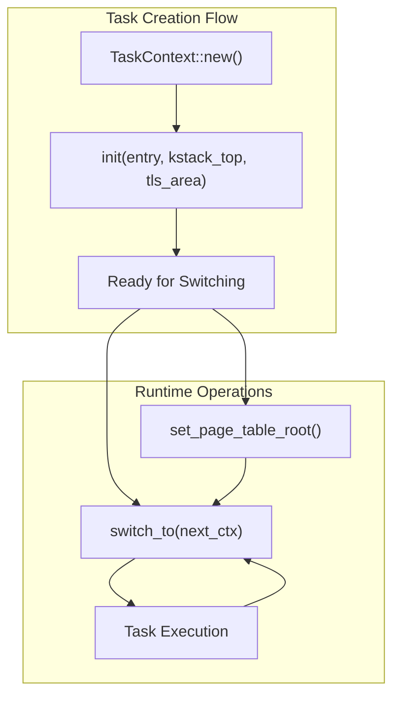

# RISC-V Context Management

> **Relevant source files**
> * [src/riscv/context.rs](https://github.com/arceos-org/axcpu/blob/b93d8fa3/src/riscv/context.rs)

## Purpose and Scope

This document covers the RISC-V architecture's CPU context management implementation within the axcpu library. It focuses on the data structures and mechanisms used to manage CPU state during task switching and exception handling, including register preservation, memory management integration, and thread-local storage support.

For RISC-V trap and exception handling mechanisms, see [RISC-V Trap and Exception Handling](/arceos-org/axcpu/4.2-risc-v-trap-and-exception-handling). For system initialization procedures, see [RISC-V System Initialization](/arceos-org/axcpu/4.3-risc-v-system-initialization).

## Core Context Structures

The RISC-V context management is built around three primary data structures that represent different levels of CPU state preservation.

### Context Structure Hierarchy



**Sources:** [src/riscv/context.rs(L8 - L123)&emsp;](https://github.com/arceos-org/axcpu/blob/b93d8fa3/src/riscv/context.rs#L8-L123)

### GeneralRegisters Structure

The `GeneralRegisters` structure represents the complete RISC-V general-purpose register set, containing all 31 registers as defined by the RISC-V specification.

|Register Group|Registers|Purpose|
| --- | --- | --- |
|Return Address|ra|Function return address|
|Stack Pointer|sp|Current stack pointer|
|Global Pointer|gp|Global data pointer (user traps only)|
|Thread Pointer|tp|Thread-local storage (user traps only)|
|Temporaries|t0-t6|Temporary registers|
|Saved Registers|s0-s11|Callee-saved registers|
|Arguments|a0-a7|Function arguments and return values|

**Sources:** [src/riscv/context.rs(L8 - L40)&emsp;](https://github.com/arceos-org/axcpu/blob/b93d8fa3/src/riscv/context.rs#L8-L40)

### TrapFrame Structure

The `TrapFrame` extends `GeneralRegisters` with supervisor-mode control and status registers required for complete exception context preservation.



The `TrapFrame` provides accessor methods for system call arguments through the `arg0()` through `arg5()` methods, which extract values from the appropriate argument registers (`a0`-`a5`).

**Sources:** [src/riscv/context.rs(L44 - L84)&emsp;](https://github.com/arceos-org/axcpu/blob/b93d8fa3/src/riscv/context.rs#L44-L84)

### TaskContext Structure

The `TaskContext` represents the minimal CPU state required for task switching, containing only callee-saved registers and system-specific state.

|Field|Purpose|Availability|
| --- | --- | --- |
|ra|Return address for context switch|Always|
|sp|Stack pointer|Always|
|s0-s11|Callee-saved registers|Always|
|tp|Thread pointer for TLS|Always|
|satp|Page table root|uspacefeature only|

**Sources:** [src/riscv/context.rs(L100 - L123)&emsp;](https://github.com/arceos-org/axcpu/blob/b93d8fa3/src/riscv/context.rs#L100-L123)

## Context Switching Mechanism

The RISC-V context switching implementation uses a combination of Rust methods and naked assembly functions to efficiently preserve and restore task state.

### Context Switch Flow

```mermaid
flowchart TD
subgraph subGraph1["context_switch() Assembly"]
    SAVE_REGS["Save callee-saved registersSTR ra,sp,s0-s11 -> current"]
    RESTORE_REGS["Restore callee-saved registersLDR s11-s0,sp,ra <- next"]
    RETURN["ret"]
end
subgraph TaskContext::switch_to()["TaskContext::switch_to()"]
    START["switch_to(&self, next_ctx: &Self)"]
    TLS_CHECK["TLS featureenabled?"]
    TLS_SAVE["Save current TPLoad next TP"]
    USPACE_CHECK["USPACE featureenabled?"]
    SATP_CMP["Current SATP !=Next SATP?"]
    SATP_SWITCH["Switch page tableFlush TLB"]
    ASM_SWITCH["context_switch(self, next_ctx)"]
end

ASM_SWITCH --> SAVE_REGS
RESTORE_REGS --> RETURN
SATP_CMP --> ASM_SWITCH
SATP_CMP --> SATP_SWITCH
SATP_SWITCH --> ASM_SWITCH
SAVE_REGS --> RESTORE_REGS
START --> TLS_CHECK
TLS_CHECK --> TLS_SAVE
TLS_CHECK --> USPACE_CHECK
TLS_SAVE --> USPACE_CHECK
USPACE_CHECK --> ASM_SWITCH
USPACE_CHECK --> SATP_CMP
```

**Sources:** [src/riscv/context.rs(L162 - L177)&emsp;](https://github.com/arceos-org/axcpu/blob/b93d8fa3/src/riscv/context.rs#L162-L177) [src/riscv/context.rs(L181 - L219)&emsp;](https://github.com/arceos-org/axcpu/blob/b93d8fa3/src/riscv/context.rs#L181-L219)

### Assembly Context Switch Implementation

The `context_switch` function is implemented as a naked assembly function that directly manipulates the task context structures:

* **Save Phase**: Uses `STR` macro to store callee-saved registers from CPU to current task's context
* **Restore Phase**: Uses `LDR` macro to load callee-saved registers from next task's context to CPU
* **Register Order**: Processes registers in reverse order during restore to maintain stack discipline

The assembly implementation assumes that the `STR` and `LDR` macros are defined to handle register storage and loading operations specific to the RISC-V architecture.

**Sources:** [src/riscv/context.rs(L181 - L219)&emsp;](https://github.com/arceos-org/axcpu/blob/b93d8fa3/src/riscv/context.rs#L181-L219)

## Memory Management Integration

The RISC-V context management integrates closely with the memory management system through the `satp` (Supervisor Address Translation and Protection) register.

### Page Table Root Management



**Key Operations:**

* **Initialization**: New tasks start with the kernel page table root
* **Page Table Switching**: Only occurs when SATP values differ between tasks
* **TLB Management**: Complete TLB flush after page table switches
* **Conditional Compilation**: Available only with `uspace` feature

**Sources:** [src/riscv/context.rs(L120 - L121)&emsp;](https://github.com/arceos-org/axcpu/blob/b93d8fa3/src/riscv/context.rs#L120-L121) [src/riscv/context.rs(L154 - L156)&emsp;](https://github.com/arceos-org/axcpu/blob/b93d8fa3/src/riscv/context.rs#L154-L156) [src/riscv/context.rs(L168 - L172)&emsp;](https://github.com/arceos-org/axcpu/blob/b93d8fa3/src/riscv/context.rs#L168-L172)

## Thread Local Storage Support

The RISC-V implementation provides thread-local storage support through the `tp` (thread pointer) register, available when the `tls` feature is enabled.

### TLS Context Management

|Operation|Method|Register|Purpose|
| --- | --- | --- | --- |
|Initialization|init()|Settpfield|Configure TLS area for new tasks|
|Context Switch|switch_to()|Save/restoretp|Maintain per-task TLS state|
|Register Access|ASM functions|Read/write TP|Low-level TLS manipulation|

The TLS implementation ensures that each task maintains its own thread-local storage area by:

1. **Saving Current State**: Reading the current `tp` register value before switching
2. **Restoring Next State**: Writing the next task's `tp` value to the register
3. **Initialization Support**: Setting the TLS area address during task creation

**Sources:** [src/riscv/context.rs(L118)&emsp;](https://github.com/arceos-org/axcpu/blob/b93d8fa3/src/riscv/context.rs#L118-L118) [src/riscv/context.rs(L146)&emsp;](https://github.com/arceos-org/axcpu/blob/b93d8fa3/src/riscv/context.rs#L146-L146) [src/riscv/context.rs(L164 - L167)&emsp;](https://github.com/arceos-org/axcpu/blob/b93d8fa3/src/riscv/context.rs#L164-L167)

## TaskContext Lifecycle

The `TaskContext` follows a specific lifecycle pattern for task creation and management:



**Initialization Parameters:**

* `entry`: Task entry point address (stored in `ra`)
* `kstack_top`: Kernel stack top (stored in `sp`)
* `tls_area`: Thread-local storage area (stored in `tp`)

**Sources:** [src/riscv/context.rs(L133 - L147)&emsp;](https://github.com/arceos-org/axcpu/blob/b93d8fa3/src/riscv/context.rs#L133-L147)