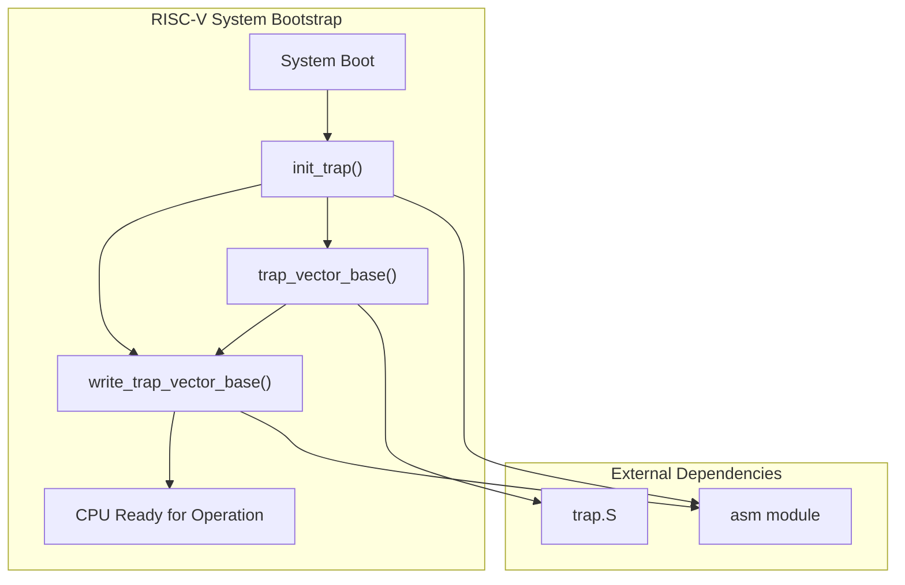
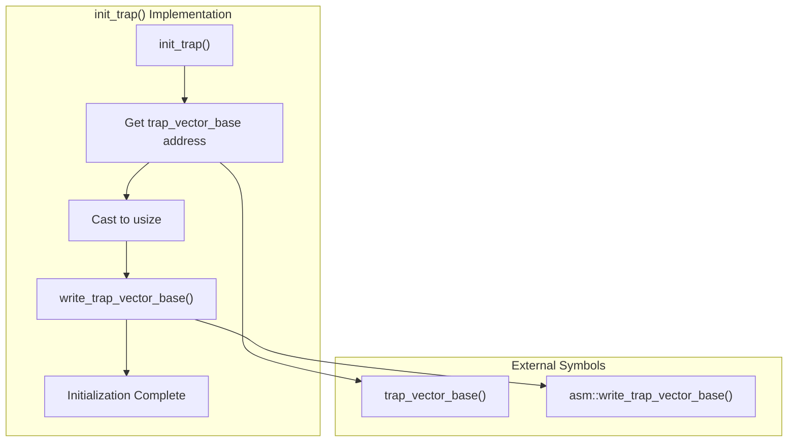
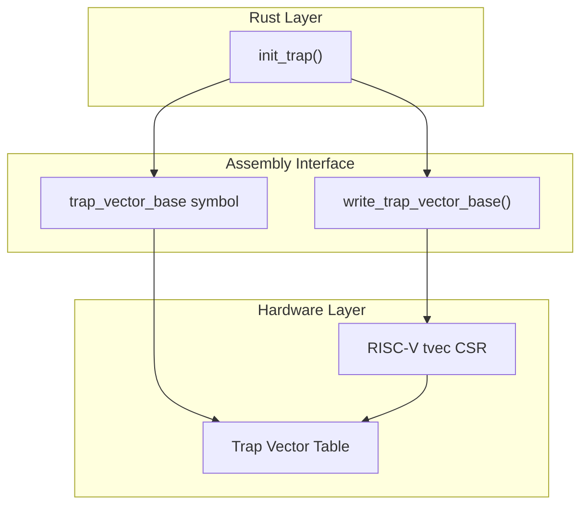
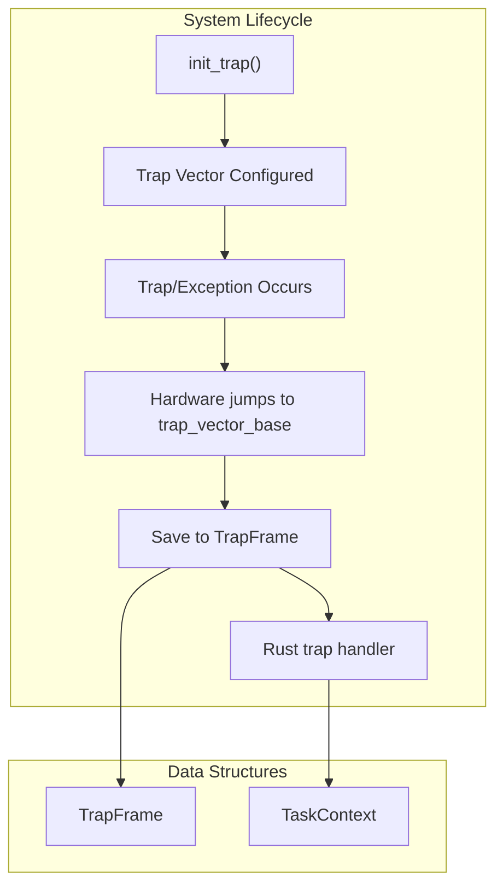

# RISC-V System Initialization

> **Relevant source files**
> * [src/riscv/init.rs](https://github.com/arceos-org/axcpu/blob/b93d8fa3/src/riscv/init.rs)

## Purpose and Scope

This document covers the RISC-V-specific system initialization procedures implemented in the axcpu library. It focuses on the bootstrap sequence for setting up CPU state and trap handling on RISC-V platforms during system startup.

For RISC-V context management structures and switching mechanisms, see [RISC-V Context Management](/arceos-org/axcpu/4.1-risc-v-context-management). For detailed trap handling implementation after initialization, see [RISC-V Trap and Exception Handling](/arceos-org/axcpu/4.2-risc-v-trap-and-exception-handling). For initialization procedures on other architectures, see [x86_64 System Initialization](/arceos-org/axcpu/2.4-x86_64-system-initialization) and [AArch64 System Initialization](/arceos-org/axcpu/3.3-aarch64-system-initialization).

## System Initialization Overview

The RISC-V system initialization is implemented as a minimal bootstrap procedure that configures essential CPU state for trap handling. Unlike other architectures that may require complex descriptor table setup, RISC-V initialization focuses primarily on trap vector configuration.

**RISC-V Initialization Flow**

Sources: [src/riscv/init.rs(L1 - L14)&emsp;](https://github.com/arceos-org/axcpu/blob/b93d8fa3/src/riscv/init.rs#L1-L14)

## Trap Vector Initialization

The core initialization function `init_trap()` establishes the trap vector base address that the RISC-V CPU uses to locate exception handlers. This is a critical step that must be completed before the system can handle any interrupts or exceptions.

**Trap Vector Setup Process**

The implementation follows this sequence:

1. **Vector Address Resolution**: The `trap_vector_base` symbol is resolved as an external C function pointer, representing the base address of the trap vector table
2. **Address Conversion**: The function pointer is cast to `usize` for use as a memory address
3. **CSR Configuration**: The address is written to the appropriate RISC-V Control and Status Register (CSR) via `write_trap_vector_base()`

Sources: [src/riscv/init.rs(L6 - L13)&emsp;](https://github.com/arceos-org/axcpu/blob/b93d8fa3/src/riscv/init.rs#L6-L13)

## Integration with Assembly Layer

The initialization depends on two key external components that bridge to the assembly layer:

|Component|Type|Purpose|
| --- | --- | --- |
|trap_vector_base|External C function|Provides base address of trap vector table|
|write_trap_vector_base()|Assembly function|Writes address to RISC-V trap vector CSR|

**Assembly Interface Integration**

The `unsafe` blocks in the implementation reflect the direct hardware manipulation required for system initialization, where incorrect trap vector configuration could compromise system stability.

Sources: [src/riscv/init.rs(L7 - L12)&emsp;](https://github.com/arceos-org/axcpu/blob/b93d8fa3/src/riscv/init.rs#L7-L12)

## Relationship to Trap Handling Architecture

The initialization establishes the foundation for the RISC-V trap handling system. The configured trap vector base points to assembly routines that will save CPU state into `TrapFrame` structures and dispatch to Rust handlers.

**Initialization to Runtime Flow**

The initialization creates the linkage between hardware trap events and the software trap handling framework implemented in the broader RISC-V module.

Sources: [src/riscv/init.rs(L1 - L14)&emsp;](https://github.com/arceos-org/axcpu/blob/b93d8fa3/src/riscv/init.rs#L1-L14)

## Architectural Simplicity

The RISC-V initialization implementation demonstrates the architectural simplicity compared to other platforms. The entire initialization consists of a single function with minimal setup requirements, reflecting RISC-V's streamlined approach to system configuration.

This contrasts with x86_64 initialization which requires GDT and IDT setup, or AArch64 initialization which involves exception level transitions and MMU configuration. The RISC-V approach focuses on the essential trap vector configuration needed for basic system operation.

Sources: [src/riscv/init.rs(L1 - L14)&emsp;](https://github.com/arceos-org/axcpu/blob/b93d8fa3/src/riscv/init.rs#L1-L14)