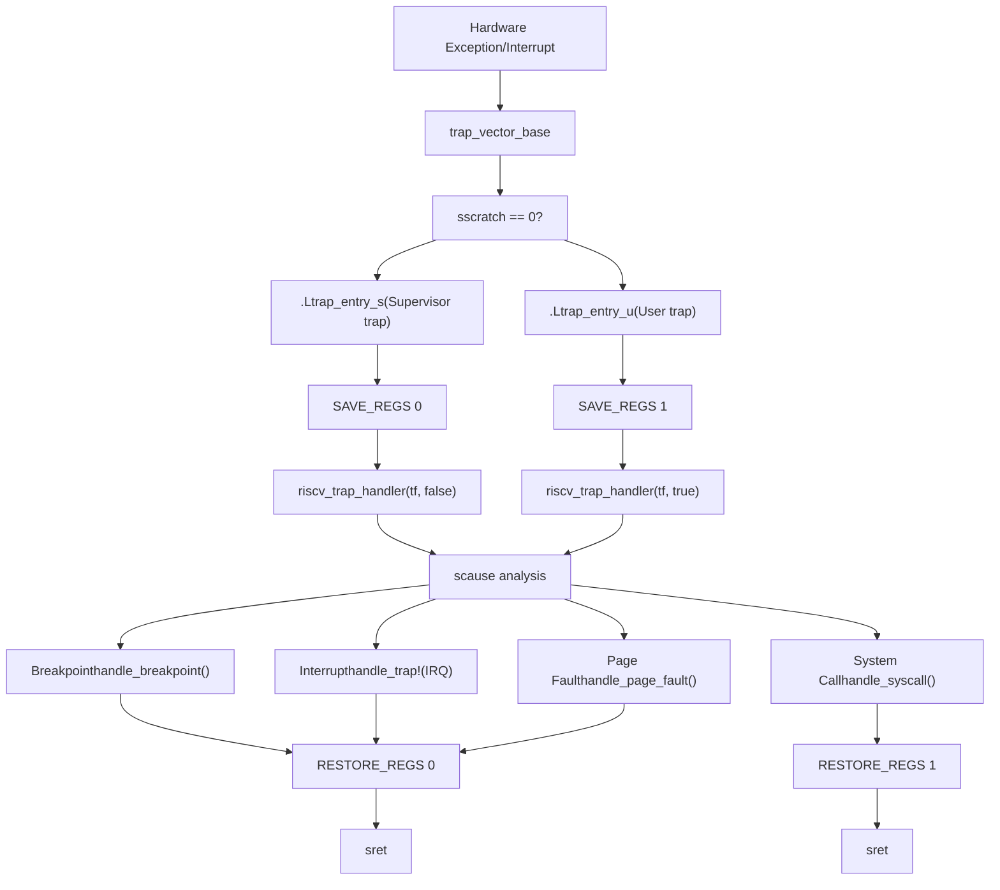
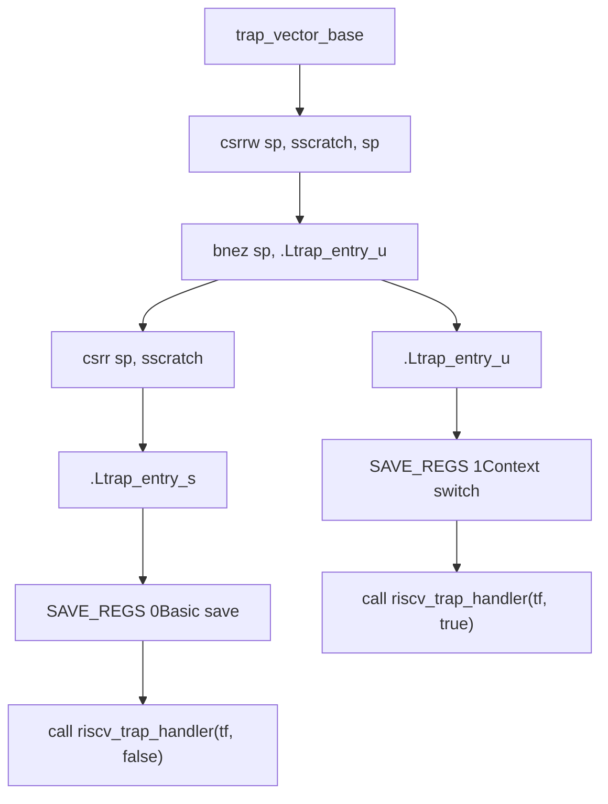
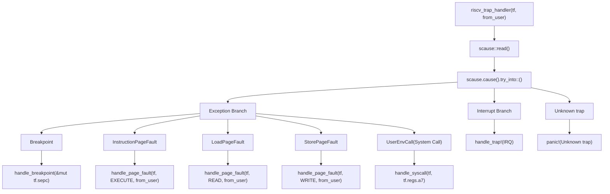
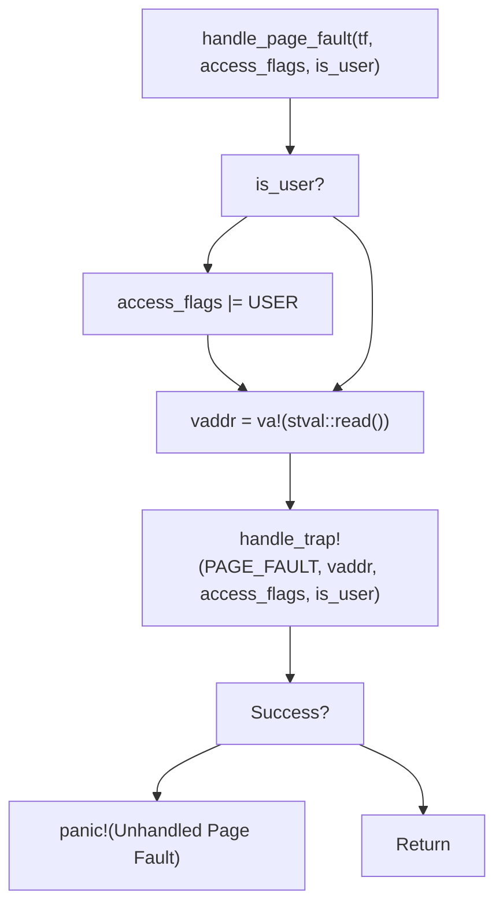
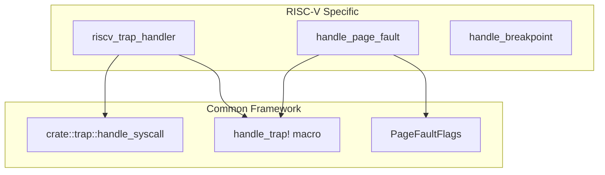

# RISC-V Trap and Exception Handling

> **Relevant source files**
> * [src/aarch64/trap.S](https://github.com/arceos-org/axcpu/blob/b93d8fa3/src/aarch64/trap.S)
> * [src/riscv/trap.S](https://github.com/arceos-org/axcpu/blob/b93d8fa3/src/riscv/trap.S)
> * [src/riscv/trap.rs](https://github.com/arceos-org/axcpu/blob/b93d8fa3/src/riscv/trap.rs)

## Purpose and Scope

This page covers the RISC-V trap and exception handling implementation in axcpu, including both the assembly-level trap entry/exit mechanisms and the Rust-based trap dispatch logic. The system handles supervisor-mode and user-mode traps, including page faults, system calls, interrupts, and debugging exceptions.

For information about RISC-V context management and register state, see [4.1](/arceos-org/axcpu/4.1-risc-v-context-management). For system initialization and trap vector setup, see [4.3](/arceos-org/axcpu/4.3-risc-v-system-initialization). For cross-architecture trap handling abstractions, see [6.2](/arceos-org/axcpu/6.2-core-trap-handling-framework).

## Trap Handling Architecture

The RISC-V trap handling system operates in two phases: assembly-level trap entry/exit for performance-critical register save/restore operations, and Rust-based trap dispatch for high-level exception handling logic.

### Trap Flow Diagram



Sources: [src/riscv/trap.S(L45 - L69)&emsp;](https://github.com/arceos-org/axcpu/blob/b93d8fa3/src/riscv/trap.S#L45-L69) [src/riscv/trap.rs(L36 - L71)&emsp;](https://github.com/arceos-org/axcpu/blob/b93d8fa3/src/riscv/trap.rs#L36-L71)

## Assembly Trap Entry Mechanism

The trap entry mechanism uses the `sscratch` register to distinguish between supervisor-mode and user-mode traps, implementing different register save/restore strategies for each privilege level.

### Register Save/Restore Strategy

|Trap Source|sscratch Value|Entry Point|Register Handling|
| --- | --- | --- | --- |
|Supervisor Mode|0|.Ltrap_entry_s|Basic register save, no privilege switch|
|User Mode|Non-zero (supervisor SP)|.Ltrap_entry_u|Full context switch including GP/TP registers|

### Trap Vector Implementation



Sources: [src/riscv/trap.S(L45 - L69)&emsp;](https://github.com/arceos-org/axcpu/blob/b93d8fa3/src/riscv/trap.S#L45-L69)

### SAVE_REGS Macro Behavior

The `SAVE_REGS` macro implements different register handling strategies based on the trap source:

**Supervisor Mode (from_user=0)**:

* Saves all general-purpose registers to trap frame
* Preserves `sepc`, `sstatus`, and `sscratch`
* No privilege-level register switching

**User Mode (from_user=1)**:

* Saves user GP and TP registers to trap frame
* Loads supervisor GP and TP from trap frame offsets 2 and 3
* Switches to supervisor register context

Sources: [src/riscv/trap.S(L1 - L20)&emsp;](https://github.com/arceos-org/axcpu/blob/b93d8fa3/src/riscv/trap.S#L1-L20)

## Rust Trap Handler Dispatch

The `riscv_trap_handler` function serves as the main dispatch point for all RISC-V traps, analyzing the `scause` register to determine trap type and invoking appropriate handlers.

### Trap Classification and Dispatch



Sources: [src/riscv/trap.rs(L36 - L71)&emsp;](https://github.com/arceos-org/axcpu/blob/b93d8fa3/src/riscv/trap.rs#L36-L71)

## Specific Trap Type Handlers

### Page Fault Handling

The `handle_page_fault` function processes memory access violations by extracting the fault address from `stval` and determining access permissions:



**Page Fault Types**:

* `LoadPageFault`: Read access violation (`PageFaultFlags::READ`)
* `StorePageFault`: Write access violation (`PageFaultFlags::WRITE`)
* `InstructionPageFault`: Execute access violation (`PageFaultFlags::EXECUTE`)

Sources: [src/riscv/trap.rs(L19 - L34)&emsp;](https://github.com/arceos-org/axcpu/blob/b93d8fa3/src/riscv/trap.rs#L19-L34) [src/riscv/trap.rs(L46 - L54)&emsp;](https://github.com/arceos-org/axcpu/blob/b93d8fa3/src/riscv/trap.rs#L46-L54)

### System Call Handling

System calls are handled through the `UserEnvCall` exception when the `uspace` feature is enabled:

```
tf.regs.a0 = crate::trap::handle_syscall(tf, tf.regs.a7) as usize;
tf.sepc += 4;
```

The system call number is passed in register `a7`, and the return value is stored in `a0`. The program counter (`sepc`) is incremented by 4 to skip the `ecall` instruction.

Sources: [src/riscv/trap.rs(L42 - L45)&emsp;](https://github.com/arceos-org/axcpu/blob/b93d8fa3/src/riscv/trap.rs#L42-L45)

### Breakpoint Handling

Breakpoint exceptions increment the program counter by 2 bytes to skip the compressed `ebreak` instruction:

```rust
fn handle_breakpoint(sepc: &mut usize) {
    debug!("Exception(Breakpoint) @ {sepc:#x} ");
    *sepc += 2
}
```

Sources: [src/riscv/trap.rs(L14 - L17)&emsp;](https://github.com/arceos-org/axcpu/blob/b93d8fa3/src/riscv/trap.rs#L14-L17) [src/riscv/trap.rs(L55)&emsp;](https://github.com/arceos-org/axcpu/blob/b93d8fa3/src/riscv/trap.rs#L55-L55)

### Interrupt Handling

Hardware interrupts are dispatched to the common trap handling framework using the `handle_trap!` macro with the `IRQ` trap type and `scause.bits()` as the interrupt number.

Sources: [src/riscv/trap.rs(L56 - L58)&emsp;](https://github.com/arceos-org/axcpu/blob/b93d8fa3/src/riscv/trap.rs#L56-L58)

## Integration with Common Framework

The RISC-V trap handler integrates with axcpu's cross-architecture trap handling framework through several mechanisms:

### Trap Framework Integration



**Framework Components Used**:

* `PageFaultFlags`: Common page fault flag definitions
* `handle_trap!` macro: Architecture-agnostic trap dispatch
* `crate::trap::handle_syscall`: Common system call interface

Sources: [src/riscv/trap.rs(L1 - L6)&emsp;](https://github.com/arceos-org/axcpu/blob/b93d8fa3/src/riscv/trap.rs#L1-L6) [src/riscv/trap.rs(L24)&emsp;](https://github.com/arceos-org/axcpu/blob/b93d8fa3/src/riscv/trap.rs#L24-L24) [src/riscv/trap.rs(L43)&emsp;](https://github.com/arceos-org/axcpu/blob/b93d8fa3/src/riscv/trap.rs#L43-L43) [src/riscv/trap.rs(L57)&emsp;](https://github.com/arceos-org/axcpu/blob/b93d8fa3/src/riscv/trap.rs#L57-L57)

## Assembly Integration

The trap handling system integrates assembly code through the `global_asm!` macro, including architecture-specific macros and the trap frame size constant:

```javascript
core::arch::global_asm!(
    include_asm_macros!(),
    include_str!("trap.S"),
    trapframe_size = const core::mem::size_of::<TrapFrame>(),
);
```

This approach ensures type safety by using the Rust `TrapFrame` size directly in assembly code, preventing layout mismatches between Rust and assembly implementations.

Sources: [src/riscv/trap.rs(L8 - L12)&emsp;](https://github.com/arceos-org/axcpu/blob/b93d8fa3/src/riscv/trap.rs#L8-L12)