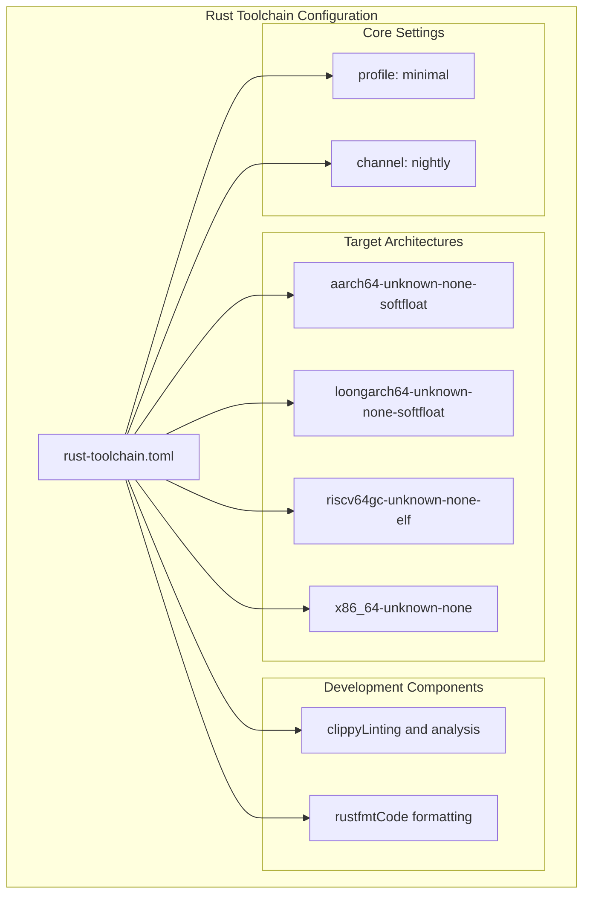
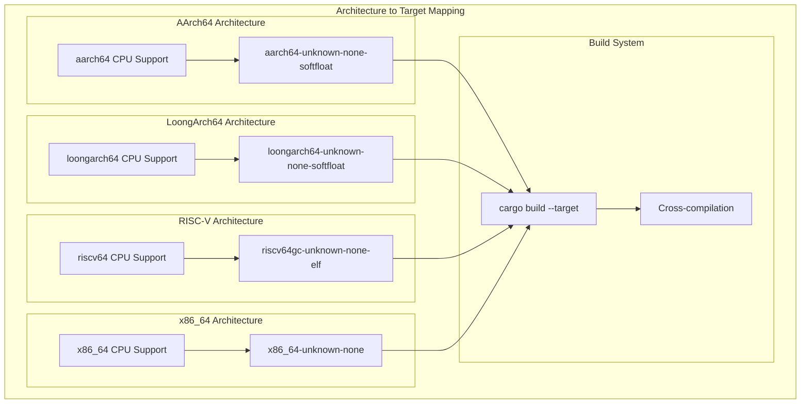
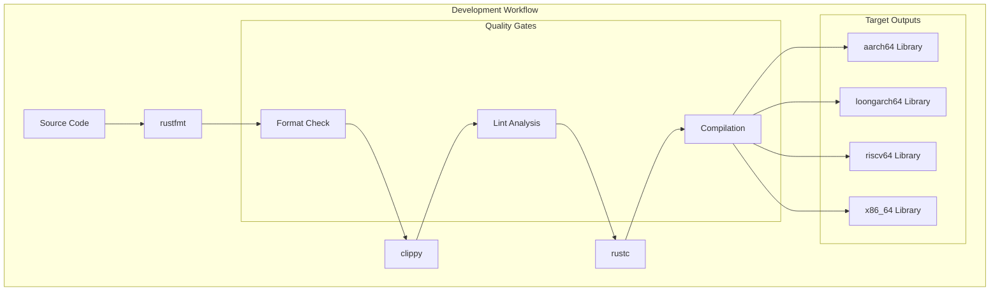

# Toolchain Configuration

> **Relevant source files**
> * [rust-toolchain.toml](https://github.com/arceos-org/axcpu/blob/b93d8fa3/rust-toolchain.toml)

This document covers the Rust toolchain configuration required for building and developing the axcpu multi-architecture CPU abstraction library. It details the specific compiler targets, development tools, and build requirements needed to support all four target architectures.

For information about the dependency structure and external crates, see [Dependencies and Package Structure](/arceos-org/axcpu/7.1-dependencies-and-package-structure).

## Rust Toolchain Requirements

The axcpu project requires the Rust nightly toolchain to access advanced features needed for low-level systems programming. The toolchain configuration is centrally managed through the `rust-toolchain.toml` file.

### Toolchain Specification

The project uses a minimal nightly toolchain profile with essential development components:

**Toolchain Configuration Mapping**

Sources: [rust-toolchain.toml(L1 - L10)&emsp;](https://github.com/arceos-org/axcpu/blob/b93d8fa3/rust-toolchain.toml#L1-L10)

## Target Architecture Configuration

Each supported architecture requires a specific Rust target triple that defines the compilation environment and ABI requirements for bare-metal development.

### Architecture Target Mapping

|Architecture|Target Triple|Purpose|
| --- | --- | --- |
|x86_64|x86_64-unknown-none|64-bit x86 bare-metal|
|RISC-V|riscv64gc-unknown-none-elf|64-bit RISC-V with compressed instructions|
|AArch64|aarch64-unknown-none-softfloat|64-bit ARM with software floating-point|
|LoongArch64|loongarch64-unknown-none-softfloat|64-bit LoongArch with software floating-point|

**Target Architecture Configuration**

Sources: [rust-toolchain.toml(L5 - L10)&emsp;](https://github.com/arceos-org/axcpu/blob/b93d8fa3/rust-toolchain.toml#L5-L10)

### Target Characteristics

**x86_64-unknown-none**

* Bare-metal x86_64 target without operating system
* Supports full x86_64 instruction set including SSE/AVX
* Used for kernel-level CPU abstraction implementations

**riscv64gc-unknown-none-elf**

* 64-bit RISC-V with general-purpose and compressed instruction extensions
* ELF format for bare-metal environments
* Supports the standard RISC-V calling convention

**aarch64-unknown-none-softfloat**

* 64-bit ARM architecture without hardware floating-point
* Suitable for systems programming where FPU may not be available
* Uses software emulation for floating-point operations

**loongarch64-unknown-none-softfloat**

* 64-bit LoongArch architecture with software floating-point
* Bare-metal target for the Chinese LoongArch instruction set
* Supports the LoongArch ABI for systems programming

Sources: [rust-toolchain.toml(L6 - L9)&emsp;](https://github.com/arceos-org/axcpu/blob/b93d8fa3/rust-toolchain.toml#L6-L9)

## Development Tools Configuration

The toolchain includes essential development tools for code quality and maintenance across all target architectures.

### Included Components

**rustfmt**

* Automatic code formatting according to Rust style guidelines
* Ensures consistent code style across all architecture implementations
* Configured through `rustfmt.toml` (if present)

**clippy**

* Advanced linting and static analysis tool
* Catches common programming errors and suggests improvements
* Particularly important for unsafe code used in low-level CPU operations

**Development Tools Integration**

Sources: [rust-toolchain.toml(L4)&emsp;](https://github.com/arceos-org/axcpu/blob/b93d8fa3/rust-toolchain.toml#L4-L4)

## Cross-Compilation Setup

The toolchain configuration enables seamless cross-compilation to all supported architectures from any development host.

### Build Process

The `rust-toolchain.toml` file automatically configures the development environment when developers run `rustup` in the project directory. This ensures all contributors use the same compiler version and have access to the required target architectures.

**Automatic Target Installation**

* Running `rustup target add` for each specified target
* Ensures consistent build environment across development machines
* Eliminates manual toolchain setup requirements

**Development Commands**

* `cargo build` - Build for the host architecture
* `cargo build --target x86_64-unknown-none` - Cross-compile for x86_64
* `cargo build --target riscv64gc-unknown-none-elf` - Cross-compile for RISC-V
* `cargo build --target aarch64-unknown-none-softfloat` - Cross-compile for AArch64
* `cargo build --target loongarch64-unknown-none-softfloat` - Cross-compile for LoongArch64

Sources: [rust-toolchain.toml(L1 - L10)&emsp;](https://github.com/arceos-org/axcpu/blob/b93d8fa3/rust-toolchain.toml#L1-L10)

## Nightly Features Usage

The nightly toolchain requirement enables access to unstable Rust features essential for systems programming:

* **Inline Assembly**: Required for architecture-specific assembly code
* **Custom Target Specifications**: Enables bare-metal target definitions
* **Advanced Const Generics**: Used for compile-time architecture dispatch
* **Unstable Library Features**: Access to experimental standard library APIs

These features are critical for implementing low-level CPU abstractions and context switching routines across different architectures.

Sources: [rust-toolchain.toml(L3)&emsp;](https://github.com/arceos-org/axcpu/blob/b93d8fa3/rust-toolchain.toml#L3-L3)