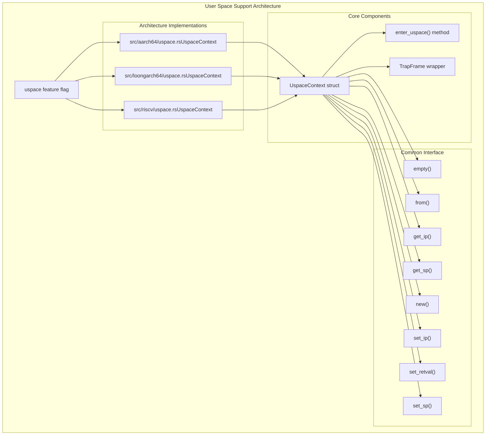
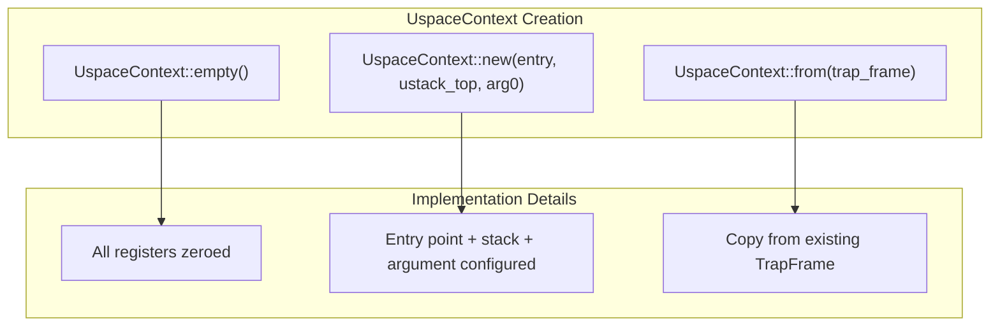
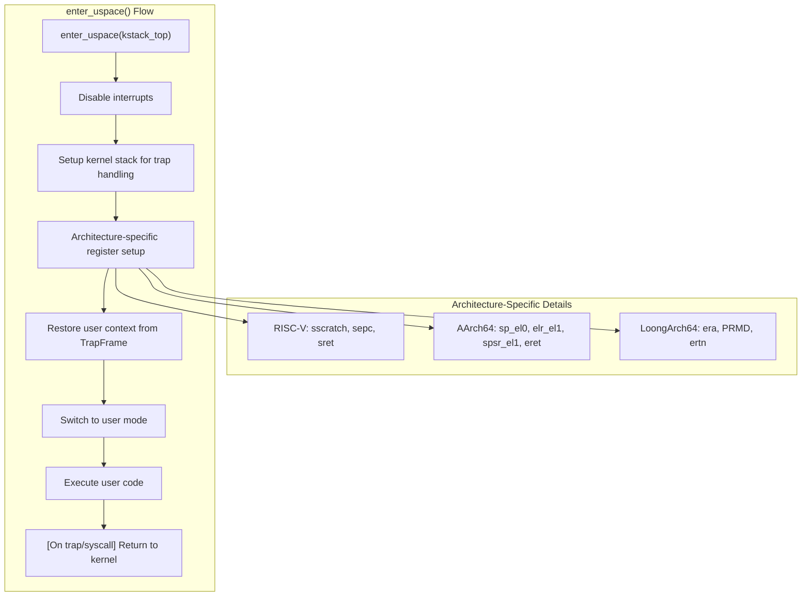

# User Space Support

> **Relevant source files**
> * [src/aarch64/uspace.rs](https://github.com/arceos-org/axcpu/blob/b93d8fa3/src/aarch64/uspace.rs)
> * [src/loongarch64/uspace.rs](https://github.com/arceos-org/axcpu/blob/b93d8fa3/src/loongarch64/uspace.rs)
> * [src/riscv/uspace.rs](https://github.com/arceos-org/axcpu/blob/b93d8fa3/src/riscv/uspace.rs)

This document covers the user space support functionality provided by the axcpu library, which enables transitions from kernel mode to user mode across supported architectures. This feature allows operating systems built on axcpu to execute user programs in unprivileged mode while maintaining proper isolation and control.

For architecture-specific trap handling that occurs when transitioning back from user space, see the trap handling sections for each architecture ([2.2](/arceos-org/axcpu/2.2-x86_64-trap-and-exception-handling), [3.2](/arceos-org/axcpu/3.2-aarch64-trap-and-exception-handling), [4.2](/arceos-org/axcpu/4.2-risc-v-trap-and-exception-handling)). For general context management during task switching, see the context management sections ([2.1](/arceos-org/axcpu/2.1-x86_64-context-management), [3.1](/arceos-org/axcpu/3.1-aarch64-context-management), [4.1](/arceos-org/axcpu/4.1-risc-v-context-management), [5.1](/arceos-org/axcpu/5.1-loongarch64-context-management)).

## Architecture Support Overview

The user space support is implemented through the `uspace` feature and provides a consistent interface across multiple architectures. Each supported architecture implements the functionality through a dedicated `uspace.rs` module that provides the `UspaceContext` structure and associated methods.

Sources: [src/riscv/uspace.rs(L1 - L104)&emsp;](https://github.com/arceos-org/axcpu/blob/b93d8fa3/src/riscv/uspace.rs#L1-L104) [src/aarch64/uspace.rs(L1 - L113)&emsp;](https://github.com/arceos-org/axcpu/blob/b93d8fa3/src/aarch64/uspace.rs#L1-L113) [src/loongarch64/uspace.rs(L1 - L98)&emsp;](https://github.com/arceos-org/axcpu/blob/b93d8fa3/src/loongarch64/uspace.rs#L1-L98)

## UspaceContext Structure

The `UspaceContext` is implemented as a wrapper around the architecture-specific `TrapFrame` structure. This design provides a unified interface while leveraging the existing trap frame infrastructure for context management.

|Architecture|UspaceContext Definition|Underlying TrapFrame|
| --- | --- | --- |
|RISC-V|pub struct UspaceContext(TrapFrame)|ContainsGeneralRegisters,sepc,sstatus|
|AArch64|pub struct UspaceContext(TrapFrame)|Contains register arrayr[31],usp,elr,spsr|
|LoongArch64|pub struct UspaceContext(TrapFrame)|Contains registers,era,prmd|

Sources: [src/riscv/uspace.rs(L8)&emsp;](https://github.com/arceos-org/axcpu/blob/b93d8fa3/src/riscv/uspace.rs#L8-L8) [src/aarch64/uspace.rs(L8)&emsp;](https://github.com/arceos-org/axcpu/blob/b93d8fa3/src/aarch64/uspace.rs#L8-L8) [src/loongarch64/uspace.rs(L8)&emsp;](https://github.com/arceos-org/axcpu/blob/b93d8fa3/src/loongarch64/uspace.rs#L8-L8)

## Context Creation and Management

Each architecture provides consistent methods for creating and manipulating user space contexts:

### Context Creation Methods

Sources: [src/riscv/uspace.rs(L12 - L35)&emsp;](https://github.com/arceos-org/axcpu/blob/b93d8fa3/src/riscv/uspace.rs#L12-L35) [src/aarch64/uspace.rs(L12 - L38)&emsp;](https://github.com/arceos-org/axcpu/blob/b93d8fa3/src/aarch64/uspace.rs#L12-L38) [src/loongarch64/uspace.rs(L12 - L32)&emsp;](https://github.com/arceos-org/axcpu/blob/b93d8fa3/src/loongarch64/uspace.rs#L12-L32)

The `new()` method performs architecture-specific initialization:

* **RISC-V**: Sets `SPIE` (enable interrupts) and `SUM` (supervisor user memory access) flags in `sstatus` [src/riscv/uspace.rs(L19 - L29)&emsp;](https://github.com/arceos-org/axcpu/blob/b93d8fa3/src/riscv/uspace.rs#L19-L29)
* **AArch64**: Configures `SPSR_EL1` with `EL0t` mode and appropriate interrupt masking [src/aarch64/uspace.rs(L26 - L32)&emsp;](https://github.com/arceos-org/axcpu/blob/b93d8fa3/src/aarch64/uspace.rs#L26-L32)
* **LoongArch64**: Sets `PPLV_UMODE` (user privilege level) and `PIE` (previous interrupt enable) in `prmd` [src/loongarch64/uspace.rs(L20 - L26)&emsp;](https://github.com/arceos-org/axcpu/blob/b93d8fa3/src/loongarch64/uspace.rs#L20-L26)

### Context Access Methods

All architectures provide consistent getter and setter methods:

|Method|Purpose|RISC-V|AArch64|LoongArch64|
| --- | --- | --- | --- | --- |
|get_ip()|Get instruction pointer|self.0.sepc|self.0.elr|self.0.era|
|get_sp()|Get stack pointer|self.0.regs.sp|self.0.usp|self.0.regs.sp|
|set_ip()|Set instruction pointer|self.0.sepc = pc|self.0.elr = pc|self.0.era = pc|
|set_sp()|Set stack pointer|self.0.regs.sp = sp|self.0.usp = sp|self.0.regs.sp = sp|
|set_retval()|Set return value|self.0.regs.a0 = a0|self.0.r[0] = r0|self.0.regs.a0 = a0|

Sources: [src/riscv/uspace.rs(L37 - L61)&emsp;](https://github.com/arceos-org/axcpu/blob/b93d8fa3/src/riscv/uspace.rs#L37-L61) [src/aarch64/uspace.rs(L40 - L63)&emsp;](https://github.com/arceos-org/axcpu/blob/b93d8fa3/src/aarch64/uspace.rs#L40-L63) [src/loongarch64/uspace.rs(L34 - L57)&emsp;](https://github.com/arceos-org/axcpu/blob/b93d8fa3/src/loongarch64/uspace.rs#L34-L57)

## User Space Entry Process

The `enter_uspace()` method performs the critical transition from kernel mode to user mode. This is an unsafe operation that fundamentally changes the processor's execution context.

Sources: [src/riscv/uspace.rs(L72 - L102)&emsp;](https://github.com/arceos-org/axcpu/blob/b93d8fa3/src/riscv/uspace.rs#L72-L102) [src/aarch64/uspace.rs(L75 - L111)&emsp;](https://github.com/arceos-org/axcpu/blob/b93d8fa3/src/aarch64/uspace.rs#L75-L111) [src/loongarch64/uspace.rs(L69 - L96)&emsp;](https://github.com/arceos-org/axcpu/blob/b93d8fa3/src/loongarch64/uspace.rs#L69-L96)

### Architecture-Specific Entry Implementation

Each architecture implements the final transition using inline assembly:

**RISC-V Implementation**:

* Uses `sscratch` to store kernel stack pointer for trap handling [src/riscv/uspace.rs(L79)&emsp;](https://github.com/arceos-org/axcpu/blob/b93d8fa3/src/riscv/uspace.rs#L79-L79)
* Sets `sepc` with user entry point [src/riscv/uspace.rs(L80)&emsp;](https://github.com/arceos-org/axcpu/blob/b93d8fa3/src/riscv/uspace.rs#L80-L80)
* Executes `sret` instruction to return to user mode [src/riscv/uspace.rs(L96)&emsp;](https://github.com/arceos-org/axcpu/blob/b93d8fa3/src/riscv/uspace.rs#L96-L96)

**AArch64 Implementation**:

* Sets `sp_el0` for user stack, `elr_el1` for entry point, `spsr_el1` for processor state [src/aarch64/uspace.rs(L86 - L88)&emsp;](https://github.com/arceos-org/axcpu/blob/b93d8fa3/src/aarch64/uspace.rs#L86-L88)
* Uses `eret` instruction to return to user mode [src/aarch64/uspace.rs(L105)&emsp;](https://github.com/arceos-org/axcpu/blob/b93d8fa3/src/aarch64/uspace.rs#L105-L105)

**LoongArch64 Implementation**:

* Configures `era` register with user entry point [src/loongarch64/uspace.rs(L74)&emsp;](https://github.com/arceos-org/axcpu/blob/b93d8fa3/src/loongarch64/uspace.rs#L74-L74)
* Uses `ertn` instruction to return to user mode [src/loongarch64/uspace.rs(L91)&emsp;](https://github.com/arceos-org/axcpu/blob/b93d8fa3/src/loongarch64/uspace.rs#L91-L91)

## Cross-Architecture Design Patterns

The user space support demonstrates several consistent design patterns across architectures:

### Trap Frame Reuse

All implementations leverage the existing `TrapFrame` structure rather than defining separate user context formats. This provides consistency with the trap handling infrastructure and ensures that user contexts contain all necessary state for exception handling.

### Kernel Stack Management

Each architecture properly configures the kernel stack pointer to handle subsequent traps or system calls from user mode:

* RISC-V: Uses `sscratch` CSR [src/riscv/uspace.rs(L79)&emsp;](https://github.com/arceos-org/axcpu/blob/b93d8fa3/src/riscv/uspace.rs#L79-L79)
* AArch64: Uses `sp_el1` (kernel stack remains in place) [src/aarch64/uspace.rs(L77 - L79)&emsp;](https://github.com/arceos-org/axcpu/blob/b93d8fa3/src/aarch64/uspace.rs#L77-L79)
* LoongArch64: Uses `write_kernel_sp()` helper [src/loongarch64/uspace.rs(L73)&emsp;](https://github.com/arceos-org/axcpu/blob/b93d8fa3/src/loongarch64/uspace.rs#L73-L73)

### Register State Initialization

The `new()` method in each architecture sets appropriate processor state flags for user mode execution, ensuring proper privilege levels and interrupt handling configuration.

Sources: [src/riscv/uspace.rs(L1 - L104)&emsp;](https://github.com/arceos-org/axcpu/blob/b93d8fa3/src/riscv/uspace.rs#L1-L104) [src/aarch64/uspace.rs(L1 - L113)&emsp;](https://github.com/arceos-org/axcpu/blob/b93d8fa3/src/aarch64/uspace.rs#L1-L113) [src/loongarch64/uspace.rs(L1 - L98)&emsp;](https://github.com/arceos-org/axcpu/blob/b93d8fa3/src/loongarch64/uspace.rs#L1-L98)