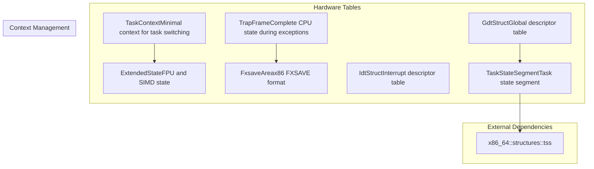
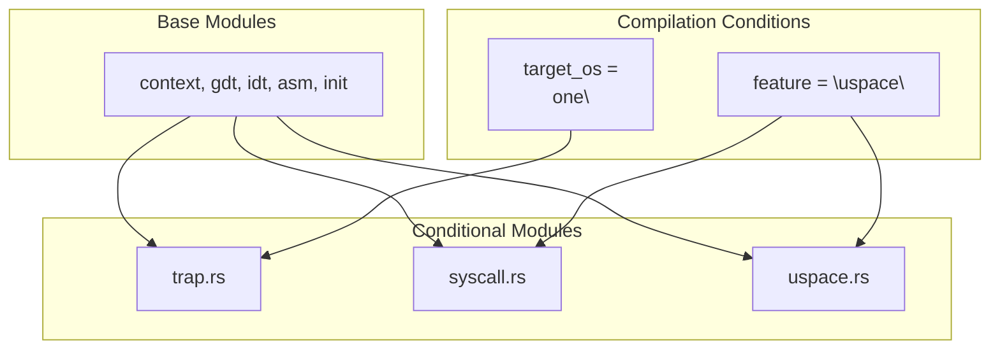

# x86_64 Architecture

> **Relevant source files**
> * [src/x86_64/mod.rs](https://github.com/arceos-org/axcpu/blob/b93d8fa3/src/x86_64/mod.rs)

## Purpose and Scope

This document provides an overview of the x86_64 architecture support in axcpu, which represents the most comprehensive and mature architecture implementation in the codebase. The x86_64 module provides CPU context management, trap handling, system call support, and hardware initialization for Intel/AMD 64-bit processors.

This page covers the overall module organization and key data structures. For detailed information about specific aspects, see:

* Context switching and CPU state management: [Context Management](/arceos-org/axcpu/2.1-x86_64-context-management)
* Exception and interrupt handling: [Trap and Exception Handling](/arceos-org/axcpu/2.2-x86_64-trap-and-exception-handling)
* System call implementation: [System Calls](/arceos-org/axcpu/2.3-x86_64-system-calls)
* Hardware initialization procedures: [System Initialization](/arceos-org/axcpu/2.4-x86_64-system-initialization)

For user space support across all architectures, see [User Space Support](/arceos-org/axcpu/6.1-user-space-support).

## Module Organization

The x86_64 architecture support is organized into several specialized modules, each handling different aspects of CPU management:

### x86_64 Module Structure

```

```

Sources: [src/x86_64/mod.rs(L1 - L21)&emsp;](https://github.com/arceos-org/axcpu/blob/b93d8fa3/src/x86_64/mod.rs#L1-L21)

## Core Data Structures

The x86_64 implementation exports several key data structures that represent different aspects of CPU state:

### Exported Types and Their Purposes



Sources: [src/x86_64/mod.rs(L17 - L20)&emsp;](https://github.com/arceos-org/axcpu/blob/b93d8fa3/src/x86_64/mod.rs#L17-L20)

|Data Structure|Purpose|Module Source|
| --- | --- | --- |
|TaskContext|Stores callee-saved registers and stack pointer for task switching|context|
|TrapFrame|Captures complete CPU state during exceptions and interrupts|context|
|ExtendedState|Manages FPU and SIMD register state|context|
|FxsaveArea|x86-specific FXSAVE/FXRSTOR data format|context|
|GdtStruct|Global descriptor table management|gdt|
|IdtStruct|Interrupt descriptor table management|idt|
|TaskStateSegment|Hardware task state segment (from x86_64 crate)|External|

## Feature-Based Compilation

The x86_64 module uses conditional compilation to enable different capabilities based on build configuration:

### Conditional Module Loading



Sources: [src/x86_64/mod.rs(L8 - L15)&emsp;](https://github.com/arceos-org/axcpu/blob/b93d8fa3/src/x86_64/mod.rs#L8-L15)

The conditional compilation enables:

* **Trap handling** (`target_os = "none"`): Exception and interrupt processing for bare-metal environments
* **User space support** (`feature = "uspace"`): System call handling and user-kernel transitions
* **System call interface** (`feature = "uspace"`): Dedicated syscall entry points and parameter handling

## Key Components Overview

The x86_64 architecture support provides several essential capabilities:

### Hardware Abstraction Layer

* **Context Management**: Efficient task switching using minimal register sets in `TaskContext`
* **Exception Handling**: Complete trap frame capture and restoration for all exception types
* **Memory Management**: Integration with x86_64 paging hardware and TLB management
* **FPU/SIMD Support**: Extended state preservation for floating-point and vector operations

### System Integration

* **Descriptor Tables**: GDT and IDT management for privilege level transitions
* **Task State Segment**: Hardware task switching support (though typically unused in modern kernels)
* **System Calls**: Fast system call entry points using `SYSCALL`/`SYSRET` instructions
* **User Space**: Complete user-kernel isolation with separate address spaces

### Assembly Interface

The `asm` module provides low-level operations that cannot be expressed in safe Rust, including:

* Context switching routines
* Trap entry/exit sequences
* CPU state manipulation
* Hardware feature detection and configuration

This architecture implementation serves as the foundation for kernel development on x86_64 platforms, providing all necessary abstractions for task management, memory protection, and hardware interaction.

Sources: [src/x86_64/mod.rs(L1 - L21)&emsp;](https://github.com/arceos-org/axcpu/blob/b93d8fa3/src/x86_64/mod.rs#L1-L21)