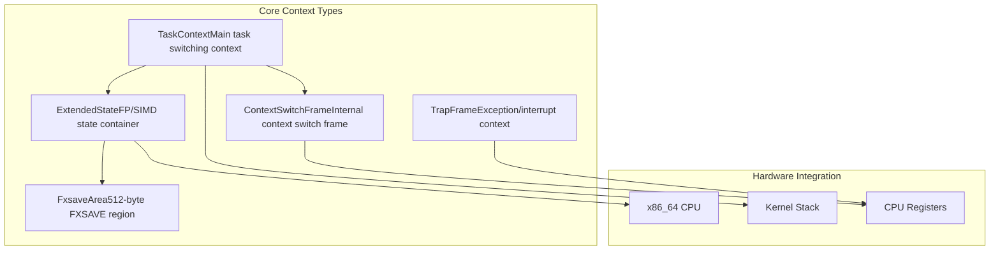
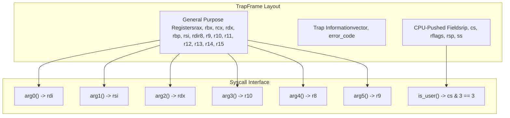
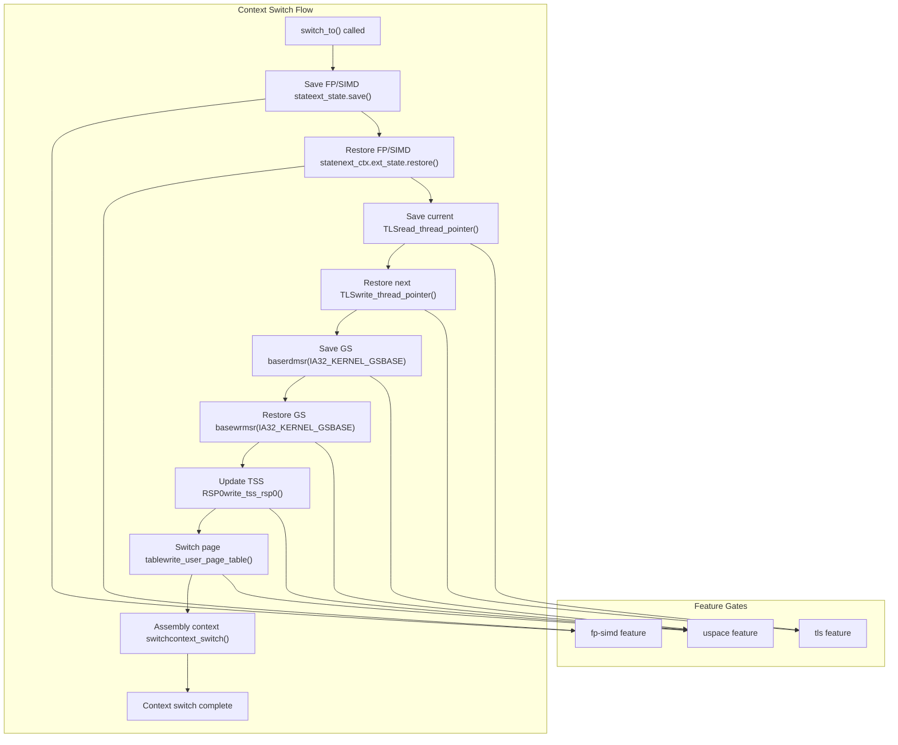
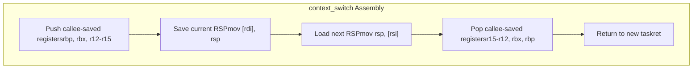
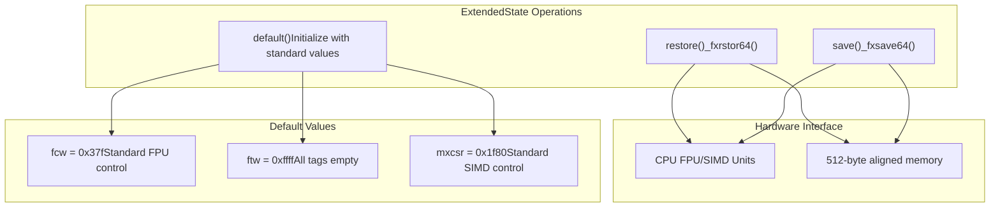
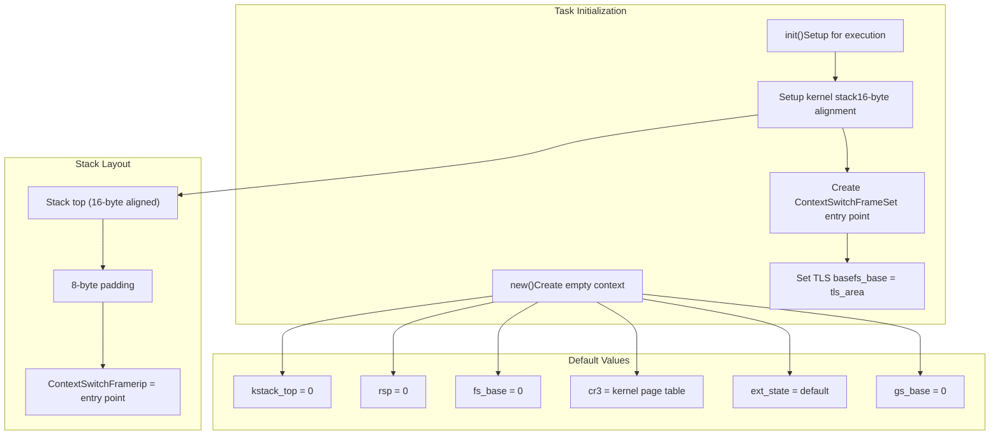
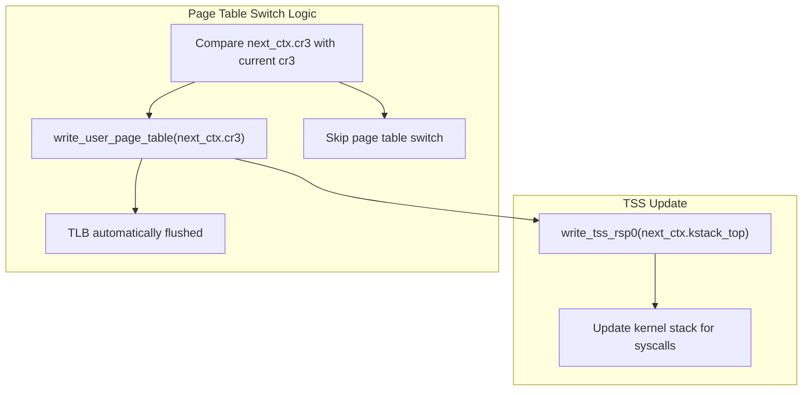

# x86_64 Context Management

> **Relevant source files**
> * [src/x86_64/context.rs](https://github.com/arceos-org/axcpu/blob/b93d8fa3/src/x86_64/context.rs)

This document covers the x86_64 CPU context management implementation in axcpu, focusing on the core data structures and mechanisms used for task context switching, exception handling, and state preservation. The implementation provides both kernel-level task switching and user space context management capabilities.

For x86_64 trap and exception handling mechanisms, see [x86_64 Trap and Exception Handling](/arceos-org/axcpu/2.2-x86_64-trap-and-exception-handling). For system call implementation details, see [x86_64 System Calls](/arceos-org/axcpu/2.3-x86_64-system-calls).

## Core Context Data Structures

The x86_64 context management system uses several key data structures to manage CPU state across different scenarios:

Sources: [src/x86_64/context.rs(L1 - L291)&emsp;](https://github.com/arceos-org/axcpu/blob/b93d8fa3/src/x86_64/context.rs#L1-L291)

### TaskContext Structure

The `TaskContext` struct represents the complete saved hardware state of a task, containing all necessary information for context switching:

|Field|Type|Purpose|Feature Gate|
| --- | --- | --- | --- |
|kstack_top|VirtAddr|Top of kernel stack|Always|
|rsp|u64|Stack pointer after register saves|Always|
|fs_base|usize|Thread Local Storage base|Always|
|gs_base|usize|User space GS base register|uspace|
|ext_state|ExtendedState|FP/SIMD state|fp-simd|
|cr3|PhysAddr|Page table root|uspace|

Sources: [src/x86_64/context.rs(L166 - L183)&emsp;](https://github.com/arceos-org/axcpu/blob/b93d8fa3/src/x86_64/context.rs#L166-L183)

### TrapFrame Structure

The `TrapFrame` captures the complete CPU register state when a trap (interrupt or exception) occurs, containing all general-purpose registers plus trap-specific information:

Sources: [src/x86_64/context.rs(L4 - L72)&emsp;](https://github.com/arceos-org/axcpu/blob/b93d8fa3/src/x86_64/context.rs#L4-L72)

## Context Switching Mechanism

The context switching process involves saving the current task's state and restoring the next task's state through a coordinated sequence of operations:

Sources: [src/x86_64/context.rs(L242 - L265)&emsp;](https://github.com/arceos-org/axcpu/blob/b93d8fa3/src/x86_64/context.rs#L242-L265)

### Assembly Context Switch Implementation

The low-level context switching is implemented in assembly using a naked function that saves and restores callee-saved registers:

Sources: [src/x86_64/context.rs(L268 - L290)&emsp;](https://github.com/arceos-org/axcpu/blob/b93d8fa3/src/x86_64/context.rs#L268-L290)

## Extended State Management

The x86_64 architecture provides extensive floating-point and SIMD capabilities that require specialized state management:

### FxsaveArea Structure

The `FxsaveArea` represents the 512-byte memory region used by the FXSAVE/FXRSTOR instructions:

|Field|Type|Purpose|
| --- | --- | --- |
|fcw|u16|FPU Control Word|
|fsw|u16|FPU Status Word|
|ftw|u16|FPU Tag Word|
|fop|u16|FPU Opcode|
|fip|u64|FPU Instruction Pointer|
|fdp|u64|FPU Data Pointer|
|mxcsr|u32|MXCSR Register|
|mxcsr_mask|u32|MXCSR Mask|
|st|[u64; 16]|ST0-ST7 FPU registers|
|xmm|[u64; 32]|XMM0-XMM15 registers|

Sources: [src/x86_64/context.rs(L86 - L107)&emsp;](https://github.com/arceos-org/axcpu/blob/b93d8fa3/src/x86_64/context.rs#L86-L107)

### ExtendedState Operations

The `ExtendedState` provides methods for saving and restoring FP/SIMD state:

Sources: [src/x86_64/context.rs(L115 - L137)&emsp;](https://github.com/arceos-org/axcpu/blob/b93d8fa3/src/x86_64/context.rs#L115-L137)

## Task Context Initialization

The task context initialization process sets up a new task for execution:

Sources: [src/x86_64/context.rs(L185 - L227)&emsp;](https://github.com/arceos-org/axcpu/blob/b93d8fa3/src/x86_64/context.rs#L185-L227)

## User Space Context Management

When the `uspace` feature is enabled, the context management system provides additional support for user space processes:

### User Space Fields

|Field|Purpose|Usage|
| --- | --- | --- |
|gs_base|User space GS base register|Saved/restored via MSR operations|
|cr3|Page table root|Updated during context switch|

### Page Table Management

The context switching process includes page table switching when transitioning between user space tasks:

Sources: [src/x86_64/context.rs(L253 - L263)&emsp;](https://github.com/arceos-org/axcpu/blob/b93d8fa3/src/x86_64/context.rs#L253-L263)

## System Call Argument Extraction

The `TrapFrame` provides convenient methods for extracting system call arguments following the x86_64 calling convention:

|Method|Register|Purpose|
| --- | --- | --- |
|arg0()|rdi|First argument|
|arg1()|rsi|Second argument|
|arg2()|rdx|Third argument|
|arg3()|r10|Fourth argument (note: r10, not rcx)|
|arg4()|r8|Fifth argument|
|arg5()|r9|Sixth argument|
|is_user()|cs & 3|Check if trap originated from user space|

Sources: [src/x86_64/context.rs(L37 - L71)&emsp;](https://github.com/arceos-org/axcpu/blob/b93d8fa3/src/x86_64/context.rs#L37-L71)