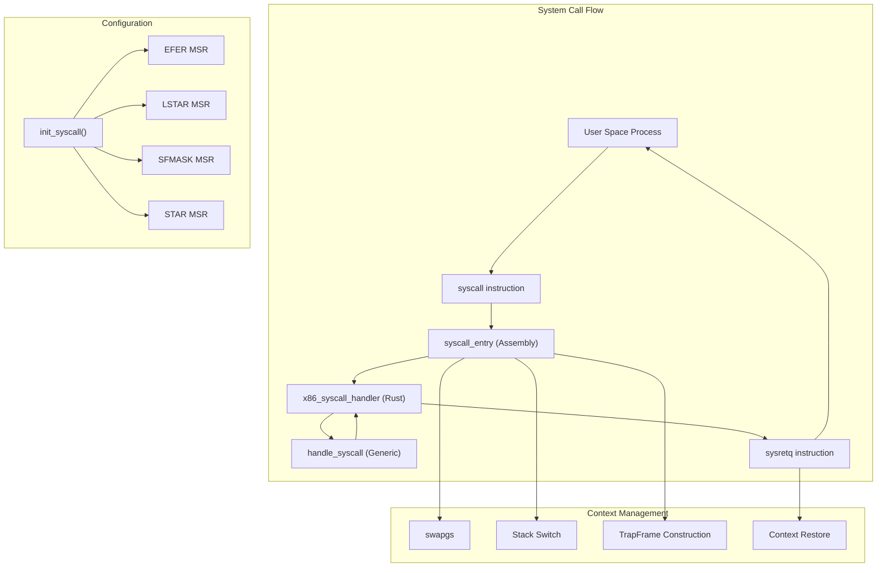
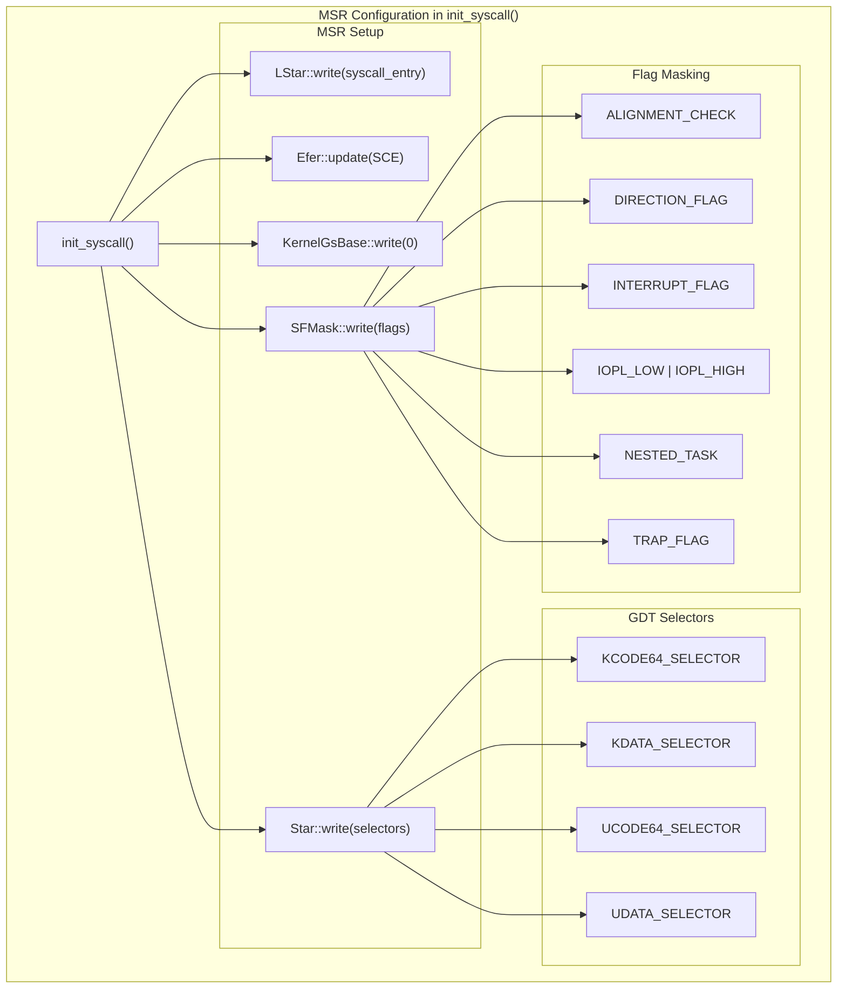
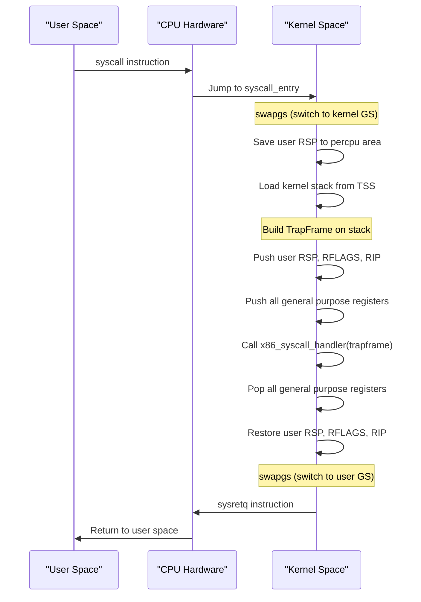
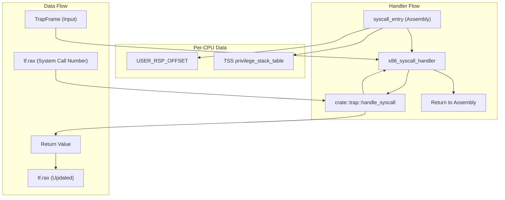
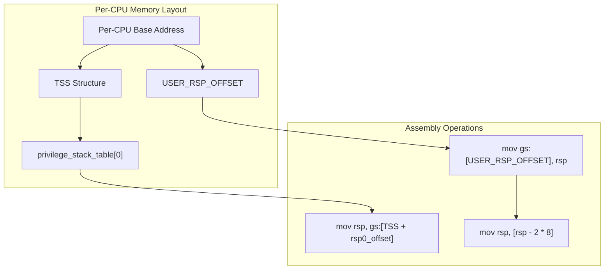
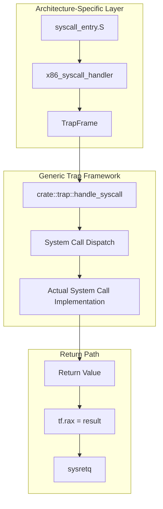

# x86_64 System Calls

> **Relevant source files**
> * [src/riscv/macros.rs](https://github.com/arceos-org/axcpu/blob/b93d8fa3/src/riscv/macros.rs)
> * [src/x86_64/syscall.S](https://github.com/arceos-org/axcpu/blob/b93d8fa3/src/x86_64/syscall.S)
> * [src/x86_64/syscall.rs](https://github.com/arceos-org/axcpu/blob/b93d8fa3/src/x86_64/syscall.rs)

This document covers the x86_64 system call implementation in the axcpu library, including the low-level assembly entry point, MSR configuration, and user-kernel transition mechanisms. The system call interface enables user space programs to request kernel services through the `syscall` instruction.

For general trap and exception handling beyond system calls, see [x86_64 Trap and Exception Handling](/arceos-org/axcpu/2.2-x86_64-trap-and-exception-handling). For user space context management across architectures, see [User Space Support](/arceos-org/axcpu/6.1-user-space-support).

## System Call Architecture Overview

The x86_64 system call implementation consists of three main components: MSR configuration during initialization, the assembly entry point that handles the low-level transition, and the Rust handler that processes the actual system call.



**Sources:** [src/x86_64/syscall.rs(L1 - L49)&emsp;](https://github.com/arceos-org/axcpu/blob/b93d8fa3/src/x86_64/syscall.rs#L1-L49) [src/x86_64/syscall.S(L1 - L56)&emsp;](https://github.com/arceos-org/axcpu/blob/b93d8fa3/src/x86_64/syscall.S#L1-L56)

## System Call Initialization

The `init_syscall` function configures the x86_64 Fast System Call mechanism by programming several Model Specific Registers (MSRs).

|MSR|Purpose|Configuration|
| --- | --- | --- |
|LSTAR|Long Syscall Target Address|Points tosyscall_entryassembly function|
|STAR|Syscall Target Address|Contains segment selectors for user/kernel code/data|
|SFMASK|Syscall Flag Mask|Masks specific RFLAGS during syscall execution|
|EFER|Extended Feature Enable|Enables System Call Extensions (SCE bit)|



The `SFMASK` register masks flags with value `0x47700`, ensuring that potentially dangerous flags like interrupts and trap flags are cleared during system call execution.

**Sources:** [src/x86_64/syscall.rs(L22 - L48)&emsp;](https://github.com/arceos-org/axcpu/blob/b93d8fa3/src/x86_64/syscall.rs#L22-L48)

## Assembly Entry Point

The `syscall_entry` function in assembly handles the low-level transition from user space to kernel space. It performs critical operations including GS base swapping, stack switching, and trap frame construction.



### Key Assembly Operations

The entry point performs these critical steps:

1. **GS Base Switching**: `swapgs` switches between user and kernel GS base registers
2. **Stack Management**: Saves user RSP and switches to kernel stack from TSS
3. **Register Preservation**: Pushes all general-purpose registers to build a `TrapFrame`
4. **Handler Invocation**: Calls `x86_syscall_handler` with the trap frame pointer
5. **Context Restoration**: Restores all registers and user context
6. **Return**: Uses `sysretq` to return to user space

**Sources:** [src/x86_64/syscall.S(L3 - L55)&emsp;](https://github.com/arceos-org/axcpu/blob/b93d8fa3/src/x86_64/syscall.S#L3-L55)

## System Call Handler

The Rust-based system call handler processes the actual system call request after the assembly entry point has set up the execution context.



The handler function is minimal but critical:

```rust
#[unsafe(no_mangle)]
pub(super) fn x86_syscall_handler(tf: &mut TrapFrame) {
    tf.rax = crate::trap::handle_syscall(tf, tf.rax as usize) as u64;
}
```

It extracts the system call number from `rax`, delegates to the generic system call handler, and stores the return value back in `rax` for return to user space.

**Sources:** [src/x86_64/syscall.rs(L17 - L20)&emsp;](https://github.com/arceos-org/axcpu/blob/b93d8fa3/src/x86_64/syscall.rs#L17-L20)

## Per-CPU State Management

The system call implementation uses per-CPU variables to manage state during the user-kernel transition:

|Variable|Purpose|Usage|
| --- | --- | --- |
|USER_RSP_OFFSET|Stores user stack pointer|Saved during entry, restored during exit|
|TSS.privilege_stack_table|Kernel stack pointer|Loaded from TSS during stack switch|



The per-CPU storage ensures that system calls work correctly in multi-CPU environments where each CPU needs its own temporary storage for user state.

**Sources:** [src/x86_64/syscall.rs(L9 - L10)&emsp;](https://github.com/arceos-org/axcpu/blob/b93d8fa3/src/x86_64/syscall.rs#L9-L10) [src/x86_64/syscall.S(L5 - L6)&emsp;](https://github.com/arceos-org/axcpu/blob/b93d8fa3/src/x86_64/syscall.S#L5-L6) [src/x86_64/syscall.S(L52)&emsp;](https://github.com/arceos-org/axcpu/blob/b93d8fa3/src/x86_64/syscall.S#L52-L52)

## Integration with Trap Framework

The x86_64 system call implementation integrates with the broader trap handling framework through the `handle_syscall` function, which provides architecture-independent system call processing.



This layered approach allows the generic trap framework to handle system call logic while the x86_64-specific code manages the low-level hardware interface and calling conventions.

**Sources:** [src/x86_64/syscall.rs(L18 - L19)&emsp;](https://github.com/arceos-org/axcpu/blob/b93d8fa3/src/x86_64/syscall.rs#L18-L19)