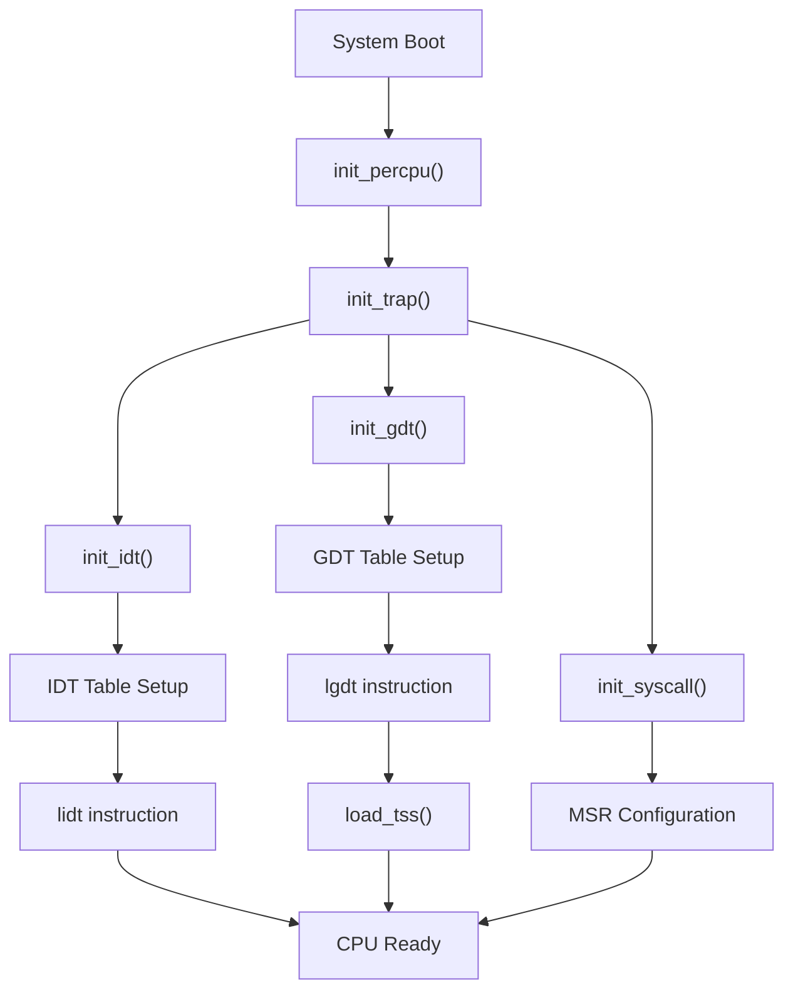
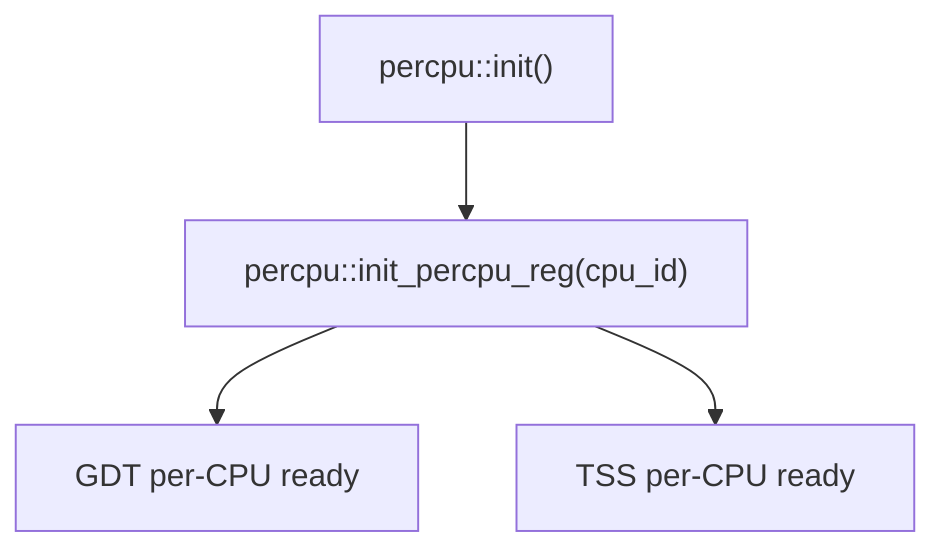
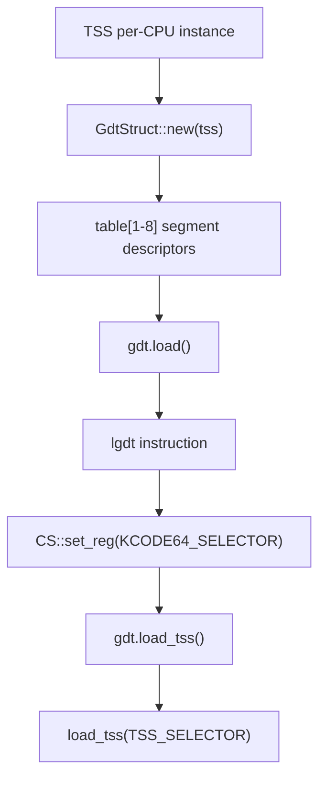
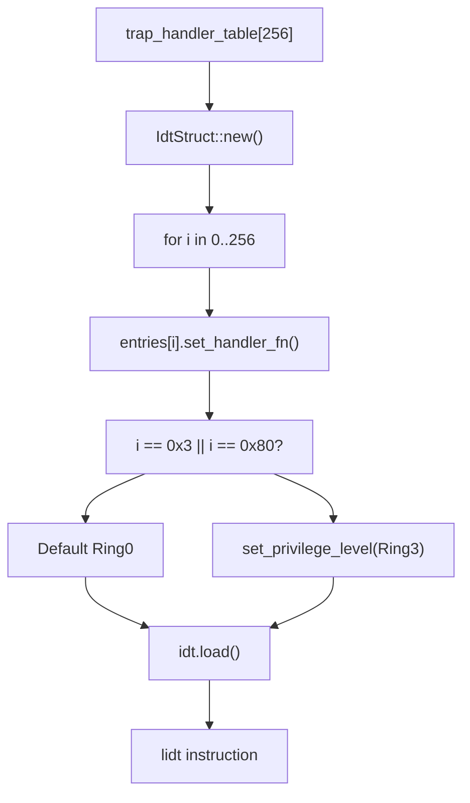
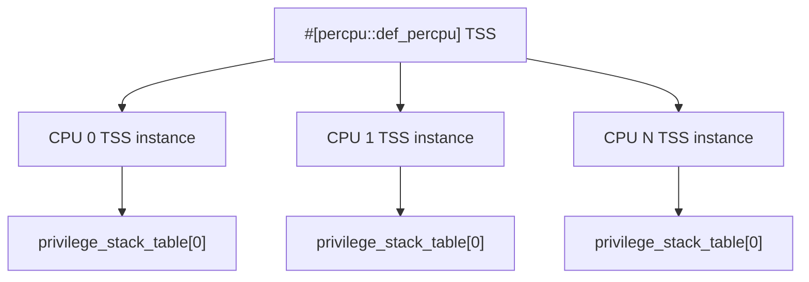

# x86_64 System Initialization

> **Relevant source files**
> * [src/x86_64/gdt.rs](https://github.com/arceos-org/axcpu/blob/b93d8fa3/src/x86_64/gdt.rs)
> * [src/x86_64/idt.rs](https://github.com/arceos-org/axcpu/blob/b93d8fa3/src/x86_64/idt.rs)
> * [src/x86_64/init.rs](https://github.com/arceos-org/axcpu/blob/b93d8fa3/src/x86_64/init.rs)

This document covers the x86_64 CPU initialization procedures during system bootstrap, including the setup of critical system tables and per-CPU data structures. The initialization process establishes the Global Descriptor Table (GDT), Interrupt Descriptor Table (IDT), and prepares the CPU for trap handling and task switching.

For x86_64 trap and exception handling mechanisms, see [x86_64 Trap and Exception Handling](/arceos-org/axcpu/2.2-x86_64-trap-and-exception-handling). For x86_64 system call implementation details, see [x86_64 System Calls](/arceos-org/axcpu/2.3-x86_64-system-calls).

## Initialization Overview

The x86_64 system initialization follows a structured sequence that prepares the CPU for operation in both kernel and user modes. The process is coordinated through the `init` module and involves setting up fundamental x86_64 system tables.



**Initialization Sequence Flow**

Sources: [src/x86_64/init.rs(L15 - L38)&emsp;](https://github.com/arceos-org/axcpu/blob/b93d8fa3/src/x86_64/init.rs#L15-L38)

## Per-CPU Data Structure Initialization

The `init_percpu()` function establishes per-CPU data structures required for multi-core operation. This initialization must occur before trap handling setup.

|Function|Purpose|Dependencies|
| --- | --- | --- |
|percpu::init()|Initialize percpu framework|None|
|percpu::init_percpu_reg()|Set CPU-specific register|CPU ID|

The function takes a `cpu_id` parameter to configure CPU-specific storage and must be called on each CPU core before `init_trap()`.



**Per-CPU Initialization Dependencies**

Sources: [src/x86_64/init.rs(L15 - L18)&emsp;](https://github.com/arceos-org/axcpu/blob/b93d8fa3/src/x86_64/init.rs#L15-L18)

## Global Descriptor Table (GDT) Initialization

The GDT setup establishes memory segmentation for x86_64 operation, including kernel and user code/data segments plus the Task State Segment (TSS).

### GDT Structure

The `GdtStruct` contains predefined segment selectors for different privilege levels and operating modes:

|Selector|Index|Purpose|Privilege|
| --- | --- | --- | --- |
|KCODE32_SELECTOR|1|Kernel 32-bit code|Ring 0|
|KCODE64_SELECTOR|2|Kernel 64-bit code|Ring 0|
|KDATA_SELECTOR|3|Kernel data|Ring 0|
|UCODE32_SELECTOR|4|User 32-bit code|Ring 3|
|UDATA_SELECTOR|5|User data|Ring 3|
|UCODE64_SELECTOR|6|User 64-bit code|Ring 3|
|TSS_SELECTOR|7|Task State Segment|Ring 0|

### GDT Initialization Process



**GDT Setup and Loading Process**

The TSS is configured as a per-CPU structure using the `percpu` crate, allowing each CPU core to maintain its own stack pointers and state information.

Sources: [src/x86_64/gdt.rs(L104 - L111)&emsp;](https://github.com/arceos-org/axcpu/blob/b93d8fa3/src/x86_64/gdt.rs#L104-L111) [src/x86_64/gdt.rs(L41 - L55)&emsp;](https://github.com/arceos-org/axcpu/blob/b93d8fa3/src/x86_64/gdt.rs#L41-L55) [src/x86_64/gdt.rs(L73 - L90)&emsp;](https://github.com/arceos-org/axcpu/blob/b93d8fa3/src/x86_64/gdt.rs#L73-L90)

## Interrupt Descriptor Table (IDT) Initialization

The IDT setup configures interrupt and exception handlers for the x86_64 architecture, mapping 256 possible interrupt vectors to their respective handler functions.

### IDT Structure and Handler Mapping

The `IdtStruct` populates all 256 interrupt vectors from an external `trap_handler_table`:



**IDT Initialization and Handler Assignment**

### Special Privilege Level Handling

Two interrupt vectors receive special Ring 3 (user mode) access privileges:

* Vector `0x3`: Breakpoint exception for user-space debugging
* Vector `0x80`: Legacy system call interface

Sources: [src/x86_64/idt.rs(L22 - L46)&emsp;](https://github.com/arceos-org/axcpu/blob/b93d8fa3/src/x86_64/idt.rs#L22-L46) [src/x86_64/idt.rs(L77 - L81)&emsp;](https://github.com/arceos-org/axcpu/blob/b93d8fa3/src/x86_64/idt.rs#L77-L81)

## System Call Initialization (Optional)

When the `uspace` feature is enabled, `init_syscall()` configures Model-Specific Registers (MSRs) for fast system call handling using the `syscall`/`sysret` instructions.

```

```

**Conditional System Call Initialization**

The system call initialization is conditionally compiled and only executed when user space support is required.

Sources: [src/x86_64/init.rs(L6 - L7)&emsp;](https://github.com/arceos-org/axcpu/blob/b93d8fa3/src/x86_64/init.rs#L6-L7) [src/x86_64/init.rs(L36 - L37)&emsp;](https://github.com/arceos-org/axcpu/blob/b93d8fa3/src/x86_64/init.rs#L36-L37)

## Task State Segment (TSS) Management

The TSS provides crucial stack switching capabilities for privilege level transitions, particularly important for user space support.

### TSS Per-CPU Organization



**Per-CPU TSS Instance Management**

The TSS includes utility functions for managing the Ring 0 stack pointer (`RSP0`) used during privilege level transitions:

* `read_tss_rsp0()`: Retrieves current RSP0 value
* `write_tss_rsp0()`: Updates RSP0 for kernel stack switching

Sources: [src/x86_64/gdt.rs(L10 - L12)&emsp;](https://github.com/arceos-org/axcpu/blob/b93d8fa3/src/x86_64/gdt.rs#L10-L12) [src/x86_64/gdt.rs(L114 - L129)&emsp;](https://github.com/arceos-org/axcpu/blob/b93d8fa3/src/x86_64/gdt.rs#L114-L129)

## Complete Initialization Function

The `init_trap()` function orchestrates the complete x86_64 system initialization sequence:

```rust
pub fn init_trap() {
    init_gdt();
    init_idt();
    #[cfg(feature = "uspace")]
    init_syscall();
}
```

This function must be called after `init_percpu()` to ensure proper per-CPU data structure availability. The initialization establishes a fully functional x86_64 CPU state capable of handling interrupts, exceptions, and system calls.

Sources: [src/x86_64/init.rs(L33 - L38)&emsp;](https://github.com/arceos-org/axcpu/blob/b93d8fa3/src/x86_64/init.rs#L33-L38)