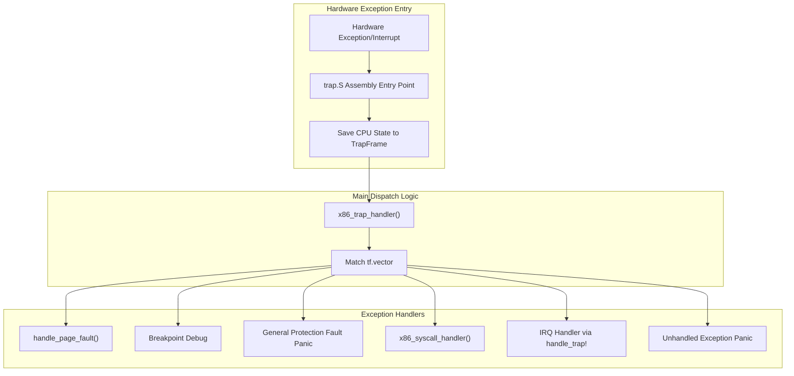
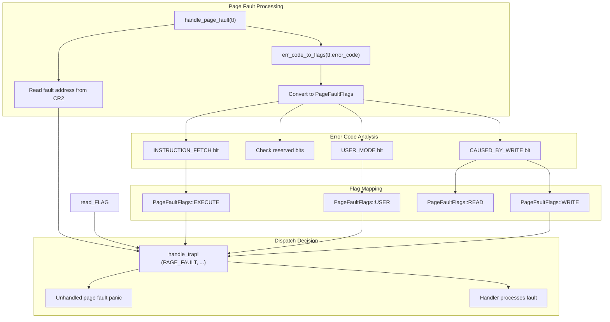
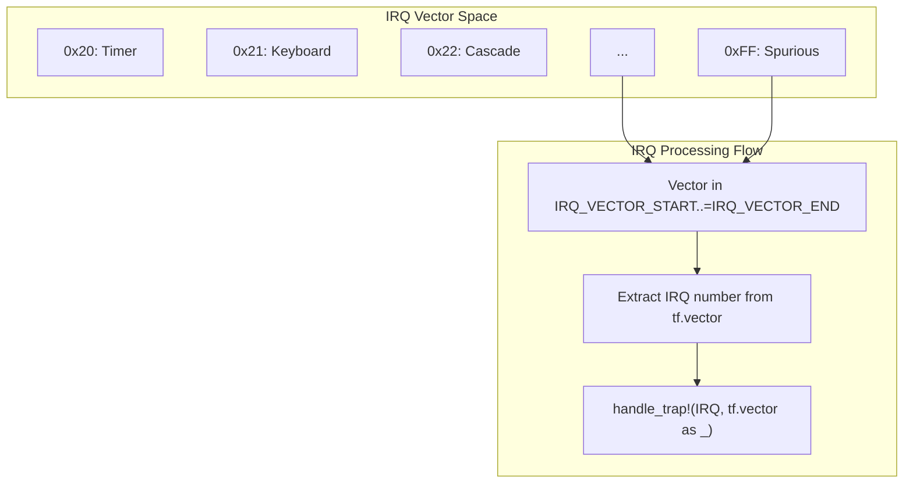

# x86_64 Trap and Exception Handling

> **Relevant source files**
> * [src/x86_64/trap.rs](https://github.com/arceos-org/axcpu/blob/b93d8fa3/src/x86_64/trap.rs)

This document covers the x86_64-specific trap and exception handling implementation in the axcpu library. It focuses on how hardware exceptions, interrupts, and system calls are processed and dispatched to appropriate handlers on the x86_64 architecture.

For broader context management including `TrapFrame` structure details, see [x86_64 Context Management](/arceos-org/axcpu/2.1-x86_64-context-management). For system call implementation specifics, see [x86_64 System Calls](/arceos-org/axcpu/2.2-x86_64-trap-and-exception-handling). For cross-architecture trap handling abstractions, see [Core Trap Handling Framework](/arceos-org/axcpu/6.2-core-trap-handling-framework).

## Exception Dispatch Architecture

The x86_64 trap handling system centers around the `x86_trap_handler` function, which serves as the main dispatcher for all hardware exceptions and interrupts. This handler examines the trap vector number to determine the appropriate response.



The dispatch mechanism uses a simple match statement on the trap vector stored in the `TrapFrame`. Each vector corresponds to a specific x86_64 exception or interrupt type defined by the hardware architecture.

**Sources:** [src/x86_64/trap.rs(L33 - L59)&emsp;](https://github.com/arceos-org/axcpu/blob/b93d8fa3/src/x86_64/trap.rs#L33-L59)

## Vector Classification and Constants

The trap handler categorizes exceptions and interrupts using predefined vector constants that correspond to x86_64 architectural definitions:

|Vector Type|Range/Value|Purpose|
| --- | --- | --- |
|PAGE_FAULT_VECTOR|14|Memory access violations|
|BREAKPOINT_VECTOR|3|Debug breakpoints|
|GENERAL_PROTECTION_FAULT_VECTOR|13|Protection violations|
|LEGACY_SYSCALL_VECTOR|0x80|System calls (int 0x80)|
|IRQ_VECTOR_STARTtoIRQ_VECTOR_END|0x20-0xFF|Hardware interrupts|

**Sources:** [src/x86_64/trap.rs(L10 - L13)&emsp;](https://github.com/arceos-org/axcpu/blob/b93d8fa3/src/x86_64/trap.rs#L10-L13) [src/x86_64/trap.rs(L34 - L47)&emsp;](https://github.com/arceos-org/axcpu/blob/b93d8fa3/src/x86_64/trap.rs#L34-L47)

## Page Fault Handling

Page fault processing involves extracting the fault address from the CR2 control register and converting the hardware error code into portable flags for the broader trap handling framework.



The `err_code_to_flags` function translates x86_64 page fault error codes into architecture-neutral `PageFaultFlags`. This abstraction allows the same page fault logic to work across different architectures.

**Sources:** [src/x86_64/trap.rs(L15 - L30)&emsp;](https://github.com/arceos-org/axcpu/blob/b93d8fa3/src/x86_64/trap.rs#L15-L30) [src/x86_64/trap.rs(L69 - L92)&emsp;](https://github.com/arceos-org/axcpu/blob/b93d8fa3/src/x86_64/trap.rs#L69-L92)

## Interrupt Request (IRQ) Handling

Hardware interrupts occupy vector numbers 0x20 through 0xFF and are handled through the unified trap framework. The handler identifies IRQ vectors and delegates processing to registered handlers.



The IRQ handling delegates to the cross-architecture trap framework using the `handle_trap!` macro, which allows different system components to register interrupt handlers.

**Sources:** [src/x86_64/trap.rs(L45 - L47)&emsp;](https://github.com/arceos-org/axcpu/blob/b93d8fa3/src/x86_64/trap.rs#L45-L47)

## Assembly Integration

The trap handling system integrates with assembly code through the `trap.S` file, which contains the low-level exception entry points and state saving routines.

```

```

The assembly code is included at compile time and provides the hardware-level interface between x86_64 exception mechanisms and the Rust handler functions.

**Sources:** [src/x86_64/trap.rs(L7)&emsp;](https://github.com/arceos-org/axcpu/blob/b93d8fa3/src/x86_64/trap.rs#L7-L7)

## System Call Integration

When the `uspace` feature is enabled, the trap handler supports legacy system calls via the `int 0x80` instruction. This provides compatibility with traditional Unix system call interfaces.

```

```

System call handling is feature-gated and delegates to the dedicated system call module for processing.

**Sources:** [src/x86_64/trap.rs(L9 - L10)&emsp;](https://github.com/arceos-org/axcpu/blob/b93d8fa3/src/x86_64/trap.rs#L9-L10) [src/x86_64/trap.rs(L44)&emsp;](https://github.com/arceos-org/axcpu/blob/b93d8fa3/src/x86_64/trap.rs#L44-L44)

## Error Handling and Diagnostics

The trap handler implements comprehensive error reporting for unhandled exceptions and invalid page faults. Critical errors result in detailed panic messages that include register state and fault information.

### Unhandled Exception Reporting

For unknown or unsupported exception vectors, the handler provides detailed diagnostic information including vector number, mnemonic name, error code, and complete register state dump.

### Page Fault Error Reporting

Page fault panics include comprehensive fault analysis showing whether the fault occurred in user or kernel mode, the faulting instruction address, the virtual address that caused the fault, and the decoded access flags.

**Sources:** [src/x86_64/trap.rs(L20 - L29)&emsp;](https://github.com/arceos-org/axcpu/blob/b93d8fa3/src/x86_64/trap.rs#L20-L29) [src/x86_64/trap.rs(L48 - L57)&emsp;](https://github.com/arceos-org/axcpu/blob/b93d8fa3/src/x86_64/trap.rs#L48-L57) [src/x86_64/trap.rs(L61 - L67)&emsp;](https://github.com/arceos-org/axcpu/blob/b93d8fa3/src/x86_64/trap.rs#L61-L67)

## Integration with Cross-Architecture Framework

The x86_64 trap handler integrates with the broader axcpu trap handling framework through the `handle_trap!` macro and standardized flag types like `PageFaultFlags`. This design allows architecture-specific trap handling while maintaining consistent interfaces for higher-level system components.

**Sources:** [src/x86_64/trap.rs(L5)&emsp;](https://github.com/arceos-org/axcpu/blob/b93d8fa3/src/x86_64/trap.rs#L5-L5) [src/x86_64/trap.rs(L19)&emsp;](https://github.com/arceos-org/axcpu/blob/b93d8fa3/src/x86_64/trap.rs#L19-L19) [src/x86_64/trap.rs(L46)&emsp;](https://github.com/arceos-org/axcpu/blob/b93d8fa3/src/x86_64/trap.rs#L46-L46)