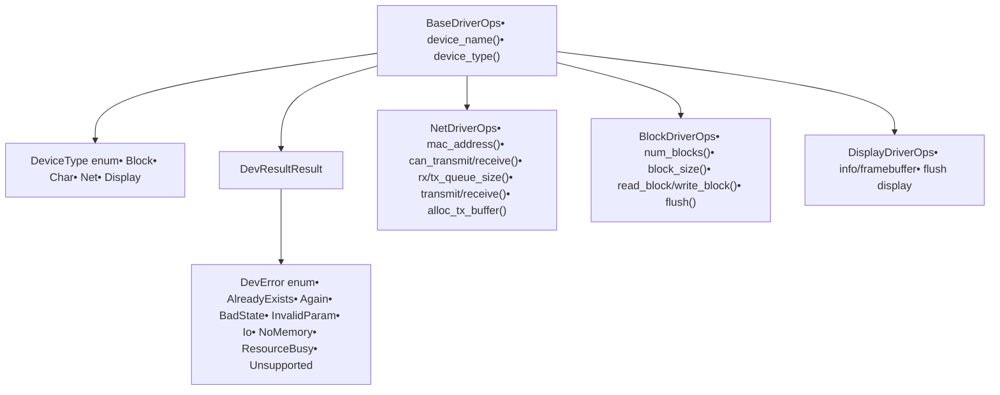
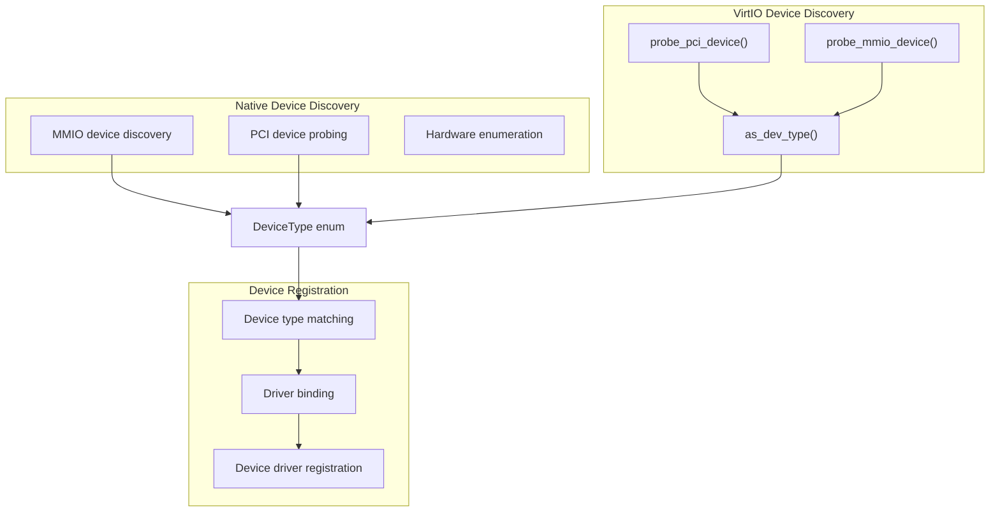
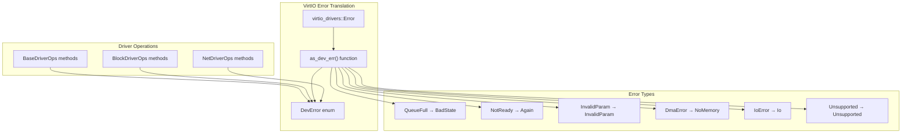
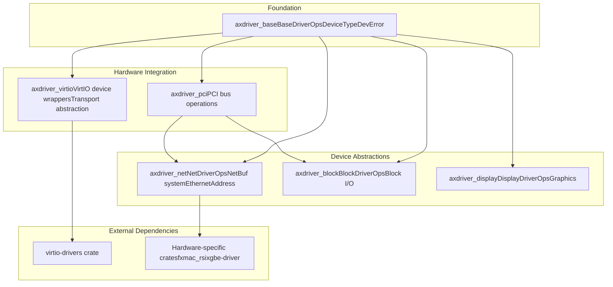

# Architecture and Design

> **Relevant source files**
> * [axdriver_base/src/lib.rs](https://github.com/arceos-org/axdriver_crates/blob/84eb2170/axdriver_base/src/lib.rs)
> * [axdriver_block/src/lib.rs](https://github.com/arceos-org/axdriver_crates/blob/84eb2170/axdriver_block/src/lib.rs)
> * [axdriver_net/src/lib.rs](https://github.com/arceos-org/axdriver_crates/blob/84eb2170/axdriver_net/src/lib.rs)
> * [axdriver_virtio/src/lib.rs](https://github.com/arceos-org/axdriver_crates/blob/84eb2170/axdriver_virtio/src/lib.rs)

## Purpose and Scope

This document describes the architectural foundations and design principles that unify the axdriver_crates framework. It covers the trait hierarchy, modular organization, error handling patterns, and compilation strategies that enable building device drivers for ArceOS across different hardware platforms and virtualized environments.

For detailed information about specific device types, see [Foundation Layer (axdriver_base)](/arceos-org/axdriver_crates/3-foundation-layer-(axdriver_base)), [Network Drivers](/arceos-org/axdriver_crates/4-network-drivers), [Block Storage Drivers](/arceos-org/axdriver_crates/5-block-storage-drivers), [Display Drivers](/arceos-org/axdriver_crates/6-display-drivers), and [VirtIO Integration](/arceos-org/axdriver_crates/7-virtio-integration). For build system details, see [Development and Build Configuration](/arceos-org/axdriver_crates/9-development-and-build-configuration).

## Core Architectural Principles

The axdriver_crates framework follows several key design principles that promote modularity, type safety, and cross-platform compatibility:

### Trait-Based Driver Interface

All device drivers implement a common trait hierarchy starting with `BaseDriverOps`. This provides a uniform interface for device management while allowing device-specific functionality through specialized traits.

### Zero-Cost Abstractions

The framework leverages Rust's type system and compilation features to provide high-level abstractions without runtime overhead. Device-specific functionality is conditionally compiled based on cargo features.

### Hardware Abstraction Layering

The framework separates device logic from hardware-specific operations through abstraction layers, enabling the same driver interface to work with both native hardware and virtualized devices.

## Trait Hierarchy and Inheritance Model

The framework establishes a clear inheritance hierarchy where all drivers share common operations while extending with device-specific capabilities.

### Base Driver Operations

**Diagram: Core Trait Hierarchy and Type System**

Sources: [axdriver_base/src/lib.rs(L18 - L62)&emsp;](https://github.com/arceos-org/axdriver_crates/blob/84eb2170/axdriver_base/src/lib.rs#L18-L62) [axdriver_net/src/lib.rs(L24 - L68)&emsp;](https://github.com/arceos-org/axdriver_crates/blob/84eb2170/axdriver_net/src/lib.rs#L24-L68) [axdriver_block/src/lib.rs(L15 - L38)&emsp;](https://github.com/arceos-org/axdriver_crates/blob/84eb2170/axdriver_block/src/lib.rs#L15-L38)

### Device-Specific Extensions

Each device type extends the base operations with specialized functionality:

|Trait|Key Operations|Buffer Management|Hardware Integration|
| --- | --- | --- | --- |
|NetDriverOps|transmit(),receive(),mac_address()|NetBufPtr,NetBufPool|NIC hardware, packet processing|
|BlockDriverOps|read_block(),write_block(),flush()|Direct buffer I/O|Storage controllers, file systems|
|DisplayDriverOps|framebuffer(),flush()|Framebuffer management|Graphics hardware, display output|

Sources: [axdriver_net/src/lib.rs(L24 - L68)&emsp;](https://github.com/arceos-org/axdriver_crates/blob/84eb2170/axdriver_net/src/lib.rs#L24-L68) [axdriver_block/src/lib.rs(L15 - L38)&emsp;](https://github.com/arceos-org/axdriver_crates/blob/84eb2170/axdriver_block/src/lib.rs#L15-L38)

## Device Type Abstraction System

The framework uses a centralized device type system that enables uniform device discovery and management across different hardware platforms.

**Diagram: Device Type Abstraction and Discovery Flow**

The `DeviceType` enum serves as the central abstraction that maps hardware devices to appropriate driver implementations. The VirtIO integration demonstrates this pattern through type conversion functions that translate VirtIO-specific device types to the common `DeviceType` enumeration.

Sources: [axdriver_base/src/lib.rs(L18 - L29)&emsp;](https://github.com/arceos-org/axdriver_crates/blob/84eb2170/axdriver_base/src/lib.rs#L18-L29) [axdriver_virtio/src/lib.rs(L71 - L79)&emsp;](https://github.com/arceos-org/axdriver_crates/blob/84eb2170/axdriver_virtio/src/lib.rs#L71-L79) [axdriver_virtio/src/lib.rs(L38 - L69)&emsp;](https://github.com/arceos-org/axdriver_crates/blob/84eb2170/axdriver_virtio/src/lib.rs#L38-L69)

## Error Handling Design

The framework implements a unified error handling strategy through the `DevResult<T>` type and standardized error codes in `DevError`.

### Error Code Mapping

The framework provides consistent error semantics across different hardware backends through error code translation:

**Diagram: Unified Error Handling Architecture**

This design enables consistent error handling across different driver implementations while preserving semantic meaning of hardware-specific error conditions.

Sources: [axdriver_base/src/lib.rs(L31 - L53)&emsp;](https://github.com/arceos-org/axdriver_crates/blob/84eb2170/axdriver_base/src/lib.rs#L31-L53) [axdriver_virtio/src/lib.rs(L82 - L97)&emsp;](https://github.com/arceos-org/axdriver_crates/blob/84eb2170/axdriver_virtio/src/lib.rs#L82-L97)

## Modular Workspace Organization

The framework employs a modular workspace structure that promotes code reuse and selective compilation.

### Workspace Dependency Graph

**Diagram: Workspace Module Dependencies**

This organization allows applications to selectively include only the device drivers needed for their target platform, minimizing binary size and compilation time.

Sources: [axdriver_base/src/lib.rs(L1 - L15)&emsp;](https://github.com/arceos-org/axdriver_crates/blob/84eb2170/axdriver_base/src/lib.rs#L1-L15) [axdriver_net/src/lib.rs(L6 - L11)&emsp;](https://github.com/arceos-org/axdriver_crates/blob/84eb2170/axdriver_net/src/lib.rs#L6-L11) [axdriver_block/src/lib.rs(L6 - L10)&emsp;](https://github.com/arceos-org/axdriver_crates/blob/84eb2170/axdriver_block/src/lib.rs#L6-L10) [axdriver_virtio/src/lib.rs(L16 - L28)&emsp;](https://github.com/arceos-org/axdriver_crates/blob/84eb2170/axdriver_virtio/src/lib.rs#L16-L28)

## Feature-Based Compilation Strategy

The framework uses cargo features to enable conditional compilation of device drivers and their dependencies.

### Feature Organization Pattern

|Crate|Features|Purpose|
| --- | --- | --- |
|axdriver_net|ixgbe,fxmac|Specific NIC hardware support|
|axdriver_block|ramdisk,bcm2835-sdhci|Storage device implementations|
|axdriver_virtio|block,net,gpu|VirtIO device types|

This pattern enables several deployment scenarios:

* **Minimal embedded**: Only essential drivers compiled in
* **Full server**: All available drivers for maximum hardware compatibility
* **Virtualized**: Only VirtIO drivers for VM environments
* **Development**: All drivers for testing and validation

Sources: [axdriver_net/src/lib.rs(L6 - L11)&emsp;](https://github.com/arceos-org/axdriver_crates/blob/84eb2170/axdriver_net/src/lib.rs#L6-L11) [axdriver_block/src/lib.rs(L6 - L10)&emsp;](https://github.com/arceos-org/axdriver_crates/blob/84eb2170/axdriver_block/src/lib.rs#L6-L10) [axdriver_virtio/src/lib.rs(L16 - L21)&emsp;](https://github.com/arceos-org/axdriver_crates/blob/84eb2170/axdriver_virtio/src/lib.rs#L16-L21)

## Hardware Abstraction Patterns

The framework implements two primary patterns for hardware abstraction:

### Direct Hardware Integration

For native hardware drivers, the framework integrates with hardware-specific crates that provide low-level device access. This pattern is used by drivers like FXmac and Intel ixgbe network controllers.

### Virtualization Layer Integration

For virtualized environments, the framework provides adapter implementations that wrap external VirtIO drivers to implement the common trait interfaces. This enables the same driver API to work across both physical and virtual hardware.

The VirtIO integration demonstrates sophisticated error translation and type conversion to maintain API compatibility while leveraging mature external driver implementations.

Sources: [axdriver_virtio/src/lib.rs(L38 - L97)&emsp;](https://github.com/arceos-org/axdriver_crates/blob/84eb2170/axdriver_virtio/src/lib.rs#L38-L97) [axdriver_net/src/lib.rs(L6 - L11)&emsp;](https://github.com/arceos-org/axdriver_crates/blob/84eb2170/axdriver_net/src/lib.rs#L6-L11)