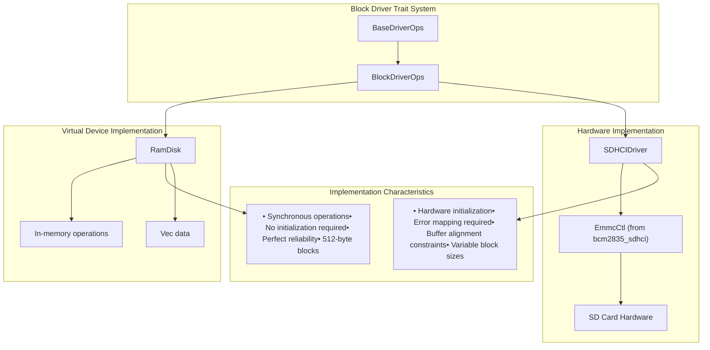
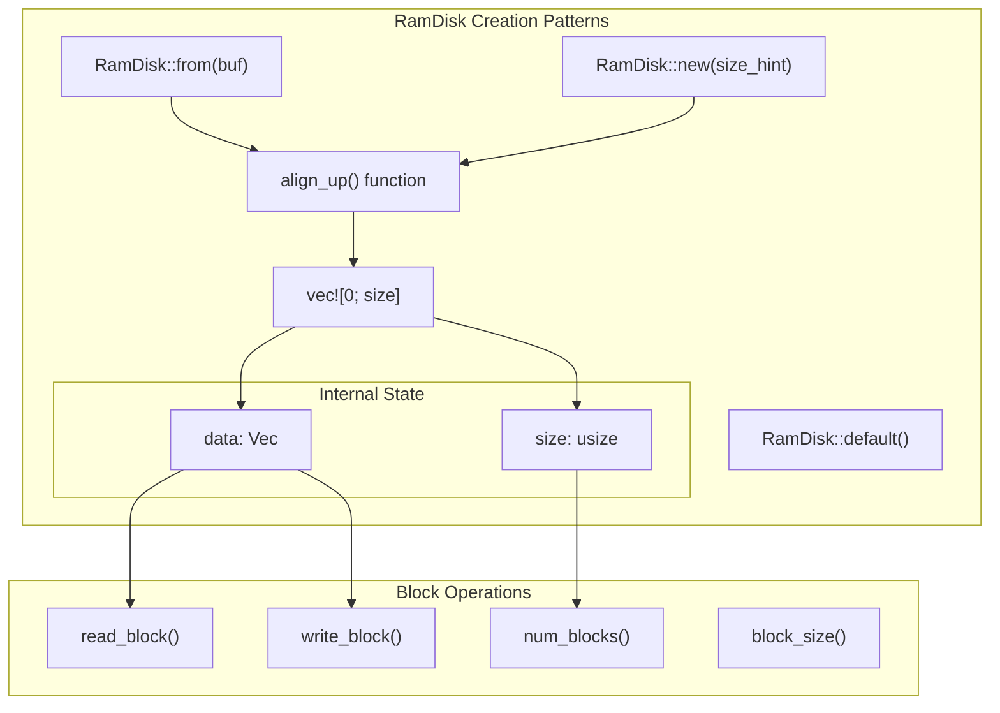
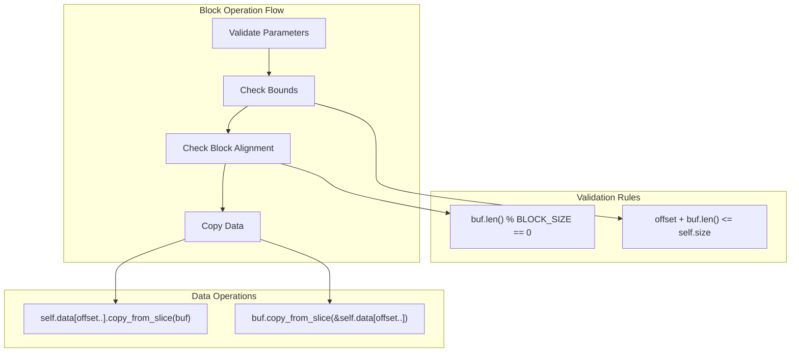
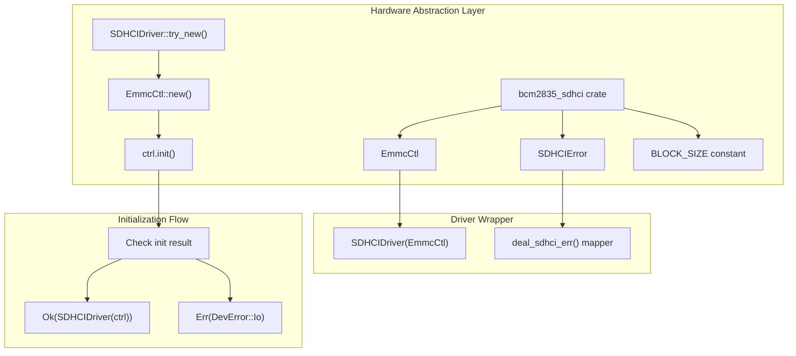
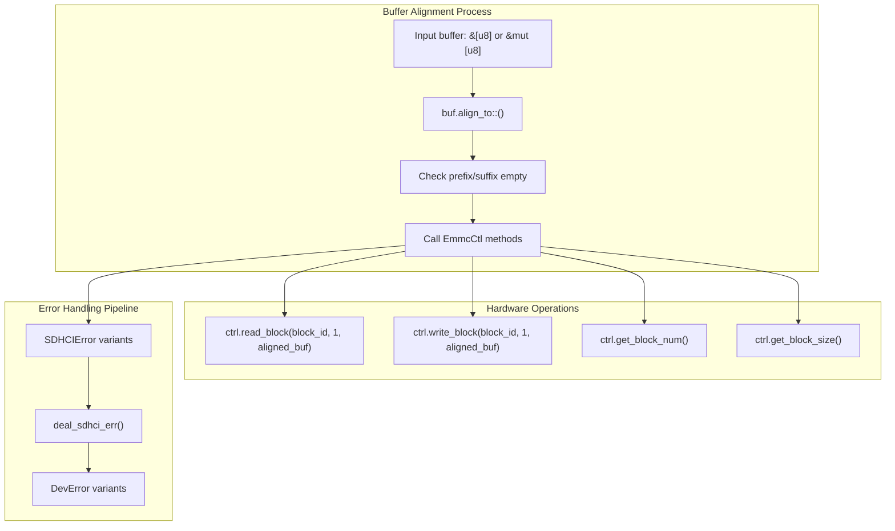
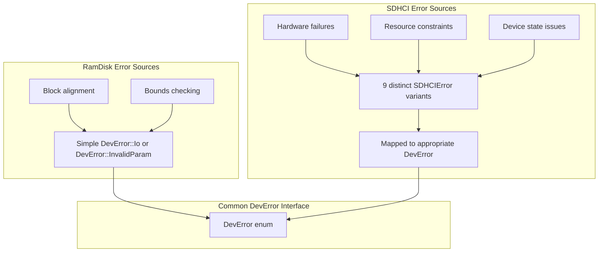

# Block Device Implementations

> **Relevant source files**
> * [axdriver_block/src/bcm2835sdhci.rs](https://github.com/arceos-org/axdriver_crates/blob/84eb2170/axdriver_block/src/bcm2835sdhci.rs)
> * [axdriver_block/src/ramdisk.rs](https://github.com/arceos-org/axdriver_crates/blob/84eb2170/axdriver_block/src/ramdisk.rs)

This document covers the concrete implementations of block storage devices in the axdriver framework. These implementations demonstrate how the abstract `BlockDriverOps` trait is realized for different types of storage hardware and virtual devices. For information about the block driver interface and trait definitions, see [Block Driver Interface](/arceos-org/axdriver_crates/5.1-block-driver-interface).

The implementations covered include both software-based virtual devices and hardware-specific drivers, showcasing the flexibility of the block driver abstraction layer.

## Implementation Overview

The axdriver framework provides two primary block device implementations, each serving different use cases and demonstrating different implementation patterns.

**Block Device Implementation Architecture**

Sources: [axdriver_block/src/ramdisk.rs(L1 - L101)&emsp;](https://github.com/arceos-org/axdriver_crates/blob/84eb2170/axdriver_block/src/ramdisk.rs#L1-L101) [axdriver_block/src/bcm2835sdhci.rs(L1 - L89)&emsp;](https://github.com/arceos-org/axdriver_crates/blob/84eb2170/axdriver_block/src/bcm2835sdhci.rs#L1-L89)

## RamDisk Implementation

The `RamDisk` implementation provides an in-memory block device primarily used for testing and development. It stores all data in a contiguous `Vec<u8>` and performs all operations synchronously without any possibility of failure.

### Core Structure and Initialization

**RamDisk Internal Structure and Operations**

The `RamDisk` struct contains two fields: `size` for the total allocated size and `data` for the actual storage vector. All operations work directly with this vector using standard slice operations.

|Method|Implementation Pattern|Key Characteristics|
| --- | --- | --- |
|new()|Size alignment + zero-filled vector|Always succeeds, rounds up to block boundary|
|from()|Copy existing data + size alignment|Preserves input data, pads to block boundary|
|read_block()|Direct slice copy from vector|Validates bounds and block alignment|
|write_block()|Direct slice copy to vector|Validates bounds and block alignment|

Sources: [axdriver_block/src/ramdisk.rs(L12 - L46)&emsp;](https://github.com/arceos-org/axdriver_crates/blob/84eb2170/axdriver_block/src/ramdisk.rs#L12-L46) [axdriver_block/src/ramdisk.rs(L58 - L96)&emsp;](https://github.com/arceos-org/axdriver_crates/blob/84eb2170/axdriver_block/src/ramdisk.rs#L58-L96)

### Memory Management and Block Operations

The `RamDisk` implementation uses a fixed block size of 512 bytes and enforces strict alignment requirements:

**RamDisk Block Operation Validation and Execution**

Sources: [axdriver_block/src/ramdisk.rs(L69 - L91)&emsp;](https://github.com/arceos-org/axdriver_crates/blob/84eb2170/axdriver_block/src/ramdisk.rs#L69-L91) [axdriver_block/src/ramdisk.rs(L98 - L100)&emsp;](https://github.com/arceos-org/axdriver_crates/blob/84eb2170/axdriver_block/src/ramdisk.rs#L98-L100)

## SDHCI Implementation

The `SDHCIDriver` provides access to SD cards on BCM2835-based systems (such as Raspberry Pi). This implementation demonstrates hardware integration patterns and error handling complexity.

### Hardware Abstraction and Initialization

**SDHCI Driver Hardware Integration Architecture**

Sources: [axdriver_block/src/bcm2835sdhci.rs(L12 - L24)&emsp;](https://github.com/arceos-org/axdriver_crates/blob/84eb2170/axdriver_block/src/bcm2835sdhci.rs#L12-L24) [axdriver_block/src/bcm2835sdhci.rs(L26 - L37)&emsp;](https://github.com/arceos-org/axdriver_crates/blob/84eb2170/axdriver_block/src/bcm2835sdhci.rs#L26-L37)

### Buffer Alignment and Hardware Operations

The SDHCI implementation requires careful buffer alignment and provides comprehensive error mapping:

**SDHCI Buffer Alignment and Hardware Operation Flow**

Sources: [axdriver_block/src/bcm2835sdhci.rs(L49 - L88)&emsp;](https://github.com/arceos-org/axdriver_crates/blob/84eb2170/axdriver_block/src/bcm2835sdhci.rs#L49-L88)

## Implementation Comparison

The two block device implementations demonstrate contrasting approaches to the same abstract interface:

|Aspect|RamDisk|SDHCIDriver|
| --- | --- | --- |
|Initialization|Always succeeds (new(),from())|Can fail (try_new()returnsDevResult)|
|Storage Backend|Vec<u8>in memory|Hardware SD card viabcm2835_sdhci|
|Error Handling|Minimal (only bounds/alignment)|Comprehensive error mapping|
|Buffer Requirements|Any byte-aligned buffer|32-bit aligned buffers required|
|Block Size|Fixed 512 bytes (BLOCK_SIZEconstant)|Variable (ctrl.get_block_size())|
|Performance|Synchronous memory operations|Hardware-dependent timing|
|Use Cases|Testing, temporary storage|Production SD card access|

### Error Mapping Patterns

**Error Handling Strategy Comparison**

The error mapping function `deal_sdhci_err()` provides a complete translation between hardware-specific errors and the unified `DevError` enum, ensuring consistent error handling across different block device types.

Sources: [axdriver_block/src/ramdisk.rs(L69 - L95)&emsp;](https://github.com/arceos-org/axdriver_crates/blob/84eb2170/axdriver_block/src/ramdisk.rs#L69-L95) [axdriver_block/src/bcm2835sdhci.rs(L26 - L37)&emsp;](https://github.com/arceos-org/axdriver_crates/blob/84eb2170/axdriver_block/src/bcm2835sdhci.rs#L26-L37) [axdriver_block/src/bcm2835sdhci.rs(L49 - L88)&emsp;](https://github.com/arceos-org/axdriver_crates/blob/84eb2170/axdriver_block/src/bcm2835sdhci.rs#L49-L88)