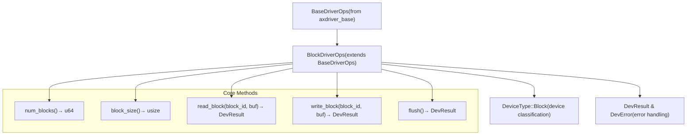
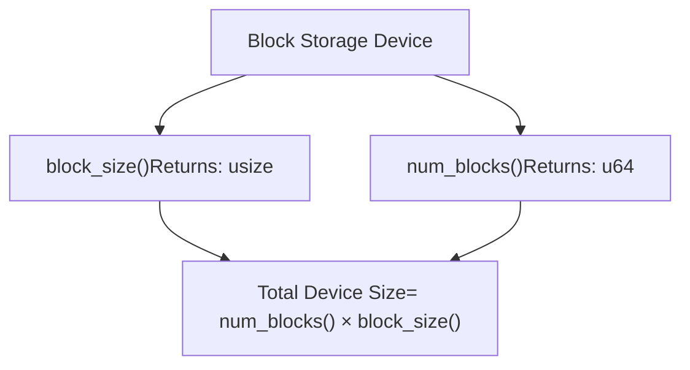
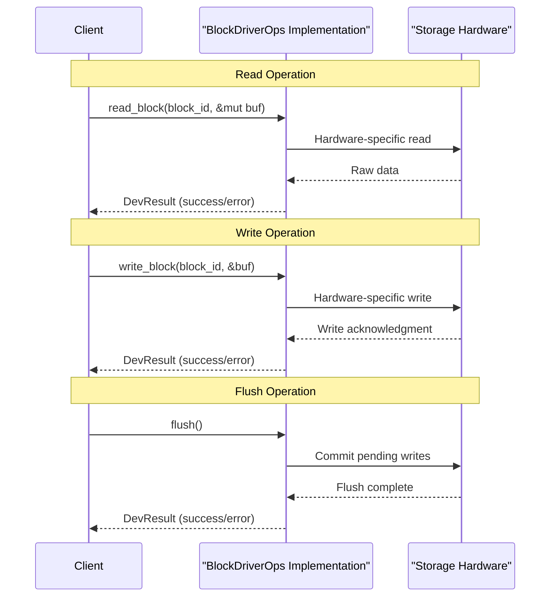

# Block Driver Interface

> **Relevant source files**
> * [axdriver_block/src/lib.rs](https://github.com/arceos-org/axdriver_crates/blob/84eb2170/axdriver_block/src/lib.rs)

## Purpose and Scope

This document covers the core block storage driver interface defined in the `axdriver_block` crate. The interface provides a standardized abstraction for block-oriented storage devices such as disks, RAM disks, and SD cards. This page focuses specifically on the `BlockDriverOps` trait and fundamental block device abstractions.

For information about specific block device implementations like RAM disk and BCM2835 SDHCI drivers, see [Block Device Implementations](/arceos-org/axdriver_crates/5.2-block-device-implementations). For the foundation layer that all drivers build upon, see [Foundation Layer (axdriver_base)](/arceos-org/axdriver_crates/3-foundation-layer-(axdriver_base)).

## Trait Hierarchy and Base Integration

### Block Driver Trait Structure



The `BlockDriverOps` trait extends the base driver interface with block-specific operations. All block drivers must implement both the base operations (device identification) and block-specific operations (storage access).

**Sources:** [axdriver_block/src/lib.rs(L15 - L38)&emsp;](https://github.com/arceos-org/axdriver_crates/blob/84eb2170/axdriver_block/src/lib.rs#L15-L38)

### Type System Integration

|Component|Purpose|Source|
| --- | --- | --- |
|BlockDriverOps|Main trait for block device operations|axdriver_block/src/lib.rs16|
|BaseDriverOps|Inherited base driver interface|axdriver_block/src/lib.rs13|
|DevResult|Standard result type for all operations|axdriver_block/src/lib.rs13|
|DevError|Unified error type across drivers|axdriver_block/src/lib.rs13|
|DeviceType|Device classification enumeration|axdriver_block/src/lib.rs13|

**Sources:** [axdriver_block/src/lib.rs(L12 - L13)&emsp;](https://github.com/arceos-org/axdriver_crates/blob/84eb2170/axdriver_block/src/lib.rs#L12-L13)

## Core Interface Methods

### Device Geometry Methods

The interface provides two fundamental methods for determining the storage device's physical characteristics:



* **`num_blocks()`**: Returns the total number of addressable blocks in the storage device [axdriver_block/src/lib.rs(L17 - L20)&emsp;](https://github.com/arceos-org/axdriver_crates/blob/84eb2170/axdriver_block/src/lib.rs#L17-L20)
* **`block_size()`**: Returns the size of each block in bytes [axdriver_block/src/lib.rs(L21 - L22)&emsp;](https://github.com/arceos-org/axdriver_crates/blob/84eb2170/axdriver_block/src/lib.rs#L21-L22)

The total device capacity is calculated as `num_blocks() * block_size()`, providing a consistent way to determine storage limits across different hardware implementations.

**Sources:** [axdriver_block/src/lib.rs(L17 - L22)&emsp;](https://github.com/arceos-org/axdriver_crates/blob/84eb2170/axdriver_block/src/lib.rs#L17-L22)

### Data Access Methods

### Block I/O Operations Flow



The interface defines three primary data access operations:

#### Read Block Operation

* **Signature**: `read_block(&mut self, block_id: u64, buf: &mut [u8]) -> DevResult`
* **Purpose**: Reads data from storage starting at the specified block ID
* **Multi-block Support**: Buffer size may exceed block size to read multiple contiguous blocks
* **Error Handling**: Returns `DevResult` for consistent error propagation

#### Write Block Operation

* **Signature**: `write_block(&mut self, block_id: u64, buf: &[u8]) -> DevResult`
* **Purpose**: Writes data to storage starting at the specified block ID
* **Multi-block Support**: Buffer size may exceed block size to write multiple contiguous blocks
* **Error Handling**: Returns `DevResult` for consistent error propagation

#### Flush Operation

* **Signature**: `flush(&mut self) -> DevResult`
* **Purpose**: Forces all pending write operations to be committed to persistent storage
* **Consistency**: Ensures data durability and consistency guarantees

**Sources:** [axdriver_block/src/lib.rs(L24 - L37)&emsp;](https://github.com/arceos-org/axdriver_crates/blob/84eb2170/axdriver_block/src/lib.rs#L24-L37)

## Error Handling and Result Types

The block driver interface uses the unified error handling system from `axdriver_base`:

|Type|Purpose|Usage Pattern|
| --- | --- | --- |
|DevResult|Standard result type for all operations|fn operation() -> DevResult|
|DevError|Unified error enumeration|Consistent error reporting across drivers|

All block operations return `DevResult`, enabling consistent error handling across different hardware implementations and allowing higher-level code to handle errors uniformly regardless of the underlying storage technology.

**Sources:** [axdriver_block/src/lib.rs(L13)&emsp;](https://github.com/arceos-org/axdriver_crates/blob/84eb2170/axdriver_block/src/lib.rs#L13-L13) [axdriver_block/src/lib.rs(L28)&emsp;](https://github.com/arceos-org/axdriver_crates/blob/84eb2170/axdriver_block/src/lib.rs#L28-L28) [axdriver_block/src/lib.rs(L34)&emsp;](https://github.com/arceos-org/axdriver_crates/blob/84eb2170/axdriver_block/src/lib.rs#L34-L34) [axdriver_block/src/lib.rs(L37)&emsp;](https://github.com/arceos-org/axdriver_crates/blob/84eb2170/axdriver_block/src/lib.rs#L37-L37)

## Design Patterns and Principles

### Mutable Reference Pattern

All data-modifying operations (`read_block`, `write_block`, `flush`) require a mutable reference to `self`, ensuring exclusive access during I/O operations and preventing data races in concurrent scenarios.

### Multi-Block Operation Support

The interface design explicitly supports multi-block operations through buffer sizing. When the provided buffer exceeds the device's block size, the implementation automatically handles reading or writing multiple contiguous blocks, improving I/O efficiency for large transfers.

### Hardware Abstraction Layer

The trait provides a hardware-agnostic interface that abstracts away device-specific details while maintaining the essential block-oriented semantics that storage hardware typically provides.

**Sources:** [axdriver_block/src/lib.rs(L15 - L38)&emsp;](https://github.com/arceos-org/axdriver_crates/blob/84eb2170/axdriver_block/src/lib.rs#L15-L38)

## Feature-Based Compilation Integration

The crate supports conditional compilation for specific implementations:

```

```

This design allows systems to include only the block driver implementations they need, reducing binary size and compilation time for embedded or specialized deployments.

**Sources:** [axdriver_block/src/lib.rs(L6 - L10)&emsp;](https://github.com/arceos-org/axdriver_crates/blob/84eb2170/axdriver_block/src/lib.rs#L6-L10)